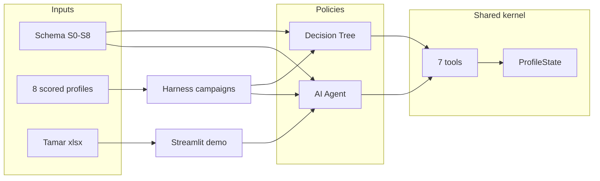

# Agent handoff: Guesty Pro onboarding PoC (ob-brain)

Copy this document (or link to it) when onboarding another AI agent to this codebase.

---

## One-line purpose

**Offline eval harness** that tests whether an **LLM onboarding agent** collects a better Guesty Pro customer profile than an **honest decision tree**, using the same schema, tools, and scoring — plus a **Streamlit demo** that loads real Salesforce handover notes.

**Repo:** [github.com/bornslipppy/ob-brain](https://github.com/bornslipppy/ob-brain) (private; contains PII in xlsx)

---

## Business question (why it exists)

Guesty’s CEO wants onboarding to move from a fixed wizard to an **AI that knows what a “complete profile” looks like** and adapts questions (listings → ownership → owner economics → financials).

Research says “adaptive” alone does not justify AI (optimal adaptive ≈ tree). This PoC tests AI only where trees struggle:

1. **Free text / ambiguity** → structured slots
2. **Combinatorial owner branch (S8)**
3. **Sales handover notes** → prefill (confirm, don’t cold-ask)

### Two falsifiable claims

| ID | Claim |
|----|--------|
| **H1** | AI agent beats honest tree on profile completeness/accuracy (SAR), without unsafe financial writes |
| **H2** | LLM beats regex extracting prefill from real sales notes (611-note corpus) |

**Not in scope:** production Guesty APIs, hosted product UI, starter-kit auto-setup after onboarding.

---

## Tailored UX logic (Salesforce + sales notes)

The stakeholder demo is not a fixed script. For each real account:

1. **Load inputs** — Salesforce row fields (name, listings, channels, owner) plus the Tamar **Notes** cell (`harness/sales_notes.py`).
2. **Seed prefills** — `seed_account_prefill()` writes known slots as `prefilled_unconfirmed` (migration, add-ons, focus topics, etc.) from `harness/account_context.py`.
3. **Steer the agent** — `build_demo_prompt_overlay()` tells the model to open by citing the note, confirm prefills before cold questions, prioritize note themes, and ask **one question per turn**.
4. **Adapt copy and order** — the LLM chooses wording and sequence per account (e.g. Hostaway + GPO first for City and Coastal; defer financials when the note signals tax anxiety). Schema `depends_on` still gates which slots are in scope.
5. **Record on confirm** — “Yes, still accurate” triggers `apply_demo_auto_confirm()` → `record_answer` for note-derived slots.

**UX principle:** same schema for everyone; **tailor-made conversation** per account. Chat text is not stored as the profile—only tool calls into `ProfileState`.

---

## How the machine works (critical)

**Chat text is NOT the profile.** Only **seven tool calls** write state:

- `record_answer`, `add_fee`, `add_tax`, `add_owner`, `skip_question`, `flag_for_call1`, `end_section`

All flow through **`ProfileState`** (`poc-eval-harness/kernel/state.py`) via **`StateReducer.apply()`**.

### Conversation loop

Location: `poc-eval-harness/harness/runner.py`

```text
policy.next_action(state, history)
  → UserQuestion → user/simulator replies → turn++
  → list[ToolCall] → reducer → repeat
  → EndConversation
```

### Fairness principle

`agent/` and `tree/` implement the same `System` protocol (`poc-eval-harness/kernel/protocol.py`). Same tools, reducer, and trace format — outcome differences are **policy only**.

| Component | Path |
|-----------|------|
| AI agent | `poc-eval-harness/agent/agent.py`, `agent/prompts/system_prompt.txt` |
| Decision tree | `poc-eval-harness/tree/tree.py` (authored blind to scored profiles) |
| Schema (ground truth) | `poc-eval-harness/schema/guesty-pro-account-creation-schema.md` |

---

## Schema sections (what we collect)

| Section | Topics |
|---------|--------|
| S0a | Salesforce basics (confirm) |
| S0b | Sales note → extracted hints (confirm) |
| S1–S3 | Brand, channels, go-live, operations |
| S4 | Financials (echo-before-write; taxes → human) |
| S5 | Booking website (conditional) |
| S6–S7 | Team, focus topics, pain (free text) |
| S8 | Hero branch: ownership → owners → pricing |

Example filled profile: `poc-eval-harness/profiles/scored/A1.json`

Plain-language overview: `docs/planning-artifacts/guesty-pro-account-creation-schema-stakeholder-summary.md`

---

## ob-brain bundle (what is in git)

| Included | Path |
|----------|------|
| Full harness + BMAD monorepo | repo root |
| 8 scored profiles + answer keys | `poc-eval-harness/profiles/scored/` |
| Tamar xlsx (PII) | `poc-eval-harness/data/Notes-for-Tamar-2026-06-02.xlsx` |
| Partial eval campaigns (tree-heavy) | `poc-eval-harness/campaigns/` |
| Env template | `.env.example` |
| Setup + gap docs | `docs/ob-brain-setup.md`, `docs/ob-brain-gap-report.md` |
| Build guide | `docs/planning-artifacts/poc-eval-harness-build-guide.md` |

| Not in git | Why |
|------------|-----|
| `.env` / API keys | Security |
| Complete agent k=5 matrix | Incomplete locally |
| H1 verdict in `reports/` | Never generated |
| Human rater JSONL | Free-text SAR |
| H2 gold corpus + pipeline | Stub only (`poc-eval-harness/h2/`) |

See [ob-brain-gap-report.md](ob-brain-gap-report.md) for full gap analysis.

---

## How to run

**Prerequisites:** Python 3.12, [uv](https://docs.astral.sh/uv/), API keys in repo-root `.env` (copy from `.env.example`).

### Stakeholder demo (Streamlit + real accounts)

```bash
cd poc-eval-harness
uv sync --extra demo
uv run streamlit run harness/demo_app.py
```

Open [http://localhost:8501](http://localhost:8501) — search account (e.g. City and Coastal), **Start session**.

Key demo modules:

- `harness/demo_app.py` — UI
- `harness/sales_notes.py` — Tamar xlsx loader
- `harness/account_context.py` — note prefill, demo prompt, auto-confirm, opening chips (turns 1–2 only)

### Synthetic CLI (no xlsx)

```bash
cd poc-eval-harness
uv sync
uv run python -m harness.interactive --system agent --profile A1
```

### Batch eval

```bash
cd poc-eval-harness
uv run python -m harness --dry-run
uv run python -m harness
```

Config: `poc-eval-harness/config/run_config.toml` (Gemini agent + simulator; `max_turns = 20` in PoC mode).

Full setup: [ob-brain-setup.md](ob-brain-setup.md)

---

## Safety / invariants (do not break)

1. **No numeric write** without echo + user confirm on `echo_before_write` fields — false-write rate must stay 0
2. **Taxes:** always `flag_for_call1`; agent never configures tax
3. **Temperature 0.0** on all tool-emitting LLM calls (`kernel/llm.py`)
4. **Simulator provider family ≠ agent** (decorrelation; validated at startup)
5. **Never commit** `.env` or publish repo while Tamar xlsx is tracked (PII)

---

## Scoring (H1)

| Piece | Path |
|-------|------|
| SAR | `poc-eval-harness/scoring/sar.py` |
| In-scope resolver | `poc-eval-harness/scoring/resolver.py` |
| H1 report synthesis | `poc-eval-harness/scoring/report.py` |
| Human rater queue | `poc-eval-harness/scoring/rater_queue.py` |

**SAR** = slot accuracy vs frozen answer key. Free-text slots (`pain`, etc.) need blind human ratings before final verdict.

---

## Current project status (honest)

| Area | Status |
|------|--------|
| Tree eval runs | Largely complete in `campaigns/` |
| Agent eval runs | Partial (tree-heavy artifact count vs agent) |
| Streamlit demo | Working with Tamar xlsx + note-aware agent |
| H1 verdict / exec sign-off | Not finalized |
| H2 extraction eval | Not built in repo |

---

## Docs to read first (in order)

1. `docs/ob-brain-setup.md` — clone and run
2. `docs/ob-brain-gap-report.md` — what is missing
3. `docs/planning-artifacts/poc-eval-harness-build-guide.md` — architecture
4. `docs/planning-artifacts/guesty-pro-account-creation-schema-stakeholder-summary.md` — plain-language schema
5. `docs/planning-artifacts/poc-plan-ai-adaptive-onboarding-2026-06-02.md` — claims and metrics

---

## Suggested first tasks for a new agent

| Task | Action |
|------|--------|
| Explain / demo | Run Streamlit; walk note confirm → tools → `ProfileState` |
| Engineering | Finish agent k=5 campaigns; generate H1 report into `reports/` |
| Analysis | Compute SAR from tree runs; compare partial agent runs |
| Avoid | Commit API keys; make repo public; change schema without reading answer keys |

---

## Quick reference diagram


