```mermaid
flowchart TD
    Start([User opens Automated Messages dashboard]) --> CheckTab{Is Calendar tab visible?}
    CheckTab -->|No tabs yet| FirstTime[Empty state: Schedule messages by calendar]
    CheckTab -->|Tabs visible| TabNav[User clicks Calendar Triggers tab]
    
    FirstTime --> ClickAdd[User clicks + Add Calendar Trigger]
    TabNav --> ClickAdd
    
    ClickAdd --> ExpandCard[Inline card expands with day picker + time picker]
    
    ExpandCard --> PreFill{Smart defaults pre-filled?}
    PreFill -->|Yes| ShowDefaults[Days: Weekdays M-F, Time: 9:00 AM, Property timezone]
    PreFill -->|No| ShowEmpty[Empty day selector + time picker]
    
    ShowDefaults --> UserSelectDays
    ShowEmpty --> UserSelectDays[User selects days]
    
    UserSelectDays --> DayMethod{How user selects days?}
    DayMethod -->|Individual days| ClickDays[Click individual day buttons: T for Thursday]
    DayMethod -->|Shortcut| ClickWeekdays[Click Weekdays shortcut, M-F selected]
    
    ClickDays --> DaysHighlight[Selected days show teal background]
    ClickWeekdays --> DaysHighlight
    
    DaysHighlight --> RealTimePreview1[Next send calculates in real-time, Updates as user clicks days]
    
    RealTimePreview1 --> UserSelectTime[User clicks time picker]
    UserSelectTime --> TimePicker[Dropdown: Hour + AM/PM selector]
    TimePicker --> SetTime[User sets 8:00 AM]
    SetTime --> TimezoneShow[Timezone badge displays: EDT - Property local time]
    
    TimezoneShow --> RealTimePreview2[Next send updates: Next: Thu, May 18 at 8:00 AM in 2 days]
    
    RealTimePreview2 --> AdvancedCheck{User needs date range?}
    AdvancedCheck -->|No| SkipAdvanced[Skip advanced options]
    AdvancedCheck -->|Yes| ExpandAdvanced[User clicks Advanced accordion]
    
    ExpandAdvanced --> DateRange[User sets optional start/end dates]
    DateRange --> SkipAdvanced
    
    SkipAdvanced --> ValidationCheck{All required fields set?}
    ValidationCheck -->|No| DisableSave[Save button disabled, Red text: Select at least one day]
    ValidationCheck -->|Yes| EnableSave[Save button enabled blue]
    
    DisableSave --> UserSelectDays
    EnableSave --> ClickSave[User clicks Save]
    
    ClickSave --> OptimisticUI[Card collapses to summary view immediately, Optimistic UI update]
    OptimisticUI --> AsyncSave[Background: POST /calendar-triggers API call]
    
    AsyncSave --> SaveSuccess{API response success?}
    SaveSuccess -->|Yes| ShowToast[Green toast: Calendar trigger saved, Displays for 3 seconds]
    SaveSuccess -->|No| ShowError[Red toast: Failed to save - Try again, Card re-expands with users data]
    
    ShowToast --> DashboardUpdate[Dashboard updates: Trigger card shows Active badge, Next send countdown visible, Recently sent timeline empty]
    
    ShowError --> RetryDecision{User retries?}
    RetryDecision -->|Yes| ClickSave
    RetryDecision -->|No| ClickCancel
    
    DashboardUpdate --> Success([Success: Calendar trigger active])
    
    ClickCancel[User clicks Cancel] --> ConfirmCancel{Changes made?}
    ConfirmCancel -->|Yes| DiscardConfirm[Confirm: Discard changes?]
    ConfirmCancel -->|No| CardCollapse
    
    DiscardConfirm --> ConfirmYes{User confirms?}
    ConfirmYes -->|Yes| CardCollapse[Card collapses without saving]
    ConfirmYes -->|No| ExpandCard
    
    CardCollapse --> End([End: No trigger created])
    
    style Start fill:#E3F2FD
    style Success fill:#E8F5E9
    style End fill:#FFEBEE
    style ShowToast fill:#E8F5E9
    style ShowError fill:#FFEBEE
    style DaysHighlight fill:#E0F2F1
    style RealTimePreview1 fill:#FFF9C4
    style RealTimePreview2 fill:#FFF9C4
```

```mermaid
flowchart TD
    Start([User views dashboard with active triggers]) --> SeeCard[User sees trigger card in collapsed state: Every Thursday at 8:00 AM, Active]
    
    SeeCard --> ClickCard[User clicks anywhere on trigger card]
    ClickCard --> CardExpands[Card expands inline showing editor]
    
    CardExpands --> ShowCurrent[Current configuration displayed: Thursday selected teal background, Time: 8:00 AM, Next send countdown visible]
    
    ShowCurrent --> EditDecision{What does user edit?}
    
    EditDecision -->|Change day| DeselectOld[User clicks Thursday to deselect]
    EditDecision -->|Change time| ClickTimePicker[User opens time picker]
    EditDecision -->|Add date range| ClickAdvanced[User expands Advanced accordion]
    
    DeselectOld --> SelectNew[User clicks Friday to select]
    SelectNew --> DayUpdates[Friday highlights teal, Thursday un-highlights]
    DayUpdates --> PreviewUpdates1[Next send updates in real-time: Next: Fri, May 19 at 8:00 AM in 3 days]
    
    ClickTimePicker --> ChangeTime[User changes 8:00 AM to 10:00 AM]
    ChangeTime --> PreviewUpdates2[Next send updates: Next: Thu, May 18 at 10:00 AM in 2 days]
    
    ClickAdvanced --> SetDateRange[User adds seasonal dates: June 1 - August 31]
    SetDateRange --> PreviewUpdates3[Next send calculates within date range]
    
    PreviewUpdates1 --> ImpactCheck
    PreviewUpdates2 --> ImpactCheck
    PreviewUpdates3 --> ImpactCheck{Does edit affect imminent send?}
    
    ImpactCheck -->|No impact| NoWarning[No warning needed]
    ImpactCheck -->|Next send < 24h| ShowWarning[Warning banner: Changing schedule affects next send in 2 hours]
    
    NoWarning --> ReadyToSave
    ShowWarning --> UserAcknowledges{User proceeds?}
    UserAcknowledges -->|Yes| ReadyToSave[User ready to save changes]
    UserAcknowledges -->|No| ClickCancel
    
    ReadyToSave --> ClickSave[User clicks Save Changes]
    ClickSave --> OptimisticUpdate[Card collapses immediately with new values]
    
    OptimisticUpdate --> AsyncUpdate[Background: PATCH /calendar-triggers/:id API call]
    
    AsyncUpdate --> UpdateSuccess{API response success?}
    UpdateSuccess -->|Yes| ShowSuccessToast[Green toast: Changes saved, Displays for 3 seconds]
    UpdateSuccess -->|No| ShowErrorToast[Red toast: Failed to save changes, Card re-expands with users edits]
    
    ShowSuccessToast --> DashboardRefresh[Dashboard updates: Trigger summary shows new schedule, Next send countdown updated, Recently sent timeline unchanged]
    
    ShowErrorToast --> RetryPrompt{User retries?}
    RetryPrompt -->|Yes| ClickSave
    RetryPrompt -->|No| ClickCancel
    
    DashboardRefresh --> Success([Success: Trigger updated])
    
    ClickCancel[User clicks Cancel] --> ConfirmDiscard[Confirm: Discard changes?]
    ConfirmDiscard -->|Yes| RevertCard[Card collapses with original values]
    ConfirmDiscard -->|No| CardExpands
    
    RevertCard --> End([End: No changes saved])
    
    style Start fill:#E3F2FD
    style Success fill:#E8F5E9
    style End fill:#FFEBEE
    style ShowSuccessToast fill:#E8F5E9
    style ShowErrorToast fill:#FFEBEE
    style ShowWarning fill:#FFF9C4
    style PreviewUpdates1 fill:#E0F2F1
    style PreviewUpdates2 fill:#E0F2F1
    style PreviewUpdates3 fill:#E0F2F1
```

# UX Design Specification: Calendar-Based Automations for Inbox v2

**Author:** Yair Cohen  
**Date:** 2026-02-11

---

<!-- UX design content will be appended sequentially through collaborative workflow steps -->

## Executive Summary

### Project Vision

Calendar-Based Automations transforms property management operational messaging from a manual, time-consuming burden into a "set it and forget it" automated system. By enabling property managers to trigger messages based on calendar patterns (day-of-week, time-of-day, date ranges) rather than only reservation events, this feature eliminates 400+ hours of manual weekly work across the customer base and closes a critical competitive gap with Track and Streamline.

**Core UX Principle:** "When should this send?" (calendar-based) vs "What conditions enable this?" (reservation-based)

### Target Users

**Primary Persona: Sarah - Mid-Market Property Manager**
- Manages 50-200 properties with recurring operational needs
- Currently spends 2+ hours weekly manually activating/deactivating trash reminders, pool service notifications, lawn care alerts
- Tech-savvy enough to use automation tools but frustrated by complex condition logic
- Desktop-first workflow, multi-tab usage common
- Needs "set it and forget it" reliability to scale operations without adding headcount

**Secondary Persona: Marcus - Support Engineer**
- Handles 910 "AM Failed to Send" tickets annually, 40% caused by condition confusion
- Needs clear documentation and intuitive UI to reduce support burden
- Represents internal stakeholder: Product must simplify, not complicate, AM setup

**Tertiary Persona: Lisa - Enterprise Operations Manager**
- Manages 340+ properties with 15-person ops team
- Needs portfolio-wide operational scheduling, audit trails, team permissions
- Represents future growth: MVP must scale gracefully to enterprise complexity

### Key Design Challenges

**Challenge 1: Simplifying Calendar Configuration Without Adding Complexity**
- Existing AM setup generates 46% of all support tickets (condition confusion)
- Risk: Adding calendar triggers could increase complexity rather than reduce it
- UX Goal: Make calendar configuration simpler and more intuitive than reservation-based conditions
- Design Constraint: Must integrate into existing AM creation flow without disrupting current reservation-based users

**Challenge 2: Clear Mental Model Separation (Operational vs Guest Journey)**
- Users must understand when to use "calendar-based" (operational) vs "reservation-based" (guest journey)
- Risk: Users might misapply calendar triggers to guest messaging, or vice versa
- UX Goal: Visually and conceptually separate the two trigger types while supporting power users who need to combine them (AND logic)
- Design Constraint: Maintain existing reservation trigger patterns while introducing calendar as additive capability

**Challenge 3: Real-Time Visibility & Reassurance**
- Users burned by past "AM Failed to Send" experiences (40% due to condition misunderstanding)
- Risk: Users won't trust "set it and forget it" automation without proof it's working
- UX Goal: Provide real-time dashboard confirmation that triggers are firing correctly (<5 second latency)
- Design Constraint: WebSocket with polling fallback, "Next scheduled send" countdown, live status updates

**Challenge 4: Safe Editing Without Breaking Trust**
- Users need to edit calendar triggers when schedules change (trash pickup day moves from Thursday to Tuesday)
- Risk: Users afraid they'll "break something" or disrupt active workflows when editing
- UX Goal: Make edits feel safe, clear, reversible, and predictable
- Design Constraint: Show "next scheduled send," provide warnings about future impact, preserve history, offer rollback

### Design Opportunities

**Opportunity 1: "Aha!" Moment in Onboarding**
- From user journey: *"Wait... EVERY Thursday? Without me doing anything?"* (Sarah's epiphany)
- Design Approach: Guided setup wizard with immediate value demonstration
- Competitive Edge: Make setup so intuitive and satisfying that it becomes the demo that wins vs Track/Streamline
- Success Metric: Users create 3+ recurring workflows within first 30 days (indicates replacing manual patterns)

**Opportunity 2: Dashboard as "Peace of Mind"**
- From user resolution: *"✅ 156 messages sent this month. ✅ Zero manual interventions. ✅ 6 hours saved."*
- Design Approach: Dashboard that celebrates automation success, not just monitors status
- Competitive Edge: Users show their boss the time savings, driving word-of-mouth adoption and retention
- Success Metric: 90% of users check dashboard at least once monthly (active monitoring engagement)

**Opportunity 3: Progressive Disclosure for Power Users**
- From Lisa's enterprise journey: Needs bulk creation, portfolio-wide deployment, audit trails, team permissions
- Design Approach: Simple by default (day-of-week + time), powerful when needed (date ranges, templates, bulk)
- Competitive Edge: Scales seamlessly from 20 properties (SMB) to 500+ properties (Enterprise) without overwhelming UI
- Success Metric: 80% of users start with simple workflows, 20% adopt advanced features within 6 months

## Core User Experience

### Defining Experience

**Core User Action:** Configure a recurring operational message to send automatically on specific days/times without manual intervention.

The heart of Calendar-Based Automations is the "set it and forget it" calendar trigger configuration experience. Users must be able to create a recurring workflow in < 5 minutes with complete confidence that it will execute correctly forever, without requiring weekly manual activation/deactivation cycles.

**Primary User Flow:**
1. **Setup (Once):** Configure calendar trigger (day-of-week + time + optional date range)
2. **Monitor (Periodic):** Check dashboard to verify triggers are firing correctly
3. **Edit (Rare):** Modify trigger when schedules change (e.g., trash day moves from Thursday to Tuesday)

**Critical Success Criterion:** If users cannot configure a calendar trigger correctly on the first attempt, or if they're unsure it's working, the entire value proposition collapses and they revert to manual workarounds.

### Platform Strategy

**Primary Platform:** React 18 web application embedded within existing Inbox v2 (desktop-first SPA)

**Technical Context:**
- **Viewport:** Desktop-only (1280px+ width), no mobile responsive requirements
- **Input Method:** Mouse/keyboard interactions (not touch-optimized)
- **Browser Support:** Evergreen desktop browsers (Chrome 90+, Edge 90+, Safari 14+, Firefox 88+)
- **Integration:** Embedded within Automated Messages workflow, extends existing Redux state management
- **Real-Time Architecture:** WebSocket with polling fallback for dashboard updates (<5 second latency)
- **Accessibility:** WCAG 2.1 Level AA compliance (keyboard navigation, screen reader support, 4.5:1 color contrast)

**Platform Constraints:**
- No offline functionality (server-side trigger evaluation runs every 60 seconds)
- Must integrate with existing @guestyci/arc component library
- Must follow established Inbox v2 design patterns (3-column layout, teal/green branding, card-based components)

**Device Context:**
- Users work from office/home computers in dedicated property management sessions
- Multi-tab workflows common (Inbox + Calendar + Reservations open simultaneously)
- Large screen real estate available (1920px+ typical)

### Effortless Interactions

**1. Calendar Configuration Must Feel Simpler Than Reservation Conditions**

Current pain: Existing AM conditions confuse users (46% of support tickets, *"What does advanced notice or length of stay mean?"*)

Effortless design:
- Visual day selector (checkbox grid: Mon-Sun) with "Weekdays"/"Weekends" shortcuts
- Time picker with clear property timezone label ("8:00 AM EDT")
- NO complex condition logic in MVP (avoid analysis paralysis)
- Single-screen configuration (no multi-step wizard for basic setup)

**2. Real-Time Status Updates Must Happen Automatically**

Current pain: Users don't trust automation due to past "AM Failed to Send" trauma (40% from condition confusion)

Effortless design:
- Dashboard auto-updates within 5 seconds when triggers fire (WebSocket)
- Live status indicators styled like "Samuel is replying..." pattern from existing Inbox
- Countdown timer shows "Next send in 2 hours 14 minutes"
- Success notifications appear automatically without refresh: *"✓ 24 messages sent (Thursday 8:00 AM)"*

**3. Editing Must Feel Safe, Not Scary**

Current pain: Users fear "breaking something" when modifying active workflows

Effortless design:
- Always show "Next scheduled send" before and after edits
- Warning modal explains impact: *"Changing the schedule will affect future sends. Past messages will not be affected."*
- Visual diff shows change: ~~Thursday 8am~~ → **Tuesday 7am**
- Rollback option available for 24 hours: "Undo recent edit"
- History preservation: Old messages remain visible (not deleted on edit)

**4. Mental Model Separation Must Be Visual, Not Explained**

Current pain: Users confuse "operational messaging" (calendar) vs "guest journey messaging" (reservation)

Effortless design:
- Tab system: "Reservation Triggers" | "Calendar Triggers" (clear visual separation)
- Icon system: Calendar icon 📅 for calendar triggers, bell icon 🔔 for reservation triggers
- Badge system: Workflows show "Calendar" badge if using calendar triggers
- Color coding: Teal for calendar (following brand), gray for reservation (neutral)

### Critical Success Moments

**Moment 1: The "Aha!" During Setup (< 2 minutes in)**

From user journey: *"Wait... EVERY Thursday? Without me doing anything?"* (Sarah's epiphany)

Success indicators:
- User selects "Calendar Trigger" option without hesitation
- Visual day picker makes day selection obvious (no dropdown hunting)
- Confirmation message reinforces "set it and forget it": *"This message will now send automatically every Thursday at 8:00 AM (property local time). You'll never need to activate it manually again."*
- User saves workflow with confidence, not confusion

Failure point: If user asks "Wait, do I need to add a reservation condition too?" → Mental model separation failed

---

**Moment 2: First Trigger Fire Confirmation (Thursday 8:00 AM)**

From user resolution: Dashboard shows real-time notification, user doesn't need to manually verify

Success indicators:
- Dashboard shows: *"✓ 24 messages sent via calendar trigger (Thursday, May 18 at 8:00 AM)"*
- Browser/email notification delivered (optional user setting)
- "Next send" countdown updates automatically: *"Next send: Thursday, May 25 at 8:00 AM (in 7 days)"*
- User doesn't need to dig through Inbox conversation history to verify success

Failure point: If user has to manually audit Inbox to confirm messages sent → Dashboard visibility failed

---

**Moment 3: Editing Without Breaking (When Trash Day Changes)**

From edge case journey: *"She breathes a sigh of relief. It worked exactly how she hoped."*

Success indicators:
- User clicks "Edit Calendar Trigger" without fear
- Warning modal appears with clear consequences: *"Future sends affected. Past messages unaffected."*
- User changes Thursday 8am → Tuesday 7am with confidence
- Confirmation shows updated schedule: *"Next send: Tuesday, May 16 at 7:00 AM. No Thursday messages will be sent."*
- Dashboard reflects new schedule immediately, old messages still visible in history

Failure point: If user hesitates or fears clicking "Save" due to ambiguous consequences → Edit flow lacks clarity

---

**Moment 4: Three Months Later - Scaling Confidence**

From resolution: *"Three months later, Coastal Rentals expands from 72 to 95 properties. Sarah doesn't change her workflow. The messages just work."*

Success indicators:
- User adds 23 new properties to portfolio
- Existing calendar workflows continue working seamlessly (if account-level)
- Dashboard shows cumulative success: *"✅ 156 messages sent this month. ✅ Zero manual interventions. ✅ 6 hours saved."*
- User doesn't think about operational messaging anymore - it's invisible infrastructure

Failure point: If user must manually reconfigure workflows for new properties → Scalability promise broken

### Experience Principles

**Principle 1: "When?" Over "What Conditions?"**

Rationale: Users think in schedules ("every Thursday"), not conditions ("3 days after check-in")

Design implications:
- Calendar UI asks: *"When should this send?"* (day picker + time picker)
- Reservation UI asks: *"What guest event triggers this?"* (check-in, booking confirmed, etc.)
- Visual separation (tabs or sections) makes the mental model obvious
- Combined triggers display as: "Thursday 8am AND 3 days before check-in" (clear AND logic)

---

**Principle 2: "Set It and Forget It" Reassurance**

Rationale: Users have automation trust issues (40% of "Failed to Send" tickets from condition confusion)

Design implications:
- Confirmation messaging is explicit: *"You'll never need to activate this manually again"*
- Real-time dashboard provides "peace of mind" visibility (<5 second updates via WebSocket)
- "Next scheduled send" countdown shows automation is alive and working
- Success badges celebrate achievements: *"✓ 156 messages sent this month, Zero manual interventions"*

---

**Principle 3: Progressive Disclosure - Simple by Default, Powerful When Needed**

Rationale: Sarah (70 properties) needs simplicity, Lisa (340 properties) needs bulk operations and enterprise features

Design implications:
- **Layer 1 (MVP, default view):** Day-of-week + time (covers 80% of use cases)
- **Layer 2 (progressive reveal):** Date ranges + seasonal patterns (accessed via "Advanced" toggle)
- **Layer 3 (enterprise features):** Bulk creation, templates, audit trails (feature-flagged, power user menu)
- Users naturally graduate from simple → advanced as portfolio grows (20 → 100 → 340 properties)

---

**Principle 4: Safe Editing Through Predictability**

Rationale: Users need to change schedules without fear of breaking active workflows

Design implications:
- Always show "Next scheduled send" before and after edits (no guessing)
- Warning modals explain impact with specificity: *"Future sends affected. Past messages unaffected."*
- Visual diff shows change clearly: ~~Thursday 8am~~ → **Tuesday 7am**
- Rollback option available for 24 hours: "Undo recent edit" button in dashboard
- History preservation: Old messages remain visible in dashboard history (not deleted on edit)

---

**Principle 5: Follow Existing Inbox Design Language**

Rationale: Calendar automations are embedded within Inbox v2, not a standalone product. Must feel native, not bolted-on.

Design implications:
- Use teal/green primary actions (from existing Inbox screenshots: "Archive", "Send" buttons)
- Card-based layouts for workflow lists (following property widgets pattern)
- Badge system for status ("Active" - green, "Paused" - yellow, "Error" - red)
- Real-time indicators styled like "Samuel is replying..." live typing pattern
- 3-column layout: Left navigation, center workflow list, right details panel
- Consistent typography: Medium weight headers, regular body text, small gray metadata timestamps

## Desired Emotional Response

### Primary Emotional Goals

**1. Liberation from Manual Burden**

Target emotion: Relief that evolves into empowerment

Users are currently trapped in unsustainable manual workflows (400+ hours weekly across customer base). Calendar-Based Automations must make users feel **freed from operational overhead**, not just "more automated."

Emotional expression: *"Remember when I spent 2 hours every week managing operational messages? That's gone. This actually works."* (Sarah, 3 weeks post-adoption)

---

**2. Confidence Through Simplicity**

Target emotion: Empowerment through clarity (not overwhelm from complexity)

Existing AM setup generates 46% of all support tickets due to condition confusion. Users should feel **"I understand this immediately"** not **"I need a support engineer."** The setup experience must be so simple it becomes the competitive demo that wins vs Track/Streamline.

Emotional expression: *"Wait... that's it? No 'if reservation exists' conditions?"* (Tom, competitive evaluation)

---

**3. Trust in "Set It and Forget It" Automation**

Target emotion: Peace of mind that automation won't fail

Users are burned by past "AM Failed to Send" experiences (40% from condition confusion). Dashboard must provide reassurance through transparency, not just passive monitoring.

Emotional expression: *"✅ 156 messages sent this month. ✅ Zero manual interventions."* (Dashboard celebrates success). Three months later: Portfolio expands 30%+ without workflow changes - trust through invisibility.

### Emotional Journey Mapping

**Stage 1: Discovery (Feature Launch Announcement)**

Desired emotion: Curious skepticism → Hopeful interest

Current state: Burned by complexity, skeptical of "automation" promises
UX approach:
- Feature announcement shows don't tell: GIF demo of 3-step setup ("Select Thursday → Set 8am → Done")
- Social proof: "80 accounts requested this - now it's here"
- Avoid overselling: Let simplicity speak for itself

---

**Stage 2: First Setup (Creating First Calendar Trigger)**

Desired emotion: Surprise & delight ("Aha!" moment) → Confidence

Critical moment: *"Wait... EVERY Thursday? Without me doing anything?"* (Sarah's epiphany)

UX approach:
- Visual day picker makes selection obvious (no dropdown hunting)
- Time picker with property timezone (no confusion)
- Confirmation message: *"You'll never need to activate this manually again"* (explicit reassurance)
- Immediate feedback: "Next send: Thursday, May 18 at 8:00 AM EDT"

Success indicator: User creates 3+ workflows within 30 days (confident adoption pattern)

---

**Stage 3: First Trigger Fire (Thursday 8:00 AM, Week 1)**

Desired emotion: Validation & relief → Trust building

Critical moment: Dashboard notification appears: *"✓ 24 messages sent (Thursday 8:00 AM)"*

UX approach:
- Real-time notification (<5 seconds via WebSocket)
- Browser/email notification: *"Your calendar trigger fired successfully"*
- Dashboard shows countdown: *"Next send: Thursday, May 25 at 8:00 AM (in 7 days)"*
- No need to manually audit Inbox conversation history - dashboard confirms success proactively

Failure point: If user must dig through Inbox to verify → Dashboard visibility failed

---

**Stage 4: Editing Trigger (When Schedules Change)**

Desired emotion: Safety & predictability → Continued trust

Critical moment: User changes Thursday → Tuesday, *"She breathes a sigh of relief. It worked exactly how she hoped."*

UX approach:
- Warning modal: *"Future sends affected. Past messages unaffected."* (clear consequences)
- Visual diff: ~~Thursday 8am~~ → **Tuesday 7am** (no ambiguity)
- Rollback option: "Undo recent edit" available for 24 hours
- Confirmation: *"Schedule updated. Next send: Tuesday, May 16 at 7:00 AM. No Thursday messages will be sent."*

Failure point: If user hesitates or fears clicking "Save" → Edit flow lacks clarity

---

**Stage 5: Long-Term Usage (3 Months+)**

Desired emotion: Peace of mind through invisibility → Empowerment

Critical moment: User expands from 72 to 95 properties, doesn't change workflows - automation scales automatically

UX approach:
- Monthly dashboard summary: *"✅ 156 messages sent. ✅ Zero interventions. ✅ 6 hours saved."*
- Users show boss the time savings → word-of-mouth adoption driver
- Automation becomes invisible infrastructure (no news is good news)
- Only surface for monthly celebration or critical errors

Success indicator: Users don't think about operational messaging anymore - freed mental capacity

### Micro-Emotions

**Confidence vs. Confusion (Target: 95% confidence during setup)**

Design approach:
- Visual day picker (checkbox grid, not dropdown) = confidence
- "Weekdays" / "Weekends" shortcuts = confidence
- Complex condition logic in MVP = confusion (avoid)
- Single-screen configuration = confidence
- Multi-step wizard for basic setup = confusion (avoid)

Measure: User creates 3+ workflows within 30 days = confident adoption

---

**Trust vs. Skepticism (Target: Convert skepticism to trust within first week)**

Design approach:
- Confirmation messaging: *"You'll never need to activate this manually again"* = builds trust
- Real-time dashboard (<5 second updates via WebSocket) = builds trust
- "Next scheduled send" countdown = builds trust
- Vague status ("Active") without specifics = maintains skepticism (avoid)

Measure: 90% of users check dashboard at least once monthly = trust monitoring, not anxious monitoring

---

**Relief vs. Anxiety (Target: Relief during edits, not anxiety about breaking things)**

Design approach:
- Warning modals with specifics: *"Future sends affected. Past unaffected."* = relief (clarity)
- Visual diff: ~~Thursday 8am~~ → **Tuesday 7am** = relief (predictability)
- Rollback option: "Undo recent edit" = relief (safety net)
- Ambiguous edit confirmations: "Are you sure?" without details = anxiety (avoid)

Measure: Users edit triggers without support tickets = confident editing behavior

---

**Accomplishment vs. Frustration (Target: Sense of accomplishment after first successful trigger fire)**

Design approach:
- Dashboard celebrates: *"✓ 24 messages sent"* = accomplishment
- Monthly summary: *"✅ 6 hours saved"* = accomplishment
- Silent failures without notification = frustration (avoid)
- User must manually audit Inbox to verify success = frustration (avoid)

Measure: Users create additional workflows after first success = viral adoption pattern

### Design Implications

**Liberation from Manual Burden → "Set It and Forget It" UX**

Design choices:
- Single-screen setup (no multi-step wizard that feels heavy)
- Confirmation messaging explicit: *"You'll never need to activate this manually again"*
- Dashboard shows "Zero manual interventions" as success metric (celebrates time saved)
- After setup, users should rarely need to return (invisibility = success)

---

**Confidence Through Simplicity → Progressive Disclosure**

Design choices:
- **Layer 1 visible by default:** Day-of-week + time (80% of use cases, no hiding)
- **Layer 2 hidden initially:** Date ranges + seasonal patterns (accessed via "Advanced" toggle)
- **Layer 3 feature-flagged:** Enterprise features (bulk creation, templates, audit trails)
- Visual day picker (checkboxes, not dropdown) reduces cognitive load
- NO complex condition logic in MVP (avoids analysis paralysis)

---

**Trust in Automation → Real-Time Visibility**

Design choices:
- Dashboard auto-updates (<5 seconds via WebSocket with polling fallback)
- "Next send" countdown shows system is alive: *"Next send in 2 hours 14 minutes"*
- Success notifications appear automatically: *"✓ 24 messages sent (Thursday 8:00 AM)"*
- Live status indicators styled like "Samuel is replying..." pattern from existing Inbox
- Monthly summary celebrates cumulative success: *"✅ 156 messages sent this month, ✅ 6 hours saved"*

---

**Safety During Edits → Predictability & Reversibility**

Design choices:
- Always show "Next scheduled send" before and after edits (no guessing)
- Warning modals explain impact with specificity: *"Future sends affected. Past messages unaffected."*
- Visual diff shows change clearly: ~~Thursday 8am~~ → **Tuesday 7am** (no ambiguity)
- Rollback available for 24 hours: "Undo recent edit" button in dashboard
- History preservation: Old messages remain visible in dashboard history (not deleted on edit)

### Emotional Design Principles

**Principle 1: Reassurance Over Uncertainty**

Guideline: Every interaction should reduce anxiety, not create it.

Application:
- Confirmation messages are explicit and reassuring
- Warning modals explain consequences with specificity
- "Next scheduled send" countdown provides constant reassurance
- Avoid vague states: "Active" must be supplemented with "Next send: Thursday, May 18 at 8:00 AM"

---

**Principle 2: Celebrate Success, Learn from Failure**

Guideline: Make success visible and delightful, make failures actionable.

Application:
- **Success:** Dashboard shows *"✓ 24 messages sent (Thursday 8:00 AM)"* with visual checkmark
- **Success:** Monthly summary celebrates: *"✅ 156 messages sent, ✅ Zero interventions, ✅ 6 hours saved"*
- **Failure:** Error notifications appear immediately: *"⚠ Trigger failed: [specific reason]. Click to retry or contact support."*
- **Failure:** Provide actionable next steps, not just error codes or generic messages

---

**Principle 3: Invisibility as Ultimate Success**

Guideline: The best automation is the one users forget about (until they need to change it).

Application:
- After initial setup, calendar triggers should "just work" without user intervention
- Dashboard provides optional monitoring, not required check-ins
- Three months later: Users expand portfolios 30%+ without changing workflows (trust through invisibility)
- Notifications are celebratory (monthly summary) or critical (errors only), not noisy

---

**Principle 4: Clarity Over Cleverness**

Guideline: Make the obvious obvious. Don't make users think about how to accomplish basic tasks.

Application:
- Visual day picker (checkbox grid) over dropdown or text input
- "Weekdays" / "Weekends" shortcuts instead of forcing manual multi-selection
- Time picker with timezone label: "8:00 AM EDT" (property local time, not guest or user timezone)
- Confirmation language is plain English: *"You'll never need to activate this manually again"* (not jargon like "Workflow enabled")

---

**Principle 5: Trust Through Transparency**

Guideline: Show users what's happening, when it's happening, and why it's happening.

Application:
- Real-time dashboard updates (<5 seconds) build trust through visibility
- "Next send" countdown shows system is alive and working
- Edit warnings explain exactly what will change: *"Future sends affected. Past messages unaffected."*
- Audit trail shows complete history: Who created/edited, when, what changed
- No black boxes - users can always see what the system is doing and verify correctness

## UX Pattern Analysis & Inspiration

### Inspiring Products Analysis

**1. Gmail "Schedule Send Later" - Gold Standard for "Set It and Forget It"**

Success patterns:
- **Contextual trigger placement:** "Schedule send" appears as dropdown next to "Send" button (in context, no menu hunting)
- **Smart presets + custom:** "Tomorrow morning (8:00 AM)", "Monday morning", or custom date/time picker (progressive disclosure)
- **Clear timezone labeling:** "8:00 AM (EDT)" explicitly shown
- **Confirmation with specifics:** "Will be sent Monday, May 18 at 8:00 AM EDT" (exact preview)
- **Edit/cancel safety net:** Can modify or cancel scheduled send before it executes
- **Invisible execution:** Email sends automatically at scheduled time, user doesn't need to verify (trust through reliability)

Application to Calendar Automations: Place "Add Calendar Trigger" button within AM editor (not buried in settings), show "Next send: Thursday, May 18 at 8:00 AM EDT" preview, provide edit/rollback safety net.

---

**2. Google Calendar - Recurring Events (Scheduling Mental Model)**

Success patterns:
- **Visual presets:** "Does not repeat" → "Daily", "Weekly on Thursday", "Weekdays (Monday to Friday)", "Custom..." (most users pick preset)
- **Visual day selector:** Checkbox grid (S M T W T F S) for custom patterns, no dropdown menus
- **Plain English confirmation:** "Repeats weekly on Thursday" (no jargon)
- **Next occurrence preview:** "Next occurrence: Thursday, May 18, 2026" (constant reassurance)
- **Edit warnings:** "This event" or "All events" modal with clear consequences before changes

Application to Calendar Automations: Adopt "Add Calendar Trigger" → visual presets ("Every Thursday", "Weekdays", "Custom"), use checkbox grid for day selection, show "Sends weekly on Thursday at 8:00 AM" confirmation, provide "Edit this trigger" with warning modals.

---

**3. monday.com - Visual Automation Builder**

Success patterns:
- **Visual sentence structure:** "When status changes to Done, notify person" with inline dropdowns (feels conversational)
- **Progressive complexity:** Simple automations are one line, complex ones add conditions (flexibility without overwhelming)
- **Template library:** 25+ pre-built automation patterns ("When date arrives", "Every time period") for common use cases
- **Color-coded status:** Green for active, gray for paused, red for errors (at-a-glance visibility)
- **Automation dashboard:** Shows all active automations, usage stats ("124 automations ran this month"), celebrates success

Application to Calendar Automations: Use visual sentence "Send [message name] every [Thursday] at [8:00 AM]" with inline dropdowns, provide template library ("Weekly trash reminder", "Weekend check-in prep"), create dashboard with color-coded badges and celebration stats ("✓ 156 messages sent this month, ✅ 6 hours saved").

---

**4. Asana - Progressive Disclosure & Fluid Layout**

Success patterns:
- **Simple by default:** Task view starts with name, assignee, due date; advanced fields appear on click (progressive disclosure)
- **Click objects, not menus:** Click due date → calendar picker appears inline, no right-click menus or buried settings
- **Fluid layout:** Left sidebar collapses for more workspace, right panel expands for details (responsive to user needs)
- **Clear visual hierarchy:** Bold task names, light gray metadata, icons for quick scanning (balanced information density)

Application to Calendar Automations: Start with day + time picker (simple), hide date ranges under "Advanced" toggle, use inline interactions (click day → checkbox appears), implement collapsible left panel (workflow list) and expandable right panel (trigger details).

---

**5. Google NotebookLM - Contextual AI Assistance (Phase 2/3 Inspiration)**

Success patterns:
- **Immediate value:** Drop documents → AI summarizes instantly, no configuration required
- **Contextual actions:** Select text → "Create note" appears where needed, not in distant toolbar
- **Smart suggestions:** AI suggests related content proactively without being intrusive

Application to Calendar Automations (Phase 2/3): AI suggests schedule based on message name ("Trash Reminder" → suggest Thursday 8am), contextual "Set up weekly messages" wizard auto-configures common patterns, smart defaults reduce setup friction.

---

**6. Intercom - Visual Workflow Builder & Clever Space Usage**

Success patterns:
- **Visual workflow editor:** Drag-and-drop triggers → conditions → actions with visual flow (self-explanatory without documentation)
- **Inline expandable configuration:** Workflow step shows summary, click to expand full editor inline (no modal navigation, keeps user in context)
- **Clever use of space:** Collapsible sections for overview, expandable details for editing, right sidebar for step properties (canvas + detail view)
- **Smart defaults:** Pre-filled sensible values, user only changes what's needed (reduces cognitive load)
- **Visual status indicators:** Active (green dot), paused (yellow), error (red) with recent activity log inline
- **Self-explanatory setup:** Plain language ("When user visits pricing page"), visual icons (calendar, person, message), color-coded step types (triggers blue, conditions yellow, actions green)

Application to Calendar Automations: Use inline expand/collapse for calendar trigger configuration (summary view in list, expand to edit without modal), implement smart defaults ("Weekdays at 9:00 AM" pre-filled), use visual status with colored dots (🟢 Active, 🟡 Paused, 🔴 Error), show "Next send" preview inline with recent activity expandable.

**Combined Configuration Pattern (All Sources):**

Collapsed state (workflow list view):
```
Trash Day Reminder
📅 Every Thursday at 8:00 AM | 🟢 Active | Next: Thu, May 18, 8:00 AM (in 2 days)
[Expand ▾]
```

Expanded inline editor (click to reveal):
```
📅 Calendar Trigger
Days: [S] [M] [T] [W] [✓Thu] [F] [S]  |  Shortcuts: [Weekdays] [Weekends]
Time: [8:00 AM ▾] EDT - Property local time
📆 Date Range (Optional): [+ Add seasonal schedule]
🔔 Combine with Reservation (Optional): [+ Add reservation condition]
[Save Changes] [Cancel]
```

Pattern sources:
- Intercom: Inline expand/collapse, visual hierarchy, smart defaults, colored status dots
- Google Calendar: Day checkbox grid (S M T W T F S), plain language confirmation, shortcuts
- Gmail: Time picker with timezone label, next send preview with specifics
- monday.com: Color-coded status badges, celebration stats in dashboard
- Asana: Progressive disclosure (advanced features hidden under toggles)

### Transferable UX Patterns

**Navigation Patterns:**

1. **Contextual Trigger Placement (Gmail-inspired)**
   - Place "Add Calendar Trigger" within AM creation flow (not buried in settings)
   - User is already in context (creating/editing message), calendar option appears naturally
   - Reduces navigation friction, matches mental model

2. **Progressive Disclosure (Asana-inspired)**
   - Start simple: Day + time picker (80% use case visible by default)
   - "Advanced" toggle reveals: Date ranges, seasonal patterns (20% use case)
   - Enterprise features: Bulk creation, templates, audit trails (feature-flagged, power user menu)

---

**Interaction Patterns:**

1. **Visual Day Selector (Google Calendar-inspired)**
   - Checkbox grid: S M T W T F S (click days directly, no dropdown menus)
   - "Weekdays" / "Weekends" shortcuts above grid (common patterns one-click)
   - Selected days highlighted with brand teal color (instant visual feedback)

2. **Inline Dropdowns (monday.com-inspired)**
   - Visual sentence: "Send every [Thursday ▾] at [8:00 AM ▾]"
   - Dropdowns embedded inline, not separate form fields
   - Feels like filling in sentence, not form (reduces cognitive load)

3. **Smart Presets (Google Calendar + Gmail-inspired)**
   - "Every Thursday", "Weekdays only", "Weekends only", "First Monday of month", "Custom..."
   - Users pick preset 80% of time, custom 20% (progressive disclosure)
   - Reduces decision fatigue for common patterns

4. **Inline Expandable Configuration (Intercom-inspired)**
   - Show calendar trigger as collapsed summary in workflow list
   - Click to expand inline editor (no separate page navigation)
   - Reduces cognitive load, keeps user in context

---

**Visual & Feedback Patterns:**

1. **Clear Confirmation Language (Gmail-inspired)**
   - "This message will now send automatically every Thursday at 8:00 AM (property local time). You'll never need to activate it manually again."
   - Plain English, explicit reassurance, no technical jargon

2. **Next Send Preview (Gmail + Google Calendar-inspired)**
   - Always show: "Next send: Thursday, May 18 at 8:00 AM EDT"
   - Optional countdown: "Next send in 2 hours 14 minutes"
   - Constant reassurance that automation is alive and working

3. **Celebration Dashboard (monday.com-inspired)**
   - "✓ 156 messages sent this month via calendar triggers"
   - "✅ Zero manual interventions needed"
   - "✅ 6 hours saved this month"
   - Celebrates success, doesn't just monitor status

4. **Color-Coded Status Badges (monday.com + Intercom + Existing Inbox-inspired)**
   - 🟢 Green: "Active" (currently sending)
   - 🟡 Yellow: "Paused" (user disabled)
   - 🔴 Red: "Error" (trigger failed)
   - ⚪ Gray: "Scheduled" (waiting for next send)
   - At-a-glance status using existing Inbox color palette (teal brand, green success, red error)

5. **Smart Defaults (Intercom-inspired)**
   - Pre-fill "Weekdays at 9:00 AM" as default when user adds calendar trigger
   - User only changes what's different (reduces decision fatigue)
   - Phase 2: AI suggests schedule based on message name

---

**Edit Safety Patterns:**

1. **Edit Warnings (Google Calendar-inspired)**
   - Modal: "Changing the schedule will affect future sends. Past messages will not be affected. Continue?"
   - Clear consequences before user commits to changes

2. **Visual Diff (Track Changes-style)**
   - Show: ~~Thursday 8:00 AM~~ → **Tuesday 7:00 AM**
   - No ambiguity about what changed

3. **Rollback Safety Net (Gmail "Undo send"-inspired)**
   - "Undo recent edit" button available for 24 hours
   - User can revert without fear of permanent damage

### Anti-Patterns to Avoid

**Anti-Pattern 1: Hidden Calendar Feature in Settings Menu**

Problem: Users expect calendar triggers in AM creation flow, not buried in account settings
Avoid: Requiring navigation path: Settings → Automations → Calendar → Enable
Instead: Contextual "Add Calendar Trigger" button in AM editor (Gmail "Schedule send" model)
Rationale: Conflicts with "click objects, not menus" principle and increases setup friction

---

**Anti-Pattern 2: Complex Multi-Step Wizard for Basic Setup**

Problem: Users want "Select Thursday, set 8am, done" - not 5-step wizard with review screens
Avoid: Step 1: Choose type → Step 2: Select day → Step 3: Set time → Step 4: Review → Step 5: Confirm
Instead: Single-screen configuration with visual day picker + time input (Google Calendar model)
Rationale: Conflicts with "< 5 minute setup" success criterion and "flexibility without complexity" principle

---

**Anti-Pattern 3: Vague Status Without Specifics**

Problem: "Active" status doesn't build trust - users need proof automation is working
Avoid: Workflow shows "Active" badge with no next send time or execution history
Instead: Show "Active - Next send: Thursday, May 18 at 8:00 AM EDT" with countdown (Gmail model)
Rationale: Conflicts with "trust through transparency" emotional principle

---

**Anti-Pattern 4: Technical Jargon in Confirmation Messages**

Problem: "Workflow enabled with recurring trigger condition" confuses non-technical users
Avoid: Technical language like "cron job", "recurring trigger condition", "execution schedule"
Instead: Plain English: "You'll never need to activate this manually again" (Gmail clarity)
Rationale: Conflicts with "clarity over cleverness" emotional principle

---

**Anti-Pattern 5: Silent Failures Without Notification**

Problem: Trigger fails to fire, user discovers hours/days later by manually auditing Inbox
Avoid: No error notification, user must actively check dashboard to discover failures
Instead: Real-time error notification: "⚠ Trigger failed: [specific reason]. Click to retry or contact support."
Rationale: Conflicts with "trust in automation" emotional goal and "reassurance over uncertainty" principle

---

**Anti-Pattern 6: Editing Without Preview or Warning**

Problem: User changes Thursday → Tuesday, unsure what will happen to existing schedule
Avoid: "Save" button with no preview of consequences or warning modal
Instead: Warning modal + visual diff + "Next send" preview before saving (Google Calendar model)
Rationale: Conflicts with "safe editing through predictability" emotional goal

### Design Inspiration Strategy

**What to Adopt Directly:**

1. **Gmail "Schedule Send" Mental Model**
   - Contextual trigger placement within AM editor (not separate settings page)
   - Smart presets + custom options (progressive disclosure)
   - Clear timezone labeling ("8:00 AM EDT - Property local time")
   - "Next send" preview with exact date/time
   - Edit/cancel with rollback safety net
   - Rationale: Proven pattern for "set it and forget it" scheduling, aligns with core user action

2. **Google Calendar Recurring Events Pattern**
   - "Add Calendar Trigger" → Visual presets ("Every Thursday", "Weekdays", "Custom")
   - Visual day checkbox grid (S M T W T F S)
   - Plain English confirmation: "Sends weekly on Thursday at 8:00 AM"
   - Edit modal with clear warnings: "This trigger" or "Delete trigger"
   - Rationale: Users already understand recurring calendar events, leverage existing mental model

3. **monday.com Automation Dashboard**
   - Visual status badges (green "Active", yellow "Paused", red "Error")
   - Usage statistics: "156 messages sent this month"
   - Celebration language: "✅ Zero manual interventions, ✅ 6 hours saved"
   - Rationale: Supports "celebration dashboard" emotional goal and "trust through transparency"

4. **Intercom Inline Expandable Pattern**
   - Collapsed summary in list view, click to expand inline editor
   - No modal navigation, keeps user in context
   - Smart defaults pre-filled, user only changes what's needed
   - Rationale: Reduces cognitive load and navigation friction

---

**What to Adapt for Our Context:**

1. **Asana Progressive Disclosure (adapted)**
   - Start with day + time picker (simple, covers 80% of use cases)
   - Hide date ranges under "Advanced" toggle (20% use case)
   - Adaptation: Sarah's use case (weekly trash reminders) doesn't need seasonal complexity initially
   - Constraint: Must integrate with existing AM editor layout (can't completely redesign)

2. **monday.com Visual Sentence Structure (adapted)**
   - "Send [message name ▾] every [Thursday ▾] at [8:00 AM ▾]" with inline dropdowns
   - Adaptation: Feels conversational, reduces form fatigue
   - Constraint: Must work within existing Redux state management and component library

3. **Intercom Smart Defaults (adapted)**
   - Pre-fill "Weekdays at 9:00 AM" when user adds calendar trigger
   - Adaptation: Reduces setup friction for common patterns
   - Constraint: Must learn from usage patterns, adjust defaults over time

4. **Google NotebookLM Smart Suggestions (Phase 2/3 only)**
   - AI suggests schedule based on message name ("Trash Reminder" → suggest Thursday 8am)
   - Adaptation: Reduces setup friction for common patterns
   - Constraint: Requires AI capability, not available in MVP, defer to post-launch

---

**What to Avoid (Anti-Patterns):**

1. **Don't bury calendar feature in settings menu** → Conflicts with contextual access and "click objects, not menus" principle
2. **Don't use multi-step wizard for basic setup** → Conflicts with "< 5 minute setup" requirement and "flexibility without complexity"
3. **Don't show vague status without next send time** → Conflicts with "trust through transparency" and "reassurance over uncertainty"
4. **Don't use technical jargon in UI** → Conflicts with "clarity over cleverness" emotional principle
5. **Don't make edits scary without preview** → Conflicts with "safe editing through predictability" emotional goal
6. **Don't silently fail without notification** → Conflicts with "trust in automation" and user recovery from errors

## Design System Foundation

### Design System Choice

**Selected Approach:** Primary - Existing @guestyci/arc Design System with Minimal Custom Extensions

This project will maximize reuse of the existing @guestyci/arc component library (v0.38.1) for all standard UI elements, leveraging arc's confirmed date/time pickers, expandable components, and layout system. Custom components will only be built if absolutely necessary for calendar-specific UX patterns that arc doesn't support.

**Core Design System:**
- **Component Library:** @guestyci/arc (v0.38.1) + @guestyci/arc-styles (v0.30.2)
- **Styling Framework:** Styled Components (v6.1.8)
- **Platform:** React 18
- **State Management:** Redux (extend existing Inbox v2 architecture)
- **Storybook Reference:** https://livebook.guesty.com/nebula/ (Nebula design system documentation)

### Rationale for Selection

**1. Project Context: Brownfield Integration with Established Design System**

Calendar-Based Automations is embedded within existing Inbox v2 (not a standalone product). The PRD explicitly requires: "Calendar UI components use @guestyci/arc component library for consistency" (NFR-I2). Users already familiar with Inbox v2 visual language (4★ rating), and arc components provide proven, accessible, brand-consistent UI patterns. Building separate design system would create visual dissonance and increase development overhead.

**2. Component Availability Confirmed**

arc library includes critical components confirmed by stakeholder:
- ✅ Date picker components (for optional date ranges: "June 1 - August 31")
- ✅ Time picker components (for "8:00 AM EDT" selection with timezone display)
- ✅ Day selector or checkbox grid components (for S M T W T F S multi-day pattern)
- ✅ Expandable/collapsible components (for Intercom-inspired inline trigger configuration)
- ✅ Standard UI components (Button, Input, Badge, Tabs, Dialog, Toast, Tooltip, Skeleton)

Component availability eliminates need for extensive custom development, accelerates MVP timeline.

**3. Timeline & Resource Efficiency (6-8 Weeks MVP)**

Reusing arc components accelerates development significantly:
- **Avoid rebuilding:** Button, Input, Modal, Card, Badge, Dropdown (proven, accessible, brand-consistent)
- **Focus investment:** Calendar trigger composition patterns and Redux integration
- **Accessibility included:** arc components already WCAG 2.1 Level AA compliant (NFR-A1)
- **Team familiarity:** Inbox v2 team already experienced with arc component patterns and Styled Components

Building custom design system would add 2-4 weeks to MVP timeline and increase accessibility/testing burden.

**4. Consistency with User Expectations**

From design screenshots analyzed: Inbox v2 uses teal/green branding (`#17847B`), card-based layouts, badge system (green success/yellow warning/red error), 3-column layout, clean typography hierarchy. Calendar triggers must follow these established patterns to feel native. arc components already implement these patterns, ensuring visual and interaction consistency automatically.

**5. Maintenance & Long-Term Scalability**

Updates to arc library benefit Calendar Automations automatically:
- Brand color changes propagate instantly (no manual theme updates)
- Accessibility improvements inherit automatically (reduced compliance burden)
- New arc components become available without migration work
- Bug fixes in arc apply to calendar triggers (reduced maintenance overhead)

Long-term maintenance synergy with broader Inbox v2 roadmap ensures Calendar Automations evolves with the platform naturally.

### Implementation Approach

**Component Strategy: arc-First with Component Composition**

**Standard Components from @guestyci/arc (Use Directly):**

1. **Button** - Primary actions ("Save", "Add Calendar Trigger"), secondary actions ("Cancel", "Edit")
2. **Input** - Text inputs for custom values
3. **Combobox** - Preset selector dropdowns ("Every Thursday", "Weekdays only", "Custom..."), searchable lists
4. **Checkbox** - Day selection grid (S M T W T F S) or multi-day selector
5. **Badge** - Status indicators ("Active", "Paused", "Error" with color coding)
6. **Tabs/TabsList/TabsTrigger** - "Reservation Triggers" | "Calendar Triggers" mental model separation
7. **Dialog** - Edit warnings ("Future sends affected"), delete confirmations, error modals
8. **Toast** - Success notifications ("✓ 24 messages sent"), error alerts, system messages
9. **Tooltip** - Helper text, timezone explanations ("Property local time"), icon clarifications
10. **Skeleton** - Loading states during async save operations, dashboard data fetch
11. **Row/Col** - Layout structure for form fields, grid layouts
12. **Label** - Form field labels ("Days", "Time", "Date Range")
13. **DatePicker** - Optional date range selection ("June 1 - August 31" for seasonal schedules)
14. **TimePicker** - Time selection with format support (12-hour/24-hour based on locale)
15. **Accordion/Collapsible** - Inline expandable trigger configuration, advanced options, history timeline
16. **DaySelector** - Multi-day checkbox grid (S M T W T F S) if available in arc

Rationale: These provide proven, accessible, brand-consistent UI with zero custom development overhead. Confirmed available in arc/Nebula.

---

**Component Composition Patterns for Calendar UI:**

Build calendar trigger interface by composing arc components:

**Pattern 1: Day Selection with Shortcuts**
```tsx
<Row gap="8px" align="center">
  <Label>Days</Label>
  {arc.DaySelector || <CheckboxGrid>} // Use arc DaySelector if available
  <Button variant="secondary" size="small">Weekdays</Button>
  <Button variant="secondary" size="small">Weekends</Button>
</Row>
```

**Pattern 2: Time Selection with Timezone**
```tsx
<Row gap="8px" align="center">
  <Label>Time</Label>
  <TimePicker value="08:00" format="12h" />
  <Tooltip content="Messages send in property local time, not guest timezone">
    <Badge variant="neutral">EDT - Property local time</Badge>
  </Tooltip>
</Row>
```

**Pattern 3: Inline Expandable Trigger (Intercom Pattern)**
```tsx
<Accordion>
  <AccordionItem 
    trigger={
      <Row justify="between">
        <Col>📅 Every Thursday at 8:00 AM</Col>
        <Badge color="green">🟢 Active</Badge>
        <Col>Next: Thu, May 18, 8:00 AM (in 2 days)</Col>
      </Row>
    }
  >
    {/* Expanded configuration: day picker + time picker + advanced options */}
    <DaySelector value={["thu"]} />
    <TimePicker value="08:00" />
    <Accordion>
      <AccordionItem title="Advanced Options">
        <DatePicker label="Start Date" />
        <DatePicker label="End Date" />
      </AccordionItem>
    </Accordion>
    <Row gap="8px">
      <Button variant="primary">Save Changes</Button>
      <Button variant="secondary">Cancel</Button>
    </Row>
  </AccordionItem>
</Accordion>
```

**Pattern 4: Status Indicators**
```tsx
<Badge color={status === 'active' ? 'green' : status === 'paused' ? 'yellow' : 'red'}>
  {status === 'active' ? '🟢 Active' : status === 'paused' ? '🟡 Paused' : '🔴 Error'}
</Badge>
```

---

**Custom Components: Only If Arc Pattern Insufficient**

Build custom only if arc components don't support specific UX patterns after evaluation:

**Evaluation Criteria:**
- Can arc DaySelector support visual S M T W T F S grid with Weekdays/Weekends shortcuts?
- Can arc Accordion support Intercom-style inline editing without modal?
- Can arc Badge support colored dot indicators (🟢🟡🔴) with status text?

**If gaps exist:**

1. **CalendarDayPickerEnhanced** - If arc DaySelector doesn't match Google Calendar visual pattern
   - Composition: arc Checkbox + arc Button (shortcuts) + arc styling
   - Follows arc design tokens (colors, spacing, border radius)

2. **TriggerCardInlineEdit** - If arc Accordion doesn't support inline edit without modal
   - Composition: arc Accordion + arc Form components + custom expand/collapse logic
   - Follows arc Card elevation and padding patterns

3. **NextSendCountdown** - If arc doesn't have real-time countdown component
   - Composition: arc Typography + custom timer logic with WebSocket updates
   - Follows arc text sizing and color patterns

**Decision Rule:** Start development with arc-native components, identify gaps through prototyping, build custom only if UX pattern cannot be achieved with arc composition.

### Customization Strategy

**Phase 1 (MVP): arc Component Composition Focus**

Strategy: Compose arc components to create calendar trigger UI with minimal custom code.

**Development Sequence:**
1. **Week 1:** Review Nebula Storybook in detail, document exact arc component APIs available
2. **Week 2:** Prototype calendar trigger configuration using arc DaySelector + TimePicker + Accordion
3. **Week 3:** Evaluate gaps - does composition achieve desired UX patterns (Intercom inline edit, Google Calendar day grid)?
4. **Week 4+:** Build minimal custom components only if arc composition insufficient

**Success Criteria:**
- 80%+ of calendar UI uses arc components directly (Button, Input, Badge, Tabs, Dialog, Toast, Layout)
- Custom component count: 0-3 maximum (DayPicker variant, Countdown timer, Status dot - only if needed)
- Visual consistency: Calendar UI indistinguishable from native Inbox v2 patterns

---

**Phase 2 (Post-MVP): Refinement & arc Library Contribution**

After MVP launch and user feedback:

**Refinement Opportunities:**
- Optimize custom components based on real usage patterns
- Simplify component APIs based on developer feedback
- Enhance accessibility based on user testing (keyboard nav, screen reader feedback)

**arc Library Contribution:**
- If CalendarDayPicker built and proves valuable → Contribute to arc as `<arc.DaySelector>`
- If NextSendCountdown built and reusable → Contribute as `<arc.Countdown>`
- Benefits: Other Guesty products can leverage calendar components, reduces long-term maintenance burden

**Component Evolution:**
- Monitor arc library updates (new components, API changes)
- Migrate custom components to arc equivalents when available
- Participate in Guesty design system working group for calendar-related components

---

**arc Design Token Reference (For Any Custom Components):**

If custom components required, inherit from @guestyci/arc-styles:

**Colors:**
- Primary: Teal/green (brand color from Inbox screenshots)
- Success: Green (`green400`-`green600` range)
- Warning: Yellow (`yellow400`-`yellow600` range)
- Error: Red (`red400`-`red600` range)
- Neutral: Gray scale (`gray50`, `gray100`, `gray200`, ..., `gray800`, `gray900`)

**Typography:**
- Font family: Nunito Sans (from Storybook HTML)
- Headers: Medium/bold weight (500-700)
- Body: Regular weight (400)
- Metadata: Small size (12px), light gray color

**Spacing:**
- 8px grid system (padding/margins: 8px, 16px, 24px, 32px increments)
- Component padding: 16px internal
- Gap between elements: 8px (tight), 16px (normal), 24px (relaxed)

**Border Radius:**
- Match arc card/button radius (typically 4-8px)

**Shadows:**
- Match arc elevation system for cards, modals

**Focus States:**
- Blue outline (2px) for keyboard navigation (WCAG 2.1 AA compliance)

**Component Documentation Standards:**

All components must include:
- **Usage guidelines:** When to use, when not to use, best practices
- **Props API:** TypeScript interface with JSDoc descriptions
- **Accessibility notes:** ARIA labels, keyboard patterns, screen reader announcements
- **Storybook stories:** Visual examples in Nebula Storybook format
- **Unit tests:** React Testing Library tests covering interactions and accessibility
- **Visual regression tests:** Ensure consistent rendering across browsers

## Defining Core Experience

### The Defining Interaction

**Core Experience:**
> "Configure a recurring calendar schedule (day + time) in under 30 seconds - no reservation required"

**User Description:**
Property managers will describe this to colleagues as: *"Now I can set Trash Day Reminder to send every Thursday at 8am - it took like 20 seconds to set up and it just works every week."*

**Core Success Feeling:**
Users feel successful when they see the visual day selector (S M T W T F S), select days instantly with shortcuts ("Weekdays"), pick a time, and see "Next send: Thu, May 18 at 8:00 AM (in 2 days)" immediately - confirming it will happen automatically without further intervention.

**If we get ONE thing perfectly right:**
The **day + time visual picker** with instant "Next send" preview must feel as intuitive as Google Calendar recurring events - users shouldn't need documentation to understand how to schedule a message.

---

### User Mental Model

**How users currently solve this:**
- Manual activation: Activate/deactivate messages every week
- Workarounds: Create duplicate messages for each day
- Competitor tools: Use Track/Streamline for calendar triggers

**Mental model users bring:**
- Google Calendar recurring events: "This message repeats like a calendar event"
- Gmail "Schedule Send": "Schedule email to send at 9am tomorrow, but recurring"
- Smartphone alarms: "Set alarm for 7am on weekdays"

**User expectations:**
- Visual day selector (checkbox grid, not dropdown)
- Time picker with AM/PM selector
- Immediate preview of "Next send" to confirm setup
- Shortcuts ("Weekdays", "Weekends") to reduce clicks
- Optional date ranges for seasonal schedules (hidden by default)

**Where confusion likely:**
- **Timezone:** "Does 8am mean guest or property timezone?" → Show "EDT - Property local time" explicitly
- **"Next send" calculation:** "Why 2 days if I selected Thursday?" → Show calendar date: "Thu, May 18"
- **Editing active triggers:** "Does changing Thursday to Friday cancel this week's send?" → Show warning: "Future sends affected"

---

### Success Criteria for Core Experience

**What makes users say 'this just works':**
- Setup completed in < 30 seconds without documentation
- Visual confirmation ("Next send: Thu, May 18") appears instantly after save
- No confusion about what will happen or when
- Shortcuts ("Weekdays") reduce 5 clicks to 1 click
- No modal navigation - inline editing keeps user in context

**When users feel smart or accomplished:**
- After setting up first calendar trigger: "✓ Saved - Next send in 2 days"
- Realizing they can stop manually activating messages every week
- Dashboard shows "✓ 24 messages sent this week - 0 failures"

**Feedback that confirms they're doing it right:**
- **Visual day selection:** Days highlight instantly when clicked
- **"Next send" countdown:** Updates in real-time as they change days/time
- **Save confirmation:** Green toast with "✓ Calendar trigger saved"
- **Dashboard status:** 🟢 Active badge with countdown timer

**Speed expectations:**
- Day selection: Instant visual feedback (< 100ms)
- "Next send" calculation: < 200ms after save
- Dashboard load: < 1 second with Skeleton loading

**What should happen automatically:**
- Pre-fill "Weekdays at 9:00 AM" as smart default
- Auto-detect property timezone and display in UI
- Calculate "Next send" based on current time + schedule
- Show "Recently sent" timeline without explicit request

---

### Novel vs. Established Patterns

**Pattern Analysis:**
80% established patterns + 20% innovative combination

**Established Patterns (Users already understand):**
- ✅ Google Calendar recurring events: Day + time picker for weekly patterns
- ✅ Smartphone alarms: Visual day selector (S M T W T F S grid)
- ✅ Gmail "Schedule Send": Time picker with preview of when message sends
- ✅ monday.com automation dashboard: Status badges (🟢 Active, 🟡 Paused, 🔴 Error)

**Novel Combination (Our unique twist):**
- 🆕 Intercom-style inline editing: Expand calendar trigger inline (no modal)
- 🆕 Real-time "Next send" countdown: "in 2 days 14 hours" with live updates
- 🆕 Contextual calendar preview: Show next 3 scheduled sends in trigger card
- 🆕 Weekdays/Weekends shortcuts: Reduce 5 clicks to 1 for common patterns

**Why this combination works:**
- Users don't need to learn new interaction patterns
- Innovation is in **composition** (inline editing + real-time preview) not in inventing new controls
- Mental model alignment with tools users already use daily

**How we'll teach the novel parts:**
- **Inline editing:** First-time tooltip: "Click to expand and edit"
- **Weekdays shortcut:** Label clarifies "Weekdays (M-F)"
- **Real-time countdown:** Show "in 2 days" format first, then reduce to date after user sees it once

**Unique twist:**
**"Set it and forget it" confidence through transparency**
- Unlike Google Calendar (static event), we show live countdown + send history
- Unlike email scheduling (one-time), we show recurring pattern with next 3 sends
- Unlike competitor tools (black box), we show real-time status + failure notifications

---

### Experience Mechanics

#### 1. Initiation: How does the user start?

**Trigger points:**
- Primary: Click "+ Add Calendar Trigger" button in Automated Messages dashboard
- Secondary: Convert existing reservation-based message to calendar-based

**What invites them to begin:**
- Empty state: "📅 Schedule messages by calendar (trash day, pool service) - no reservation required"
- Tabs: "Reservation Triggers" | "Calendar Triggers" (mental model separation)

**Visual cues:**
- Blue "+ Add Calendar Trigger" button (primary action)
- Calendar icon (📅) reinforces "calendar-based" concept
- Inline expandable card appears in list (Intercom pattern)

---

#### 2. Interaction: What does the user actually do?

**Step 2a: Select days**
- User sees visual day selector: **S M T W T F S** (checkbox grid)
- Clicks individual days to toggle OR clicks "Weekdays"/"Weekends" shortcuts
- Selected days highlight immediately (green background/check mark)

**Step 2b: Select time**
- User opens time picker dropdown (hour 1-12 + AM/PM)
- Sees property timezone displayed: "EDT - Property local time"
- Tooltip explains: "Messages send in property time, not guest timezone"

**Step 2c: Optional advanced settings**
- User toggles "Advanced" accordion for date range picker
- Selects start/end dates for seasonal schedules (e.g., "June 1 - August 31")
- Hidden by default (progressive disclosure, < 20% users need this)

**Step 2d: Save**
- User clicks "Save" button (primary blue)
- System validates: days + time selected
- System calculates next send time

**System response during interaction:**
- **Real-time "Next send" preview:** "Next send: Thu, May 18 at 8:00 AM (in 2 days)" updates as user changes settings
- **No loading states:** Local calculation (instant feedback)
- **Error prevention:** "Save" button disabled until days + time selected

---

#### 3. Feedback: What tells users they're succeeding?

**Success feedback:**
- **Green toast:** "✓ Calendar trigger saved - Next send: Thu, May 18 at 8:00 AM"
- **Trigger card collapses:** Shows compact summary: "📅 Every Thursday at 8:00 AM | 🟢 Active | Next: Thu, May 18"
- **Countdown starts:** "in 2 days 14 hours" updates in real-time

**Ongoing feedback (automation running):**
- **Before send:** "Sending in 2 hours 14 minutes"
- **During send:** "Sending now..." (brief loading)
- **After send:** "✓ 24 messages sent (Thu, May 18)" in "Recently sent" timeline
- **Success metrics:** "6 hours saved this week" (cumulative celebration)

**Error feedback:**
- **Validation:** Red text: "Select at least one day"
- **Save error:** Toast: "❌ Failed to save - Try again"
- **Send failure:** Email notification + 🔴 Error badge

**How they know it's working:**
- 🟢 Active badge = automation running
- Countdown timer = next send approaching
- "Recently sent" timeline = successful sends history
- No manual intervention = "set it and forget it"

**What happens if they make a mistake:**
- Edit inline (no modal), update day/time, see updated preview
- "Cancel" button discards changes
- Warning modal if editing during send window: "⚠️ Affects next send in 2 hours"

---

#### 4. Completion: How do users know they're done?

**Successful outcome:**
- Trigger card collapses to summary view
- "✓ Saved" toast dismisses after 3 seconds
- Dashboard shows new trigger in Active state with next send time

**What's next:**
- Add another calendar trigger
- Edit existing trigger (click to expand inline)
- Monitor dashboard for send confirmations
- Archive trigger when no longer needed

**Completion confidence:**
- "Next send: Thu, May 18 at 8:00 AM (in 2 days)" confirms setup correct
- "Every Thursday" confirms weekly pattern
- 🟢 Active badge confirms automation running
- No uncertainty: User knows exactly when next message sends

## Visual Design Foundation

### Color System

**Primary Brand Colors (arc Design System):**
- **Primary/Brand:** Teal/Green `#17847B` - Primary actions, active states, calendar trigger accent
- **Primary Dark:** `#0F5D56` - Hover states, pressed states
- **Primary Light:** Teal variations for backgrounds and subtle accents

**Semantic Status Colors:**
- **Success Green:** `green400`-`green600` - 🟢 Active status, success toasts, positive metrics
- **Warning Yellow:** `yellow400`-`yellow600` - 🟡 Paused status, cautionary alerts
- **Error Red:** `red400`-`red600` - 🔴 Error status, failed sends, validation errors

**Neutral Gray Scale:**
- Gray 50-900 spectrum for backgrounds, text, borders
- Gray 800 (`#424242`) for primary text
- Gray 500 (`#9E9E9E`) for secondary text and helper text

**Accessibility Compliance:**
- All text colors meet WCAG 2.1 Level AA contrast ratios (4.5:1 minimum)
- Status colors include both color AND icon indicators (🟢🟡🔴) for colorblind accessibility
- Focus states use 2px blue outline with sufficient contrast

---

### Typography System

**Font Family:** Nunito Sans (arc foundation)
- Regular (400) - Body text, descriptions
- Medium (500-600) - Labels, secondary headings
- Bold (700) - Primary headings, emphasis

**Type Scale:**
- **H1:** 24px / Bold / Line height 1.3 - Section titles
- **H2:** 20px / Bold / Line height 1.4 - Subsection titles
- **H3:** 16px / Medium / Line height 1.5 - Component titles
- **Body Large:** 16px / Regular / Line height 1.6 - Primary content
- **Body Medium:** 14px / Regular / Line height 1.5 - Secondary content
- **Body Small:** 12px / Regular / Line height 1.4 - Metadata, timestamps

**UI Components:**
- Button: 14px / Medium
- Label: 14px / Medium
- Badge: 12px / Medium
- Input: 14px / Regular

**Accessibility:** Minimum 14px body text, 1.5+ line height for readability

---

### Spacing & Layout Foundation

**Base Unit:** 8px grid system (arc foundation)

**Component Spacing:**
- Compact: 8px - Dense UI, small badges
- Default: 16px - Standard padding (buttons, inputs, cards)
- Comfortable: 24px - Spacious layouts, modal content
- Relaxed: 32px - Page-level sections

**Element Gaps:**
- Tight: 8px - Related form fields
- Normal: 16px - Standard vertical rhythm
- Relaxed: 24px - Section spacing
- Section: 32px - Major content blocks

**Layout Structure (Inbox v2 pattern):**
- **3-column dashboard:** Left sidebar (240px) + Center (fluid) + Right sidebar (320px)
- **Card layout:** 8px border radius, subtle shadow, 1px border
- **12-column grid:** 16px gutters, 1440px max container width

**Responsive Breakpoints:**
- Mobile: < 768px
- Tablet: 768px - 1024px
- Desktop: > 1024px

---

### Accessibility Considerations

**Color Contrast:**
- ✅ WCAG 2.1 Level AA compliance (4.5:1 minimum for text)
- ✅ Status colors include color + icon + text (multi-sensory feedback)

**Typography:**
- ✅ Minimum 14px body text
- ✅ 1.5+ line height for readability
- ✅ Max 80 characters per line

**Interactive Elements:**
- ✅ 2px blue focus outline for keyboard navigation
- ✅ 44x44px minimum touch targets
- ✅ ARIA labels for icon-only buttons
- ✅ Screen reader announcements for dynamic content

**Motion:**
- ✅ Respect `prefers-reduced-motion` preference
- ✅ Subtle transitions (< 300ms)
- ✅ No auto-playing animations

**Visual Design Principles:**
1. Multi-sensory feedback (color + icon + text)
2. Progressive disclosure (hide advanced options)
3. Clear visual hierarchy (size, weight, color)
4. Consistent patterns throughout
5. Error prevention (disabled states, validation, confirmations)

## Design Direction Decision

### Design Directions Explored

We explored 6 distinct design direction variations to determine the optimal visual and interaction approach for Calendar-Based Automations:

1. **Inline Expansion (Intercom-inspired)** - Expandable cards within list, contextual editing
2. **Side Panel Configuration** - Asana/Notion-style slide-out panel for focused editing
3. **Compact Dashboard** - Gmail-style dense layout, maximum triggers visible
4. **Status-First Dashboard** - monday.com-style celebration metrics prominent
5. **Visual Calendar** - Google Calendar-style date picker with monthly preview
6. **Minimalist Clean** - Apple/Things 3-style maximum whitespace

Each direction was evaluated against core experience goals, emotional design principles, technical feasibility, and user needs (Sarah with 5 triggers vs future enterprise with 50+ triggers).

---

### Chosen Direction

**Direction 1: Inline Expansion (Intercom-inspired Pattern)**

**Key Visual and Interaction Elements:**
- Expandable trigger cards within dashboard list (no modal navigation)
- Circular button day selector (S M T W T F S) with Weekdays/Weekends shortcuts
- Collapsed view shows: Message name, schedule summary, status badge with colored dot, next send countdown
- Expanded view shows: Day picker, time picker, advanced options accordion, save/cancel buttons
- Comfortable density: 16px card padding, 24px section spacing, 8px element gaps
- Status indicators: Badges with colored dots + text (🟢 Active, 🟡 Paused, 🔴 Error) for multi-sensory feedback

---

### Design Rationale

**Alignment with Core Experience (< 30 Second Setup):**
Inline editing eliminates modal navigation and context switching. User workflow: Click trigger → Expands inline → Edit day/time → Save. No page reload, no navigation, no cognitive overhead. This directly supports the "configure recurring schedule in < 30 seconds" goal.

**Match with Established UX Patterns:**
- Intercom inline expansion: Exact pattern identified in UX inspiration analysis
- Google Calendar day grid: Familiar S M T W T F S pattern users already understand
- Gmail "Schedule Send": Time picker with timezone clarity ("EDT - Property local time")
- monday.com status badges: Colored dots + text for accessibility and clarity

**Support for Emotional Goals:**
- **Confidence through transparency:** Collapsed view shows all critical info (status, next send, schedule pattern)
- **Celebration through feedback:** Status badges and countdown visible without expanding
- **Reassurance over uncertainty:** "Next send: Thu, May 18 at 8:00 AM (in 2 days)" always visible in collapsed state
- **Safe editing through predictability:** Inline editing with cancel button prevents accidental changes, changes preview in real-time

**Design Principles Applied:**
- ✅ Progressive disclosure: Advanced options (date ranges) hidden under accordion
- ✅ Contextual triggers: Edit happens in context (within trigger card), not separate modal
- ✅ Visual feedback: Days highlight instantly when clicked, "Next send" updates in real-time
- ✅ Flexibility without complexity: Simple patterns easy (click Thursday), complex patterns possible (advanced accordion)

**Scalability Considerations:**
- Sarah (5 triggers): Comfortable list, easy to scan all triggers at once
- Future enterprise (50+ triggers): Compact enough for 8-10 triggers per screen, supports search/filter
- Mobile responsive: Inline expansion works better than side panels on small screens (no horizontal space constraints)

**Technical Feasibility:**
- 100% @guestyci/arc components (Accordion, Checkbox, TimePicker, Button, Badge)
- No custom navigation patterns (modals, slide-out panels) to build
- Inline expansion pattern already proven in Inbox v2 codebase
- React 18 + Redux state management straightforward (expand/collapse state per trigger)

**Requirements Alignment:**
- NFR-P1 (< 1 sec load): Inline expansion is client-side only, no server round-trip
- NFR-P2 (< 200ms save): No page reload, optimistic UI updates
- NFR-A1 (WCAG 2.1 AA): 44x44px day buttons, keyboard navigation, screen reader announcements
- NFR-I2 (arc consistency): 100% arc components, matches Inbox v2 visual language

---

### Implementation Approach

**Component Architecture:**

1. **CalendarTriggerCard** - Primary container component using arc.Accordion
   - Collapsed view (TriggerSummary): Message name, schedule, status badge, next send
   - Expanded view (TriggerEditor): Day picker, time picker, advanced options, action buttons

2. **DaySelector** - Custom composition of arc.Checkbox styled as circular buttons
   - 7 circular buttons (S M T W T F S) - 44x44px each for touch-friendly interaction
   - Weekdays/Weekends shortcut buttons for common patterns
   - Real-time visual feedback on selection

3. **NextSendPreview** - Real-time calculation component
   - Redux selector calculates next send based on: selected days, time, property timezone, current datetime
   - Displays: "Next: Thu, May 18 at 8:00 AM (in 2 days)"
   - Updates immediately as user changes days/time

**Interaction States:**
- Hover: Subtle shadow elevation, day button border color changes to brand teal
- Active/Focus: Selected days show solid teal background, 2px blue outline for keyboard nav
- Loading: arc.Skeleton animation during save operations
- Error: Red validation text, arc.Toast notifications for failures

**Responsive Strategy:**
- Desktop (> 1024px): 3-column layout, horizontal day selector with inline shortcuts
- Tablet (768-1024px): 2-column layout, same horizontal day selector
- Mobile (< 768px): Single column, day selector shortcuts stack below buttons, 44x44px touch targets

**Accessibility Implementation:**
- Keyboard navigation: Tab, arrow keys, Enter/Space, Escape
- Screen reader announcements: Trigger state changes, day selections, save confirmations
- ARIA labels: Day buttons (`aria-pressed`), expand icons, status badges
- Touch targets: 44x44px minimum for all interactive elements (WCAG AA compliance)

**Visual Application:**
- Colors: Teal primary `#17847B`, status colors (green/yellow/red), gray scale text hierarchy
- Typography: 14px trigger title (Medium 600), 14px schedule (Regular 400), 12px badges (Medium 600)
- Spacing: 16px card padding, 12px card gaps, 24px section gaps
- Components: 44x44px day buttons, standard arc button/input sizing

## User Journey Flows

### Journey 1: Create Calendar Trigger (Sarah's Happy Path)

**User Goal:** Set up "Trash Day Reminder" to send every Thursday at 8:00 AM

**Entry Point:** Dashboard "+ Add Calendar Trigger" button

**Success Outcome:** Active trigger with "Next send" countdown visible in dashboard

**Flow Diagram:**



**Flow Optimization:**

**Steps to Value:** 6 core actions (20-30 seconds)
1. Click "+ Add Calendar Trigger"
2. Select day(s) or use shortcut
3. Select time
4. Review "Next send" preview
5. Click "Save"
6. Confirm success toast

**Cognitive Load Reduction:**
- Smart defaults pre-filled (Weekdays at 9am)
- Real-time "Next send" preview (no mental calculation)
- Progressive disclosure (Advanced options hidden)
- Shortcuts reduce clicks (Weekdays = 1 click vs 5 clicks)

**Feedback Moments:**
- Immediate: Days highlight on click (< 100ms)
- Real-time: "Next send" updates as user changes settings
- Confirmation: Green toast on save success
- Celebration: Active badge + countdown visible

**Error Recovery:**
- Validation: "Save" button disabled until required fields set
- Save failure: Card re-expands with user's data preserved
- Cancel confirmation: Prevents accidental data loss

---

### Journey 2: Edit Existing Calendar Trigger (Sarah's Edge Case)

**User Goal:** Change "Trash Day Reminder" from Thursday to Friday

**Entry Point:** Click existing trigger card in dashboard

**Success Outcome:** Updated trigger with confirmation toast

**Flow Diagram:**



**Flow Optimization:**

**Steps to Value:** 4 core actions (15-20 seconds)
1. Click trigger card to expand
2. Change day or time
3. Review updated "Next send" preview
4. Click "Save Changes"

**Safety Mechanisms:**
- Optimistic UI: Immediate feedback, but revertible on error
- Impact warning: "Next send in 2 hours" alerts user to imminent impact
- Cancel confirmation: "Discard changes?" prevents accidental data loss
- Error recovery: Card re-expands with user's edits preserved on save failure

---

### Journey Patterns

**Navigation Patterns:**

1. **Inline Expansion for Quick Actions**
   - No modal navigation required
   - Click to expand, edit in context, collapse on save
   - Optimistic UI updates (immediate feedback, async save)
   - Usage: Create trigger, Edit trigger, View trigger details

2. **Progressive Disclosure for Complexity**
   - Show essential fields by default (days, time)
   - Hide advanced options under accordion ("Advanced Options" for date ranges)
   - Usage: Any form with power-user features that 80% of users don't need

**Decision Patterns:**

1. **Shortcut Buttons for Common Choices**
   - Provide individual selection (day buttons) + shortcuts ("Weekdays", "Weekends")
   - Reduces 5 clicks to 1 click for common patterns
   - Usage: Day selector, Time presets (Phase 2)

2. **Real-Time Preview for Validation**
   - Calculate "Next send" in real-time as user changes settings
   - No "Preview" button needed - always visible
   - Usage: Any configuration where user needs to understand outcome before committing

**Feedback Patterns:**

1. **Multi-Level Feedback System**
   - **Immediate (< 100ms):** Visual highlight on click (day buttons turn teal)
   - **Real-time (< 200ms):** "Next send" recalculates and updates
   - **Confirmation (3 seconds):** Green toast after save success
   - **Persistent:** Status badge (Active) + countdown always visible

2. **Error Prevention + Recovery**
   - **Prevention:** "Save" button disabled until required fields set
   - **Early Warning:** "Affects next send in 2 hours" banner
   - **Graceful Recovery:** Card re-expands with user's data on save failure
   - **Clear Actions:** Red toast with actionable message ("Try again")

**State Management Patterns:**

1. **Optimistic UI Updates**
   - Card collapses immediately on save (don't wait for API)
   - Background async save to API
   - Revert on error (card re-expands with user's data)
   - Benefits: Feels instant (< 200ms perceived save time)

2. **Client-Side Calculation + Server Validation**
   - "Next send" calculated client-side (instant feedback)
   - Server recalculates and validates on save (authoritative)
   - Mismatch triggers warning: "Next send updated by server"
   - Benefits: Fast UX + server-side accuracy

---

### Flow Optimization Principles

**Minimize Steps to Value:**
- Create trigger: 6 actions (20-30 seconds) vs industry average 10+ steps
- Edit trigger: 4 actions (15-20 seconds) for simple changes
- Smart defaults reduce initial decision-making (Weekdays at 9am pre-filled)

**Reduce Cognitive Load:**
- Real-time preview eliminates mental calculation ("When will this send?")
- Progressive disclosure hides complexity until needed
- Shortcuts reduce clicks for common patterns (Weekdays shortcut)

**Provide Clear Feedback:**
- Immediate visual response (< 100ms) for all interactions
- Real-time "Next send" calculation (< 200ms)
- Persistent status indicators (badge + countdown always visible)
- Success celebration (green toast + active badge)

**Handle Edge Cases Gracefully:**
- Validation prevents invalid states ("Save" disabled until complete)
- Warning banners for imminent impact ("Affects send in 2 hours")
- Error recovery preserves user's work (re-expand with data on failure)
- Cancel confirmation prevents accidental data loss

**Create Moments of Delight:**
- Instant day selection feedback (satisfying click interaction)
- Real-time countdown updates (feels alive and responsive)
- Success celebration (green toast + active status)
- Zero manual intervention after setup ("set it and forget it")

## Component Strategy

### Design System Components Coverage

**Available from @guestyci/arc (Use Directly):**

**Core Input Components:**
- ✅ Button (primary, secondary variants)
- ✅ Input (text input, number input)
- ✅ Combobox (dropdown with search, pagination)
- ✅ Checkbox (standard checkbox)
- ✅ Label (form labels)
- ✅ TimePicker (time selection with format support)
- ✅ DatePicker (date range selection)

**Layout Components:**
- ✅ Row, Col (flex layout)
- ✅ Section (layout sections)
- ✅ Accordion, AccordionItem (expandable/collapsible)
- ✅ Tabs, TabsList, TabsTrigger (tab navigation)

**Feedback Components:**
- ✅ Badge (status labels with variants)
- ✅ Status (status indicators)
- ✅ Tooltip (helper text, explanations)
- ✅ Toast (success/error notifications)
- ✅ Dialog (modals, confirmations)
- ✅ Skeleton (loading states)

**Navigation Components:**
- ✅ DropdownMenu (menu system)

**Gap Analysis:**

**Gaps Requiring Custom Components:**

1. **Day Selector Grid (S M T W T F S)** - Circular button grid with multi-select + shortcuts not provided by standard arc checkbox
2. **CalendarTriggerCard** - Inline expansion pattern combining arc.Accordion with trigger-specific summary/editor views
3. **NextSendPreview** - Real-time countdown calculation and live updates not provided by arc
4. **ImpactWarningBanner** - Conditional warning logic for imminent send impacts

---

### Custom Components Specifications

#### Component 1: DaySelector

**Purpose:** Allow users to select day(s) of the week for calendar trigger with visual feedback and shortcuts

**Content:**
- 7 circular buttons representing days (S M T W T F S)
- 2 shortcut buttons ("Weekdays", "Weekends")
- Label: "Days"

**Actions:**
- Click individual day button → toggle selection (select/deselect)
- Click "Weekdays" → select M-F simultaneously
- Click "Weekends" → select S+S simultaneously
- Keyboard: Arrow keys to navigate, Space/Enter to toggle

**States:**
- **Default (unselected):** White background, gray border (#E0E0E0), gray text (#757575)
- **Hover:** Teal border (#17847B), teal background tint (#E0F2F1)
- **Selected:** Solid teal background (#17847B), white text, teal border
- **Focus:** 2px blue outline for keyboard navigation
- **Disabled:** Gray background (#F5F5F5), gray text (#BDBDBD), not clickable

**Variants:**
- Compact: 36x36px buttons (mobile/tight spaces)
- Default: 44x44px buttons (standard, WCAG compliant)
- Large: 52x52px buttons (accessibility/elderly users)

**Accessibility:**
- Each day button: `aria-label="Sunday"`, `aria-pressed="false"` (toggles to `"true"` when selected)
- Shortcut buttons: `aria-label="Select weekdays (Monday through Friday)"`
- Keyboard navigation: Arrow keys move focus, Space/Enter toggle selection
- Screen reader: Announces "Sunday selected" or "Sunday deselected" on toggle

**Content Guidelines:**
- Always use single-letter day abbreviations (S M T W T F S)
- Shortcuts labeled as "Weekdays" and "Weekends"
- Label always "Days"

**Interaction Behavior:**
- Click individual day → immediate visual feedback (< 100ms), triggers "Next send" recalculation
- Click shortcut → selects multiple days simultaneously with smooth transition
- Multiple days selectable (multi-select pattern)
- Selected state persists until explicitly deselected

**Component API:**
```typescript
interface DaySelectorProps {
  value: number[]; // [0-6] where 0=Sunday, 6=Saturday
  onChange: (days: number[]) => void;
  disabled?: boolean;
  size?: 'compact' | 'default' | 'large';
  showShortcuts?: boolean; // default: true
}
```

---

#### Component 2: CalendarTriggerCard

**Purpose:** Display calendar trigger in collapsed summary OR expanded editor inline (no modal navigation)

**Content:**
- **Collapsed View:**
  - Message name (14px Medium)
  - Schedule summary: "📅 Every Thursday at 8:00 AM"
  - Status badge: 🟢 Active / 🟡 Paused / 🔴 Error
  - Next send countdown: "Next: Thu, May 18 (in 2 days)"
  - Expand icon: ▼
- **Expanded View:**
  - DaySelector component
  - TimePicker component
  - Advanced accordion (optional date ranges)
  - Save/Cancel buttons

**Actions:**
- Click anywhere on collapsed card → expand inline
- Click "Save" → validate, collapse, save to API
- Click "Cancel" → confirm if changes made, collapse without saving
- Click expand icon → same as clicking card

**States:**
- **Collapsed - Default:** White background, 1px gray border, subtle shadow
- **Collapsed - Hover:** Shadow elevation increases (visual affordance)
- **Expanded:** Teal left border (2px), no shadow change
- **Saving:** "Save" button shows loading spinner, card locked
- **Error:** Red left border (2px), error toast displayed

**Variants:**
- Standard: Full width in dashboard list
- Compact: Reduced padding for mobile (12px vs 16px)

**Accessibility:**
- Card has `role="button"` and `aria-expanded="false"` (toggles to `"true"` when expanded)
- Expand icon has `aria-label="Expand trigger configuration"`
- When expanded: Screen reader announces "Editing [Message Name]. Days: [selected days]. Time: [selected time]."
- Keyboard: Enter/Space to expand, Escape to collapse

**Content Guidelines:**
- Message name: Truncate with ellipsis after 50 characters
- Schedule summary: Always show icon (📅) + readable schedule
- Next send: Use relative time ("in 2 days") for <7 days, absolute date for >7 days

**Interaction Behavior:**
- Expansion: Smooth animation (200ms ease-out), card pushes content down
- Collapse: Immediate on save (optimistic UI), smooth animation on cancel
- Save: Optimistic collapse → background API call → revert on error
- Cancel with changes: Confirm dialog ("Discard changes?")

**Component API:**
```typescript
interface CalendarTriggerCardProps {
  trigger: CalendarTrigger;
  onSave: (updatedTrigger: CalendarTrigger) => Promise<void>;
  onDelete?: () => void;
  defaultExpanded?: boolean;
  compact?: boolean;
}
```

---

#### Component 3: NextSendPreview

**Purpose:** Show users when the next message will send with real-time calculation and countdown

**Content:**
- Relative time: "Next send: Thu, May 18 at 8:00 AM (in 2 days 14 hours)"
- Updates in real-time as user changes days/time in editor

**Actions:**
- No user actions (read-only display)
- Automatically recalculates when days/time/timezone change

**States:**
- **Calculating:** Skeleton animation (< 200ms during calculation)
- **Valid:** Green text (#2E7D32) indicating next send is scheduled
- **Warning:** Yellow text (#F57F17) if next send is soon ("in 2 hours")
- **Error:** Red text (#C62828) if no days selected or invalid configuration

**Variants:**
- Inline (editor): Shows full details with timezone
- Compact (collapsed card): Shows abbreviated format ("Next: Thu, May 18")

**Accessibility:**
- Aria live region: `aria-live="polite"` announces updates to screen readers
- Screen reader: "Next send updated: Thursday, May 18 at 8:00 AM Eastern Daylight Time, in 2 days"

**Content Guidelines:**
- Always show property timezone (not user/guest timezone)
- Use relative time for < 7 days, absolute date for > 7 days
- 12-hour format with AM/PM

**Interaction Behavior:**
- Recalculates < 200ms whenever days, time, or timezone input changes
- No loading state needed (calculation is synchronous client-side)
- Updates every minute when displayed (countdown ticks down)

**Component API:**
```typescript
interface NextSendPreviewProps {
  selectedDays: number[];
  selectedTime: string; // "08:00" in 24h format
  propertyTimezone: string;
  dateRange?: { start: Date; end: Date };
  variant?: 'inline' | 'compact';
  showCountdown?: boolean;
}
```

---

#### Component 4: ImpactWarningBanner

**Purpose:** Warn users when editing a trigger will affect an imminent send (< 24 hours)

**Content:**
- ⚠️ icon + warning text: "Changing schedule affects next send in 2 hours"
- Optional: "Continue anyway" button

**Actions:**
- No actions (informational banner only)
- User acknowledges by proceeding with save or clicking cancel

**States:**
- **Hidden:** Not displayed if no imminent impact (next send > 24h)
- **Visible - Warning:** Yellow background (#FFF9C4), yellow border (#FBC02D)
- **Visible - Critical:** Red background (#FFEBEE), red border (#EF5350) if next send < 1h

**Variants:**
- Standard: Shows in expanded trigger editor
- Modal: Could be used in confirmation dialog (Phase 2)

**Accessibility:**
- `role="alert"` for immediate screen reader announcement
- Icon has `aria-hidden="true"`
- Screen reader: "Warning: Changing schedule affects next send in 2 hours"

**Content Guidelines:**
- Always include specific time ("in 2 hours" not "soon")
- Use friendly language ("affects" not "will break")

**Interaction Behavior:**
- Appears immediately when user edits trigger with imminent send
- Stays visible until user saves or cancels
- Disappears on save (warning acknowledged)

**Component API:**
```typescript
interface ImpactWarningBannerProps {
  nextSendTime: Date;
  threshold?: number; // Hours before send to show warning (default: 24)
  severity?: 'warning' | 'critical';
}
```

---

### Component Implementation Strategy

**Foundation Components (from @guestyci/arc) - Use Directly:**
- Button, TimePicker, DatePicker, Badge, Accordion, Toast, Dialog, Tooltip, Skeleton, Row/Col, Label, Tabs

**Rationale:** These components are proven, accessible, and match Inbox v2 visual language. No customization needed.

**Custom Components (designed in this step):**

1. **DaySelector** - Circular button grid with shortcuts
   - **Rationale:** Unique visual pattern not provided by arc checkbox
   - **Composition:** arc.Checkbox logic + custom styling with arc design tokens
   - **Priority:** Critical (MVP - core user journey)

2. **CalendarTriggerCard** - Inline expansion accordion
   - **Rationale:** Specific layout combining arc.Accordion with trigger summary/editor views
   - **Composition:** arc.Accordion + arc.Row/Col + DaySelector + TimePicker + Buttons
   - **Priority:** Critical (MVP - core user journey)

3. **NextSendPreview** - Real-time countdown display
   - **Rationale:** Live calculation and countdown updates not provided by arc
   - **Composition:** Custom React component with Redux selector + timer logic
   - **Priority:** Critical (MVP - transparency emotional goal)

4. **ImpactWarningBanner** - Conditional warning for imminent sends
   - **Rationale:** Specific logic for showing/hiding based on next send timing
   - **Composition:** Custom React component with arc color tokens
   - **Priority:** Important (MVP - safety mechanism)

**Implementation Approach:**

**Phase 1: Build Custom Components Using arc Tokens**
- All custom components inherit arc design tokens (colors, spacing, typography, border-radius)
- Follow arc accessibility patterns (ARIA labels, keyboard nav, focus states)
- Use arc styled-components patterns for consistency
- Document in arc Storybook format

**Phase 2: Ensure arc Consistency**
- Custom components visually indistinguishable from arc components
- Same interaction patterns (hover states, focus outlines, loading animations)
- Same prop API conventions (disabled, size, variant, onChange)

**Phase 3: Create Reusable Patterns**
- DaySelector reusable for any day-of-week selection
- NextSendPreview pattern reusable for other scheduled features
- ImpactWarningBanner pattern reusable for any time-sensitive editing

**Phase 4: Contribute Back to arc (Post-MVP)**
- If DaySelector proves valuable → contribute to arc as `<arc.DaySelector>`
- If NextSendPreview generalizes → contribute as `<arc.Countdown>`
- Benefits: Reduced long-term maintenance, other Guesty products benefit

---

### Implementation Roadmap

**Phase 1 - Critical Components (Week 1-2, MVP)**

**Week 1:**
1. **DaySelector** - Needed for create/edit trigger flows
   - Build circular button grid with multi-select
   - Add Weekdays/Weekends shortcuts
   - Implement keyboard navigation
   - Test accessibility with screen readers

2. **CalendarTriggerCard** - Needed for dashboard display and inline editing
   - Build collapsed summary view
   - Build expanded editor view with arc.Accordion
   - Implement optimistic UI save pattern
   - Add cancel confirmation for dirty state

**Week 2:**
3. **NextSendPreview** - Needed for real-time feedback
   - Build client-side calculation logic
   - Implement live countdown updates (every minute)
   - Add relative time formatting

4. **ImpactWarningBanner** - Needed for safe editing
   - Build conditional display logic
   - Implement severity variants
   - Add ARIA alert for screen readers

**Phase 2 - Enhancement Components (Post-MVP, Month 2-3)**

5. **BulkActionBar** - For Lisa's enterprise use case (select multiple triggers → bulk actions)
6. **TriggerTemplateLibrary** - Pre-configured templates for common patterns
7. **HistoryTimeline** - Shows past sends for transparency

**Phase 3 - Advanced Components (Phase 2/3 Features)**

8. **MultiTimeSelector** - For multiple send times per day (Growth feature)
9. **HolidayExceptionCalendar** - For holiday awareness (Vision feature)
10. **ConditionalLogicBuilder** - For advanced rules (Vision feature)

## UX Consistency Patterns

### Button Hierarchy & Actions

**Primary Actions (Teal #17847B):**
- **When to Use:** Main action user wants to complete (Save trigger, Add Calendar Trigger)
- **Visual Design:** Solid teal background, white text, 14px Medium weight
- **Behavior:** Enabled when all required fields valid, disabled (gray) when invalid
- **Placement:** Right-aligned in action groups, or prominent at top of sections
- **Examples:** "Save", "Save Changes", "+ Add Calendar Trigger"

**Secondary Actions (White with gray border):**
- **When to Use:** Alternative or cancellation actions
- **Visual Design:** White background, gray border (#E0E0E0), gray text (#757575)
- **Behavior:** Always enabled, may show confirmation dialog if discarding changes
- **Placement:** Left of primary action in action groups
- **Examples:** "Cancel", "Archive", "Edit"

**Shortcut Actions (Small secondary buttons):**
- **When to Use:** Quick selection helpers that modify form state
- **Visual Design:** Small secondary button style, 12px text, rounded corners
- **Behavior:** Immediate action, no confirmation needed
- **Placement:** Inline with related form controls
- **Examples:** "Weekdays", "Weekends", "Clear All"

**Destructive Actions (Red #C62828):**
- **When to Use:** Permanent actions that delete or remove data
- **Visual Design:** Red text on white/gray background (not solid red button)
- **Behavior:** Always requires confirmation dialog before executing
- **Placement:** Secondary position, never primary action
- **Examples:** "Delete Trigger", "Remove All"

**Accessibility:**
- Minimum 44x44px touch targets
- 2px blue focus outline for keyboard navigation
- `aria-label` for icon-only buttons
- Loading state: Button shows spinner + disabled state during async operations

---

### Feedback Patterns (Multi-Level System)

**Immediate Feedback (< 100ms) - Visual Response:**
- **When to Use:** Any interactive element click or hover
- **Visual Design:** 
  - Hover: Shadow elevation, border color change
  - Click: Background color change, button press animation
- **Behavior:** Instant CSS transition, no async operation
- **Examples:** Day button hover (teal border), Day button click (teal background)

**Real-Time Feedback (< 200ms) - Calculation Updates:**
- **When to Use:** Form inputs that affect calculated values
- **Visual Design:** Text updates in place, no loading spinner (fast enough)
- **Behavior:** Redux selector recalculates, component re-renders
- **Examples:** "Next send" preview updates as user selects days/time

**Confirmation Feedback (3 seconds) - Toast Notifications:**
- **When to Use:** After successful action completion (save, delete, update)
- **Visual Design:**
  - Success: Green background (#E8F5E9), green icon (✓), green text
  - Error: Red background (#FFEBEE), red icon (✗), red text
  - Info: Blue background (#E3F2FD), blue icon (ℹ), blue text
- **Behavior:** Appears top-right, auto-dismisses after 3s, dismissable by click
- **Examples:** "✓ Calendar trigger saved", "❌ Failed to save - Try again"

**Persistent Feedback - Status Indicators:**
- **When to Use:** Ongoing state that user needs constant awareness of
- **Visual Design:** Badge with colored dot + text (🟢 Active, 🟡 Paused, 🔴 Error)
- **Behavior:** Always visible in collapsed trigger card, updates when trigger state changes
- **Examples:** Active badge + "Next: Thu, May 18 (in 2 days)" countdown

**Warning Feedback - Impact Alerts:**
- **When to Use:** User action may have unintended consequences
- **Visual Design:** Yellow banner (#FFF9C4) with ⚠️ icon + specific warning text
- **Behavior:** Appears when condition met, persists until acknowledged
- **Examples:** "⚠️ Changing schedule affects next send in 2 hours"

**Accessibility:**
- Toast: `role="alert"` for screen reader announcement
- Status changes: `aria-live="polite"` region announces updates
- Warnings: `role="alert"` for immediate announcement

---

### Form Patterns

**Inline Editing Pattern:**
- **When to Use:** Quick edits without leaving current context
- **Visual Design:** Form expands within card, no modal overlay
- **Behavior:** 
  - Click card → expands inline (200ms animation)
  - Edit fields → real-time preview updates
  - Save → optimistic collapse, background API call
  - Cancel → confirm if dirty, collapse without saving
- **Examples:** CalendarTriggerCard expansion for editing

**Progressive Disclosure:**
- **When to Use:** Advanced options used by <20% of users
- **Visual Design:** Accordion with "Advanced Options" label, chevron icon
- **Behavior:** 
  - Collapsed by default (show essential fields only)
  - Click to expand (smooth animation)
  - State persists during session
- **Examples:** Date range picker hidden under "Advanced" accordion

**Form Validation:**
- **When to Use:** Any form with required fields or business rules
- **Visual Design:**
  - Error: Red text below field, red border on input
  - Success: No visual indicator (absence of error is success)
- **Behavior:**
  - Validate on blur (not on every keystroke)
  - Show error immediately after blur if invalid
  - Clear error when field becomes valid
  - Disable "Save" button until all required fields valid
- **Examples:** "Select at least one day" error under day selector

**Smart Defaults:**
- **When to Use:** Forms where most users choose same values
- **Visual Design:** Fields pre-filled with most common values
- **Behavior:** User can override, "Clear All" shortcut available
- **Examples:** "Weekdays at 9:00 AM" pre-filled for new calendar triggers

**Accessibility:**
- Labels associated with inputs: `<label for="time-picker">`
- Error messages: `aria-describedby` links input to error
- Required fields: `aria-required="true"` attribute
- Form submission: `aria-invalid="true"` on invalid fields

---

### State Management Patterns

**Optimistic UI Updates:**
- **When to Use:** User actions where success is highly likely (>95% success rate)
- **Visual Design:** UI updates immediately (card collapses, success state shows)
- **Behavior:**
  - Update UI instantly (don't wait for API response)
  - Background async API call
  - On success: No additional action
  - On error: Revert UI, show error toast, re-expand form with user's data
- **Examples:** Save trigger → card collapses immediately, saves in background

**Error Recovery:**
- **When to Use:** Any operation that can fail (API calls, validation errors)
- **Visual Design:** Error toast + re-expanded form OR error banner
- **Behavior:**
  - Preserve user's input data
  - Show specific error message
  - Provide clear recovery path (Retry button, Edit button)
- **Examples:** Save failure → card re-expands with user's edits preserved

**Loading States:**
- **When to Use:** Operations taking >200ms
- **Visual Design:**
  - Short operations (< 1s): Button spinner
  - Long operations (> 1s): Skeleton loaders
- **Behavior:**
  - Start immediately when operation begins
  - End when operation completes
  - Never show loading state <200ms (causes flicker)
- **Examples:** Dashboard initial load → Skeleton trigger cards

**Dirty State Management:**
- **When to Use:** Forms with unsaved changes
- **Visual Design:** No visual indicator, but confirmation dialog on navigation
- **Behavior:**
  - Track field changes in Redux
  - On cancel: Show "Discard changes?" confirmation if dirty
  - On navigate away: Browser confirm dialog if dirty
- **Examples:** Editing trigger, clicking Cancel → "Discard changes?"

**Accessibility:**
- Loading: `aria-busy="true"` on loading containers
- Error recovery: Focus moves to error message or first invalid field
- Dirty state: Screen reader announces "You have unsaved changes"

---

### Navigation Patterns

**Tab Navigation (Mental Model Separation):**
- **When to Use:** Distinct modes or categories that need clear separation
- **Visual Design:** arc.Tabs with active tab underlined in teal, inactive gray
- **Behavior:** 
  - Click tab → switches view, no page reload
  - Active tab indicator persists
  - URL updates with query param
- **Examples:** "Reservation Triggers" | "Calendar Triggers" tabs

**Inline Expansion (Contextual Editing):**
- **When to Use:** Quick edits without leaving current view
- **Visual Design:** Card expands vertically, pushing content down
- **Behavior:**
  - Click card → smooth expand animation (200ms)
  - Edit in place → no modal, no navigation
  - Save/Cancel → collapses back to summary view
- **Examples:** CalendarTriggerCard inline editing

**Contextual Actions (Hover/Focus Actions):**
- **When to Use:** Secondary actions available on specific items
- **Visual Design:** Icons appear on hover/focus (Edit, Delete, Archive)
- **Behavior:**
  - Hidden by default (reduce visual noise)
  - Appear on card hover or keyboard focus
  - Always accessible via keyboard
- **Examples:** Edit icon appears on trigger card hover

**Accessibility:**
- Tab navigation: `role="tablist"`, `aria-selected="true"` on active tab
- Inline expansion: `aria-expanded` attribute toggles
- Contextual actions: Always keyboard accessible (not hover-only)

---

### Empty States & First-Time Experience

**Empty State (No Calendar Triggers Yet):**
- **When to Use:** User's first visit to Calendar Triggers tab
- **Visual Design:**
  - Illustration: 📅 calendar icon (large, centered)
  - Heading: "Schedule messages by calendar"
  - Body text: "Set up recurring messages without reservations"
  - Primary CTA: "+ Add Calendar Trigger" button
- **Behavior:** Disappears after user creates first trigger
- **Examples:** Empty Calendar Triggers tab on first visit

**Empty Search Results (Phase 2):**
- **When to Use:** User searches for triggers, no matches found
- **Visual Design:**
  - Icon: 🔍 search icon
  - Heading: "No triggers found"
  - Body: Show search query, suggest alternatives
- **Behavior:** Updates as user types in search

**Zero State (All Triggers Archived):**
- **When to Use:** User had triggers, archived all of them
- **Visual Design:**
  - Heading: "No active triggers"
  - Body: "All triggers archived. Create new or view archive."
  - Actions: "Add Calendar Trigger" + "View Archive" link
- **Behavior:** Shows count of archived triggers if >0

**Accessibility:**
- Empty states: Use semantic HTML (`<section>` with heading)
- CTA buttons: Clear aria-label, keyboard accessible
- Illustrations: `aria-hidden="true"` (decorative)

---

### Loading & Data States

**Skeleton Loaders:**
- **When to Use:** Initial dashboard load (fetching triggers from API)
- **Visual Design:** Gray placeholder cards matching real card layout, animated shimmer
- **Behavior:**
  - Shows 3-5 skeleton cards
  - Animates for <2 seconds
  - Replaces with real content when data arrives
- **Examples:** Dashboard initial load

**Inline Spinners:**
- **When to Use:** Button actions (Save, Delete) taking >200ms
- **Visual Design:** Small spinner icon inside button, button disabled during load
- **Behavior:**
  - Start when user clicks button
  - End when API responds
  - Button locked during loading
- **Examples:** "Save" button shows spinner during async save

**Error States (API Failure):**
- **When to Use:** Dashboard fails to load data from API
- **Visual Design:**
  - Icon: ⚠️ warning icon
  - Heading: "Unable to load calendar triggers"
  - Body: "Check your connection or try again"
  - Action: "Retry" button
- **Behavior:** Retry button re-attempts API call

**Accessibility:**
- Skeleton loaders: `aria-busy="true"`, screen reader announces "Loading"
- Spinners: `aria-label="Saving"` on button during load
- Error states: Focus moves to error message, `role="alert"`

## Responsive Design & Accessibility

### Responsive Strategy

**Design Philosophy: Desktop-First with Mobile Optimization**

Inbox v2 is primarily a desktop web application for property managers managing operations from their office. However, ~30% of users check dashboards on mobile/tablet during property visits or emergencies.

**Desktop Strategy (> 1024px) - Primary Experience:**

**Layout:**
- 3-column dashboard: Left sidebar (240px) + Center content (fluid, min 600px) + Right sidebar (320px optional)
- Maximum content density: 8-10 calendar trigger cards visible per screen
- Multi-column forms: Day selector + time picker side-by-side, not stacked
- Hover interactions: Contextual action icons appear on card hover

**Touch vs Mouse:**
- Mouse-optimized: Hover states for contextual actions, tooltips on hover
- Efficient clicking: Smaller click targets acceptable (40x40px minimum)
- Keyboard navigation: Full keyboard shortcuts support (Tab, Arrow keys, Escape)

**Desktop-Specific Features:**
- Bulk selection: Checkbox column for selecting multiple triggers (Phase 2)
- Inline preview pane: Right sidebar shows trigger details when selected
- Drag-and-drop: Reorder triggers (Phase 2/3)

---

**Tablet Strategy (768px - 1024px) - Touch-Optimized:**

**Layout:**
- 2-column dashboard: Left sidebar collapses to hamburger menu, center content expands to full width
- Touch-first interactions: All interactive elements 44x44px minimum (WCAG AA compliant)
- No hover states: All actions visible by default or accessed via tap

**Touch vs Mouse:**
- Touch targets: 44x44px minimum for all buttons, day selector buttons, trigger cards
- Swipe gestures: Swipe left on trigger card to reveal contextual actions
- Long-press: Long-press trigger card to enter multi-select mode (Phase 2)

**Tablet-Specific Adaptations:**
- Collapsible sidebar: Hamburger menu for navigation, off-canvas drawer
- Full-width trigger cards: No right sidebar, use inline expansion
- Larger typography: Body text 16px (vs 14px desktop) for readability

---

**Mobile Strategy (< 768px) - Mobile-First Essential:**

**Layout:**
- Single column: Stack all content vertically, no sidebars
- Bottom navigation: Tab bar at bottom (Reservation | Calendar) for thumb-friendly access
- Full-screen modals: Editing trigger opens full-screen modal (insufficient width for inline expansion)

**Touch vs Mouse:**
- Touch targets: 48x48px minimum (larger than WCAG AA for fat-finger tapping)
- Swipe gestures: Swipe left for actions, swipe down to dismiss modals
- Pull-to-refresh: Pull down to refresh dashboard data

**Mobile-Specific Adaptations:**
- Day selector: Stack shortcuts below day grid (vertical layout)
- Time picker: Native iOS/Android time pickers
- Simplified dashboard: Show only essential info (message name, next send, status)
- Expanded view: Full-screen overlay with "Done" button at top

---

### Breakpoint Strategy

**Breakpoints (Mobile-First Media Queries):**

```css
/* Mobile (default): 320px - 767px */
/* Base styles, single column, stacked layout */

@media (min-width: 768px) {
  /* Tablet: 768px - 1023px */
  /* 2-column layout, touch-optimized, 44px touch targets */
}

@media (min-width: 1024px) {
  /* Desktop: 1024px+ */
  /* 3-column layout, mouse-optimized, hover states */
}

@media (min-width: 1440px) {
  /* Large Desktop: 1440px+ */
  /* Max-width container (1440px), centered, extra breathing room */
}
```

**Why Mobile-First:**
- Start with most constrained layout, progressively enhance
- Ensures core functionality works on all devices
- Performance: Load essential styles first, desktop enhancements later

**Critical Breakpoints for Calendar Triggers:**

**768px (Tablet threshold):**
- Trigger cards: Change from full-screen modal (mobile) to inline expansion (tablet+)
- Day selector: Change from vertical shortcuts to horizontal shortcuts
- Navigation: Change from bottom tab bar to top tabs

**1024px (Desktop threshold):**
- Layout: Add right sidebar for trigger details/history
- Hover states: Enable contextual action icons on hover
- Touch targets: Reduce from 44px to 40px (mouse precision)

---

### Accessibility Strategy

**Compliance Level: WCAG 2.1 Level AA (Required by PRD NFR-A1)**

Level AA is industry standard for good UX, legally sufficient for ADA/Section 508 compliance, and achievable within MVP timeline.

**Accessibility Requirements:**

**1. Color & Contrast (WCAG 2.1 AA):**

✅ **Text Contrast:**
- Normal text (< 18px): Minimum 4.5:1 contrast ratio
- Large text (≥ 18px or ≥ 14px bold): Minimum 3:1 contrast ratio
- Gray 800 (#424242) on white = 10.4:1 ✓ (exceeds 4.5:1)

✅ **UI Component Contrast:**
- Interactive elements: 3:1 minimum with adjacent colors
- Status badges: Colored dot + text (multi-sensory, not color-only)
- Validation errors: Red text + icon (not color-only)

✅ **Non-Color Indicators:**
- Status: 🟢 Active (dot + text), not color-only
- Errors: ✗ icon + red text
- Success: ✓ icon + green text

---

**2. Keyboard Navigation (WCAG 2.1 AA):**

✅ **All Interactive Elements Keyboard Accessible:**
- Tab: Move focus to next interactive element
- Shift+Tab: Move focus to previous element
- Enter/Space: Activate button, expand trigger card
- Arrow keys: Navigate day selector buttons
- Escape: Close modal, collapse expanded trigger card

✅ **Focus Indicators:**
- 2px blue outline on all focused elements
- Focus order follows visual layout (left-to-right, top-to-bottom)
- No keyboard traps

✅ **Skip Links:**
- "Skip to main content" link at top (visible on keyboard focus)
- Bypasses navigation, jumps to trigger list

---

**3. Screen Reader Support (WCAG 2.1 AA):**

✅ **Semantic HTML:**
- `<button>` for buttons (not `<div>` with click handlers)
- `<label>` associated with form inputs
- `<section>`, `<nav>`, `<main>` for page structure
- Headings hierarchy (`<h1>`, `<h2>`, `<h3>`)

✅ **ARIA Labels & Roles:**
- Day buttons: `aria-label="Sunday"`, `aria-pressed="false"`
- Expand icon: `aria-label="Expand trigger configuration"`
- Trigger cards: `role="button"`, `aria-expanded="false"`
- Status badges: `aria-label="Active status. Next send in 2 days"`

✅ **Live Regions:**
- Toast notifications: `role="alert"` (immediate announcement)
- Next send updates: `aria-live="polite"`
- Status changes: `aria-live="polite"`

✅ **Form Accessibility:**
- Labels associated with inputs: `<label for="time-picker">Time</label>`
- Error messages: `aria-describedby` links input to error text
- Required fields: `aria-required="true"`
- Invalid fields: `aria-invalid="true"`

---

**4. Touch Targets (WCAG 2.1 AA):**

✅ **Minimum Sizes:**
- Desktop/Tablet: 44x44px minimum (WCAG AA requirement)
- Mobile: 48x48px minimum (generous for fat-finger tapping)

✅ **Spacing:**
- 8px minimum spacing between touch targets
- Day selector buttons: 8px gap between each button
- Action buttons: 12px gap between Save and Cancel

✅ **Touch Target Examples:**
- Day selector buttons: 44x44px (circular, comfortable tapping)
- Trigger card: Full card height clickable (80-100px tall)
- Shortcut buttons ("Weekdays"): 32px tall x 80px wide

---

**5. Assistive Technology Support:**

✅ **Screen Readers Tested:**
- VoiceOver (iOS/macOS): Primary screen reader for Apple devices
- NVDA (Windows): Free, popular Windows screen reader
- JAWS (Windows): Industry-standard Windows screen reader (enterprise)

✅ **Browser Compatibility:**
- Chrome + VoiceOver (Mac)
- Safari + VoiceOver (Mac/iOS)
- Firefox + NVDA (Windows)
- Edge + JAWS (Windows)

✅ **High Contrast Mode:**
- Windows High Contrast Mode: Respect system colors
- arc components already support high contrast (tested in Inbox v2)

---

### Testing Strategy

**Responsive Testing:**

**Device Testing:**
- **Mobile:** iPhone 12/13/14 (iOS 15+), Samsung Galaxy S21/S22 (Android 12+)
- **Tablet:** iPad Air/Pro (iPadOS 15+), Samsung Tab S7/S8
- **Desktop:** MacBook Pro (13"/16"), Windows laptop (1920x1080), 4K monitor (3840x2160)

**Browser Testing:**
- Chrome (90%+ market share): Primary browser
- Safari (iOS): Required for iPhone/iPad users
- Firefox: Test compatibility
- Edge: Test Windows users

**Network Testing:**
- Fast 4G: Test typical mobile network performance
- Slow 3G: Test worst-case mobile (image lazy loading, skeleton loaders)
- Offline: Test error states when network unavailable

---

**Accessibility Testing:**

**Automated Testing (CI Pipeline):**
- **axe DevTools:** Automated accessibility scanner (catches 30-40% of issues)
- **Lighthouse:** Google audit tool (accessibility score 90+)
- **ESLint jsx-a11y:** Linting rules catch common accessibility mistakes

**Manual Testing (Human QA):**
- **Keyboard-only navigation:** Navigate entire app with keyboard only
- **Screen reader testing:** VoiceOver (Mac/iOS), NVDA (Windows), JAWS (Windows)
- **Color blindness simulation:** Chrome DevTools color blindness emulator
- **High contrast mode:** Test Windows High Contrast Mode

**User Testing (Inclusive Design):**
- **Users with disabilities:** Recruit 2-3 users with visual/motor disabilities
- **Assistive technology users:** Test with actual screen reader users
- **Diverse devices:** Test with users on their own devices

---

### Implementation Guidelines

**Responsive Development Best Practices:**

1. **Use Relative Units (Not Fixed Pixels):**
   - Font sizes: `rem` units (scales with user preferences)
   - Padding/margins: `rem` units (proportional scaling)
   - Widths: Percentages or `fr` units (fluid layouts)

2. **Mobile-First Media Queries:**
   - Base styles: Mobile (320px+)
   - Enhance progressively: Tablet (768px+), Desktop (1024px+)
   - Avoids override complexity

3. **Touch Target Optimization:**
   - Day selector buttons: 44x44px minimum (48px on mobile)
   - Spacing: 8px minimum between touch targets
   - Prevent shrinking: `min-width` and `min-height` properties

4. **Image Optimization:**
   - Responsive images: `srcset` with multiple sizes
   - Lazy loading: Load images as user scrolls
   - Format: WebP with PNG fallback

**Accessibility Development Best Practices:**

1. **Semantic HTML Structure:**
   - Use `<button>` for buttons (not `<div>` with onclick)
   - Use `<label>` associated with inputs
   - Use `<section>`, `<nav>`, `<main>` for structure
   - Proper heading hierarchy

2. **ARIA Labels & Roles:**
   - `aria-label` for icon-only buttons
   - `aria-pressed` for toggle buttons (day selector)
   - `aria-expanded` for expandable components
   - `role="alert"` for important announcements

3. **Keyboard Navigation Implementation:**
   - Tab order follows visual layout
   - Arrow keys for related items (day selector)
   - Enter/Space to activate
   - Escape to cancel/close

4. **Focus Management:**
   - Return focus after modal close
   - Skip links for keyboard users
   - No keyboard traps
   - Visible focus indicators (2px blue outline)

5. **Live Region Announcements:**
   - `aria-live="polite"` for status updates
   - `role="alert"` for errors and warnings
   - `aria-atomic="true"` for complete message reading
