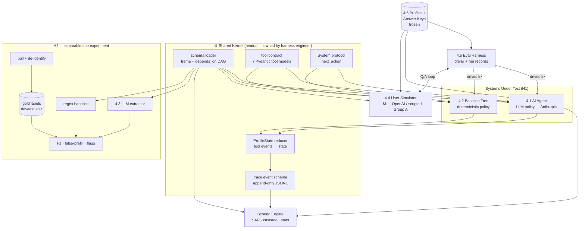

# Architecture Decision Document — AI Adaptive Onboarding PoC (Eval Harness)

> **What this is.** The technical architecture for the offline eval harness specified by the
> [PRD](prds/prd-AI-Adaptive-Onboarding-PoC-2026-06-02/prd.md) (35 FRs) and decomposed by
> [epics.md](epics.md) (5 epics / 30 stories). It does **not** redesign the experiment —
> the [PoC plan v1.2](poc-plan-ai-adaptive-onboarding-2026-06-02.md) remains the experimental
> source of truth and the [schema v0.3](guesty-pro-account-creation-schema.md) remains the frame.
> This document translates those into component boundaries, a tech stack, and the structural
> mechanisms that make the PRD's invariants enforceable in code rather than by discipline.

---

## 0. Scope & Architectural Drivers

This is an **offline, file-based eval harness** — not a service, not a UI, no production API. That single fact dominates every decision below: there is no scaling concern, no auth surface, no uptime requirement. The hard requirements are **reproducibility, fairness isolation, and structural enforcement of invariants** — getting a *defensible* number out of N=8, not getting a number fast.

The load-bearing constraints (from the PRD), restated as architectural drivers:

| # | Driver | Source | Architectural consequence |
|---|--------|--------|---------------------------|
| D-1 | Both SUTs share one fixed tool surface and emit **identical** machine-readable traces | FR-2, FR-13b | One tool contract + one trace format, authored once, imported by both. The tree is a *policy*, not a parallel implementation. |
| D-2 | Temperature 0.0 on every scored slot, enforced **structurally** | FR-6 | Temperature is a property of a *call type*, not a call-site argument. Tool-emitting calls cannot be issued at any other temperature. |
| D-3 | Simulator uses a **different provider family** than the agent | FR-21 | Provider identity is config-validated at startup; same-family config is a hard fail. |
| D-4 | No shared state between runs; each run reproducible | FR-22, FR-26 | A run is a pure function of `(frozen inputs, run_index, seed)`. State is constructed fresh per run; the durable artifact is an immutable trace. |
| D-5 | Freeze discipline: k=5 frozen campaign, ≤2 re-freezes, all campaigns reported | FR-25, FR-26 | A content-hashed **manifest** gates the frozen run; the harness refuses to run frozen without one and stamps it into every record. |
| D-6 | Tree author ≠ agent-prompt author; tree authored blind to profiles | FR-9, FR-10 | Module + branch isolation; a neutral shared kernel owned by neither partisan. |
| D-7 | H2 is separable — no simulator, no tree | §4 (PRD), Epic 5 | H2 is a standalone package with its own entry point; it shares only the schema loader and LLM client. |
| D-8 | PII: raw notes never on disk unprotected; de-identified corpus only | §9, NFR-3 | Raw notes live outside the repo behind access control; a commit-time guard blocks PII; the extractor only ever sees de-identified text. |

**Team shape.** 2–3 engineers. The FR-10 hard precondition (tree author ≠ agent author) and the neutral-kernel requirement (D-6) drive the module ownership map in §11.

---

## 1. Tech Stack

Recommended stack with rationale. Items marked **[RATIFY]** are genuine choices I want your sign-off on (§14); everything else follows from the drivers.

| Layer | Choice | Version (verified 2026-06-02) | Rationale |
|-------|--------|-------------------------------|-----------|
| Language | **Python** | 3.12+ | The deliverable is statistics + LLM orchestration, not a product. Cluster bootstrap, slot-level aggregation, and PII tooling all live in the Python data stack. ✅ **Ratified** (§14). |
| Agent / extractor LLM | **Anthropic SDK** (`anthropic`) | `0.105.2` | Native tool-use loop (`stop_reason == "tool_use"` → `tool_result`), per-call `temperature`, usage accounting for SM-10. Pin a **dated model snapshot** (e.g. `claude-opus-4-6`), never a `-latest` alias (see Risk R-7). |
| Simulator LLM (decorrelated) | **OpenAI SDK** (`openai`) | `2.40.0` | Different provider family satisfies FR-21 structurally. Native structured outputs (`responses.parse` / `chat.completions.parse`) and a best-effort `seed` param (more than Anthropic exposes — see R-2). ✅ **Ratified** — agent=Claude / sim=GPT (§14). |
| Schema / contract validation | **Pydantic** | v2 | The 7 tools, the per-slot `item_shape`, the extractor output, and the trace events are all Pydantic models — one validation layer, JSON-schema export for LLM tool defs for free. |
| Trace store (durable) | **JSONL**, append-only, one file per run | — | Human-diffable, git-friendly, PII-free (H1), trivially reproducible. The trace *is* the source of truth; everything downstream is derived. |
| Analysis store (derived) | **DuckDB** | latest stable | Reads the JSONL/Parquet traces directly; SQL makes the cluster-bootstrap and per-group/per-section SAR aggregations clean. No server, no migration, file-based. ✅ **Ratified** (§14). |
| Numerics / bootstrap | **NumPy** (+ SciPy if needed) | latest stable | Cluster bootstrap CIs (FR-25) implemented explicitly so the clustering and lower-bound>0 rule are auditable, not hidden in a library default. |
| De-identification (H2) | **[RATIFY / OPEN-2]** | — | Method (automated PII scrub vs. manual vs. Presidio-style) is gated on the data/RevOps owner. Architecture treats de-id as a pluggable pre-labeling stage; the *interface* is fixed, the *implementation* is OPEN-2. |
| Config | **TOML** + Pydantic settings | — | Run config (providers, models, k, seeds, temperatures, manifest path) is a validated, version-controlled file. Provider-decorrelation and temperature defaults are validated here. |
| Test | **pytest** | latest stable | The scoring engine, in-scope resolver, cascade attribution, and false-write detector are pure functions with hand-computed fixtures (these are the highest-risk code — §13). |
| Packaging / env | **uv** or **Poetry** + lockfile | — | A pinned lockfile is part of the freeze manifest (D-5). |

**Deliberately rejected:** orchestration frameworks (LangChain / LlamaIndex / agent frameworks). They abstract away exactly the things this experiment *measures* — per-call temperature, the precise tool-call trace, provenance, the message-by-message loop. The harness needs a thin, transparent loop it fully controls. We write ~200 lines of loop instead of inheriting 20k lines of indirection.

---

## 2. System Decomposition & Component Boundaries

Six components from the PRD, plus a **neutral shared kernel** that is the linchpin of fairness (D-1, D-6).



**The principle that makes the comparison fair:** the agent and the tree are two implementations of one `System` protocol. Neither owns the tool surface, the state reducer, or the trace format — those live in the kernel. An "outcome difference between systems" is therefore *provably* attributable to the policy, because everything around the policy is literally the same code path (D-1).

---

## 3. The Shared Contracts (the heart of the design)

Four contracts, authored once in the kernel, frozen before authoring of either SUT begins.

### 3.1 Tool contract (FR-2, FR-13b)

The seven tools are Pydantic models; their JSON Schema is exported for the agent's LLM tool definitions and the same models validate the tree's direct calls. Arguments conform to the schema `item_shape` for the targeted slot.

```python
# kernel/tools.py  (illustrative)
class RecordAnswer(ToolCall):    field_id: str; value: Any; source: Source
class AddFee(ToolCall):          fee_type: str; amount: float; unit: Literal["flat","percent"]
class AddTax(ToolCall):          tax_type: TaxType; tax_type_other: str | None; inclusivity: ...; what_taxed: list[...]
class AddOwner(ToolCall):        owner: OwnerItem            # full S8 item_shape
class SkipQuestion(ToolCall):    field_id: str; reason: str
class FlagForCall1(ToolCall):    topic: str; user_quote: str; note: str
class EndSection(ToolCall):      section_id: str
```

Every state mutation in either system is exactly one of these (FR-2 consequence). Free-writes are structurally impossible — there is no other path into `ProfileState`.

### 3.2 ProfileState reducer

A pure reducer: `apply(state, tool_call) -> state`. It enforces the schema's runtime field-state machine (`unanswered → recorded | skipped | flagged | prefilled_unconfirmed`) and the `depends_on` guards. Both systems mutate state only through it. This is also where **`end_section` is rejected while any reachable in-scope slot is undispositioned or any echo awaits confirmation** (§8 invariant 7).

### 3.3 Trace event schema (NFR-1, and more than NFR-1 — see R-10)

The trace is an append-only event log, **richer than a bare tool-call list**, because false-write detection on composite tools (FR-24 / EC-12) and questions-to-completion (excluding echo turns, EC-32) cannot be reconstructed from tool calls alone:

```jsonc
// one JSONL line per event
{ "turn": 7, "kind": "user_facing_question", "slot": "security_deposit_amount", "text": "..." }
{ "turn": 8, "kind": "value_introduced",     "slot": "security_deposit_amount", "subfield": "amount", "value": 500 }
{ "turn": 8, "kind": "echo_issued",          "slot": "security_deposit_amount", "subfield": "amount", "value": 500 }
{ "turn": 9, "kind": "user_confirmed",       "slot": "security_deposit_amount", "subfield": "amount" }
{ "turn": 9, "kind": "tool_call",            "tool": "record_answer", "args": {...} }
```

`kind` is the vocabulary the metric computers consume: `false_write_rate` = a `tool_call` on an `echo_before_write` field with no prior `user_confirmed` for every echo-required sub-field; `questions_to_completion` = count of `user_facing_question` events, **excluding** `echo_issued` (EC-32). Identical computation for both systems (FR-24).

### 3.4 System protocol

```python
class System(Protocol):
    system_id: str            # "agent" | "tree" — distinct provider/author recorded
    def next_action(self, state: ProfileState, last_user_msg: str | None)
        -> UserQuestion | list[ToolCall] | EndConversation: ...
```

The harness loop is system-agnostic: ask → simulator answers → policy emits tool calls or the next question → reduce → repeat, until `EndConversation` or the **60 user-facing-turn cap** (§8 invariant 7), which marks the run `incomplete` (a defined outcome, not a hang).

---

## 4. Determinism, Temperature & Decorrelation (structural enforcement)

The PRD is explicit that these must be enforced by construction, not by call-site discipline (FR-6) — so they live in the LLM client layer, not in prompts.

### 4.1 Temperature as a call-type, not an argument (D-2 / FR-6)

```python
# kernel/llm.py
def scored_completion(...):   # temperature HARD-CODED to 0.0; no override parameter exists
    return client.complete(..., temperature=0.0)

def glue_completion(...):     # the ONLY path permitted temperature 0.2 — emits no tool calls
    return client.complete(..., temperature=0.2)
```

The agent's tool-emitting calls route exclusively through `scored_completion`. `glue_completion` is type-restricted to produce conversational text only (no tools attached to the request). There is no function in the codebase that emits a scored tool call at temperature ≠ 0.0. Verifiable from run config/logs (FR-6 consequence) because every call logs its `call_type` and temperature into the trace.

> ⚠️ This contradicts **epics Story 3.7** as currently written ("temperature 0.2 for extraction and 0.0 on numeric writes"). The PRD's M5 resolution (FR-6) supersedes it: **0.0 on all scored slots**, 0.2 only on unscored glue. See Risk **R-1** — Story 3.7 must be corrected before dev.

### 4.2 Provider decorrelation (D-3 / FR-21)

Provider family is a config field validated at startup: `assert agent.provider_family != simulator.provider_family` — a same-family config aborts the run. Group A simulator turns are **slot-keyed scripted canned replies** (FR-19 / EC-27), selected by which slot the question targets, not by sequence position — so they answer the agent's adaptive question regardless of order. Run config records distinct providers (FR-21 consequence).

### 4.3 Honest determinism note

Real determinism comes from echo-before-write, not temperature (PRD §8 / NFR-2). Temperature 0.0 is *not* treated as a hard guarantee; residual variance is measured across k=5 (FR-25). See R-2 on the seed asymmetry.

---

## 5. Reproducibility & Freeze Discipline (D-4, D-5 / FR-22, FR-26)

### 5.1 A run is a pure function

`run(frozen_profile, system, run_index, seed) -> RunRecord`. No run reads another run's state. The `RunRecord` is immutable, written once, and carries: the manifest hash, the dated model snapshot(s), the provider config, the seed (where supported), the full event trace, the realized in-scope slot set, and the computed metrics.

### 5.2 The freeze manifest

Freeze = a `manifest.json` capturing **content hashes** of every input that could change the result:

- each of the 8 frozen profiles + answer keys
- the agent system prompt
- the tree definition
- the simulator config + scripted Group A turns
- the scoring code (module hash)
- the schema version + the resolved in-scope slot sets (frozen with the answer keys — see §6.4)
- the dependency lockfile
- the git commit SHA

The harness **refuses to run in `--frozen` mode without a manifest**, and stamps the manifest hash into every `RunRecord`. A post-freeze change to *any* hashed input ⇒ hash mismatch ⇒ the harness forces a **re-freeze** (new manifest, increment a counter persisted alongside campaigns). **Re-freezes are capped at 2** (FR-26); exceeding requires a recorded PM override flag and is reported as a multiple-comparisons risk. This covers the SUTs, the simulator, **and** the scoring harness (EC-25) — a "silent patch" is impossible because the patched file's hash no longer matches the manifest.

### 5.3 Campaign retention

Every frozen campaign is written to its own immutable directory (`campaigns/<manifest-hash>/`). The report generator reads **all** campaign directories, not just the latest (FR-25 / H4) — a single favorable campaign cannot be presented in isolation.

### 5.4 Dev/test isolation

Dev profiles (≥4) and scored profiles (8) are physically separate directories. The harness's `--frozen` mode will only load the scored set; dev runs are tagged `tuning` and are structurally excluded from any campaign directory. Run records carry the tuning/scored tag so the run record itself proves tuning happened on dev only (Story 4.4 AC).

---

## 6. Scoring Engine (FR-23, FR-30, FR-35)

The scorer is pure and reads only the trace + the frozen answer key. Five concerns, each a tested function:

### 6.1 The in-scope resolver (single source of truth)

`resolve_inscope_slots(profile_facts, adjudication_choice) -> {slot_id: expected_disposition}` walks the schema `depends_on` DAG against the profile's ground-truth facts and returns **every reachable slot across all three tiers** in the in-scope sections (the §3 Glossary denominator) with its expected disposition. This one function computes **both** the SAR denominator **and** the cascade/sensitivity re-resolution — so the denominator and the scoring use identical reachability logic. It is the most load-bearing pure function in the system (R-5, R-6).

### 6.2 Per-disposition scoring

Implements the FR-23 rubric exactly: zero tolerance on money/percentages, range-match for range ground truths, `recorded`/`flagged`/`skipped`/`conditional` handling, required-skip-must-be-flagged (EC-24), and `unanswered` tagging for premature `end_section` (so a flow bug isn't conflated with a wrong value).

### 6.3 Cascade attribution (FR-23 / EC-8)

When a `depends_on` root slot is mis-recorded, downstream zeros are tagged `dependent(cascade)` and attributed to the single root error. The report shows SAR **both** raw **and** cascade-collapsed.

### 6.4 Free-text & S5 routing (FR-35, FR-4)

- **Free-text slots** (`pain`, `split_terms`, verbal ownership) and the **SM-4 structural-win** are *not* auto-scored. The scorer emits a **blind, system-anonymized rating task** to a queue (JSONL/CSV); ≥2 raters fill it; the scorer ingests their adjudicated verdict. This makes human rating an **async input to scoring**, not a blocker inside the run loop. (Operational risk R-4.)
- **S5 conditional** is scored against the **realized transcript** where the direct-booking signal could vary run-to-run (FR-4), via a dynamic disposition resolver. Recommendation: pin the direct-booking signal deterministically in all 8 specs (the PRD permits this) so the dynamic path is exercised intentionally, not accidentally.

### 6.5 Adjudication & sensitivity band (FR-30)

Contested slots are never dropped. The band re-runs §6.1 under best/worst adjudication; when a contested slot is a `depends_on` **root**, the band **propagates** through the dependency chain (re-resolving every dependent slot's expected disposition). SM-4 must survive the worst-case band.

---

## 7. Statistics, Honest to N=8 (FR-25)

A `statistics` module computes:

- **Cluster bootstrap CIs** — resample profiles (clusters) with replacement, then slots within, over the pooled scored-slot set. Implemented explicitly in NumPy so the clustering is auditable.
- **CI applicability rule (H5):** inferential CIs only for **Group B (n=4)** and the **pooled B+C** slot set. Groups A and C (n=2) get descriptive-only intervals, explicitly labeled "not inferential." The §10 "CI clears zero" (lower bound > 0) condition applies to B and pooled B+C only.
- **Decision-stability** — the per-profile verdict must hold in **≥4/5** runs; the module reports the verdict-flip rate, **excluding** flips caused by a stochastic simulator changing the realized S5 signal (FR-4).
- **Disposition-flip flags** — any slot whose disposition flips across runs is a reliability red flag (same S5 exclusion).

---

## 8. H2 Pipeline (separable) & PII Governance (D-7, D-8)

A standalone package (`h2/`) with its own entry point. It shares only the schema loader (for S0b slot defs) and the LLM client. **No simulator, no tree, no ProfileState** — it is a static extraction task on real text.

**Pipeline (mirrors Epic 5):**

```
pull(full-length) → de-identify[OPEN-2] → label(2 raters + tiebreak)
   → dev/test split → { LLM extractor (provenance + abstention) ‖ regex baseline }
   → score(per-type matching) → { micro-F1, false-prefill, provenance-failure, flag-quality }
```

- **Per-type matching (FR-17/M7):** enums exact; `list<enum>` (`risk_flags`, `addon_intent`) by per-element set overlap (TP/FP/FN on members); free-text via the FR-35 blind rater.
- **Abstention (FR-18):** false-prefill ceiling ≤10% on sparse/empty strata **and** per-slot on populated notes that omit a slot; CI-reported if the sparse stratum < 10 notes.
- **Provenance fidelity (FR-14/EC-18):** every emitted slot carries a span that must appear in the (de-identified) note under whitespace/case normalization; a correct value with a non-verbatim span is tallied as a separate provenance-failure sub-metric.
- **Brief-only slots (FR-16):** `customer_sentiment`, `risk_flags`, `tech_level` are emitted to the gold/score layer but the harness asserts they never appear in any H1 user-facing turn.

**PII governance (NFR-3 / §9), enforced structurally:**

1. **Raw notes live outside the repo** — a path under access control by the data/RevOps owner; `.gitignore` plus a **pre-commit / CI guard** that scans staged content for PII patterns and the raw-corpus path and **blocks the commit**. (No raw note can reach git even by accident.)
2. **De-identify before any human/LLM touch.** The extractor and labelers only ever receive de-identified text — so **provenance spans are de-identified by construction** (they quote de-identified text).
3. **The de-identification method is OPEN-2** — gated on the data/RevOps owner. Architecture fixes the *interface* (a `deidentify(note) -> note` stage with a verification report); the *implementation* is ratified separately. **This blocks Epic 5 Story 5.1 and must close before the pull.**

---

## 9. End-to-End Data Flow (H1)

```
frozen profile (facts + persona + answer key)
        │
        ├──────────────► in-scope resolver ──► realized scored-slot set (frozen w/ answer key, §6.4)
        │
   harness.run(profile, system, run_index, seed)
        │   ask ─────────────► User Simulator (decorrelated provider / scripted Group A)
        │                          │ reply (faithful, echo-correcting, no answer-key leak)
        │   ◄───────────────────────┘
        │   policy.next_action ──► ToolCall[] ──► ProfileState.apply ──► trace event(s)
        │   (loop until EndConversation or 60-turn cap)
        ▼
   RunRecord (immutable JSONL: trace + manifest hash + models + metrics)
        │
        ▼  (×5 runs × 8 profiles × 2 systems = 80 frozen H1 runs)
   Scoring Engine ──► SAR (by group/section, raw + cascade-collapsed)
        │              + secondary metrics + free-text rater queue
        ▼
   Statistics ──► cluster bootstrap CIs + decision-stability
        ▼
   Report generator ──► H1×H2 verdict matrix (§7.1) + §10 kill-criteria evaluation
```

---

## 10. Repository Structure, Module Stubs & Ownership (D-6 / FR-10)

### 10.1 Full directory tree

```
poc-eval-harness/
│
├── kernel/                        # ◀ NEUTRAL — Epic 0 (Stories 0.1, 0.2)
│   ├── __init__.py                #   re-exports public surface
│   ├── schema.py                  #   SchemaLoader, FrameGraph
│   ├── tools.py                   #   the 7 ToolCall models + ToolCallUnion
│   ├── state.py                   #   ProfileState, apply(), SlotStatus enum
│   ├── trace.py                   #   TraceEvent, TraceWriter, TraceReader
│   ├── llm.py                     #   scored_completion(), glue_completion(), provider clients
│   └── protocol.py                #   System protocol, NextAction union type
│
├── agent/                         # ◀ Epic 3 — AGENT-PROMPT AUTHOR only
│   ├── __init__.py
│   ├── agent.py                   #   AgentSystem(System) — LLM-backed policy
│   └── prompts/
│       └── system_prompt.txt      #   the agent's system prompt (tunable on dev set only)
│
├── tree/                          # ◀ Epic 2 — TREE AUTHOR (≠ agent author)
│   ├── __init__.py                #   (tree author never sees profiles/scored/)
│   └── tree.py                    #   TreeSystem(System) — deterministic FSM policy
│
├── simulator/                     # ◀ Epic 4 — harness engineer
│   ├── __init__.py
│   ├── simulator.py               #   UserSimulator — LLM or scripted (Group A)
│   └── scripted_turns/            #   slot-keyed canned replies for Group A (FR-19/EC-27)
│       └── group_a.yaml
│
├── harness/                       # ◀ Epic 4 — harness engineer
│   ├── __init__.py
│   ├── runner.py                  #   run_campaign(), run_one() — async, idempotent
│   ├── manifest.py                #   FreezeManifest — content-hash, validate, stamp
│   └── records.py                 #   RunRecord dataclass — immutable, written once
│
├── scoring/                       # ◀ Epic 4 — harness engineer
│   ├── __init__.py
│   ├── resolver.py                #   resolve_inscope_slots() — the pure SAR denominator
│   ├── sar.py                     #   score_slot(), score_profile(), cascade_tag()
│   ├── metrics.py                 #   false_write_rate(), questions_to_completion(), etc.
│   ├── stats.py                   #   cluster_bootstrap_ci(), decision_stability()
│   ├── rater_queue.py             #   free-text async rating queue (FR-35 / §6.4)
│   └── report.py                  #   generate_h1_report(), verdict_matrix()
│
├── profiles/                      # ◀ Epic 1 — analyst + reviewers
│   ├── dev/                       #   ≥4 calibration profiles (tuning only, never scored)
│   └── scored/                    #   8 frozen profiles + answer keys (tree session blind to this)
│
├── h2/                            # ◀ Epic 5 — separable; shares only kernel.schema + kernel.llm
│   ├── __init__.py
│   ├── extractor.py               #   LLMExtractor — S0b structured JSON + provenance
│   ├── regex_baseline.py          #   RegexExtractor — keyword rules (FR-17)
│   ├── labeling.py                #   gold label I/O, dev/test split
│   ├── scorer.py                  #   micro_f1(), false_prefill_rate(), flag_quality()
│   └── data/                      #   de-identified corpus only (raw notes NEVER here — PII guard)
│       ├── .gitignore             #   blocks *.raw, *.pii, raw/ entirely
│       ├── labeled_dev.jsonl      #   gold dev subset (post de-id + labeling)
│       └── labeled_test.jsonl     #   gold held-out test subset (frozen)
│
├── campaigns/                     # ◀ immutable per-manifest run outputs (all retained)
│   └── <manifest-hash>/
│       ├── manifest.json          #   content hashes of all frozen inputs
│       └── runs/
│           └── <profile>_<system>_<run_idx>.jsonl   # one file = one run trace
│
├── config/
│   └── run_config.toml            #   providers, models, k, seeds, temps — validated on load
│
├── tests/                         # ◀ fixtures-first for the three high-risk pure functions
│   ├── test_resolver.py           #   resolve_inscope_slots: C1/C2 fan-out, ownership_model flip
│   ├── test_sar.py                #   cascade attribution, sensitivity band propagation
│   ├── test_false_write.py        #   per-sub-field echo-introduced/confirmed detection (EC-12)
│   ├── test_tools.py              #   Pydantic validation on all 7 tool models
│   └── fixtures/
│       ├── profile_c1.json        #   C1: 4-owner fan-out (commission/fixed/split/other)
│       ├── profile_c2.json        #   C2: "70% of whatever comes in after fees"
│       └── traces/                #   hand-computed reference traces for metric assertions
│
├── pyproject.toml                 #   dependencies pinned; part of the freeze manifest
├── uv.lock                        #   (or poetry.lock) — locked, committed
├── .gitignore                     #   includes: h2/data/raw/, *.pii, campaigns/ (large)
└── .github/
    └── workflows/
        └── pii_guard.yml          #   blocks commits touching h2/data/raw/ or *.pii patterns
```

### 10.2 Module stubs (Story 0.1 deliverables — kernel only)

Everything below lives in `kernel/`. These are the **exact public surfaces** Amelia must produce; `agent/` and `tree/` import them and nothing else.

---

**`kernel/tools.py`** — the 7 tool models (FR-2)

```python
from __future__ import annotations
from typing import Any, Literal, Union
from pydantic import BaseModel

class Source(str): ...  # "user_stated" | "sf_prefill" | "ai_extracted_from_note"

class RecordAnswer(BaseModel):
    tool: Literal["record_answer"] = "record_answer"
    field_id: str
    value: Any
    source: Source

class AddFee(BaseModel):
    tool: Literal["add_fee"] = "add_fee"
    fee_type: str
    amount: float
    unit: Literal["flat", "percent"]

class AddTax(BaseModel):
    tool: Literal["add_tax"] = "add_tax"
    tax_type: str           # provisional G3 casing — normalised on scoring (OPEN-3)
    tax_type_other: str | None = None
    inclusivity: Literal["inclusive", "exclusive"]
    what_taxed: list[str]   # list<enum[accommodation_fare,cleaning_fee,additional_fees]>
    scope: Literal["listing", "account_wide"]

class AddOwner(BaseModel):
    tool: Literal["add_owner"] = "add_owner"
    owner_name: str
    email: str
    listings: list[str]
    ownership_share: float | None = None
    management_model: Literal["commission", "fixed_fee", "revenue_split", "other"]
    pmc_commission_rate: float | None = None     # depends_on management_model == 'commission'
    fixed_fee_amount: float | None = None        # depends_on management_model == 'fixed_fee'
    split_terms: str | None = None               # depends_on revenue_split | other
    who_pays_channel_commission: Literal["owner", "pmc", "split"] | None = None

class SkipQuestion(BaseModel):
    tool: Literal["skip_question"] = "skip_question"
    field_id: str
    reason: str

class FlagForCall1(BaseModel):
    tool: Literal["flag_for_call_1"] = "flag_for_call_1"
    topic: str
    user_quote: str
    note: str

class EndSection(BaseModel):
    tool: Literal["end_section"] = "end_section"
    section_id: str

ToolCall = Union[
    RecordAnswer, AddFee, AddTax, AddOwner,
    SkipQuestion, FlagForCall1, EndSection
]
```

---

**`kernel/state.py`** — ProfileState pure reducer

```python
from __future__ import annotations
from enum import Enum
from typing import Any
from pydantic import BaseModel
from .tools import ToolCall

class SlotStatus(str, Enum):
    UNANSWERED            = "unanswered"
    RECORDED              = "recorded"
    SKIPPED               = "skipped"
    FLAGGED               = "flagged"
    PREFILLED_UNCONFIRMED = "prefilled_unconfirmed"

class SlotState(BaseModel):
    field_id: str
    status: SlotStatus = SlotStatus.UNANSWERED
    value: Any = None
    source: str | None = None
    flag_ref: str | None = None
    echo_pending: bool = False          # True between echo_issued and user_confirmed

class ProfileState(BaseModel):
    profile_id: str
    slots: dict[str, SlotState] = {}   # keyed by field_id
    owners: list[dict] = []
    fees: list[dict] = []
    taxes: list[dict] = []
    turn_count: int = 0

def apply(state: ProfileState, tool_call: ToolCall) -> ProfileState:
    """
    Pure reducer — returns a new ProfileState.
    Raises ValueError if end_section is called while any reachable
    in-scope slot in that section is undispositioned or echo_pending.
    Never mutates the input state.
    """
    ...
```

---

**`kernel/trace.py`** — trace event schema (§3.3 — richer than bare tool-calls)

```python
from __future__ import annotations
from typing import Literal, Union, Any
from pydantic import BaseModel

class UserFacingQuestion(BaseModel):
    kind: Literal["user_facing_question"] = "user_facing_question"
    turn: int
    slot: str | None          # primary slot being asked about (None for open-ended)
    text: str                 # the question text shown to the simulator

class ValueIntroduced(BaseModel):
    kind: Literal["value_introduced"] = "value_introduced"
    turn: int
    slot: str
    subfield: str | None      # for composite tools (add_owner, add_fee, add_tax)
    value: Any

class EchoIssued(BaseModel):
    kind: Literal["echo_issued"] = "echo_issued"
    turn: int
    slot: str
    subfield: str | None
    value: Any                # the value echoed back

class UserConfirmed(BaseModel):
    kind: Literal["user_confirmed"] = "user_confirmed"
    turn: int
    slot: str
    subfield: str | None

class UserCorrected(BaseModel):
    kind: Literal["user_corrected"] = "user_corrected"
    turn: int
    slot: str
    subfield: str | None
    corrected_value: Any

class ToolCallEvent(BaseModel):
    kind: Literal["tool_call"] = "tool_call"
    turn: int
    tool: str
    args: dict
    temperature: float        # must be 0.0 for scored slots — logged for audit (FR-6)

class SessionEnd(BaseModel):
    kind: Literal["session_end"] = "session_end"
    turn: int
    reason: Literal["completed", "incomplete_turn_cap", "errored"]

TraceEvent = Union[
    UserFacingQuestion, ValueIntroduced, EchoIssued,
    UserConfirmed, UserCorrected, ToolCallEvent, SessionEnd
]
```

---

**`kernel/llm.py`** — temperature-enforced LLM client (FR-6, D-2)

```python
from __future__ import annotations
from typing import Any
import anthropic
import openai
from .tools import ToolCall

# Clients are constructed once from run_config.toml; temperature is NOT a parameter.

def scored_completion(
    messages: list[dict],
    tools: list[dict],        # JSON-schema tool defs exported from kernel/tools.py
    system: str | None = None,
    *,
    _client: anthropic.Anthropic,
    _model: str,
) -> tuple[str | None, list[ToolCall]]:
    """
    ALWAYS runs at temperature=0.0. No override parameter exists.
    Used for every turn that may emit a tool call on a scored slot.
    Returns (assistant_text | None, list_of_parsed_tool_calls).
    """
    ...

def glue_completion(
    messages: list[dict],
    system: str | None = None,
    *,
    _client: anthropic.Anthropic,
    _model: str,
) -> str:
    """
    Runs at temperature=0.2. CANNOT attach tools — structural guard against
    accidentally routing a scored-slot turn through the glue path.
    Used only for conversational transitions / greetings.
    """
    ...

def simulator_completion(
    messages: list[dict],
    system: str | None = None,
    *,
    _client: openai.OpenAI,
    _model: str,
    seed: int | None = None,   # best-effort; OpenAI only
) -> str:
    """
    OpenAI provider (different family from agent — FR-21).
    Returns the simulator's natural-language reply.
    """
    ...
```

---

**`kernel/protocol.py`** — System protocol + NextAction types

```python
from __future__ import annotations
from typing import Protocol, Union
from pydantic import BaseModel
from .state import ProfileState
from .tools import ToolCall

class UserQuestion(BaseModel):
    text: str
    primary_slot: str | None = None   # hint for the simulator slot-key lookup (FR-19/EC-27)

class EndConversation(BaseModel):
    reason: str

NextAction = Union[UserQuestion, list[ToolCall], EndConversation]

class System(Protocol):
    system_id: str    # "agent" | "tree" — distinct, recorded in every RunRecord

    def next_action(
        self,
        state: ProfileState,
        conversation_history: list[dict],   # full message log so far
    ) -> NextAction: ...
```

---

**`kernel/schema.py`** — frame loader + depends_on DAG

```python
from __future__ import annotations
from dataclasses import dataclass, field
from typing import Any

@dataclass
class SlotDef:
    id: str
    section: str
    priority: str                    # "required" | "recommended" | "optional"
    type: str
    depends_on: str | None = None    # raw condition string from schema JSON
    echo_before_write: bool = False
    human_handoff: str | None = None
    options: list[str] = field(default_factory=list)
    item_shape: dict = field(default_factory=dict)

class SchemaLoader:
    """Parses guesty-pro-account-creation-schema.md JSON blocks into SlotDef objects."""
    def load(self, schema_path: str) -> list[SlotDef]: ...

class FrameGraph:
    """
    Builds the depends_on DAG from a list of SlotDefs.
    Primary method: reachable_slots(profile_facts, sections) -> list[SlotDef]
    Used by resolve_inscope_slots() in scoring/resolver.py.
    """
    def __init__(self, slots: list[SlotDef]): ...
    def reachable_slots(self, profile_facts: dict[str, Any], sections: list[str]) -> list[SlotDef]: ...
```

### 10.3 Ownership rules (fairness-critical)

- **`kernel/` is frozen and version-tagged** before either `agent/` or `tree/` is touched. Neither the tree author nor the agent-prompt author may modify it.
- **`tree/` is developed on a branch that has never fetched `profiles/scored/`.** The freeze verification (FR-9/H7) is confirmed from git history before merge.
- **`agent/` and `tree/` import `kernel` read-only** — they implement `System` and call the kernel's `apply()`, `scored_completion()`, and `ToolCall` models. Nothing else.
- With **2 engineers**: Engineer A = kernel + harness + simulator + scoring + extractor (Epics 0/4/5) and agent prompt (Epic 3); Engineer B = tree only (Epic 2). The single-builder kernel caveat (architecture R-8) applies; log it in the run record.
- With **3 engineers**: Engineer A = kernel + harness (neutral); Engineer B = agent (Epic 3); Engineer C = tree (Epic 2). Cleanest fairness posture.

---

## 11. Run Execution Model

- **Async + bounded concurrency.** 80 frozen runs (plus dev iteration) of up-to-60-turn LLM loops benefit from concurrency; cap it to respect provider rate limits.
- **Idempotent & resumable.** Each run is keyed by `(manifest_hash, profile_id, system_id, run_index)`. A completed `RunRecord` is never recomputed; a mid-campaign API failure resumes the missing runs only — a frozen campaign is never lost or silently restarted.
- **Transient-error retry** with backoff on API 429/5xx; a run that exhausts retries is recorded as `errored` (distinct from `incomplete`), surfaced in the report rather than silently dropped.
- **Cost/latency capture (SM-10/NFR-5)** from SDK usage objects, written per run; baseline tree ≈ 0.

---

## 12. Epic → Architecture Mapping

| Epic | Architecture home |
|------|-------------------|
| **Epic 0 — Kernel & scaffold** | `kernel/` (§10.2 stubs), `config/run_config.toml`, `pyproject.toml`/lockfile, `.github/workflows/pii_guard.yml`, `tests/test_tools.py` |
| Epic 1 — Ground-truth bench | `profiles/`, the §6.1 in-scope resolver (frozen *with* the answer keys), adjudication protocol §6.5 |
| Epic 2 — Honest tree | `tree/` (a `System` policy over the kernel), capability ledger doc, blind-authoring branch isolation §10 |
| Epic 3 — AI agent | `agent/` (a `System` policy), `scored_completion` enforcement §4.1, trace events §3.3 |
| Epic 4 — Harness & verdict | `harness/`, `scoring/`, `simulator/`, `statistics`, freeze manifest §5, report generator §9 |
| Epic 5 — H2 | `h2/` standalone pipeline §8, PII governance D-8 |

---

## 13. Implementation Risk Register (flag before epics go to dev)

Ordered by what will hurt most if missed. R-1, R-4, R-5/6, R-10 are the ones I'd resolve before a line of code.

| ID | Risk | Sev | Where | Recommended action |
|----|------|-----|-------|--------------------|
| **R-1** | ~~Epics Story 3.7 contradicts PRD FR-6 on temperature.~~ **RESOLVED 2026-06-02** — Story 3.7 corrected to FR-6 v2 (0.0 on all scored slots; 0.2 only on unscored glue). | ✅ Closed | epics §3.7 | Done. |
| **R-2** | **Seed pinning is provider-asymmetric.** Anthropic exposes no `seed`; OpenAI's is best-effort. "Reproducible with pinned seeds" is only partially achievable — if the agent is on Claude, agent runs are *not* seed-reproducible even at temp 0. | Med | FR-22, §5 | Accept it: real reproducibility comes from the **frozen-input manifest + retained raw traces** (§5), not seed determinism. Make this explicit in the report; k=5 + decision-stability is the variance control by design (FR-25). |
| **R-3** | **S5 dynamic scoring** couples the scorer to the realized transcript (FR-4), creating a code path where "expected disposition" depends on simulator stochasticity. | Med | FR-4, §6.4 | Pin the direct-booking signal deterministically in all 8 specs (PRD permits). Exercise the dynamic resolver only where S5 surfacing is the intended test, not as an accident of phrasing. |
| **R-4** | **Free-text rating (FR-35) is human-in-the-loop at k=5 scale.** 5 runs × 8 profiles × several free-text slots × ≥2 blind raters can become the critical path on the verdict. | Med/High | FR-35, §6.4 | Build rating as an **async queue** (§6.4), not an inline blocker. If throughput is infeasible, pre-register a **run-sampling rule** for free-text slots (e.g., rate runs 1 & median) — but note it weakens stability claims on those slots; get PM sign-off on the sampling rule before freeze. |
| **R-5** | **Cascade attribution + band propagation** (FR-23/FR-30) is the most algorithmically subtle code: a contested root re-resolves the whole downstream disposition set under two bands. Easy to get quietly wrong → wrong SAR. | **High** | §6.1, §6.3, §6.5 | Implement `resolve_inscope_slots` + cascade as **pure functions with hand-computed fixtures** (C1/C2 owner fan-out, ownership_model flip). Unit tests are the acceptance gate, not a nicety. |
| **R-6** | **The SAR denominator is *derived*, not enumerated** (in-scope set computed by resolving `depends_on` against facts). A resolver bug changes SAR for everyone; denominator membership is itself adjudicable (FR-30). | **High** | §6.1, FR-30 | Compute the realized in-scope set during **answer-key validation (FR-29)** and **freeze it with the answer key** in the manifest. Score against the frozen set; don't recompute from code that might drift. |
| **R-7** | **Model snapshot drift.** A `-latest` alias can change under you between freeze and re-run; provider deprecation can retire a snapshot mid-experiment (Anthropic's deprecation list shows this happens). | Med | §1, §5.2 | Pin **dated snapshots** in the manifest; record them in every RunRecord. A mid-experiment deprecation is a forced, logged re-freeze. |
| **R-8** | **Single-engineer overload.** With 2 engineers, Engineer A owns Epics 3+4+5 *and* the neutral kernel — a lot, and the kernel ideally isn't owned by the agent author. | Med | §10, OPEN-1 | Prefer a 3rd engineer on kernel+harness for neutrality + load. If only 2: document the agent-author-built-the-kernel deviation as a fairness caveat (the kernel is policy-neutral, but note it). Tie to OPEN-1. |
| **R-9** | **De-identification method (OPEN-2) blocks H2** and shapes the storage design; provenance-span de-id depends on it. | Med | §8, OPEN-2 | Close OPEN-2 with data/RevOps before the note pull (Story 5.1). Architecture is ready (pluggable de-id stage); the implementation is the gate. |
| **R-10** | **False-write detection on composite tools needs more than a tool-call trace** (FR-24/EC-12): per-sub-field "introduced/echoed/confirmed" turn tracking. A bare NFR-1 "tool-call trace" is necessary but insufficient. | Med | §3.3, FR-24 | Adopt the **richer event trace** (§3.3) from day one. Retrofitting echo-event capture after the agent loop is built is painful. |
| **R-11** | **FR-15 precedence split across H1 and H2.** The conflict-surfacing half is scored in ≥1 H1 profile (EC-17); the extraction half in H2. Easy to drop the H1 seed. | Low/Med | FR-15, §6 | Ensure ≥1 of the 8 scored specs seeds a handover-note prefill that conflicts with spec facts; the scorer checks conflict-surfacing there. Add to Epic 1 authoring checklist. |
| **R-12** | **G3 enum casing open (OPEN-3).** Tax-type/`what_taxed` casing is provisional. | Low | OPEN-3, FR-23 | Score S4 enums with a **case/whitespace-normalized comparison fallback** (already specced). If G3 closes after the run, re-score (not re-run) and note it. Build the normalization into the enum scorer now. |

---

## 14. DRI Decisions (ratified 2026-06-02)

| # | Decision | Status |
|---|----------|--------|
| 1 | **Language: Python 3.12.** | ✅ Ratified (Yair) |
| 2 | **Provider assignment (FR-21):** agent = Anthropic/Claude (dated snapshot), simulator = OpenAI/GPT (dated snapshot), extractor = same family as agent (Claude). | ✅ Ratified (Yair) |
| 3 | **No orchestration framework** — hand-rolled loop + native SDKs for full transparency over temperature/trace/provenance. | ✅ Accepted (architect default; not vetoed) |
| 4 | **Analysis layer: DuckDB** for the clustered-bootstrap SQL over JSONL traces. | ✅ Ratified (architect's call, DRI no-preference) |
| 5 | **Free-text rating (R-4): rate all k=5 runs.** Volume is tractable (~120 blind ratings); keeps decision-stability clean on those slots. Documented fallback: a runs-1/3/5 sampling rule that activates **only** with PM sign-off if rater capacity proves short. | ✅ Decided (architect's call, DRI delegated) |
| 6 | **Kernel ownership (R-8): prefer a 3rd engineer** owning the neutral kernel + harness. Fallback (only-2-engineers): Engineer A builds the kernel with a **logged fairness caveat** — the kernel is policy-neutral (tool contract, reducer, trace, scoring-by-disposition), so integrity risk is low. Resolves on OPEN-1. | ✅ Decided (architect's call, DRI delegated) — pending OPEN-1 staffing |
| 7 | **R-1 (Story 3.7 temperature bug): corrected in `epics.md`** to FR-6 v2 (0.0 on all scored slots; 0.2 only on unscored glue). | ✅ Fixed (Yair approved) |

**Blocking opens carried from the PRD:** OPEN-1 (resourcing / FR-10 two-author precondition — also gates Decision 6), OPEN-2 (de-id method — blocks H2 / Story 5.1), OPEN-3 (G3 casing — handled by the normalization-fallback enum scorer, non-blocking).

---

## 15. What I Deliberately Did **Not** Touch

- The experiment design, thresholds, and kill criteria — PoC plan + PRD §7/§10 are the source of truth; architecture serves them, it doesn't relitigate them.
- The answer-key *content* and profile facts — Epic 1's job, validated by reviewers (FR-29), not the architect's.
- Production write paths (G2/OPEN-5) — out of PoC scope by design (no live Guesty API).
