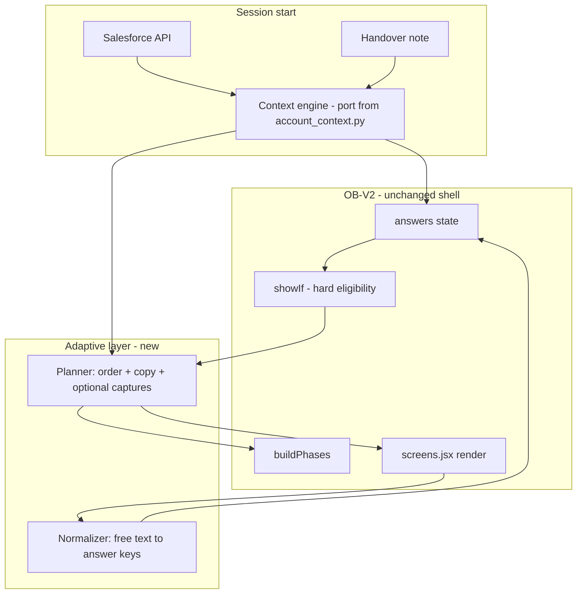

# OB-V2 × Brain Merge — Architecture Report

**Purpose:** How to merge the adaptive “brain” of the Guesty Pro onboarding PoC into the existing rule-based **OB-V2** questionnaire prototype — without requiring the full account-creation schema at questionnaire runtime.

**Audience:** Product and engineering leads planning incremental adoption of adaptive onboarding in the wizard UI.

---

## Executive summary

Do **not** replace the wizard with a chat UI. Add a thin **Session Context + Adaptive Planner** that the existing OB-V2 shell consults.

| Layer | Role |
|-------|------|
| **Context engine** (port from `account_context.py`) | Salesforce row + handover note → seeded `answers`, flags, copy hints |
| **Adaptive planner** | Reorder *eligible* screens, personalize copy, optional capture screens |
| **OB-V2 wizard** (unchanged shell) | `answers`, `showIf`, widgets, canvas, review/setup/done |

**Invariant:** `showIf` remains the **safety gate**. The brain only reorders and rephrases screens that already pass eligibility — never bypasses compliance or branching rules.

---

## 1. What exists today

### 1.1 OB-V2 (questionnaire prototype)

Source analyzed: `OB-V2.zip` (`wizard.jsx`, `screens.jsx`, `README.md`).

| Aspect | Implementation |
|--------|----------------|
| State | Flat `answers` object — **not** a schema runtime |
| Flow | `buildPhases(answers)` → filter with `showIf`, walk screens in **array order** |
| Context | Hardcoded `SF_PREFILL`, `CSM_NAME` |
| Branching | Deterministic predicates (`oauth_status`, `pay_timing`, `owners_gate`, etc.) |
| UX | Welcome mentions “pre-filled from your sales call”; `SourceChip` on prefilled fields |

Core phase builder pattern:

```javascript
function buildPhases(answers) {
  phases.push({ type: "welcome" });
  const screens = SCREENS.filter((s) => !s.showIf || s.showIf(answers));
  // screens pushed in makeScreens() array order
  phases.push({ type: "review" });
  phases.push({ type: "setup" });
  phases.push({ type: "done" });
}
```

### 1.2 Brain (PoC — ob-brain / poc-eval-harness)

| Layer | What it does | Needs full schema at runtime? |
|-------|----------------|-------------------------------|
| **Context engine** | SF row + note → extracted hints, defer rules | **No** |
| **Policy** | Next topic, personalized copy, one question per turn | Uses schema in PoC; can use **screen IDs** in wizard |
| **Write contract** | `record_answer`, echo-before-write, SAR scoring | **Yes** — eval harness only |

The PoC schema (`guesty-pro-account-creation-schema.md`) was **reverse-engineered from OB-V2** (cites `wizard.jsx` / `screens.jsx`). The merge reconnects siblings, not foreign systems.

**Critical PoC principle (from `docs/agent-handoff.md`):** Chat text is not the profile — only tool calls write state. In OB-V2, **`answers` + `set()`** are the write surface.

---

## 2. Recommended merge model

### 2.1 Architecture diagram



### 2.2 Design principle

**Questionnaire schema = `answers`.** You do not need `ProfileState` or the full account-creation schema in the wizard if you maintain a small **screen registry**: `screenId` → `answersKeys`, `showIf`, `mustFollow`, `priorityHints`.

The full schema document remains the **contract for mapping** and for PoC evaluation — not a runtime dependency in OB-V2.

---

## 3. Four requested capabilities

### 3.1 Salesforce / sales notes in the intro

**Verdict:** High value — **do first (P0).**

OB-V2 already has UX patterns (`SF_PREFILL`, `SourceChip`, `BotAlert`). Missing pieces: **real data** and **note-aware opening**.

**Implementation:**

1. **Session init API** returns:

```json
{
  "sf": {
    "first_name": "...",
    "listing_count": 8,
    "channels": ["airbnb", "booking"],
    "partner_cleaning": "Turno"
  },
  "note": {
    "raw": "...",
    "summary_bullets": ["...", "..."],
    "extracted": {
      "migration_source": "hostaway",
      "focus_topics": ["owner_reporting"],
      "addon_intent": ["gpo"]
    }
  },
  "flags": {
    "defer_financials": true
  }
}
```

2. **Port keyword extractors** from `poc-eval-harness/harness/account_context.py` (deterministic v1; LLM extraction optional later for H2-style prefill).

3. **Seed `answers`** at `useState` init (extend current `SF_PREFILL` seeding with note-derived keys).

4. **Welcome + optional S0.5 “Handover recap”:**
   - 2–3 bullets from the note (pattern from `build_opening_user_message`).
   - Confirm migration / add-ons / focus before Section 1.

**Outcome:** ~80% of the stakeholder demo’s “specialist read your note” moment without LLM on the critical path.

---

### 3.2 Adapt question order

**Verdict:** High value — **with guardrails (P1).**

Today, order is fixed by `makeScreens()` array order; `buildPhases` only filters by `showIf`.

**Implementation:**

1. Add per-screen metadata:
   - `answersKeys: string[]`
   - `mustFollow: string[]` (dependency edges, e.g. OAuth chain)
   - `priorityHints: (context, answers) => number` (optional)

2. **Planner** outputs `priority[screenId]` from handover context.

3. After `showIf` filter, **sort** eligible screens by priority, then **topological sort** on `mustFollow`.

**Keep deterministic order for:**

- OAuth chain (`Q1.4` → `Q1.4b` → `Q1.AHA`)
- `pay_timing` → deposit/split screens
- Tax/fee builders (high-risk, echo-before-write)

**Allow adaptive order for:**

- Section 8 (focus vs pain)
- Operations vs brand when note stresses cleaning/accounting
- Defer Section 4 when `defer_financials` (see `note_signals_defer_financials` in `account_context.py`)

Start with **rule-based priority** (demo overlay rules). Add LLM ordering only after telemetry shows gaps.

---

### 3.3 More free-text inputs

**Verdict:** Selective — **not wholesale (P3).**

OB-V2 is widget-heavy for validation, canvas, and review. Free text already exists on `Q6.2` (pain) and some provider “other” fields.

**Where free-text + normalization pays off:**

| Use case | Pattern |
|----------|---------|
| Handover correction | Capture screen → normalize → `answers` |
| Pain / focus | Extend existing textarea + optional enum mapping |
| “Other” channel/provider | NL → string fields on `answers` |
| Ambiguous financial phrasing | NL → enum with confidence; fallback to structured screen |

**Capture screen pattern:**

```text
UI: one textarea
On Continue: normalize(screenId, text, answers) → updates + confidence
Review panel: show extracted value; “Edit” opens structured screen
```

**Do not** replace fee/tax/owner-split builders with free text — those need structured review and echo-before-write discipline from the PoC.

---

### 3.4 Personalized UX copy

**Verdict:** High value, low risk if scoped (P2).

Copy is embedded in `render()` (`q-title`, `q-help`, `BotAlert`). Personalization should be **injection**, not full JSX regeneration.

**Implementation:**

1. Optional per screen: `copy(context, answers) → { title, help, botLines }`.
2. Default = current static strings.
3. Templates: `"{{first_name}}, you mentioned {{migration_source}} — let's confirm channels first."`
4. **LLM (glue_completion, ~0.2 temp)** only for: welcome, first post-welcome bridge, milestone — mirroring agent opening vs scored turns split.
5. Cache per `(accountId, screenId)` for the session (stable on back navigation).

---

## 4. What not to port

| PoC component | In OB-V2? | Replacement |
|---------------|-----------|-------------|
| `ProfileState` + seven tools | Skip | `answers` + `set()` |
| Full schema runtime | Skip | Screen registry |
| Chat loop / simulator | Skip | Phase index + Continue |
| SAR / eval harness | Keep in PoC repo | Optional telemetry later |

---

## 5. Phased rollout

| Phase | Scope | Risk |
|-------|--------|------|
| **P0** | Real SF + note extractors + welcome / handover recap | Low |
| **P1** | Rule-based screen priority + `defer_financials` | Low |
| **P2** | `copy()` templates on 5–8 high-traffic screens | Low |
| **P3** | 2–3 capture screens + normalizer (LLM optional) | Medium |
| **P4** | LLM planner for order (feature flag) | Medium |

---

## 6. Code references (brain PoC)

| Concern | Path |
|---------|------|
| SF + note → metadata | `poc-eval-harness/harness/account_context.py` |
| Demo steering rules | `build_demo_prompt_overlay()` |
| Opening message pattern | `build_opening_user_message()` |
| Prefill seeding | `seed_account_prefill()` |
| Agent handoff summary | `docs/agent-handoff.md` |
| Schema (documentation / mapping) | `poc-eval-harness/schema/guesty-pro-account-creation-schema.md` |

---

## 7. Code references (OB-V2)

| Concern | Location in prototype |
|---------|----------------------|
| Phase model | `wizard.jsx` — `buildPhases`, `useState(answers)` |
| Screen definitions | `screens.jsx` — `makeScreens()`, `showIf` |
| SF mock | `screens.jsx` — `SF_PREFILL` |
| Welcome | `wizard.jsx` — `WelcomePanel` |

---

## 8. Bottom line

The merge is **not** “install the chat agent inside the wizard.” It is:

1. **Context engine** at init (Salesforce + notes → seeded `answers` + flags).
2. **Planner** that sorts eligible screens and supplies copy variants.
3. **Normalizer** on a few capture screens for flexibility.
4. **Wizard UI** unchanged — same screens, canvas, review, setup, done.

The PoC proved **policy** value (note-first, confirm-before-cold-ask, defer financials). OB-V2 proved **interaction** value (widgets, `showIf`, canvas). Glue them at the **phase builder + copy injection** seam.

---

## 9. Suggested next artifacts

1. **Screen registry** — every `Q*` id → answer keys → `mustFollow` → priority hints (derived from `screens.jsx`).
2. **P0 API contract** — handover context payload for session init.
3. **Spike** — `buildPhases` with priority sort behind `?adaptive=1` query flag in the prototype.

---

*Generated from architecture session 2026-06-04. OB-V2 source: user-provided `OB-V2.zip`.*
