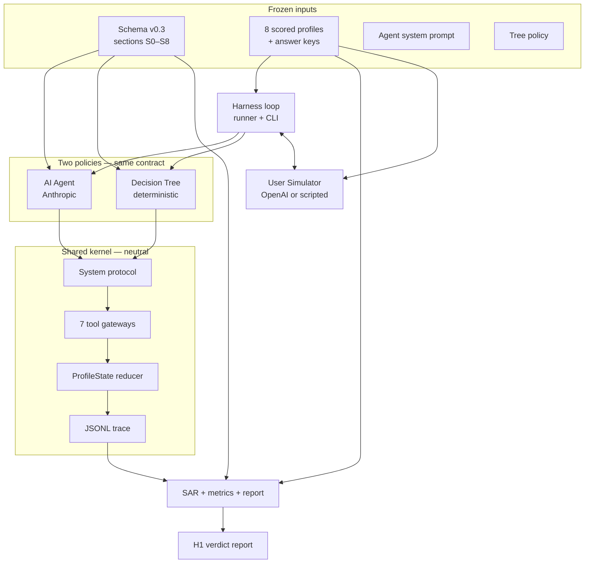

# PoC Eval Harness — Build Guide

> **Plain-language profile topics:** [guesty-pro-account-creation-schema-stakeholder-summary.md](guesty-pro-account-creation-schema-stakeholder-summary.md)  
> **Full field spec:** [guesty-pro-account-creation-schema.md](guesty-pro-account-creation-schema.md)  
> **Architectural decisions:** [architecture.md](architecture.md)

---

## What this build is

An **offline evaluation harness** that runs two conversation policies — an **AI agent** and an **honest decision tree** — through the same Guesty Pro onboarding schema, against the same simulated customers, and scores both field-by-field.

It is **not** production Guesty integration. It answers one product question with numbers:

> Can AI collect a more complete and accurate customer profile than a tree on the hard parts (free text, ambiguity, owner fan-out, sales-note prefill) **without breaking safety** on financial fields?

The Streamlit demo (`harness/demo_app.py`) is a **stakeholder-facing slice** of the same kernel — real Salesforce accounts + Tamar handover notes, human in the loop instead of a simulator.

---

## The two claims being tested

| Claim | What it tests | Baseline |
|-------|---------------|----------|
| **H1** (conversational) | Agent vs tree on the same 8 scored profiles | Decision tree in `tree/tree.py` |
| **H2** (extraction) | LLM vs regex turning sales notes into structured prefill | Regex baseline in `h2/` |

H1 and H2 share the **schema** but run as separate entry points. H2 has no simulator and no tree.

---

## Architecture at a glance



**Fairness principle:** Agent and tree implement the same `System` protocol and write through the same reducer and tools. A score difference is attributable to **policy**, not to different write paths.

---

## 1. The schema — the frame everything runs on

Location: `poc-eval-harness/schema/guesty-pro-account-creation-schema.md` (mirrors the planning doc).

The schema defines **what a complete Guesty Pro customer profile contains** before Call 1 — not a fixed questionnaire script, but a **slot graph** the agent or tree must fill.

### Ten topic areas (sections)

| Section | Role |
|---------|------|
| **S0a** | Salesforce basics — mostly confirm, not re-type |
| **S0b** | Sales handover note → AI-extracted hints to confirm |
| **S1** | Brand / logo |
| **S2** | Listings, channels, go-live timing |
| **S3** | Operations (cleaning, locks, checklists) |
| **S4** | Financials — echo-before-write; taxes always human handoff |
| **S5** | Booking website — conditional on direct booking |
| **S6** | Team roles |
| **S7** | Focus topics + pain (free text) |
| **S8** | **Hero branch** — ownership model → owner records → pricing |

Each field in the schema carries metadata the runtime enforces:

| Metadata | Purpose |
|----------|---------|
| `depends_on` | Slot is in scope only when a condition on prior answers holds (branching) |
| `echo_before_write` | Numeric/fee values must be echoed and confirmed before recording |
| `human_handoff` | Agent must `flag_for_call_1`, not configure (e.g. taxes) |
| `source` | Provenance ladder: `user_stated` > `sf_prefill` > `ai_extracted_from_note` |

Example filled profile: `poc-eval-harness/profiles/scored/A1.json`.

---

## 2. ProfileState — where answers accumulate

Location: `poc-eval-harness/kernel/state.py`.

Chat text is **not** the profile. Only **tool calls** mutate state.

```text
ProfileState
├── slots: { field_id → status + value + source }
│     status: unanswered | prefilled_unconfirmed | recorded | skipped | flagged
├── fees[]      ← add_fee (mandatory_fees)
├── taxes[]     ← add_tax (always flagged context)
├── owners[]    ← add_owner (S8 fan-out)
├── flags[]     ← flag_for_call_1 (specialist handoffs)
└── turn_count
```

When the session ends, this object **is** the collected profile. The eval harness compares it to each profile's frozen **answer key**; the demo shows a short text summary via `format_summary()`.

---

## 3. The seven tool gateways — the only write path

Location: `poc-eval-harness/kernel/tools.py`.

Every answer enters state through exactly one of these tools. There is no other mutation channel — free-writes are structurally impossible.

| Tool | Writes |
|------|--------|
| `record_answer` | Scalar/enum/bool slot (e.g. `go_live`, `ownership_model`) |
| `add_fee` | One mandatory fee row → `fees[]` |
| `add_tax` | One tax row → `taxes[]` (specialist configures later) |
| `add_owner` | One owner record → `owners[]` |
| `skip_question` | Slot explicitly skipped |
| `flag_for_call_1` | Slot or topic deferred to onboarding specialist |
| `end_section` | Closes a schema section when all reachable slots are dispositioned |

The agent emits these via LLM tool-use; the tree calls the same Pydantic models directly.

---

## 4. Other gateways — control points beyond tools

### Branch gateway (`depends_on`)

The schema loader builds a **dependency DAG** (`kernel/schema.py` → `FrameGraph`). A slot is **in scope** only when its `depends_on` condition is satisfied by recorded facts.

Examples:
- **S5 website fields** — only when `channels` includes direct booking
- **S8 owner records** — only when `ownership_model` is mixed or all-managed
- **Payment split** — only when payment timing is split

Both agent and tree must respect reachability; the scorer uses the same resolver (`scoring/resolver.py`).

### Echo gateway (`echo_before_write`)

For money and percentages (S4 fees, deposit amounts, etc.), the agent must:

1. Introduce the value in conversation  
2. Emit trace events: `echo_issued` → user confirms → `user_confirmed`  
3. Only then call `record_answer` or `add_fee`

The **false-write rate** metric counts tool calls that skip confirmation. Must be **zero** — a hard safety kill criterion.

### Section gateway (`end_section`)

`StateReducer` rejects `end_section` while any **reachable in-scope slot** is still open or an echo is pending. Prevents the agent from closing financials while mandatory fields are unanswered.

### LLM temperature gateway

Location: `poc-eval-harness/kernel/llm.py`.

| Call type | Temperature | May emit tools? |
|-----------|-------------|-----------------|
| `scored_completion` | **0.0** (hard-coded) | Yes — all profile writes |
| `glue_completion` | 0.2 | No — conversational glue only |

Scored slots never pass through a non-zero temperature path.

### Provider gateway (simulator decorrelation)

Agent uses **Anthropic**; simulator uses **OpenAI** (different provider family). Config validation aborts if they match — prevents the simulator from sharing model bias with the agent under test.

---

## 5. How one run works

Location: `poc-eval-harness/harness/runner.py`, `kernel/protocol.py`.

```text
1. Load profile + seed ProfileState (demo: Salesforce + note prefill)
2. LOOP until EndConversation or turn cap (60 user-facing turns):
     a. policy.next_action(state, history)
        → UserQuestion  |  list[ToolCall]  |  EndConversation
     b. If UserQuestion:
          trace: user_facing_question
          simulator (or human) replies
          turn_count += 1
     c. If ToolCall[]:
          reducer.apply(state, each tool)
          trace: tool_call + echo lifecycle events
     d. Repeat inner loop until next question or end
3. Final ProfileState + trace.jsonl
4. score_profile(state, answer_key) → SAR + slot scores
5. Aggregate metrics → RunRecord → campaign directory
```

**Trace** (`kernel/trace.py`): append-only JSONL per run — questions, echo events, tool calls, session end. Metrics (false writes, questions-to-completion, cost) are derived from the trace, not from chat logs.

---

## 6. The two policies

### AI Agent (`agent/agent.py`)

- Reads schema + system prompt + current slot status
- Decides next question **or** batch of tool calls via Claude tool-use
- Demo path: sales-note overlay in `harness/account_context.py` — confirm prefills, defer financials when note signals anxiety, one fee amount at a time

### Decision tree (`tree/tree.py`)

- Deterministic policy authored **blind to scored profiles** (fairness rule)
- Same tools, same reducer — branches on recorded facts, not LLM reasoning
- Baseline for H1: "what an honest hand-authored tree achieves"

---

## 7. User simulator

Location: `poc-eval-harness/simulator/simulator.py`.

Plays the customer using profile **facts** + **persona** from JSON profiles. Group A profiles use **slot-keyed scripted YAML** (`simulator/scripted_turns/group-a.yaml`) so replies match whichever slot the agent asked about — regardless of question order.

The simulator never writes to `ProfileState`; it only produces user text.

---

## 8. Scoring and the verdict report

Location: `poc-eval-harness/scoring/`.

| Module | Output |
|--------|--------|
| `resolver.py` | Which slots are in scope for this profile |
| `sar.py` | **SAR** — slot accuracy rate vs frozen answer key |
| `metrics.py` | False-write rate, clarification efficiency, advice violations |
| `stats.py` | Bootstrap CIs, decision stability across k=5 runs |
| `report.py` | **H1 markdown report** — SM-1..SM-4, kill criteria, verdict matrix |

**SAR denominator:** intersection of in-scope slots (from schema + profile facts) and answer-key slots with expected disposition.

**Per-slot dispositions in answer key:** `recorded:value`, `skipped`, `flagged`, `conditional`.

Campaign CLI: `cd poc-eval-harness && uv run python -m harness` (see `harness/cli.py`). Runs under **freeze discipline** — content-hashed manifest gates all inputs; post-freeze changes force re-freeze.

---

## 9. H2 — sales note extraction (separate track)

Location: `poc-eval-harness/h2/`.

Pulls de-identified handover notes → LLM extractor vs regex baseline → precision/recall on prefill slots (`migration_source`, `addon_intent`, `risk_flags`, etc.).

Shares schema loader only. No conversation loop. Grounded in 611 real Tamar export notes (PII never committed — see `.github/workflows/pii-guard.yaml`).

---

## 10. Stakeholder demo path

| Piece | Role |
|-------|------|
| `harness/sales_notes.py` | Load Tamar xlsx locally |
| `harness/account_context.py` | Prefill slots, demo prompt overlay, opening message, auto-confirm |
| `harness/session.py` | Step-based loop — pause on each question |
| `harness/demo_app.py` | Streamlit UI — account search, chat, optional tool log |

Run:

```bash
cd poc-eval-harness
uv sync --extra demo
export SALES_NOTES_XLSX="/path/to/Notes for Tamar....xlsx"
uv run streamlit run harness/demo_app.py
```

Demo uses the **same kernel** (schema, tools, reducer, agent) as eval — but a human replaces the simulator and Salesforce replaces synthetic profile seeds.

---

## 11. Repository map

```text
poc-eval-harness/
├── kernel/           # Schema, tools, state reducer, trace, LLM gateways, protocol
├── agent/            # AI policy + system prompt
├── tree/             # Baseline decision-tree policy
├── simulator/        # LLM + scripted customer replies
├── harness/          # Runner, CLI, freeze, demo, sales notes, session
├── scoring/          # SAR, metrics, stats, H1 report
├── profiles/scored/  # 8 frozen profiles + answer keys (A1–C2)
├── schema/           # Account-creation schema v0.3 (runtime copy)
├── config/           # run_config.toml — models, k, paths
├── campaigns/        # Immutable run outputs (gitignored in prod use)
└── h2/               # Note-extraction sub-experiment
```

---

## 12. What success looks like

| Outcome | Meaning |
|---------|---------|
| H1 supported + safety clean | Greenlight thin live prototype on S8 hero branch |
| H1 falsified | Ship honest tree; know exactly where AI failed |
| H2 supported | Prefill-from-notes path is viable for "confirm don't ask" |
| Kill criteria triggered | Hard stop — false numeric writes or inappropriate advice |

Both pass and fail are valuable. The harness exists so the decision is **evidence-backed**, not a demo impression.

---

## Quick reference — related docs

| Question | Document |
|----------|----------|
| What topics does the profile cover? | [stakeholder-summary](guesty-pro-account-creation-schema-stakeholder-summary.md) |
| Why did we build this? | [PoC plan §1](poc-plan-ai-adaptive-onboarding-2026-06-02.md) |
| FRs and kill criteria | [PRD](prds/prd-AI-Adaptive-Onboarding-PoC-2026-06-02/prd.md) |
| Component boundaries & freeze | [architecture.md](architecture.md) |
| Example customer | `poc-eval-harness/profiles/scored/A1.json` |
