# UX Design Specification — Guesty Pro Onboarding Wizard

**Author:** Yair Cohen
**UX Designer:** Sally (BMad UX Designer)
**Date:** 2026-05-25
**PRD basis:** v2 — `prds/prd-Guesty-Pro-Onboarding-Wizard-2026-05-25/prd.md`

> This spec supersedes the 2026-05-03 UX design specification. It is built against the new PRD (v2) and the four review artifacts (reconcile-brief, adversarial, edge-cases, rubric, structure), plus the current Tahini knowledge base (Guesty UX Principles P1-P11, Arc component library, personas, domain model).
>
> **Amendment 2026-05-26:** The V4 questionnaire (9 sections) is superseded by the new onboarding script (10 sections). This amendment surgically removes the 4-tier skip intercept system, accountant delegation, the Communications section, and Auto-Pilot Defaults; adds the Booking Website section, Business section (logo + owner records + rate strategy), Review/Setup/Done arc, and expanded Operations + Financials field schemas. See frontmatter `revisionLog` for full impact list. Sections marked **[AMENDED 2026-05-26]** below indicate revised content; sections marked **[DEPRECATED 2026-05-26]** are retained for traceability but no longer authoritative.
>
> **Amendment 2026-05-27 (Canvas-as-Moments):** The morphing canvas is no longer persistently visible. It is hidden by default and animates in at specific reveal moments only: (1) Q1.4 AHA reveal — stays through Q1.5; (2) Section 3 mid-funnel milestone — brief 4–5s celebratory return; (3) Section 8 Review & Confirm — full section. Body screens (Sections 2, 5, 6, 7) become Typeform-style single-panel with inline italic bot voice. DD-5 Hybrid simplifies: anchor pattern retained at Sections 1, 3, 4, 8; body becomes Typeform-pure. Source attribution chips migrate from canvas to left-panel question copy. Sections marked **[AMENDED 2026-05-27]** below indicate canvas-moments revision.
>
> **Amendment 2026-05-28 (Implementation Reference Merge):** The Airbnb Connect prototype implementation reference (previously `airbnb-connect-implementation-reference.md`) is merged into the spec as an appendix to the existing "Airbnb Connect Step — Pre-Built Component Reference" section. Includes full source component map, dependency list, mock implementations for `ConnectAbnb` and `ImportListings`, dummy listing data, and embed pattern in the wizard shell. Flagged inconsistency: DC-9 branch nomenclature mismatch between spec (LiveData/SalesforcOnly/NoData) and implementation reference (B1/B2/B5) — needs reconciliation.

---

<!-- UX design content will be appended sequentially through collaborative workflow steps -->

---

## Executive Summary

### Project Vision

Guesty Pro Onboarding Wizard transforms the "blank slate" problem of a new PMS account into a confident, pre-configured management environment — delivered in a single 9-screen Typeform-style flow. The wizard surfaces proof of value (live Airbnb listings in a real-time account preview) as early as screen 2, then progressively builds a complete operational profile through guided questions, intelligent defaults, and optional delegation. By exit, the account is not just created — it is ready to manage properties.

This is not a setup form. It is the first operational experience Guesty Pro delivers. Every screen must earn the user's continued attention.

**Desktop-only V1.** Mobile installation is deferred to V2 per stakeholder confirmation (2026-05-25).

---

### Target Users

**Primary — Persona 2A: The Growing Owner-Operator (SMB)**
- 2–10 properties, manages everything themselves
- No IT support, no dedicated admin staff
- Time-constrained: setup happens in stolen moments, not dedicated sessions — expects to pause and resume
- **Role Collapse:** exec sponsor + admin + product champion = one person. The enterprise pattern of three distinct roles collapses into a single owner-operator. All design decisions must assume this.
- Tech-comfortable but not technical; expects consumer-grade clarity in business software
- Primary success signal: seeing their actual Airbnb properties appear in the product before they've typed a single field

**Secondary — Persona 2B: The Delegating Owner (SMB)**
- Similar property count; delegates day-to-day operations to a small team or trusted assistant
- Starts the wizard themselves, may hand off specific sections (especially financial)
- Will use the Accountant Secure Link delegation path (FR-27/28/29)

**Edge — Persona 3G: The Accountant**
- Never enters the wizard proper
- Receives a token-gated Secure Link (14-day TTL, FR-27) scoped to financial data only
- Completes their section asynchronously; their write commits merge into the owner's profile
- UX for this persona lives entirely outside the wizard shell

---

### Key Design Challenges

Design challenges are split into two tiers based on the nature of the problem. **Tier 1** challenges are pure UX/IA problems. **Tier 2** challenges require a state machine specification as a co-primary artifact — the UX surface cannot be designed until the states are defined.

#### Tier 1 — Pure UX Problems

**DC-1: Role Collapse — Information Architecture**
The wizard must address one person who is simultaneously the decision-maker, the data-entry operator, and the technical configuration owner. Questions written for an enterprise "IT admin" will alienate the SMB owner-operator who has no IT context. Every label, tooltip, and section header must be written for the owner, not for a system administrator.

**DC-2: Trust Establishment Before OAuth**
Screen 1 (before Airbnb connects) has no live data to show. Trust must be established through design alone: brand voice, scope statements, privacy signals, and a clear value proposition — all without crossing into marketing copy. The user must feel confident enough to hand over Airbnb OAuth credentials.

**DC-5: Question Sequencing and Typeform Pacing**
The wizard has 9 screens covering property setup, financial configuration, operations settings, and Auto-Pilot preferences. Sequencing governs cognitive load: harder decisions must follow easier ones that provide context. The pacing must feel conversational, not bureaucratic. Each screen transition must feel earned, not just "next."

**DC-6: AHA Moment Timing**
The AHA moment — live Airbnb listings populating in the morphing canvas — is the single most important event in the wizard. Its placement must be deliberate: early enough to motivate continued completion, but not so early that the user hasn't formed enough context to understand what they're seeing. Current design positions it at screen 2 (immediately after OAuth). This must be validated against sequencing logic.

**DC-7: Skip Intercept and 4-Tier Deferral System**
The tiered skip system (FR-35..FR-38) has four levels: Contextual Hint → Soft Block → "Maybe Later" modal → Final Skip with consequence summary. Skip reactance is a real risk: if users feel trapped, they abandon. The intercept must feel like helpful guidance, not a hostage situation. "Maybe Later" must dominate over "Skip Forever" in both language and visual weight (Deferral Spectrum principle).

**DC-11: CS Handoff and Post-Wizard Transition**
The wizard exits into a Rocketlane-delivered onboarding journey (adversarial finding C-1). The handoff surface is undefined in the PRD: what does the user see on wizard completion? What data does CS receive? If Rocketlane delivery fails or is unavailable, what is the fallback? The wizard exit screen must not create a cliff edge — it must set expectations for what comes next, regardless of the delivery vehicle.

---

#### Tier 2 — Dual-Artifact Design Challenges

*Each DC below has a state machine spec (for engineering) and a UX surface spec (for design). Both are required before wireframing. Neither supersedes the other.*

---

**DC-3: Hybrid Freshness (Re-poll on Wizard Entry)**

**State Machine:**
```
POLLING_IDLE
  → POLLING_TRIGGERED       (wizard entry event fires)
  → POLLING_IN_FLIGHT       (re-poll hook active; P95 ≤ 3s; 5 hooks; FR-11)
  → POLLING_RESOLVED_MATCH  (data unchanged vs. cached snapshot)
  → POLLING_RESOLVED_DIFF   (data changed vs. cached snapshot)
  → POLLING_STALE           (last successful poll > 24h ago)
  → POLLING_FAILED          (hook error or timeout)
```
Rules: No retroactive re-routing on re-poll diff. Re-poll fires on wizard entry only, not mid-session.
Freshness window: 24h from last successful poll.

**UX Surface:**
| State | What user sees |
|---|---|
| RESOLVED_MATCH | Silent. No notification. Canvas unchanged. |
| RESOLVED_DIFF | Yellow badge on canvas panel: *"X listings updated"* + 7s auto-dismiss toast: *"Your Airbnb listings were refreshed."* |
| STALE (> 24h) | Staleness indicator on canvas: *"Last synced [date]"* with Refresh icon. Non-blocking. User can continue. |
| FAILED | Inline error in canvas: *"Couldn't refresh your listings."* Retry button. Manual entry fallback. Does not block wizard progression. |

---

**DC-4: Delegation Lifecycle (Accountant Secure Link)**

**State Machine:**
```
NOT_OFFERED
  → OFFERED      (owner triggers "Invite Accountant")
  → SENT         (email dispatched; 14-day TTL token generated; FR-27)
  → OPENED       (accountant clicks link; token validated)
  → IN_PROGRESS  (accountant actively interacting with scoped form)
  → COMPLETED    (accountant submits; write committed to profile)
  → EXPIRED      (TTL exceeded; no interaction or incomplete)
  → CANCELLED    (owner revokes before COMPLETED)
  → SUPERSEDED   (owner re-invites; previous token immediately invalidated)
```
**Concurrency rule:** One active token at a time. New invite → previous token → SUPERSEDED immediately.
**Write conflict:** Reject accountant's write on simultaneous submit; preserve owner's write. Surface: *"This section was updated. Please review the current values."* Owner always wins — they are the contract holder.

**UX Surface:**
| State | Owner sees | Accountant sees |
|---|---|---|
| NOT_OFFERED | "Add your accountant" CTA | — |
| SENT | Pending badge; "Resend" + "Cancel" | Email with secure link (14-day TTL) |
| OPENED | "Your accountant opened the form" notification | Scoped data-entry form (token-gated) |
| IN_PROGRESS | Progress indicator if API available; else "In progress" | Active form |
| COMPLETED | Green checkmark; accountant data merged into canvas preview | "Thank you, you're done" confirmation |
| EXPIRED | "Invitation expired" + "Resend" CTA | "This link has expired. Contact your host." |
| CANCELLED | CTA returns to NOT_OFFERED state | "This invitation was cancelled." |
| SUPERSEDED | New invite flow begins | "This link is no longer valid." |

---

**DC-8: OAuth In-Flight (Airbnb Connection)**

**State Machine:**
```
NOT_STARTED
  → INITIATED         (user clicks "Connect Airbnb")
  → CALLBACK_PENDING  (redirected to Airbnb OAuth; awaiting return)
  → CONSENT_RECORDED  (token received, validated, stored)
  → WRITE_COMMITTED   (listings fetched; profile updated; AHA fires)
  → FAILED            (any step fails → error with recovery path)
```

**UX Surface:**
| State | What user sees |
|---|---|
| NOT_STARTED | "Connect Airbnb" button (screen 2) |
| INITIATED | Button → loading state, *"Connecting to Airbnb…"* |
| CALLBACK_PENDING | *"Please complete authorization in the Airbnb window."* Tab/popup context. No in-wizard state visible. |
| CONSENT_RECORDED | *"Airbnb connected! Loading your listings…"* + spinner on canvas |
| WRITE_COMMITTED | Canvas populates with live listings — AHA moment fires |
| FAILED | Inline error; retry button; manual-entry fallback. No dead ends. |

**Edge H-25 (OAuth resume after tab close):** If wizard re-enters while CALLBACK_PENDING (tab closed mid-auth): show *"Your Airbnb connection was interrupted. Connect again?"* Do NOT resume from cache. Force re-initiation.

---

**DC-9: Empty Airbnb Data (Branch Enumeration)**

Five explicit "no data" branches — each has a forward path; none are dead ends:

| Branch | Condition | UX response |
|---|---|---|
| B1: Zero listings | Airbnb account has no active listings | *"You don't have active Airbnb listings yet. You can add properties after setup."* → skip to next section; `property_count = 0` |
| B2: All listings inactive | Listings exist but all unlisted or deactivated | *"Your Airbnb listings are currently inactive. We'll sync them when they're active."* → flag for background sync; continue |
| B3: API rate limit | Empty response due to rate limit | Treat as FAILED (DC-8 FAILED path); retry once silently; then show manual entry |
| B4: Partial data | Some listings missing photos or titles | Import all available fields; flag incomplete fields: *"Some listing details are missing — complete them in your dashboard."* |
| B5: First-time host | OAuth succeeds; zero listing history | *"Welcome! Let's set up your first property in Guesty."* → route to manual property creation |

---

**DC-10: Auto-Pilot Silent Writes (Consent-Gated Configuration)**

**Audit event schema (required for every silent write; FR-43..FR-49):**
```json
{
  "event_type": "wizard_autopilot_write",
  "timestamp": "ISO-8601",
  "user_id": "<owner_id>",
  "session_id": "<wizard_session_id>",
  "consent_version": "<consent_record_id>",
  "field_written": "<field_name>",
  "value_written": "<new_value>",
  "previous_value": "<prior_value>",
  "trigger": "wizard_autopilot_consent"
}
```

**UX Surface:**
Silence during writes is intentional — cognitive load reduction. The UX surfaces the writes post-hoc:
- No real-time toasts during write execution
- Confirmation Screen (screen 9 / FR-42): *"Here's what we set up for you"* — full list of Auto-Pilot writes with current values and per-item Settings deep-links: *"Change anytime in Settings →"*
- Audit trail available in Account History post-wizard

---

### Design Opportunities

**DO-1: Split-Screen Morphing Canvas**
The foundational layout pattern: left panel = active question + bot assistant; right panel = live evolving account preview that updates as answers are given. The canvas is the proof that the wizard is doing real work, not collecting form data into a void. It transforms abstract configuration into visible, tangible progress.

**DO-2: Airbnb OAuth as the AHA Trigger**
Positioning Airbnb Connect as the first *interactive* step (screen 2) rather than a later integration step means the product earns trust with real data before asking any hard configuration questions. Live listings appearing = proof of value before any commitment.

**DO-3: Bot-Assisted Question Flow**
A conversational bot layer within the Typeform structure softens technical questions and provides contextual guidance without adding screens. The bot can explain why a question is being asked, surface relevant defaults, and catch likely errors — without blocking flow.

**DO-4: Progressive Disclosure of Complexity**
Start with identity and property basics (low cognitive load, high confidence); build to financial configuration and Auto-Pilot settings (high stakes, high complexity). The sequence must feel like a natural conversation, not an escalating interrogation.

**DO-5: Server-Authoritative Branching as UX Clarity**
FR-7 (server-authoritative branching) means the wizard routes correctly based on user data, not user-declared profile. This is a UX opportunity: users don't have to classify themselves; the wizard adapts to their reality. Reduces decision fatigue and mis-routing.

**DO-6: Deferral as a Feature, Not a Failure**
The 4-tier skip intercept (FR-35..FR-38) reframes incomplete sections as intentional deferrals rather than abandoned forms. "Maybe Later" as the primary skip language positions the wizard as respectful of the user's constraints. Post-wizard, deferred items become actionable tasks — not lost configuration.

**DO-7: Accountant Delegation as Trust Architecture**
The Secure Link pattern (FR-27/28/29) keeps sensitive financial data out of the wizard's main flow entirely. For Persona 2B (Delegating Owner), this is a significant trust signal: Guesty understands that financial data is shared carefully, not entered by whoever is at the keyboard.

**DO-8: Resume State as Confidence Builder**
FR-9 (resume state written within 2s, 3 retries) means the wizard never loses progress. For the SMB owner-operator who will be interrupted constantly, this transforms the wizard from a high-stakes single-session commitment into a low-stakes multi-session process. The resume UI must make this guarantee visible: *"Pick up where you left off."*

**DO-9: Auto-Pilot Defaults as Expert Recommendation**
Auto-Pilot settings (screen 8) can be framed not as convenience toggles but as expert recommendations: *"Based on properties like yours, most hosts enable…"* This shifts the cognitive frame from "I'm making a decision I don't understand" to "I'm accepting expert guidance I can change later." Reduces friction on high-stakes configuration choices.

---

## Core User Experience

> **[AMENDED 2026-05-26]** Section structure updated to reflect new onboarding script. AHA Moment now at Q1.4 (after 3 pre-flight questions). 4-tier skip intercept removed → flat skip + Call 1 punch list. Accountant delegation removed. Communications section removed. Booking Website, Business, Review & Confirm, Setup-in-progress, Done sections added.

### Defining Experience

The single most important user action in the Guesty Pro Onboarding Wizard is **connecting Airbnb via OAuth at Q1.4**. The three pre-flight questions before it (active listing count, Airbnb-only check, channel confirmation) prime the AHA Moment by anchoring user expectations. The OAuth moment is still the hinge.

This reframes what the wizard is: not a form the user fills out, but a **live account preview the user shapes through their answers**. The right panel (morphing canvas, DO-1) makes this concrete — it updates in real time as answers come in. The user is not configuring a system; they are watching their account come to life.

The core loop is: **Connect → See real data → Configure around what you see.**

---

### Platform Strategy

**V1 — Desktop web only.** Confirmed by stakeholder (2026-05-25).

- **Input paradigm:** Mouse + keyboard primary. No touch optimization required in V1.
- **Browser context:** Full-tab experience. The wizard occupies the full viewport — split-screen layout (DO-1) without compromise.
- **OAuth method:** Full-page **redirect** (not popup). Popup blockers on enterprise/managed Chrome profiles cause silent failures for 15–20% of users. Redirect is architecturally reliable; canvas state is recovered server-side via FR-9 on return.
- **Canvas update model:** **Optimistic local update** — canvas morphs immediately from local answer state. FR-9 server write happens asynchronously in background. Perceived performance is fully decoupled from server latency. Retry logic fires silently; only surfaces to user if all 3 retries exhaust.
- **Offline:** Not required. All state is server-persisted (FR-9). Interruption is recoverable via resume, not local caching.
- **Resume across sessions:** Critical. FR-9 mandates resume state written within 2s of each answer, 3 retries. Multi-session setup is the designed primary path, not a recovery flow.

---

### Effortless Interactions

**1. Airbnb OAuth connection (Q1.4)**
Single click → full-page redirect to Airbnb authorization → return to wizard callback URL → **"Restoring your session…"** micro-state (canvas re-hydrates from server-side session state) → listings render in canvas. The "Restoring your session…" state is a named, designed UX state — not a loading spinner. It signals that the wizard remembers the user, not that something broke. [AMENDED 2026-05-26: OAuth moved from Q1.1 to Q1.4]

**2. Wizard resume**
Returning users land at their last unanswered question — not on a landing screen, not on screen 1. Previously answered questions are visibly complete. No re-entry required.

**3. Review & Confirm acceptance** [AMENDED 2026-05-26]
Section 8 (Review & Confirm) is completable with one action ("Confirm and continue") that commits the plan and triggers Section 9 (Setup in progress). Users can edit any item inline before confirming. Per FR-44 deferral and C3 decision, this commits the *plan*, not real provisioning writes.

**4. Skip / deferral** [AMENDED 2026-05-26]
Skipping a non-critical question requires one action. Per the new onboarding script: "Everything is skippable. Skipped items become a punch list for Call 1." No tiered intercept dialog. No Auto-Pilot Acceptance Modal. The CSM picks up skipped items on Call 1. "Maybe Later" framing is retained in copy where appropriate, but mechanically every skip writes to the Call 1 punch list immediately.

**5. Bot guidance**
Contextual guidance appears proactively when a question has a non-obvious answer. Dismissible in one click. Users never search for help — the help finds them.

---

### Critical Success Moments

**CSM #1: The AHA — Live listings appear (Q1.4)** [AMENDED 2026-05-26]
*"This thing actually knows my properties."*
Fires on OAuth WRITE_COMMITTED state at Q1.4 (after 3 pre-flight questions confirming listing count, Airbnb-only status, and channel mix). Canvas populates with real listing data. Must be fast (P95 ≤ 3s per FR-11), visually prominent, and feel like product magic, not a data import. This is the moment the user shifts from skeptical to invested.
*Measurability: OAuth success rate + listings-rendered event.*

**CSM #2: First skip accepted without penalty (any deferral screen)**
*"It understood that I'm not ready yet."*
After the first "Maybe Later" action, a brief confirmation closes the loop: *"Got it. We'll remind you after setup."* If this feels punishing, users abandon rather than continue skipping.
*Measurability: session continuation rate post-first-skip vs. non-skip cohort (parity = "without penalty").*

**CSM #3: Mid-funnel milestone (Section 3 Financials entry)** [AMENDED 2026-05-26]
*"I'm more than halfway. Look at what's already done."*
AHA at Q1.4 creates a motivation spike that decays by mid-funnel without reinforcement. At Section 3 (Financials — the longest section with 7 questions) entry, a visible progress milepost fires: micro-confirmation of completed sections, progress counter (*"You're halfway through. 5 sections to go."*), canvas update. This is the secondary motivation anchor sustaining completion through Sections 2–7.
*Measurability: Section 3 reach rate; drop-off delta between milepost-seen vs. not-seen cohorts (A/B).*

**CSM #4: Review & Confirm (Section 8)** [AMENDED 2026-05-26]
*"Look at everything that's already set up."*
Not a receipt — proof of work. Full list of recorded settings grouped by section, with edit links per item. Per C3 decision and FR-44 deferral, this is the *plan* — what will be applied, not what has been provisioned. Section 9 (Setup in progress) commits the plan; Section 10 (Done) lands the user on the dashboard with focus widgets + skipped-items punch list.
*Measurability: wizard completion rate (Section 8 → Section 10 conversion).*

> **Removed 2026-05-26:** Accountant delegation cohort metric. Delegation flow eliminated per C5 reversal.

---

### Experience Principles

**EP-1: Confidence Before Commitment (P1)**
Show real data before asking for real decisions. The wizard earns the right to ask configuration questions by first demonstrating it knows the user's properties. Questions before the AHA must be minimal and low-stakes.

**EP-2: Do the Heavy Lifting (P9)**
Pre-configure wherever the product can make a defensible default. The user's job is to confirm, correct, or defer — not to build from scratch.
> **FR-44 caveat:** The Profile Output Schema is deferred (Phase 0 blocker). EP-2 in V1 means: we pre-configure the *view and recommendations* — write commits are gated on FR-44 resolution. The spec must not promise write execution until FR-44 is resolved. EP-2 is directionally correct; its delivery scope must be scoped to what FR-44 allows at launch.

**EP-3: States Must Be Visible**
Every machine state — OAuth, delegation, freshness, silent writes, save failures — has a UX representation. The user always knows what the system is doing. "In flight" is not invisible.

**EP-4: Deferral Is Respect — and Deferred Items Have a Return Path**
"Maybe Later" increases in-session completion 15–25% (B2B SaaS benchmark). Without structured re-engagement, deferred items have a 60–70% post-wizard abandonment rate. "Maybe Later" is therefore a commitment to a named re-engagement flow:
- **Critical deferred items** (payment config, property address): in-app notification + email within 24h. Subject anchored to consequence: *"Your first booking could fail without [item]."*
- **Optional deferred items** (Auto-Pilot preferences, accountant delegation): in-app task list, 7-day nudge.
- **All deferred items** surface as an actionable task list on the post-wizard dashboard — not buried in Settings.

**EP-5: Resume Is a Promise — Including When the Promise Breaks**
FR-9 writes within 2s with 3 retries. Canvas updates are optimistic-local; server commit is async.
- **If retries fail during active session:** Non-blocking toast — *"Having trouble saving — we'll keep trying."*
- **If session ends before recovery:** Recovery screen on re-entry — *"We had trouble saving part of your last session. Here's what we recovered, and what you may need to re-enter."*
A failed write is a machine state (EP-3). It has a UX representation.

---

## Desired Emotional Response

### Primary Emotional Goals

The wizard's emotional contract has a measurable form and an experiential form. Both must be true.

**Measurable form:** Reduce *perceived effort* (Customer Effort Score) and accelerate *perceived time-to-value* by demonstrating product knowledge of the user's situation before requiring the user to explain it. Both constructs correlate with B2B SaaS activation and 30-day retention (HBR/Dixon CES research; OpenView and Reforge PLG benchmarks).

**Experiential form (in-wizard):**
> *"This product already understood my situation before I explained it."*

**Experiential form (at wizard exit, V1):**
> *"My preferences are saved, and someone trustworthy is finalizing the rest."*

V1 hands off completion to CS. The honest emotional payoff is **relief + confidence**, not pride. Pride requires agency-with-completion, which V1 does not deliver (FR-44 deferred). Designing for pride would set up an emotional debt the product cannot pay.

---

### Emotional Journey Mapping

| Stage | Moment | Desired feeling | Risk emotion to avoid |
|---|---|---|---|
| First screen (pre-OAuth) | Trust establishment | **Safe** — "this is legitimate and respects my data" | Skeptical, wary |
| OAuth connection | Commitment to connect | **Curious + low-risk** — "let's see what it does with my listings" | Anxious, exposed |
| AHA (screen 2) | Live listings appear | **Surprised + validated** — "it actually works, and it knows me" | Underwhelmed, confused |
| Mid-wizard (screens 3–6) | Configuration questions | **In control** — "I'm shaping my account, not filling out a form" | Fatigued, trapped |
| Skip / deferral | "Maybe Later" accepted | **Respected** — "it understood I'm not ready, and it didn't punish me" | Guilty, penalized |
| Mid-funnel milestone (screen 5) | Progress milepost | **Accomplished** — "look at how much is already done" | Doubtful about finishing |
| Auto-Pilot (screen 8) | Accepting recommendations | **Confident** — "I'm taking the expert recommendation, not guessing" | Anxious about wrong choices |
| Confirmation (screen 9) | Proof of work revealed | **Relieved + confident someone has this** — "my preferences are saved; a real human is finalizing the rest" | Anticlimactic, abandoned |
| Re-entry (resume) | Returning after break | **Reassured** — "it remembered exactly where I was" | Frustrated, starting over |
| Error / save failure | EP-5 failure mode fires | **Informed but not alarmed** — "something went wrong but it's handling it" | Panicked, abandoned |

---

### Micro-Emotions

**Confidence over confusion** — every question must be answerable without leaving the wizard. Tooltips, bot guidance, and contextual examples eliminate the "I don't know what this means" moment.

**Trust over skepticism** — trustworthiness is demonstrated through behavior, not marketing copy. The product shows listings before asking for configuration; surfaces audit events; labels data sources visibly. Trust is built incrementally through transparency.

**Accomplishment over frustration** — the morphing canvas is the visible-work mechanism. Every answer produces a visible change in the account preview. The user is never left wondering whether their input mattered.

**Calm over urgency** — SMB owner-operators are already time-pressured. The wizard must never add urgency. Skip intercepts are informed guidance, not warnings. Never: *"You must complete this now."*

**Relief over anxiety** — the confirmation screen is the emotional payoff: handing a difficult, complex task to something that knew what to do, with the assurance that a real human is now finalizing.

---

### Design Implications

**"Safe" → Privacy-first screen 1 copy**
Screen 1 establishes trust through explicit scope statements: what Airbnb data will be accessed, what will not, how it will be used. Plain language, no fine print.

**"Surprised + validated" → AHA must be visually choreographed**
The canvas update must not feel like a data load — it must feel like a reveal. The choreography is a designed theatrical moment, not a side effect. Design intent (locked here, exact values speced in Step 11):
- **Stagger interval:** 180–220ms between cards (produces "anticipation," not "parade").
- **Entry curve:** spring with settle — cards arrive and settle, not slide flat.
- **Counter behavior:** ticks up *with each card landing*, driven by animation completion events, not by data arrival. This detail distinguishes reveal from load.
- **Pre-reveal state:** empty canvas with subtle pulse (signaling "something is about to happen"). No skeleton placeholders. The reveal is the *appearance* of cards, not the *morph* of placeholders.
- Defaults are forbidden. If the AHA reveal lands as a fade-in, the entire emotional contract collapses.

**"In control" → Questions are conversations, not fields**
Typeform pacing + bot guidance make each screen a dialogue. One thing asked at a time. Context before decision. The bot speaks first when a question is non-obvious.

**"Respected" → "Maybe Later" is designed, not apologetic**
Skip intercept language acknowledges judgment positively: *"Got it — we'll hold this for after setup."* Low-drama visual treatment. No red icons, no defensive "are you sure?" prompts.

**"Confident" → Auto-Pilot frames recommendations as expert opinion**
Screen 8 opens with a rationale: *"Based on properties like yours, most hosts enable these settings. You can change any of them at any time."* Shifts the cognitive frame from "decision I don't understand" to "advice from someone who does."

**"Informed but not alarmed" → Error states are calm and actionable**
EP-5 failure UX uses calm, factual language with a clear action. No red full-screen errors. A composed professional acknowledging a problem and explaining what's happening — not a system crashing.

**Canvas content must show plan, not work (V1 honesty rule)**
Until FR-44 resolves, copy on the morphing canvas and across the wizard reflects that recommendations are saved as preferences, not executed as configuration:
- ✅ *"Here's what we recommend based on your properties."*
- ✅ *"We've drafted your setup. Confirm to save your preferences."*
- ❌ *"We've set this up for you."* — forbidden in V1.
- ❌ *"Your account is configured."* — forbidden in V1.

---

### Answer → Canvas Delta Taxonomy

Every wizard answer maps to one of four canvas-delta classes (binds Step 12):

| Class | Example answers | Canvas effect |
|---|---|---|
| **Property-shape** | Property count, types, channels | Visible primary content (cards, channel logos) |
| **Setup-state** | Tax structure, currency, payment | Settings chips/badges in a "Your Setup" strip below cards |
| **Recommendation** | Auto-Pilot preferences | Recommendation list with explicit *"We recommend…"* framing — never "set up" |
| **Profile-only** | Bot preferences, tone settings | **No canvas change is acceptable** — documented exception |

Every answer in the wizard must be classified into one of these four classes before Step 12. Hand-waving "the canvas reacts" is forbidden — it produces invented reactions in implementation.

---

### EP-5 Recovery Screen Data Contract

On re-entry after exhausted write retries, the recovery screen presents:
- **Heading:** *"We had trouble saving part of your last session."*
- **Recovered answers** displayed as **confirmable chips** (not silent auto-restore). Each chip shows the question, the recovered value, a timestamp (*"3 minutes before disconnect"*), and a confirm/edit affordance.
- **Unrecoverable answers** listed separately with a *"You'll need to re-enter this"* label.
- **Continue affordance:** *"Continue where you left off"* button — disabled until all recovered chips are confirmed.
- Implementation contract: per-step wizard state with timestamps; diff between last server-committed and local-unsaved values.

---

### Instrumentation

Emotional outcomes are measured via a 3-layer stack. No single metric carries the EDPs alone.

**Behavioral signals:**
- Wizard completion rate (overall + per-step)
- Step-level drop-off, with screen-5 milepost A/B (tests CSM #3)
- Skip-then-return rate within 24h / 7d (tests EDP-4 deferral re-engagement)
- Time-to-First-Listing-Published (TTFP) — perceived TTV proxy
- Resume-from-failure-recovery completion rate (tests EDP-5)

**Attitudinal signals:**
- Post-wizard CES: 1-question micro-survey — *"Guesty made it easy to get set up"* (1–7 scale)
- NPS at day 7 (not day 0 — emotional verdict isn't formed at exit)

**Qualitative signals (load-bearing for unfalsifiable EDPs):**
- 8–12 moderated user sessions per quarter
- Coded for unprompted use of language matching EDPs: *"seen"*, *"anticipated"*, *"respected"*, *"trapped"*, *"figured out for me"*, etc.
- This is the only direct signal that EDP-1 and EDP-5 are landing as designed.

**Source attribution requirement:**
The morphing canvas visibly labels data sources at all times. Every pre-filled or inferred value displays its origin (*"from your Airbnb account"*, *"based on properties like yours"*). Opaque inference is where "anticipated" tips into "surveilled" for SMB users (Puntoni/JCR personalization research; Intuit QuickBooks SMB onboarding studies).

---

### Emotional Design Principles

**EDP-1: Speak First, Ask Second — Show the *Plan*, Not the *Work* (V1)**
The product demonstrates knowledge of the user's situation before asking the user to explain it. Live listings before questions. Pre-filled defaults before configuration choices. Until FR-44 resolves, the morphing canvas presents the product's *recommendations and plan* — not committed work. Copy across the wizard reflects this. A user who later discovers nothing was written would correctly conclude the wizard lied on day one. Plan-language is honest, still emotionally positive, and preserves the EDP-1 contract.

**EDP-2: Make Work Visible**
Every user action must produce a visible result in the morphing canvas — classified per the Answer→Canvas Delta Taxonomy. Invisible progress is emotionally indistinguishable from no progress. The canvas is not a preview — it is the emotional proof that the wizard is doing real work on the user's behalf.

**EDP-3: Earn Trust Incrementally**
Trust is built across every screen through consistent, predictable behavior: the product says what it will do, does it, and shows what it did. Surprises — even good ones — are calibrated. The AHA is a designed surprise; everything else behaves exactly as the user expects.

**EDP-4: Never Make the User Feel Trapped**
Friction must always have a visible exit. Every intercept has a deferral path. Every error has a recovery action. Every state has a forward direction. The wizard's emotional promise: no dead ends, no forced choices, no situations where the user's only option is to abandon.

**EDP-5: The Exit Earns the Entry**
The confirmation screen makes the user feel the time invested was worth it — not just functionally (preferences saved) but emotionally (significant work accomplished). The emotional ROI on wizard completion must be proportional to the effort the user expended.

**EDP-6: The Handoff Is Part of the Experience — Not the End of It**
The wizard exit (screen 9) is not the emotional end — it's a transition. If the CS handoff (DC-11) is undefined or vague, the entire 9-screen emotional investment evaporates at exit.

The confirmation screen must present a **concrete, named, time-bound next step:**
- *"Sarah from our onboarding team will email you within 24 hours to finalize your setup."* (with a real name/photo, even if generic-by-pool)
- Never: *"Someone from our team will be in touch."*

**Fallback state (CS handoff unresolved at V1 ship):** Even if Rocketlane/CS contract is not finalized, the confirmation screen must commit to a specific email timeframe and a named human point of contact. The fallback is not a missing feature — it is a designed emotional state.

*Desired feeling at handoff:* **Held, not handed off.**

---

## UX Pattern Analysis & Inspiration

### Inspiring Products Analysis

**Group A — Connection-First Onboarding** (most directly transferable to OAuth-as-AHA model)

**1. Zapier (Mobbin FTUE reference)**
*Pattern:* OAuth connection is the first interactive step, not a setup option. Product reads user data before asking for preferences.
*Lesson:* Validates Airbnb OAuth placement at screen 2. Connection-first onboarding outperforms configuration-first onboarding on activation in Mobbin/Zapier data.

**2. QuickBooks (Intuit SMB research)**
*Pattern:* Pre-fills financial setup from connected bank accounts, with visible data-source attribution (*"from your Chase business account"*). Designed for the SMB role-collapse persona.
*Lesson:* Source attribution on the canvas is non-optional — it separates *anticipated* from *surveilled* for SMB users. Locked into Instrumentation in Step 4.

**3. HubSpot (Mobbin FTUE reference)**
*Pattern:* Multi-step B2B onboarding with role-based branching and progressive feature reveal.
*Lesson:* Validates the 9-screen architecture but legacy HubSpot leans bureaucratic. Adapt the multi-step skeleton with Typeform pacing + bot guidance to avoid form-as-wizard.

---

**Group B — Canvas-as-Workspace** (transferable to morphing canvas design)

**4. Linear (B2B SaaS UX Report)**
*Pattern:* Calm, low-chrome, single-decision-per-screen. Heavy lifting done by the product; keyboard-first; intelligent defaults.
*Lesson:* Visual register closer to Linear than to legacy enterprise SaaS. Low chrome lets canvas content carry emotional weight.

**5. Miro (B2B SaaS UX Report)**
*Pattern:* Visual canvas as primary workspace. Dramatic reveals when content populates (templates, shapes, frames appear with intentional animation).
*Lesson:* The AHA choreography (180–220ms stagger, spring settle, counter-with-cards) traces directly to Miro's design language. Canvas is emotional center, not sidebar.

**6. Motion (Mobbin FTUE reference)**
*Pattern:* Split-screen calendar canvas — left for actions, right for the live calendar that updates as actions are taken.
*Lesson:* Closest architectural cousin to the morphing canvas. Validates split-screen layout (DO-1).

---

**Group C — Progressive Disclosure & Trust Building**

**7. Notion (B2B SaaS UX Report)**
*Pattern:* Onboarding hides complexity behind progressive reveal. Templates do the heavy lifting. "Remind me later" is a first-class action.
*Lesson:* Validates EP-2 (do the heavy lifting) and EP-4 (deferral is respect). Notion's "Maybe Later" tooling is essentially what we're designing.

**8. Slack (B2B SaaS UX Report)**
*Pattern:* Channel-first onboarding — a single concrete artifact (the channel) is created before any abstract configuration. Trust earned by showing immediate utility.
*Lesson:* Maps to Airbnb listings being the "first concrete artifact" in our wizard. Reinforces AHA-at-screen-2 placement.

---

**Group D — Animation & Interaction Polish** (transferable to Step 11/12)

**9. Amie (Mobbin FTUE reference)**
*Pattern:* Animation choreography is intentional and load-bearing — micro-interactions communicate state, not just decoration.
*Lesson:* Reference for AHA reveal animation curve. Spring-with-settle on entry produces *"arrived"* not *"loaded."*

**10. Plane, Productboard (Mobbin FTUE references)**
*Pattern:* Modern B2B SaaS interaction polish — keyboard navigation, calm palettes, content-forward layouts.
*Lesson:* Stylistic reference for the visual register. Avoid the over-saturated enterprise SaaS aesthetic in favor of this calm-modern register.

---

### Transferable UX Patterns

| # | Pattern | Source | Our adoption |
|---|---|---|---|
| 1 | OAuth-first AHA | Zapier, Slack, QuickBooks | Adopted directly — Airbnb OAuth at screen 2 |
| 2 | Canvas-as-workspace | Miro, Linear, Motion | Adopted directly — morphing canvas is emotional center (EDP-2) |
| 3 | Source-attributed pre-fill | QuickBooks, Intuit SMB research | Adopted directly — canvas data labeling (Step 4 Instrumentation) |
| 4 | Staggered theatrical reveal | Miro, Amie | Adopted directly — 180–220ms stagger, spring settle, counter-with-cards |
| 5 | Calm chrome, single-decision screens | Linear, Notion, Plane | Adopted directly — supports EP-2 and Typeform pacing |
| 6 | "Maybe Later" as first-class action | Notion | Adopted directly — EP-4 deferral architecture |
| 7 | Named human handoff | Premium B2B services | Adopted directly — EDP-6 |
| 8 | Concrete artifact before abstract config | Slack, Linear | Adopted directly — listings before settings |

---

### Anti-Patterns to Avoid

| # | Anti-pattern | Why we avoid | What we do instead |
|---|---|---|---|
| 1 | Generic Welcome splash | No content earns the screen | Screen 1 does trust work, not greeting work |
| 2 | Forced product tour with hotspots | Breaks flow; universally disliked in B2B research | Bot guidance (DO-3) — inline, dismissible |
| 3 | Empty state with no scaffolding | Post-wizard "now what?" failure | Confirmation screen + EP-4 post-wizard task list |
| 4 | Defensive "Are you sure?" skip prompts | Triggers reactance; feels coercive | 4-tier intercept (DC-7) — calibrated guidance, not coercion |
| 5 | Long forms disguised as steps | HubSpot legacy cautionary example | Each screen has distinct cognitive purpose |
| 6 | Marketing copy as trust signal | Diminishing returns; reads as weak content | Trust earned through behavior (EDP-3) |
| 7 | Silent loading spinners | Particularly damaging during AHA | Named loading states (*"Restoring your session…"*) |
| 8 | Modal interruptions for guidance | Universally interrupts task focus | Bot guidance is inline, never modal |
| 9 | Vague handoff language | Emotional cliff at exit | EDP-6 — named, time-bound handoff |
| 10 | Promising writes without schema backing | Retroactive trust collapse | EDP-1 "Plan vs. Work" honesty rule (V1) |

---

### Design Inspiration Strategy

**Adopt directly** (patterns map 1:1 to our context):
- OAuth-first AHA (Zapier) — already at screen 2
- Source-attributed pre-fill (QuickBooks) — canvas data labeling
- Named human handoff (premium B2B) — EDP-6
- "Maybe Later" as first-class action (Notion) — EP-4
- Concrete artifact before abstract config (Slack) — listings before settings

**Adapt** (modify for our specific context):
- HubSpot multi-step skeleton → adapt with Typeform pacing + bot guidance
- Notion progressive disclosure → adapt to fixed 9-screen flow (no open-ended canvas)
- Linear's calm chrome → adapt to Guesty Pro brand register (warmer than Linear's monochrome, same low-chrome principle)
- Miro's theatrical reveals → adapt to AHA-specific physics (cards-with-counter, not abstract shapes)
- Motion's split-screen → adapt to morphing canvas with bot-assist on left (right panel more active than theirs)

**Avoid** (conflict with our principles):
- Generic Welcome splash → conflicts with EDP-1
- Forced product tours → conflicts with DO-3 and EP-3
- Defensive skip prompts → conflicts with EP-4
- Marketing trust signals → conflicts with EDP-3
- Silent loading → conflicts with EP-3
- Vague handoff language → conflicts with EDP-6

---

## Design System Foundation

### Design System Choice

**Nebula** is Guesty's frontend platform; **Arc** is its React component library. Together they are the non-negotiable foundation for this product — Nebula/Arc is not selected, it is inherited.

- **Nebula monorepo:** `github.com/guestyorg/nebula`
- **Live documentation (source of truth for component specs and design tokens):** `https://livebook.guesty.com/nebula/`
- **Figma source of truth:** [Arc Design System on Figma](https://www.figma.com/design/B84JuFhooCiTkgezEwWgjx/Arc-Design-System)
- **Nebula packages** the wizard will depend on:
  - **Arc** — UI component library (Radix UI + Tailwind CSS + shadcn/ui foundation; 40+ components)
  - **Arc Styles** — Tailwind CSS utilities, design tokens, dark mode
  - **Arc Shell** — Two-level CSS Grid layout system (`LayoutShell` + `AppShell`) for micro-frontend apps
  - **Louvre** — Cloudinary-based image rendering (relevant for listing card photos in the morphing canvas)
  - **Dio** — Event tracking and analytics (will carry the EDP instrumentation events)
  - **Localize** — i18n (V1 English-only, but copy must be Localize-compatible from day one)
  - **Agni** — Networking (JWT/CSRF/HTTP client for OAuth, resume state writes, etc.)
- **UX principles** (P1–P11): `Tahini/knowledge/ux-guidelines/guesty-ux-principles.md` (supporting reference)
- **CSS isolation prefix:** `gst-` (coexists with Foundation)
- **Accessibility baseline:** WCAG 2.1 AA (Nebula-documented compliance target)
- **Theming:** Dark mode is supported across Arc. The wizard must work in both light and dark modes.
- **Governance:**
  - `#ds-design` (Slack — design discussions and feedback)
  - `#ds-engineering` (Slack — engineering questions and support)
  - Extension promotion candidates flagged in this spec are filed through these channels.

The Onboarding Wizard is the first interactive experience the user has with Guesty Pro. If it does not feel like Guesty Pro, the rest of the product will feel inconsistent retroactively. Nebula/Arc adoption is therefore both a brand requirement and a trust requirement (EDP-3).

### Rationale for Selection

1. **Brand & visual continuity.** Users move from the wizard into the rest of Guesty Pro within 24 hours (EDP-6). Any visual register shift breaks EDP-3.
2. **Component maturity.** Arc has battle-tested components with documented accessibility, governance, and edge-case handling.
3. **Existing engineering capacity.** Guesty engineers already know Arc. Introducing a parallel system would slow Phase 1.
4. **The Tahini knowledge base.** P1–P11 trace directly to our EPs and EDPs.

### Implementation Approach

**Nebula/Arc as foundation; wizard-specific patterns composed from existing primitives.** Genuinely new extensions feed back to Nebula governance (#ds-design / #ds-engineering) as proposed components.

**Arc components confirmed available** (from the Nebula Component Index; exact API in Step 11):

*Layout (Arc Shell + Arc layout primitives):*
- `LayoutShell` — top-level CSS Grid shell (screen-mode aware; supports banners and collapse rules)
- `AppShell` + `AppShellPanel` — multi-panel app shell (the split-screen wizard layout is likely composed from these, not built as a new extension — see Customization Strategy)
- `PageHeader` — page header with actions, breadcrumb, tooltip support
- `Container`, `Grid`, `Stack` — layout primitives (note: `Row` and `Col` are deprecated; use `Stack` + `Grid` instead)

*Typography:*
- `Heading` (H1–H4)
- `Text` (Small / Base / Large / Extra Large; supports alignment, bold, underline, ellipsis, italic)

*Inputs & Controls:*
- `Button` (full variant set: variants, sizes, with icon, loading, as link, alignment, disabled states)
- `ButtonGroup` (horizontal/vertical orientation)
- `Checkbox` (default, checked, disabled, with label, controlled, indeterminate)
- `CheckboxCard` (horizontal/vertical; "Amenities Tags," "User Roles Grid," "Mixed Content" variants — strong fit for Auto-Pilot preference selection on screen 8)
- `Combobox` (single/multi-select, search, infinite scroll, custom renderers, sticky footer, form integration, large dataset support — strong fit for property/channel selection)
- `Calendar` + date picker (single and range, with disabled-date tooltips and limited-range support)
- `AddressInput` (with country/region/location restriction, place types, language code support — for property address questions)

*Surfaces & Feedback:*
- `Card` (default, without footer, custom content, nested)
- `Alert` (Information / Success / Warning / Critical variants; with/without icon; single, mixed, and end-aligned actions; controlled/uncontrolled state)
- `AlertDialog` (default, controlled, with custom actions — for skip intercept Tiers 2–3 and recovery confirmation)
- `Avatar` (default, with fallback, with icon, custom size — for EDP-6 named handoff rep)
- `Badge` (variants, edge cases — strong fit for source attribution labels and canvas setup-state chips)
- `Accordion` (default, multiple, controlled, disabled, custom styling)
- `Collapsible` (default, controlled, with rich content)
- `Breadcrumb` (default, with ellipsis, custom separators)
- `Carousel` (horizontal/vertical, with/without controls, infinite loop, auto-play, responsive)

*Data & Visualization (used selectively):*
- `Datatable` (the modern `arc-datatable` package — note the legacy `DataTable` is deprecated; do not use it)
- `Chart` (Bar / Line / Area / Pie / Donut / Radial — not used in wizard, but available for post-wizard dashboard)

**Wizard composition pattern (replaces my earlier "Split-screen wizard shell — new pattern" extension):**
The 40/60 split-screen layout is composed from `LayoutShell` + `AppShell` + two `AppShellPanel` instances (one for the question/bot panel on the left, one for the morphing canvas on the right). This is an existing Arc Shell capability, not a new extension. Verify exact panel-width APIs in Step 11 against the `Custom Widths` AppShell story.

**Genuinely new patterns the wizard likely still needs** (extension candidates — to be confirmed against Nebula Storybook in Step 11):
- **Morphing canvas container** — animation-aware container with managed entry/exit choreography for the AHA reveal. May be composable from `Card` + Framer Motion, or may warrant a new `WizardCanvas` primitive. **Verify in Step 11.**
- **Bot dialogue surface** — inline, dismissible, contextual conversational message. May be composable from `Alert` (Information variant, Without Icon, Description Only) — needs visual validation against Figma. **Verify in Step 11.**
- **Source attribution label** — small persistent metadata label on pre-filled values. Almost certainly a `Badge` variant (subtle styling) rather than a new component. **Verify in Step 11.**
- **Recovery confirmable chip** — per-answer recovery chip with question/value/timestamp/confirm/edit. Likely composable from `Card` (small variant) + `Button` + `Text`. **Verify in Step 11.**
- **Tiered skip intercept (Tier 4)** — low-drama "deferral acknowledgment" surface. May be composable from `Alert` (Information variant, no critical color) — must avoid using `AlertDialog` for Tier 4 (which would be a modal). **Verify in Step 11.**

### Customization Strategy

**Principle:** *Inherit, don't override.* Customization is restricted to genuinely new patterns where Arc has no precedent.

**Permitted:**
- New wizard-specific layouts composing Arc primitives
- New variants of existing Arc components where the wizard surfaces a use case Arc has not yet addressed
- New animation choreography for the AHA reveal — using Arc tokens for timing and easing where they exist

**Forbidden:**
- Re-theming Arc tokens (colors, spacing, typography)
- Creating parallel components when an Arc component exists with minor gaps — file an extension request, do not fork
- One-off inline styles. Every visual decision must map to a token or documented extension.

**Governance feedback loop:** Each wizard-specific extension is logged with the Arc team as a candidate for promotion. The wizard is a validated sandbox for new patterns. Step 14 includes a formal extension-promotion list.

### Arc Principles → Our EPs Mapping

| Our EP / EDP | Arc principle (P1–P11) |
|---|---|
| EP-1 (Confidence before commitment) | P1 — direct trace |
| EP-2 (Do the heavy lifting) | P9 — direct trace |
| EP-3 (States must be visible) | P11 + general transparency |
| EP-4 (Deferral is respect) | Extends Arc — candidate for promotion |
| EP-5 (Resume is a promise) | Extends Arc — candidate for promotion |
| EDP-1 (Speak first, ask second) | P1 + P9 composite |
| EDP-2 (Make work visible) | P11 — direct trace |
| EDP-6 (Handoff is part of experience) | Extends Arc — candidate for promotion |

---

## Defining Experience

> **[AMENDED 2026-05-26]** AHA Moment placement updated: Q1.4 (after 3 pre-flight questions), not Q1.1. The pre-flight serves as a low-stakes ramp that primes the AHA reveal.
>
> **[AMENDED 2026-05-27 — Canvas-as-Moments]** Canvas is no longer continuously visible. Reframed from "watch your setup take shape continuously" to "see the product reveal itself at three deliberate moments." Body screens become single-panel Typeform-style with inline italic bot voice. Canvas reveals: (1) Q1.4 AHA, holds through Q1.5; (2) Section 3 mid-funnel milestone (brief celebratory return ~4–5s); (3) Section 8 Review & Confirm (full section).

### Defining Experience

The single defining interaction of the Guesty Pro Onboarding Wizard is:

> **"See your account come into focus — three times, exactly when it matters."**  *(amended from "Watch your setup take shape as you answer")*

The wizard is now built around **three canvas reveal moments,** with single-panel Typeform-style flow in between:

1. **AHA at Q1.4 — Your real listings appear.** The first and most powerful moment. Empty wizard becomes "your business, here, real." Canvas slides in with stagger; listings, reservations, message count populate. The user goes from skeptical to invested. Canvas holds through Q1.5 so the user can absorb what they just saw.

2. **Mid-funnel milestone at Section 3 entry — A celebratory beat.** Canvas slides in briefly (4–5 seconds) showing the user's account-so-far with a progress counter ("You're 30% through. Listings + Operations set."). Slides out. Reinforces motivation through the Financials section ahead — the longest and most consequential.

3. **Review & Confirm at Section 8 — Proof of work.** Canvas returns for the entire section, showing the full plan grouped by section with edit links. Not a receipt — proof that the wizard built something. The user verifies, edits anything that looks off, confirms.

Between these moments, the wizard is a **single-panel Typeform-style flow** — left panel only, full-width question, inline italic bot voice where needed, no canvas. This is *deliberate*: the wizard earns the right to occupy 60% of the viewport only when it has something visually meaningful to show.

This Plan-vs-Work honesty rule (EDP-1, C3 decision) still applies: when the canvas appears, it renders the user's *setup* (preferences, recommendations, plan) — not committed account configuration (which is gated on FR-44 resolution).

If we nail these three moments — the AHA reveal, the mid-funnel celebratory beat, and the Section 8 proof-of-work summary — every other UX decision finds its justification. If we miss them, the wizard collapses into a long form regardless of how well the individual screens are designed.

For Guesty Pro, the defining interaction is now: *"the product reveals itself three times — and the rest of the wizard is just answering questions briskly."*

If we nail this one interaction — the felt sense that *answering builds something visible* — every other UX decision in this spec finds its justification. If we miss it, the wizard collapses into a long form regardless of how well the individual screens are designed.

For Guesty Pro, the defining interaction is: *"answer, and the product builds your setup with you, visibly."*

---

### User Mental Model

**What the research base shows** (NN/g, Pendo 2023 onboarding benchmarks, Appcues data): B2B users arrive with **vendor-shaped expectations** — *"this will be like the last SaaS I signed up for."* For SMB owner-operators specifically (Intuit's QuickBooks studies, Shopify Plus onboarding research), the dominant prior is a **setup checklist** — a list of discrete configuration items to work through linearly.

**Our positioning:** Users arrive expecting a setup checklist; we subvert that expectation with a live canvas. The AHA at Q1.4 is what forcibly recategorizes the experience — *"oh, this is doing something I can see."* The three pre-flight questions before Q1.4 (listing count, Airbnb-only check, channels) are deliberately low-friction and SF-prefilled to build velocity into the AHA reveal.

**Hypothesized prior models worth testing in research** (flagged as assumption, not finding — to be validated in 5–8 prior-mental-model interviews before launch):
- *Form expectation:* "type, type, submit" — static, bureaucratic
- *Chatbot expectation:* free-text AI dialogue
- *Product tour expectation:* passive clicking through hotspots

These three are useful design strawmen for risk mitigation but are not yet evidenced.

**The mental model we are building:**

> *"I am having a guided conversation with a product that is configuring itself in front of me. I answer, and I see the result. The product does the work; I make the decisions."*

This is closer to **a contractor walking the property with you** than to any digital pattern the user has seen before. The bot is the contractor — competent, collaborative, operational. The canvas is the visible work-in-progress. The Typeform pacing is the conversational rhythm. Alternative framing: **setting up a workstation** — workmanlike, functional, dignifies the operational decisions being made.

The wizard must teach the correct mental model within the first 30 seconds — through the AHA, the canvas, and the bot's opening line.

---

### Success Criteria — Tiered

**V1 launch gates (must hit to call the launch a win):**
- AHA reach rate ≥ **70%** of sessions
- Canvas updates visibly on ≥ **95%** of answered questions *(engineering correctness — keep strict)*
- Post-wizard CES ≥ **5.0** on 1–7 scale for *"Guesty made it easy to get set up"*
- Recovery screen completion rate ≥ **70%** when surfaced

**V2 maturity targets (aspirational, not launch-gating):**
- AHA reach ≥ 90%
- Recovery completion ≥ 85%
- CES ≥ 6.0
- Skip-then-return rate within 24h ≥ 40% on deferred items
- Day-7 NPS ≥ established baseline (TBD)

**Instrumented but not gated (research signals, not OKRs):**
- Eye-tracking attention ≥ 60% on canvas in moderated sessions
- Unprompted canvas-centric language frequency in transcripts (see methodology below)
- Time-to-First-Listing-Published (perceived TTV proxy)

**Language Test — Methodology:**
Unprompted linguistic coding of think-aloud transcripts is a legitimate grounded-theory open-coding variant. To make it rigorous:
- **Pre-register the marker list** before sessions (avoid confirmation bias). Initial markers: *saw, watched, appeared, built itself, knew, showed me, took shape.* Negative markers: *form, survey, questionnaire.*
- **Reframe as directional signal**, not pass/fail at 40% — *"majority of participants spontaneously use perception verbs"* is the qualitative finding to look for.
- **Establish baseline** by measuring the same markers on a form-based competitor onboarding flow. Without baseline, any threshold is meaningless.

---

### Novel vs. Established Patterns

The defining interaction is a **novel composition of established patterns**. None of the constituent patterns are new; the assembly is.

**Established patterns we are composing:**
1. Multi-step wizard (every B2B SaaS — pacing model is established)
2. OAuth-first onboarding (Zapier, Slack, QuickBooks)
3. Split-screen workspace (Motion, Linear)
4. Live preview / canvas (Miro, Figma, Notion)
5. Typeform-style question pacing
6. Conversational bot guidance (inline, not modal)
7. Source-attributed pre-fill (QuickBooks, Plaid)

**What is novel:**
- The **morphing canvas tied to a structured wizard** — most live-preview canvases exist outside structured onboarding; most wizards have static or no preview. The combination is rare.
- The **AHA placed at screen 2 of 9** — inverting the typical "end-of-flow AHA" requires the canvas to do work the rest of the wizard would otherwise carry.
- The **Plan vs. Work copy honesty rule** (EDP-1, V1) — most wizards conflate showing and doing. Explicitly separating them is novel and required by FR-44 deferral.

**Implications for user education:**
- No individual pattern needs teaching (all familiar).
- The user *does* need to learn that the wizard is the assembly. Taught via the AHA at screen 2, not by instruction. **Show, don't tell.**
- No tutorial or tour. The AHA is the lesson.

**Familiar metaphors we lean on:**
- *A contractor walking the property with you* — competent, collaborative, operational
- *Setting up a workstation* — workmanlike, functional, dignifies the decisions being made

---

### Experience Mechanics

**1. Initiation**
- Wizard launches automatically on first sign-in (FR-7 server-authoritative branching).
- Screen 1 opens with the split-screen already visible — left: bot opening line + first question; right: empty canvas with subtle pulse.
- Bot opening line introduces the metaphor: *"Let's set up your account together. I'll ask a few questions — you'll see your setup take shape on the right."*
- No "Begin" button. The wizard is the first thing **for cold-start sessions only** (see Re-entry & Failure States below).

**2. Interaction**
- Each screen presents one primary question with structured choices (Arc inputs).
- User answers → canvas updates immediately (optimistic local) → server commit async.
- OAuth screen 2: click → full-page redirect → return → *"Restoring your session…"* → AHA reveal fires.
- Pre-filled values appear with source-attribution labels.
- Bot speaks contextually when a question is non-obvious — inline tooltip or brief sentence beneath the question.
- Skip pathways visible on every screen; calibrated by 4-tier intercept (DC-7).

**3. Feedback**
- Per-answer canvas update per Answer→Canvas Delta Taxonomy
- Per-screen progress indicator + mid-funnel milestone at screen 5
- Save status: invisible on success; calm toast on retry failure
- Source attribution on pre-filled values
- AHA reveal: once-per-session theatrical animation (stagger + spring + counter-with-cards)
- Mistake recovery: every field editable until submission; no destructive validation; errors are inline and conversational

**4. Completion**
- Screen 9 confirmation: *"Here's what we set up for you"* summary
- Per-item Settings deep-links
- Handoff state (EDP-6): named onboarding rep, photo, 24-hour email commitment
- Single primary CTA: *"Take me to my dashboard."*
- Deferred items surface as task list on post-wizard dashboard
- 24h re-engagement notification for critical deferred items (subject to infra audit — see EP-4 V1 Scope)
- 7d NPS + remaining nudge (deferred to V1.1 unless Rocketlane natively pipes)

---

### Re-entry & Failure States

The phrase *"the wizard is the first thing"* applies to **cold-start sessions only**. Re-entry and failure states require distinct designed UX surfaces.

**State A — Cold start (first-ever session):**
Wizard launches automatically; bot opens with the canvas-introduction line. No "Begin" button.

**State B — Mid-funnel resume (returning, in-progress session):**
Wizard lands at last unanswered question with prior canvas state rehydrated from server. Bot opens with: *"Welcome back — picking up where we left off."* Previously answered questions are visibly complete in the wizard navigation. The canvas reflects all accepted answers.

**State C — Multi-tab open (concurrent session attempts):**
Server-authoritative state + tab-leader lock via BroadcastChannel. Non-leader tabs display: *"This setup is open in another tab"* with a primary action: *"Take over here"* (transfers the lock; the previously-leading tab becomes non-leader on next interaction).

**State D — In-session save failure (Winston's extension of EP-5):**
If FR-9's 3 retries exhaust during an active session, the affected canvas element receives a **subtle amber edge** and an **inline chip** beneath it: *"Couldn't save — retry."*
**No rewind.** The optimistic canvas state remains visible. User confirms or edits to trigger a fresh write attempt. This extends EP-5's confirmable-chips pattern from re-entry to in-session.

**State E — Recovery on re-entry (EP-5 contract — already designed):**
Confirmable chips screen precedes the wizard; the wizard is not first in this state.

**OAuth Handoff Contract — implementation requirements (binding for Step 11):**
- **Pre-redirect:** persist canvas state to `sessionStorage` AND server (idempotency key on OAuth `state` parameter). The *"Connect Airbnb"* click triggers a 150–200ms outbound transition (canvas dims, bot says *"Taking you to Airbnb…"*) so the redirect feels caused, not abrupt.
- **On return:** split-screen shell paints on first frame from SSR/cached HTML — not after JS hydrates. *"Restoring your session…"* is a shimmer over the same canvas, same layout. No route change. No white flash.
- **AHA reveal budget:** P95 ≤ 1.8s after return; hard ceiling 3s. If exceeded, degrade to *"Almost there…"* copy with canvas remaining in shimmer. Beyond ceiling without resolution, surface an explicit retry option.

---

### EP-4 Re-engagement Infrastructure — V1 Scope

Each re-engagement mechanism in EP-4 has an engineering dependency that must be confirmed by the platform team before V1 ship. Until confirmed, mechanisms are flagged as **design intent**, not committed features.

| Mechanism | V1 status |
|---|---|
| Post-wizard task list on dashboard | **Probable V1** (pending platform team confirmation) |
| 24h critical-item notification (in-app + email) | **Pending notification infra audit** |
| 7d optional-item nudge | **Defer to V1.1** unless Rocketlane integration pipes this natively |
| Day-7 NPS survey | **Defer to V1.1** unless Rocketlane integration pipes this natively |

The EP-4 architectural intent stands regardless of which mechanisms ship in V1 — the design honors *"deferral is respect"* whether or not every nudge mechanism is built. But the spec must not claim infrastructure that isn't engineering-committed.

**Blocking dependency:** EDP-6 fallback state requires DC-11 (CS handoff via Rocketlane) to be either resolved or have a designed Rocketlane-independent fallback. This is the load-bearing V1 risk.

---

## Visual Design Foundation

### Color System

**Inherited from Arc Styles via the `gst-` CSS variable family.** All colors use Arc Styles semantic tokens (HSL values declared in `:root` and `.dark` selectors). The wizard never references literal color values — only token references — so dark mode works automatically.

**Wizard-specific semantic mappings** (existing Arc Styles tokens — no new tokens):

| Wizard role | Arc Styles token | Light (HSL) | Dark (HSL) | Notes |
|---|---|---|---|---|
| Wizard shell background | `--gst-background` | `0 0% 100%` (white) | `224 71% 4%` (dark navy) | |
| Canvas panel surface | `--gst-card` | `0 0% 100%` (white) | `224 71% 4%` (=bg) | **Needs explicit `--gst-border` in dark mode** since elevation = 0 |
| Question panel surface | `--gst-card` | `0 0% 100%` (white) | `224 71% 4%` (=bg) | Same — visible boundary via border |
| Primary text | `--gst-foreground` | `215 28% 17%` (dark slate) | `213 31% 91%` (cool light) | |
| AHA emphasis (listing cards) | `--gst-primary` + `--gst-card` | `171 100% 24%` (teal ≈ #00795C) | `210 40% 98%` (inverts to light) | **Reference the token, not the teal literal** |
| Recommendation surface (Plan vs Work) | `--gst-card` + `--gst-border` | white + subtle border | dark navy + dark border | Visibly distinct from committed-state surface |
| Source attribution label | `--gst-muted-foreground` | `220 9% 46%` (mid gray) | `215.4 16.3% 56.9%` | Subtle persistent metadata |
| In-flight (pending save) | (no token — invisible) | — | — | Optimistic state during async commit |
| Save failure (State D — amber edge) | `--gst-warning` | `32 95% 44%` (amber) | (no dark override — stays vivid) | **Verify warning contrast on dark canvas in Step 11** |
| Save failure chip | `--gst-warning` text on `--gst-card` | amber on white | amber on dark navy | |
| Skip-respected acknowledgment | `--gst-muted` + `--gst-muted-foreground` | `240 5% 96%` very light gray | `223 47% 11%` dark blue-gray | Low-drama register |
| Mid-funnel milestone (CSM #3) | `--gst-success` | `143 78% 36%` (green) | (no dark override) | |
| Bot dialogue surface | `--gst-information` family | `226 94% 55%` (blue) | (no dark override) | Inline `Alert` Information variant |
| Focus ring | `--gst-ring` | `171 100% 24%` (=primary teal) | `216 34% 17%` (dark slate) | Keyboard nav |

**Color decisions worth flagging:**
- **No red for save failures.** Use `--gst-warning` (amber). Reserve `--gst-destructive` (red) for actual errors only — red triggers anxiety incompatible with EDP-5's *"informed but not alarmed."*
- **Brand color is teal** (≈ `#00795C`), calmer and more operator-pragmatic than typical SaaS blue. Matches Step 4's calm-modern register.
- **AHA emphasis must reference the primary token**, not the hex value — otherwise dark mode breaks (primary inverts to near-white in dark).
- **Source attribution = `--gst-muted-foreground`** — already calibrated for subtle persistent metadata. No need for a new `arc.text.subtle.accessible` variant.
- **Dark mode canvas boundary:** because `--gst-card` equals `--gst-background` in dark mode, the morphing canvas needs an explicit `--gst-border` divider — without it, the panel disappears.

---

### Typography System

**Inherited from Arc Styles. Primary font: Figtree** (Google Fonts, weights 300–900, italic + roman). Secondary font: Noto Serif Georgian (i18n support; V1 English-only does not require it).

**Confirmed type scale** (from compiled CSS):

| Role | Size | Line-height | Weight |
|---|---|---|---|
| Body base | 14px | 1.67 | 400 |
| H1 | 30px (1.875rem) | 1.2 | 400 |
| H2 | 24px (1.5rem) | 1.2 | 400 |
| H3 | 21px (1.3125rem) | 1.2 | 400 |
| H4 | 18px (1.125rem) | 1.2 | 400 |
| H5 | 15px (0.9375rem) UPPERCASE | 1.2 | 400 |
| H6 | 12px (0.75rem) | 1.2 | 400 |

> Note: Guesty headings use **font-weight 400** (regular), not bold. This is a deliberate calm register — headings are large, not heavy. Aligns with the operator-pragmatic emotional register.

**Wizard typographic hierarchy** (compositions of Arc `Heading` + `Text` components):

| Role | Arc component | Notes |
|---|---|---|
| Question prompt | `Heading` H2 (24px / weight 400) | One per screen; large-but-calm |
| Question helper text | `Text` Base (14px) | Below prompt |
| Bot dialogue | `Text` Base (14px) **italic** | Distinct from question text — signals "bot is speaking" |
| Input labels | Built into `Combobox`/`Checkbox`/etc. | Use component defaults |
| Canvas section headers (*"Your Properties"*, *"Your Setup"*) | `Heading` H3 (21px) | Calmer than question prompts |
| Listing card title | `Text` Base (14px) bold | Standard |
| Source attribution | `Text` Small (12px) | Persistent secondary metadata |
| Confirmation summary sections | `Heading` H3 + `Text` Base | Per-item |
| Save failure chip | `Text` Small (12px) | Scannable |

**Voice differentiation:**
- **Bot voice** = `Text` italic — visually distinct from question text without requiring a different surface
- **System voice** (loading states, save status, errors) = `Text` standard — never italic. Bot does not narrate system events; system messages stand on their own.
- This separation prevents the bot from feeling responsible for failures it didn't cause.

---

### Spacing & Layout Foundation

**Inherited from Tailwind CSS via Arc Styles** — no separate spacing CSS variable family. Spacing uses Tailwind's default scale via utility classes (`p-4`, `gap-6`, `space-y-8`, etc.). The wizard uses Tailwind utilities directly rather than referencing custom spacing tokens.

**Tailwind spacing reference** (default scale, 4px base):
- 1 = 0.25rem (4px) → 24 = 6rem (96px)
- Most common wizard values: `4` (16px), `6` (24px), `8` (32px), `12` (48px)

**Split-screen layout decisions** (composed from Arc Shell — **not a new extension**):

The 40/60 split is built using **`LayoutShell` + `AppShell`** with two `AppShellPanel` instances:
- `LayoutShell` provides the outer shell with screen-mode awareness and banner support
- `AppShell` provides the multi-panel grid (`Custom Widths` story validates configurable widths)
- Left panel: `AppShellPanel` at 40% width — contains question + bot
- Right panel: `AppShellPanel` at 60% width — contains the morphing canvas
- `PageHeader` is intentionally **omitted** from the wizard shell — wizards don't have a global header bar; the wizard chrome is the wizard

**Viewport assumptions:**
- Minimum supported width: **1280px** (desktop V1)
- Optimal target: **1440px**
- Maximum: **1920px** with content centering above
- Sub-1366px viewports may collapse to 50/50 (verify in Step 11 against `AppShell` collapse-rule story)

**Question panel internal layout:**
- Vertical centering via Tailwind `flex` utilities
- Maximum content width: **520px** (readability ceiling)
- Use `Stack` (vertical) with `gap-6` (24px) between question groups

**Canvas panel internal layout:**
- Outer padding: `p-12` (48px)
- Cards grid: `Grid` component — 2 columns at 1280–1599px, 3 columns at 1600px+
- Card-to-card spacing: `gap-4` (16px)
- Section dividers: `space-y-8` (32px) vertical rhythm

**Layout principles:**
- **One question per screen.** No multi-field forms within a step.
- **Canvas is always visible.** Never collapses, never hides behind tabs. If content overflows, the canvas scrolls independently — the question panel does not.
- **Footer is fixed.** Skip option, back navigation, primary CTA are always at the same screen position across all 9 screens — eliminates spatial reorientation between screens.

---

### Animation Tokens (Confirmed + Wizard Extensions)

**Confirmed from Arc Styles** (found in compiled CSS):
- Easing: `cubic-bezier(.4, 0, .2, 1)` — Material Design "standard" ease (Arc's general easing)
- Easing: `cubic-bezier(0, 0, .2, 1)` — ease-out / decelerate (Arc's enter/appear easing)
- Radix-driven `enter` / `exit` keyframes exist for component-level animations

**Wizard-specific extensions** (proposed for Nebula governance, exact values to be finalized in Step 11 with Figma reference):

| Token | Proposed value | Use |
|---|---|---|
| `wizard.stagger.intimate` | 80ms | Close-grouped chip reveals |
| `wizard.stagger.anticipation` | **200ms** | **AHA card stagger** ("anticipation," not "parade") |
| `wizard.stagger.parade` | 350ms | Confirmation summary reveal |
| `wizard.ease.settle` | `cubic-bezier(0.34, 1.56, 0.64, 1)` | Spring-with-settle (AHA card entry; cards arrive then settle) |
| `wizard.ease.calm` | `cubic-bezier(0, 0, .2, 1)` (=Arc's ease-out) | Reuses existing Arc easing |
| `wizard.duration.immediate` | 120ms | Chip confirmations, toggles |
| `wizard.duration.standard` | 240ms | Canvas updates, transitions |
| `wizard.duration.theatrical` | 400ms | Each AHA card entry |
| `wizard.duration.handoff` | 150–200ms | Outbound to OAuth (*"Taking you to Airbnb…"* fade) |
| `wizard.canvas.reveal.duration` | **500ms** | Canvas slide-in from right (full surface reveal) [NEW 2026-05-27] |
| `wizard.canvas.reveal.easing` | `cubic-bezier(0.16, 1, 0.3, 1)` (ease-out-expo) | Canvas slide-in — feels confident, decisive [NEW 2026-05-27] |
| `wizard.canvas.hide.duration` | **350ms** | Canvas slide-out to right (full surface hide) [NEW 2026-05-27] |
| `wizard.canvas.hide.easing` | `cubic-bezier(0.7, 0, 0.84, 0)` (ease-in-expo) | Canvas slide-out — gets out of the way decisively [NEW 2026-05-27] |
| `wizard.canvas.milestone.holdtime` | **4500ms** | Section 3 mid-funnel celebratory hold before auto-hide [NEW 2026-05-27] |

**Motion-specific states:**
- **Canvas Hidden state** (default): Canvas surface is translated off-canvas (right edge) and `display: none` after exit animation completes. Left panel expands to full width. [NEW 2026-05-27]
- **Canvas Revealing → Visible**: Canvas re-enters DOM, slides in from right edge using `wizard.canvas.reveal.duration` + `wizard.canvas.reveal.easing`. Left panel concurrently animates from full-width → 40% width using `wizard.duration.standard`. AHA reveal: after slide-in completes, stagger animation fires per existing `wizard.stagger.anticipation` token. [NEW 2026-05-27]
- **Canvas Visible → Hiding**: Inverse of reveal. Slide-out + left panel re-expands. After hide animation completes, canvas DOM is unmounted (or hidden) and `canvas.hide_complete` event fires. [NEW 2026-05-27]
- **Canvas Pulse on Mid-funnel Milestone**: Slide-in, hold for `wizard.canvas.milestone.holdtime` (4.5s), slide-out. Total event lifecycle ~5.35s (500ms reveal + 4500ms hold + 350ms hide). [NEW 2026-05-27]
- **Pre-reveal pulse** (legacy — only used during Q1.4 OAuth callback before AHA reveal completes): `--gst-card` at 60–100% opacity, 1.8s cycle, indefinite. Signals *"something is about to happen here."*
- **Shimmer** (during *"Restoring your session…"*): standard Tailwind/shadcn shimmer pattern over canvas. No layout reflow.
- **Amber edge** (State D save failure): 2px solid border using `--gst-warning`, fade-in 240ms, persistent until resolved.

**Reduced-motion compliance** (`prefers-reduced-motion: reduce`):
- Stagger collapses to 0ms (all cards appear simultaneously)
- Spring easing (`wizard.ease.settle`) collapses to `wizard.ease.calm` (Arc's standard ease-out)
- Pre-reveal pulse disabled (replaced with static `--gst-card` treatment)
- Shimmer becomes static loading indicator
- **Canvas reveal/hide animations collapse to opacity fades** [NEW 2026-05-27]: slide-in/slide-out replaced with 200ms opacity transitions. Left panel resize is instant (no animation). Total reveal time drops from 500ms → 200ms.
- **AHA must still feel intentional under reduced motion** — even without animation, the canvas going from empty to populated is the moment. Verify in user testing that reduced-motion users still experience an AHA.

---

### Accessibility Considerations

**Compliance target:** WCAG 2.1 AA — Nebula-documented baseline.

**Contrast (verify in Step 11 via Figma + automated tooling):**
- Source attribution at `--gst-muted-foreground` 12px — small + subtle is the highest-risk combination; verify ≥ 4.5:1 ratio against both `--gst-card` (light + dark)
- `--gst-warning` amber edge against `--gst-card` background — verify ≥ 3:1 non-text contrast in both modes (warning has no dark override, so dark mode is particularly important to check)
- Bot italic body text — verify italic does not reduce legibility against `--gst-card`

**Focus management:**
- Split-screen focus order: left panel question → input → skip/back → right panel (only when canvas has interactive elements such as confirmation deep-links)
- During *"Restoring your session…"* state: focus is trapped on a status announcement (`aria-live="polite"`) until AHA reveal completes
- During multi-tab "open elsewhere" state: focus on the *"Take over here"* button by default
- Use Arc's existing `--gst-ring` token for all focus indicators

**Keyboard navigation:**
- Tab order respects the split-screen reading order (left → right)
- `Enter` on input commits and advances to next question
- `Escape` opens the skip intercept (Tier 1)
- Confirmation screen (screen 9) deep-links to Settings are individually keyboard-accessible

**Screen reader announcements (`aria-live`):**
- AHA reveal: *"Your X Airbnb listings have loaded."* (single polite announcement after all cards land)
- Save failure (State D): *"Saving failed. Press tab to review."* (polite, non-interrupting)
- Mid-funnel milestone: *"Three of five sections complete."* (polite)
- Multi-tab leadership change: *"This setup is now active in another tab."* (assertive)

**Motion accessibility:**
- `prefers-reduced-motion` fully respected (see Animation Tokens above)
- AHA reveal must not be the only signifier of "your listings loaded" — accompanied by screen-reader announcement and visual state change perceptible without animation

**Color independence:**
- Save failure state not amber-edge-only — accompanied by inline chip with text label
- Mid-funnel milestone not green-only — accompanied by text counter (*"3 of 5 complete"*)
- Source attribution not muted-color-only — text label (*"from your Airbnb account"*) is load-bearing

---

### Visual Foundation Strategy Summary

**Inherited (zero new tokens):**
- Arc Styles full semantic color token family (`--gst-*` HSL, light + dark)
- Figtree typography stack and complete type scale (H1–H6 + body)
- Tailwind spacing scale (via utility classes)
- Arc Shell layout primitives (`LayoutShell`, `AppShell`, `AppShellPanel`)
- Two confirmed easing curves (`.4 0 .2 1`, `0 0 .2 1`)
- Arc component visual treatments (radius, shadows, borders — Tailwind/shadcn defaults)

**Composed (wizard-specific applications of existing tokens):**
- Semantic mappings: Plan-vs-Work / source attribution / in-flight saves / skip-respected / mid-funnel milestone / bot dialogue
- Voice differentiation (bot italic vs. system standard)
- 40/60 split-screen via `AppShell` + two `AppShellPanel` instances
- Dark mode canvas boundary via explicit `--gst-border` (since card = background in dark)

**Extended (Nebula governance promotion candidates — exact values finalized in Step 11):**
- `wizard.stagger.*` family (animation stagger intervals)
- `wizard.ease.settle` (spring physics for AHA reveal — currently no Arc spring easing)
- `wizard.duration.*` family (animation duration tokens)
- Motion states: pre-reveal pulse, shimmer-during-restore, amber-edge-on-save-failure

---

## Design Direction Decision

### Direction Overview: Five Candidate Directions

Five design directions were evaluated against the needs of Persona 2A (SMB owner-operator who is simultaneously exec sponsor, admin, and product champion).

| Code | Name | Core Metaphor | Bot Surface | Canvas Surface |
|------|------|--------------|-------------|---------------|
| DD-1 | Typeform-Pure | Sequential form | None | None |
| DD-2 | Split-Screen Neutral | Interview + Preview | Persistent panel | Static preview |
| DD-3 | Canvas-Forward | Drafting table | Inline italic only | Live evolving preview |
| DD-4 | Bot-Centric | Conversational AI | Full-width chat | Embedded in chat |
| DD-5 | **Hybrid** *(selected)* | Advisor + Drafting table | Anchor screens only | Full wizard body |

---

### DD-1: Typeform-Pure

**Concept:** One question at a time, full-screen, progressive. Clean and focused.

**Strengths:**
- Zero cognitive overhead per screen
- Familiar to users who have completed Typeform-style flows
- Easiest to implement

**Weaknesses for this product:**
- No persistent value demonstration — user takes it on faith that setup is doing something
- AHA Moment cannot be surfaced (requires canvas)
- Role Collapse persona needs to see account context to make confident configuration decisions
- Discarded: insufficient for B2B configuration complexity

---

### DD-2: Split-Screen Neutral

**Concept:** Left panel for question, right panel for static account preview. Neutral tone, no bot.

**Strengths:**
- Split-screen pattern well-established in B2B SaaS onboarding (Linear, Motion, Plane references)
- Arc Shell (`AppShell` + `AppShellPanel`) implements this natively

**Weaknesses:**
- Static preview reads as a mockup, not a live account — erodes trust
- No bot dialogue means no contextual explanation for complex questions (property type, pricing model)
- Mid-funnel cliff risk high without a conversational guide

**Discarded:** Canvas must be live, not static; complex questions need contextual guidance.

---

### DD-3: Canvas-Forward

**Concept:** Live evolving canvas dominates right panel. Bot exists only as inline italic annotations within question text. No persistent bot persona.

**Strengths:**
- Highest immediate value demonstration — canvas makes progress tangible
- AHA Moment at screen 2 is most powerful in this mode
- "Drafting table" mental model is intuitive for configuration work

**Weaknesses:**
- Complex anchor screens (property type at S1, CSM handoff at S9) lose guidance without bot persona
- Inline italic bot voice can feel impersonal at moments requiring trust or commitment
- Risk: users skip without understanding consequences on deferral-heavy screens

**Evaluated but not selected as standalone.**

---

### DD-4: Bot-Centric

**Concept:** Full-width conversational AI interface. Canvas is secondary, embedded in chat responses.

**Strengths:**
- Maximally conversational — reduces intimidation for non-technical users
- Bot can handle complexity naturally

**Weaknesses for this product:**
- Persona 2A is time-pressed — chat format slows velocity
- Canvas loses its power when subordinated to chat bubbles
- B2B SaaS users expect to configure, not converse
- Figma reference set (Zapier, HubSpot, ClickUp) shows bot-centric onboarding used only for automation-heavy products

**Discarded:** Wrong velocity profile for SMB owner-operator.

---

### DD-5: Hybrid (Selected Direction)

> **[AMENDED 2026-05-26]** Anchor screens remapped to new 10-section structure. Body screens now cover Sections 2 (Operations), 5 (Governance), 6 (Focus Topics), 7 (Business). Anchor screens at Section 1 (Pre-flight including AHA at Q1.4), Section 3 (Financials — high-stakes), Section 4 (Booking Website — net-new + commitment), Section 8 (Review & Confirm). Section 9 (Setup in progress) and Section 10 (Done) are non-question screens with their own treatments.

**Concept:** Canvas-Forward architecture for the wizard body, with Bot-Integrated surfaces at anchor screens — the moments where contextual guidance materially affects the quality of user decisions.

**Core Principle:** *The bot appears exactly when a human expert would speak up, and steps back when the user is in flow.*

#### Hybrid Architecture (amended for new 10-section structure)

**Canvas-Forward body** (Sections 2 Operations, 5 Governance, 6 Focus Topics, 7 Business):
- Full split-screen: left panel = question + inline italic bot annotation, right panel = live evolving canvas
- Bot voice: inline italic, non-persistent, embedded in question text only
- Canvas: live, optimistically updated, source-attributed
- Navigation: Next / Back / Skip (flat skip — no tier — adds to Call 1 punch list)

**Bot-Integrated anchor screens** (Section 1 Pre-flight + AHA, Section 3 Financials, Section 4 Booking Website, Section 8 Review & Confirm):
- Bot surface: `Alert` component with `--gst-information` variant (blue), positioned in left panel below the question
- Bot icon: Avatar with bot identifier
- Bot dialogue: 1–3 sentences, plain language, no filler
- Canvas: present from Q1.4 AHA onward (not on Q1.1–Q1.3 pre-flight pre-AHA)

**Special screens** (Sections 9 Setup-in-progress, 10 Done):
- Section 9: full-viewport loading state with per-item progress (canvas hidden during commit)
- Section 10: dashboard with focus widgets + punch list, NOT the wizard surface — wizard exits to dashboard

**[AMENDED 2026-05-27 — Canvas-as-Moments]**: Canvas is no longer continuously visible. See Canvas Reveal Moments table below. Body screens (Sections 2, 5, 6, 7) are now **single-panel Typeform-style** with bot voice as inline italic only. Anchor screens (Sections 1, 3, 4, 8) retain bot Alert surface in left panel — but canvas only renders at three specific moments (Q1.4 AHA + holds through Q1.5; Section 3 entry milestone; Section 8 full).

#### Anchor Screen Rationale

| Screen | Anchor Reason | Bot Role |
|--------|--------------|---------|
| S1 — Property Type | First impression + classification determines downstream logic | Explains why the choice matters; names what changes |
| S2 — Channel Connect | AHA Moment trigger; OAuth commitment is irreversible within session | Frames the redirect; sets expectation for canvas reveal |
| S5 — Pricing Model | Mid-funnel; most consequential revenue configuration | Distinguishes Smart Pricing from manual; flags plan compatibility |
| S9 — Confirmation + Handoff | Final commitment; deferral debts surface; CSM handoff introduced | Names what was set up vs. deferred; introduces CSM by name |

#### Bot Component Specification (DD-5) [AMENDED 2026-05-26]

```
Arc component: Alert (variant="information")
Token:         --gst-information  (226 94% 55% — blue)
Position:      Left panel, below question, above input control
Icon:          Avatar (bot identifier, not user avatar)
Max lines:     3 sentences
Tone:          Advisory, plain language — no "Great!", no filler
Trigger:       Anchor screens only — Section 1 (Q1.1–Q1.5), Section 3 (Q3.1–Q3.7),
               Section 4 (Q4.1–Q4.3), Section 8 (Review & Confirm)
Dismiss:       Not dismissible (inline advisory, not a notification)
```

#### Canvas Specification (DD-5) [AMENDED 2026-05-27 — Canvas-as-Moments]

```
Arc component:    AppShellPanel (right, animated visibility — not fixed-visible)
Default state:    HIDDEN. Left panel occupies full viewport width.
Reveal moments:   3 only — see "Canvas Reveal Moments" below
Width split:      Hidden mode → 100% left, 0% right
                  Revealed mode → 40% left / 60% right
Content:          Live account preview — only present during reveal moments
Reveal anim:      wizard.canvas.reveal.duration (500ms) + reveal.easing
Hide anim:        wizard.canvas.hide.duration (350ms) + hide.easing
Dark mode:        Explicit --gst-border divider when revealed
Reduced motion:   Slide → opacity fade (200ms); panel resize instant
```

#### Canvas Reveal Moments (Authoritative List) [NEW 2026-05-27]

| # | Moment | Trigger | Hold behavior | Hide trigger |
|---|--------|---------|---------------|--------------|
| 1 | **AHA Reveal at Q1.4** | `oauth.callback_received` with `outcome: 'success'` | Canvas reveals + AHA stagger fires. Stays visible through Q1.5 "Going-live timeline". | User advances from Q1.5 to Section 2 → canvas slides out |
| 2 | **Mid-funnel milestone at Section 3 entry** | `wizard.section_entered` with `section_id: 3` (first time only — not on back-navigation) | Canvas reveals showing "account-so-far" summary + progress counter. Auto-holds for `wizard.canvas.milestone.holdtime` (4.5s). | Auto-hide after 4.5s OR user clicks "Continue" CTA |
| 3 | **Section 8 Review & Confirm** | `wizard.section_entered` with `section_id: 8` | Canvas reveals with full Review & Confirm summary (Accordion with edit links). Stays visible for entire section. | User clicks "Confirm and continue" → canvas slides out as Section 9 loader takes over |

**Body screens (Sections 2, 5, 6, 7) and pre-AHA (Q1.1–Q1.3):**
- Canvas remains **HIDDEN**.
- Left panel renders full-width Typeform-style single-question layout.
- Inline italic bot voice embedded in question copy where guidance is needed.
- No source attribution chips in canvas (none visible) — moved to inline copy: *"Pre-filled from your sales call. Looks right?"*

**Section 9 (Setup in progress) and Section 10 (Done):**
- Canvas not used. Section 9 is a full-viewport loader. Section 10 is a dashboard, not the wizard surface.

#### Section-by-Section Bot/Canvas Assignment [AMENDED 2026-05-27 — Canvas-as-Moments]

| Section | Section Name | Bot Surface | Canvas State |
|---------|--------------|-------------|--------------|
| 1 | Pre-flight (Q1.1–Q1.3) | ✅ Alert (information) | **HIDDEN** — single-panel layout |
| 1 | Pre-flight Q1.4 — Connect Airbnb (the WOW step) | ✅ Alert (information) | **Canvas reveals + AHA stagger** (post-OAuth success) |
| 1 | Pre-flight Q1.5 — Going-live timeline | ✅ Alert (information) | **Canvas held visible** (carries AHA momentum) |
| 2 | Operations (Q2.1–Q2.6) | Inline italic only | **Canvas slides out on Section 2 entry. HIDDEN.** Single-panel Typeform-style. |
| 3 | Financials (Q3.1–Q3.7) | ✅ Alert (information) | **Brief reveal at Section 3 entry — mid-funnel milestone (4.5s celebratory hold). Then hidden** for Q3.1–Q3.7 questions. Single-panel layout. |
| 4 | Booking Website (Q4.1–Q4.3) | ✅ Alert (information) | **HIDDEN.** Single-panel layout. (Anchor bot present.) |
| 5 | Governance (Q5.1–Q5.2) | Inline italic only | **HIDDEN.** Single-panel layout. |
| 6 | Focus Topics (Q6.1–Q6.2) | Inline italic only | **HIDDEN.** Single-panel layout. |
| 7 | Business (Q7.1–Q7.3) | Inline italic only | **HIDDEN.** Single-panel layout. *(Q7.2a Owner-Listing matcher uses its own dedicated two-column UI, not the canvas — it's a question-mode surface in the left panel area.)* |
| 8 | Review & Confirm | ✅ Alert (information) | **Canvas reveals for entire section** — full summary with edit links |
| 9 | Setup in Progress | None (full-viewport loading) | Hidden — Section 9 loader takes over entire viewport |
| 10 | Done | None (dashboard, not wizard) | Not applicable — dashboard widgets + punch list |

#### Why DD-5 for Persona 2A

Persona 2A (SMB owner-operator) is simultaneously:
- **Exec sponsor** — needs to see business value materializing (canvas satisfies this)
- **Admin** — needs to configure accurately (bot guidance at complex decisions satisfies this)
- **Time-pressed** — needs velocity between anchor screens (inline italic + canvas momentum satisfies this)

DD-5 is the only direction that serves all three roles without compromising any.

#### Implementation Notes for Downstream Steps [AMENDED 2026-05-26]

- **Step 11 (Component Strategy):** `Alert` (information variant) requires no extension. `AppShellPanel` confirmed in Arc Shell. Bot avatar uses `Avatar` component. NEW Tier D components needed for Booking Website (Q4.1–Q4.3), Business section (Q7.1–Q7.3), Review & Confirm (Section 8), Setup in Progress (Section 9), Done (Section 10).
- **Step 12 (UX Patterns):** Two pattern families — Anchor Pattern (bot surface + canvas) and Body Pattern (inline italic + canvas). Plus: multi-question section pattern (sections with 5+ questions), file upload pattern, multi-step sub-wizard pattern (taxes), review & confirm pattern.
- **Step 13 (Responsive & Accessibility):** Both patterns must work in dark mode. Bot `Alert` uses `--gst-information` which has defined dark override.
- **Step 14 (Completion):** Flat skip behavior (no tier intercept) replaces prior `AlertDialog`-z-index concern.

---

### Design Direction Decision Log

**Evaluated:** DD-1, DD-2, DD-3, DD-4, DD-5  
**Selected:** DD-5 (Hybrid: Canvas-Forward + Bot-Integrated at anchors)  
**Rationale:** Best fit for Persona 2A role-collapse triad (exec sponsor + admin + time-pressed operator)  
**Trade-off accepted:** Higher implementation complexity than DD-1/DD-2 — justified by AHA Moment and mid-funnel engagement requirements  
**Deferred:** HTML/Figma interactive mockup — to be produced as deliverable after Step 14 (full spec complete)

---

## User Journey Flows

> **[AMENDED 2026-05-26]** Major rewrite to align with new 10-section onboarding script.
>
> **Deprecated journeys** (kept in document for traceability but no longer authoritative):
> - **UJ-2 David** — urgent route to Financials. Q1.2 post-sync routing removed from new script.
> - **UJ-3 Sara** — tiered skip intercept. 4-tier system removed; flat skip + Call 1 punch list replaces it.
> - **UJ-4 Marcus** — accountant delegation. Delegation flow removed from new script entirely.
> - **UJ-9 Tom** — delegation ghosted. Same — delegation removed.
>
> **Amended journeys:** UJ-1 Maya (full flow rewrite), UJ-5 Hannah (partner detection downgraded to confirm-only), UJ-6 Ben (mid-session anchor moves), UJ-7 Priya (OAuth at Q1.4 not Q1.1), UJ-8 Yusuf (handoff at Section 8), UJ-10 Lina (write failure pattern unchanged), UJ-11 Chen (evaluator pattern unchanged).
>
> **New journeys:** UJ-12 (Owner-to-Listing matcher), UJ-13 (Booking Website setup).
>
> **Removed state machines:** DC-4 Delegation Lifecycle (per C5 reversal), DC-10 Auto-Pilot Audit Trail (Auto-Pilot Defaults removed).
>
> **Retained state machines:** DC-3 Data Freshness, DC-8 OAuth, DC-9 Empty-Data Branching.

The originally specced journeys UJ-1 through UJ-11 are retained in this document with their amendment notices. Below this notice, **journeys are presented as drafted, with [DEPRECATED 2026-05-26] or [AMENDED 2026-05-26] markers per UJ.** A new "Amended User Journey Summary" appears after the original journey block, summarizing the post-amendment authoritative flow.

**Coverage principle:** Every flow includes the success path, at least one error/edge branch, and a recovery artifact (what the user has when they leave, if they do).

---

### UJ-1: Maya — End-to-End Happy Path [AMENDED 2026-05-26]

> **Amended.** Original 9-screen flow below is retained for traceability. **Authoritative replacement flow appears in "UJ-1 (Amended)" subsection at the end of this Step 10.**

**Persona:** Owner-operator, 8 listings, Call 1 in 2d 14h. Completes the full Wizard in ~8 minutes.
**Design direction:** DD-5 Hybrid — bot Alert at S0, S1, S5, S9; canvas live from S1 post-AHA.


```mermaid
flowchart TD
    A([Dashboard\nCall 1 booked → Wizard entry]) --> B
    subgraph S0 ["S0 — Cover Screen (Bot-Integrated)"]
        B[Personalized welcome\nCall countdown live\nBot Alert: what to expect] --> C{Consent\nchecked?}
        C -- No --> B
        C -- Yes --> D[CTA enabled\n'Let's get started →']
    end
    D --> E
    subgraph S1 ["S1 — Connect Airbnb (Bot-Integrated + AHA)"]
        E[Bot Alert: why view-only matters] --> F["[Connect Airbnb — 10 sec]"]
        F --> G([OAuth redirect\nAirbnb → return])
        G --> H{OAuth\noutcome?}
        H -- Success --> I[AHA Reveal:\nListings stagger into canvas\n'✓ 8 listings · 22 reservations · 3 messages']
        H -- Failed/Cancelled --> J[Inline error state\nRetry + help link]
        J --> F
        I --> K{Check-in\n< 48h?}
        K -- No --> L[Bot: 'Next — operations\nand guest messaging'\nAuto-advance]
        K -- Yes --> UJ2[→ UJ-2 Urgent Route]
    end
    L --> M
    subgraph S2 ["S2 — Operations (Canvas-Forward)"]
        M[Q2.1: Cleaning system\nCanvas: property card active] --> N{Partner\ndetected?}
        N -- Yes → auto-advance --> O[Bot confirmation chip\n'Turno connected ✓'\nCanvas updates]
        N -- No --> P[User selects:\nIn-house / External / Not sure]
        O --> Q[Q2.2: Guest access method]
        P --> Q
        Q --> R[User selects:\nSmart Lock / Lockbox / Meet & Greet\nCanvas: access chip updates]
    end
    R --> S
    subgraph S3 ["S3 — Communications (Canvas-Forward)"]
        S[Q3.1: Inbox + automation\nCanvas: messaging panel\nDynamic copy if unread > 5] --> T{User\nchoice}
        T -- 'Yes, set them up' --> U[Q3.2: Check-in template\npre-drafted from Q2.2 access method\nCanvas: template preview]
        T -- 'I'll do this later' --> V[Flag for Call 1 prep\nSkip to S4]
        U --> W{User edits?}
        W -- 'Use it' --> X[Q3.3: Review request template\nCanvas: template 2 updates]
        W -- 'Let me edit it' --> Y[Inline editor\nCanvas live-updates]
        Y --> X
        X --> Z[Confirm or edit review template]
    end
    Z --> AA
    V --> AA
    subgraph S4 ["S4 — Team & Access (Canvas-Forward)"]
        AA[Q4.1: Who owns financials?\nCanvas: team roster preview] --> AB{Decision\nowner?}
        AB -- 'I own it' --> AC[S5 self-complete path]
        AB -- 'Someone else' --> UJ4[→ UJ-4 Delegation path]
    end
    AC --> AD
    subgraph S5 ["S5 — Financials (Bot-Integrated)"]
        AD[Bot Alert: payment policy stakes\nCanvas: pricing widget] --> AE[Q5.2: Payment timing]
        AE --> AF[Q5.3: Fees + cleaning fee\nCanvas: fee breakdown updates]
        AF --> AG{Fee validation\nreasonableness check}
        AG -- Within range --> AH[Confirm]
        AG -- Outlier --> AI[Inline flag:\n'This is higher than most similar properties.\nLooks right?']
        AI --> AH
    end
    AH --> AJ
    subgraph S6 ["S6 — Call 1 Prep (Canvas-Forward)"]
        AJ[Q6.1: Prioritized topics\nSuggestion order: Financial Setup first\nif S5 skipped] --> AK[User selects priorities\nCanvas: agenda preview builds]
    end
    AK --> AL
    subgraph S7 ["S7 — Quick Wins (Canvas-Forward)"]
        AL[High-value items\nshown based on account data] --> AM{User tackles\nquick wins?}
        AM -- Yes each → canvas updates --> AN[Items completed\nCanvas: each win checked off]
        AM -- Skip → Tier 4: no intercept --> AN
    end
    AN --> AO
    subgraph S9 ["S9 — Handoff (Bot-Integrated)"]
        AO[Bot Alert: CSM intro by name\nCanvas: full account summary] --> AP["What's Configured\n9 items listed"]
        AP --> AQ[CSM name + call date\nCalendar-add CTA]
        AQ --> AR["[Go to Dashboard →]"]
    end
    AR --> AS([Populated dashboard\nCall 1 agenda ready\nCSM notified])
```

---

### UJ-2: David — Urgent Route to Financials [DEPRECATED 2026-05-26]

> **Deprecated.** The new onboarding script removes Q1.2 (post-sync routing). No `Next_Check_In_Date < 48h` detection. The urgent-route mechanic is gone. UrgentRouteBadge component obsolete. PRD §4.3 (Airbnb post-sync routing) supersedes this journey.

**Persona:** Owner-operator, 12 listings, next guest checks in tomorrow morning.
**Trigger:** `Next_Check_In_Date < 48h` detected at post-sync routing.

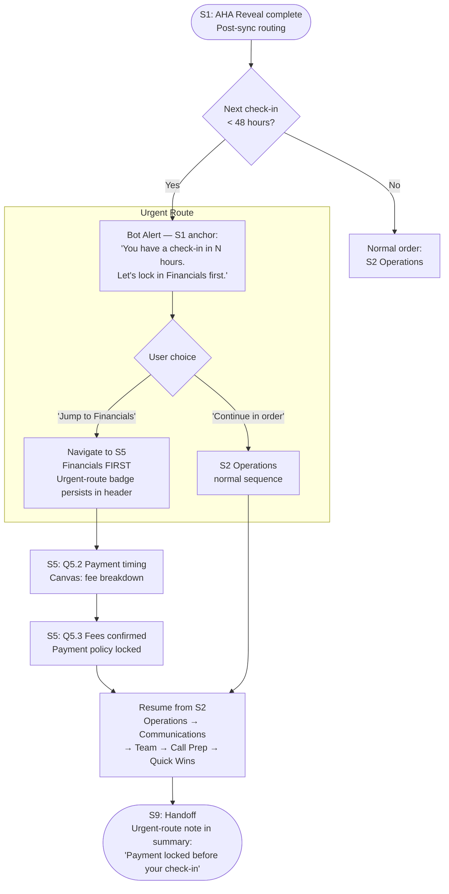
```mermaid
flowchart TD
    A([S1: AHA Reveal complete\nPost-sync routing]) --> B{Next check-in\n< 48 hours?}
    B -- No --> C[Normal order:\nS2 Operations]
    B -- Yes --> D
    subgraph URGENT ["Urgent Route"]
        D[Bot Alert — S1 anchor:\n'You have a check-in in N hours.\nLet's lock in Financials first.'] --> E{User choice}
        E -- 'Jump to Financials' --> F[Navigate to S5\nFinancials FIRST\nUrgent-route badge persists in header]
        E -- 'Continue in order' --> G[S2 Operations\nnormal sequence]
    end
    F --> H[S5: Q5.2 Payment timing\nCanvas: fee breakdown]
    H --> I[S5: Q5.3 Fees confirmed\nPayment policy locked]
    I --> J[Resume from S2\nOperations → Communications\n→ Team → Call Prep → Quick Wins]
    G --> J
    J --> K([S9: Handoff\nUrgent-route note in summary:\n'Payment locked before your check-in'])
```

**Key UX constraint:** The urgent-route badge ("⚡ Payment policy locked for your check-in") remains visible in the persistent header for the rest of the session per FR-11.1 — even if the check-in window passes by the user's next re-entry.

---

### UJ-3: Sara — Skip Intercept → Decides to Connect [DEPRECATED 2026-05-26]

> **Deprecated.** The 4-tier skip intercept system has been removed per C4 reversal. Per the new onboarding script: "Everything is skippable. Skipped items become a punch list for Call 1." No intercept dialogs. No Auto-Pilot Acceptance Modal. SkipInterceptDialog and AutoPilotAcceptanceModal components obsolete. PRD §4.7 (Tiered Skip Intercept System) and FR-35–38, FR-37.1 superseded.

**Persona:** Impatient owner-operator, clicks "Skip to Dashboard" before connecting Airbnb.
**Four tiers:** intercept copy and CTA options adapt to how much the user has invested.

```mermaid
flowchart TD
    A([User clicks 'Skip to Dashboard']) --> B{Wizard\nposition?}
    B -- Before S1 connected --> C
    subgraph T1 ["Tier 1 — Before Airbnb Connected"]
        C[AlertDialog:\n'Your dashboard will be empty.\nGive me 10 seconds to connect\nyour Airbnb account first.'] --> D{User choice}
        D -- Primary: 'Okay, 10 seconds' --> E[Return to Q1.1\nNormal OAuth flow]
        D -- Secondary: 'I'll connect later' --> F[Auto-Pilot Acceptance Modal\nConfirm which defaults apply\nFR-37.1]
        F --> G[Safe exit → Dashboard\nPersistent 'Finish Setup' link\nCall 1 prep: Airbnb flagged]
    end
    B -- During S2-S3 --> H
    subgraph T2 ["Tier 2 — Partially Configured"]
        H[AlertDialog:\n'Account partially set up.\nN more sections remaining.\nAbout 90 more seconds.'] --> I{User choice}
        I -- Primary: 'Yes, let's finish' --> J[Return to current screen]
        I -- Secondary: 'Take me to the dashboard' --> K[Safe exit\nRemaining → Call 1 Prep]
    end
    B -- During S4-S6 --> L
    subgraph T3 ["Tier 3 — 80% Complete"]
        L[AlertDialog:\n"You're 80% set. Rest covered\nwith CSM_Name on your call."] --> M{User choice}
        M -- Primary: 'Quick finish' --> N[Return to current screen]
        M -- Secondary: "I'll talk to CSM" --> O[Safe exit\nItems routed to call prep]
    end
    B -- During S7 --> P[Tier 4: No intercept\nSilent safe exit\nItems → Call 1 Prep]
    E --> Q([Normal flow\ncontinues from S1])
    J --> R([Normal flow\nresumes at position])
    N --> R
    G --> S([Dashboard\n'Finish Setup' persistent link])
    K --> S
    O --> S
    P --> S
```

---

### UJ-4: Marcus — Accountant Delegation [DEPRECATED 2026-05-26]

> **Deprecated.** Accountant delegation removed entirely per C5 reversal. The new onboarding script's Q5.1 Decision Owner is a single in-flow question with "one person OR split into three" options — no secure link, no Stripped Section 5 View, no accountant consent banner. DelegationStatusCard and StrippedSection5Surface components obsolete. DC-4 Delegation Lifecycle state machine obsolete. PRD §4.5 (Financials with Accountant Delegation), §4.10 (Delegation Lifecycle), FR-25–30, FR-50 superseded.

**Persona:** Owner-operator, 15 listings, uses a bookkeeper (Jane).
**Dual-flow:** Marcus's flow and Jane's separate Stripped Section 5 View run concurrently.

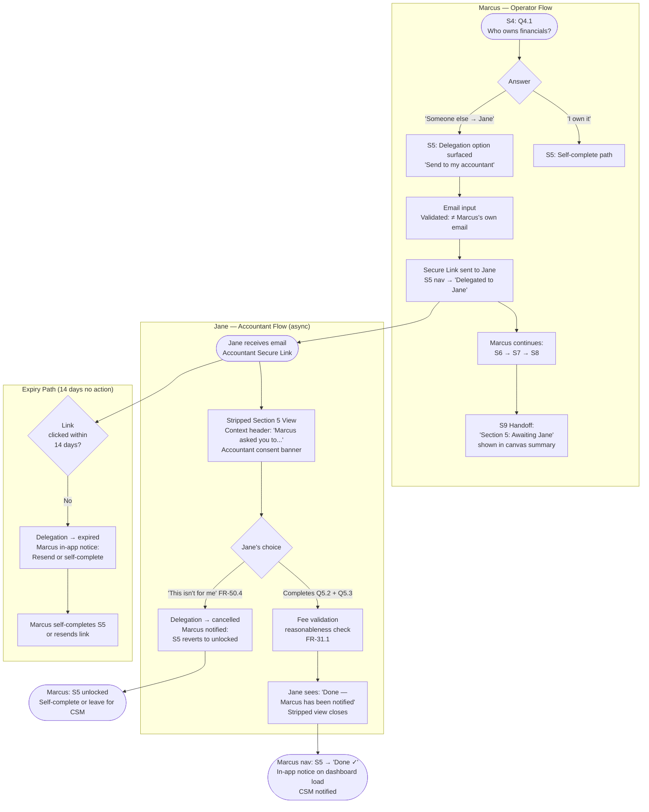
```mermaid
flowchart TD
    subgraph MARCUS ["Marcus — Operator Flow"]
        A([S4: Q4.1\nWho owns financials?]) --> B{Answer}
        B -- 'I own it' --> C[S5: Self-complete path]
        B -- 'Someone else → Jane' --> D[S5: Delegation option surfaced\n'Send to my accountant']
        D --> E[Email input\nValidated: ≠ Marcus's own email]
        E --> F[Secure Link sent to Jane\nS5 nav → 'Delegated to Jane']
        F --> G[Marcus continues:\nS6 → S7 → S8]
        G --> H[S9 Handoff:\n'Section 5: Awaiting Jane'\nshown in canvas summary]
    end
    subgraph JANE ["Jane — Accountant Flow (async)"]
        F --> I([Jane receives email\nAccountant Secure Link])
        I --> J[Stripped Section 5 View\nContext header: 'Marcus asked you to...'\nAccountant consent banner]
        J --> K{Jane's choice}
        K -- Completes Q5.2 + Q5.3 --> L[Fee validation\nreasonableness check\nFR-31.1]
        L --> M[Jane sees: 'Done —\nMarcus has been notified'\nStripped view closes]
        K -- 'This isn't for me' FR-50.4 --> N[Delegation → cancelled\nMarcus notified:\nS5 reverts to unlocked]
    end
    subgraph EXPIRY ["Expiry Path (14 days no action)"]
        I --> O{Link\nclicked within\n14 days?}
        O -- No --> P[Delegation → expired\nMarcus in-app notice:\nResend or self-complete]
        P --> Q[Marcus self-completes S5\nor resends link]
    end
    M --> R([Marcus nav: S5 → 'Done ✓'\nIn-app notice on dashboard load\nCSM notified])
    N --> S([Marcus: S5 unlocked\nSelf-complete or leave for CSM])
```

**Lock constraint:** While Jane's delegation is in `opened` state (FR-50 DC-4), Marcus cannot edit Q5.2/Q5.3. He can still cancel the delegation (FR-50.6).

---

### UJ-5: Hannah — Partner Auto-Skip [AMENDED 2026-05-26]

> **Amended.** Auto-advance is downgraded to confirm-only per the new script: "Looks like you're using **{{cleaning_tool}}**. Keep it / Change." User must take an action (Confirm or Change) — no silent auto-advance. PriceLabs handling: Section 7 Q7.3 (Rate Strategy) is auto-skipped when SF indicates dynamic pricing tool. Branching logic preserved; mechanic changed.

**Persona:** Owner-operator with Turno + PriceLabs already connected.
**System behavior:** CRM `Partners` field triggers auto-advance/skip, reducing 3+ screens to bot confirmations.

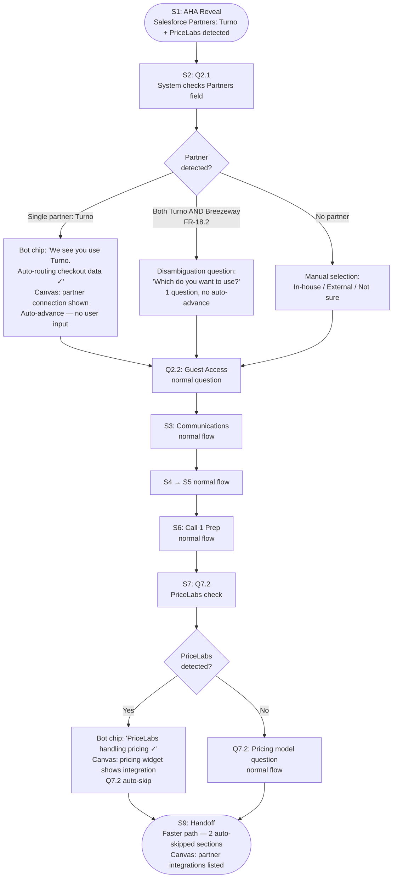
```mermaid
flowchart TD
    A([S1: AHA Reveal\nSalesforce Partners: Turno + PriceLabs detected]) --> B[S2: Q2.1\nSystem checks Partners field]
    B --> C{Partner\ndetected?}
    C -- Single partner: Turno --> D[Bot chip: 'We see you use Turno.\nAuto-routing checkout data ✓'\nCanvas: partner connection shown\nAuto-advance — no user input]
    C -- Both Turno AND Breezeway\nFR-18.2 --> E[Disambiguation question:\n'Which do you want to use?'\n1 question, no auto-advance]
    C -- No partner --> F[Manual selection:\nIn-house / External / Not sure]
    D --> G[Q2.2: Guest Access\nnormal question]
    E --> G
    F --> G
    G --> H[S3: Communications\nnormal flow]
    H --> I[S4 → S5 normal flow]
    I --> J[S6: Call 1 Prep\nnormal flow]
    J --> K[S7: Q7.2\nPriceLabs check]
    K --> L{PriceLabs\ndetected?}
    L -- Yes --> M[Bot chip: 'PriceLabs handling pricing ✓'\nCanvas: pricing widget shows integration\nQ7.2 auto-skip]
    L -- No --> N[Q7.2: Pricing model question\nnormal flow]
    M --> O([S9: Handoff\nFaster path — 2 auto-skipped sections\nCanvas: partner integrations listed])
    N --> O
```

**Penetration caveat (per John's review):** "~40% shorter" depends on actual Turno + PriceLabs attach rate in the SMB cohort — currently unconfirmed. UJ-5 is treated as a real but not necessarily common journey until penetration data is added (tracked in Open Questions for Step 14).

---

### UJ-6: Ben — Mid-Session Return with Refreshed Data [AMENDED 2026-05-26]

> **Amended.** Q3.2 in V4 was "Check-in Template" (Communications section — REMOVED). In new script, Q3.2 is "Non-refundable rates" (Financials). Ben's interrupt-point anchor moves to a Financials question. Re-poll + freshness toast mechanic unchanged. Communications section eliminated entirely.

**Persona:** Owner-operator, interrupted at Q3.2, returns 14 hours later to fresh guest activity.
**Two-session flow:** State persistence + Airbnb re-poll on re-entry.

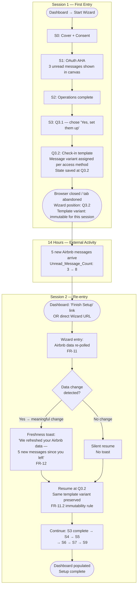
```mermaid
flowchart TD
    subgraph SESSION1 ["Session 1 — First Entry"]
        A([Dashboard → Start Wizard]) --> B[S0: Cover + Consent]
        B --> C[S1: OAuth AHA\n3 unread messages shown in canvas]
        C --> D[S2: Operations complete]
        D --> E[S3: Q3.1 — chose 'Yes, set them up']
        E --> F[Q3.2: Check-in template\nMessage variant assigned per access method\nState saved at Q3.2]
        F --> G([Browser closed / tab abandoned\nWizard position: Q3.2\nTemplate variant: immutable for this session])
    end
    subgraph GAP ["14 Hours — External Activity"]
        G --> H[5 new Airbnb messages arrive\nUnread_Message_Count: 3 → 8]
    end
    subgraph SESSION2 ["Session 2 — Re-entry"]
        H --> I([Dashboard: 'Finish Setup' link\nOR direct Wizard URL])
        I --> J[Wizard entry:\nAirbnb data re-polled\nFR-11]
        J --> K{Data change\ndetected?}
        K -- Yes → meaningful change --> L[Freshness toast:\n'We refreshed your Airbnb data —\n5 new messages since you left'\nFR-12]
        K -- No change --> M[Silent resume\nNo toast]
        L --> N[Resume at Q3.2\nSame template variant preserved\nFR-11.2 immutability rule]
        M --> N
        N --> O[Continue: S3 complete → S4 → S5\n→ S6 → S7 → S9]
        O --> P([Dashboard populated\nSetup complete])
    end
```

**Data freshness rule (FR-11.2):** The Airbnb snapshot used for Q3.2's template variant is immutable per session — even if the re-poll detects new messages, the template variant shown is the one assigned in Session 1. The freshness toast acknowledges the new data without invalidating the in-progress configuration.

---

### UJ-7: Priya — OAuth Failure → Degraded Mode Fallback [AMENDED 2026-05-26]

> **Amended.** OAuth now triggered at Q1.4 (after 3 pre-flight questions), not Q1.1. Failure path semantics unchanged. Degraded mode (canvas shows ghost cards, "Connect Later" status) carries through Sections 2–8. CSM picks up Airbnb connect on Call 1.

**Persona:** Owner-operator, 9 listings, just rotated Airbnb password last week. Token mismatch on connect.
**SM coverage:** SM-1 (the failure cohort). What happens when OAuth itself is the collapse point.

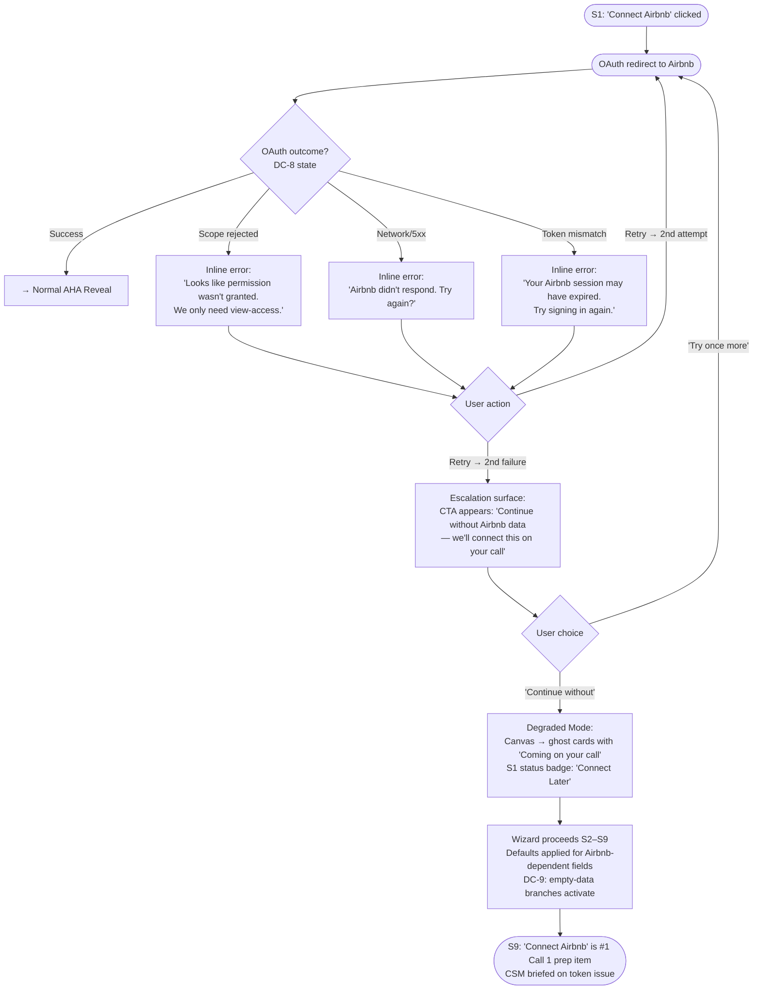
```mermaid
flowchart TD
    A([S1: 'Connect Airbnb' clicked]) --> B([OAuth redirect to Airbnb])
    B --> C{OAuth outcome?\nDC-8 state}
    C -- Success --> D[→ Normal AHA Reveal]
    C -- Scope rejected --> E[Inline error:\n'Looks like permission wasn't granted.\nWe only need view-access.']
    C -- Network/5xx --> F[Inline error:\n'Airbnb didn't respond. Try again?']
    C -- Token mismatch --> G[Inline error:\n'Your Airbnb session may have expired.\nTry signing in again.']
    E --> H{User action}
    F --> H
    G --> H
    H -- Retry → 2nd attempt --> B
    H -- Retry → 2nd failure --> I[Escalation surface:\nCTA appears: 'Continue without Airbnb data\n— we'll connect this on your call']
    I --> J{User choice}
    J -- 'Try once more' --> B
    J -- 'Continue without' --> K[Degraded Mode:\nCanvas → ghost cards with 'Coming on your call'\nS1 status badge: 'Connect Later']
    K --> L[Wizard proceeds S2–S9\nDefaults applied for Airbnb-dependent fields\nDC-9: empty-data branches activate]
    L --> M([S9: 'Connect Airbnb' is #1 Call 1 prep item\nCSM briefed on token issue])
```

**Recovery artifact:** Wizard does not block on Airbnb. The user is never trapped at S1.

---

### UJ-8: Yusuf — Reaches Section 8, Bounces Without "Confirm and continue" [AMENDED 2026-05-26]

> **Amended.** Handoff screen renumbered: S9 → Section 8 (Review & Confirm). CTA renamed: "Go to Dashboard" → "Confirm and continue". Re-entry surface in Section 2 (re-entry into Wizard) leads back to Section 8 with all answers preserved.

**Persona:** Owner-operator, completes Sections 1–7 in one sitting, lands on Section 8 Review & Confirm, reads it, closes the tab without clicking the final CTA.
**SM coverage:** SM-5 — the journey that exposes whether AHA + Section 8 design actually pull users through.

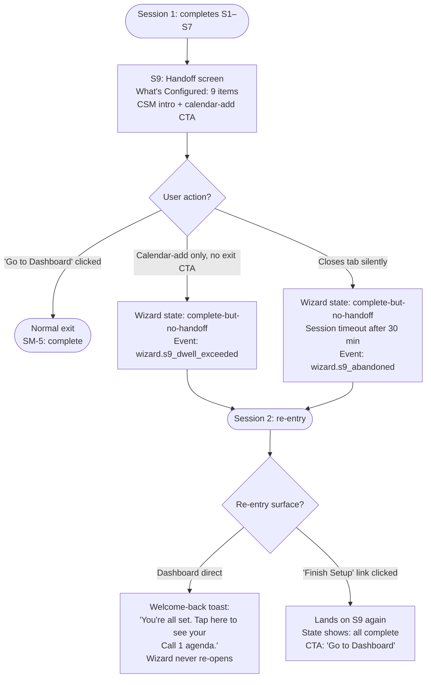
```mermaid
flowchart TD
    A([Session 1: completes S1–S7]) --> B[S9: Handoff screen\nWhat's Configured: 9 items\nCSM intro + calendar-add CTA]
    B --> C{User action?}
    C -- 'Go to Dashboard' clicked --> D([Normal exit\nSM-5: complete])
    C -- Calendar-add only, no exit CTA --> E[Wizard state: complete-but-no-handoff\nEvent: wizard.s9_dwell_exceeded]
    C -- Closes tab silently --> F[Wizard state: complete-but-no-handoff\nSession timeout after 30 min\nEvent: wizard.s9_abandoned]
    E --> G([Session 2: re-entry])
    F --> G
    G --> H{Re-entry surface?}
    H -- Dashboard direct --> I[Welcome-back toast:\n'You're all set. Tap here to see your\nCall 1 agenda.'\nWizard never re-opens]
    H -- 'Finish Setup' link clicked --> J[Lands on S9 again\nState shows: all complete\nCTA: 'Go to Dashboard']
```

**Instrumentation:** Three distinct events differentiate `complete-with-CTA`, `complete-with-calendar-only`, and `complete-but-silent`. SM-5 separates "reached S9" from "completed handoff CTA" — they are not the same.

---

### UJ-9: Tom — Delegation Ghosted (Jane Never Opens Link) [DEPRECATED 2026-05-26]

> **Deprecated.** Same as UJ-4: delegation removed per C5 reversal. No accountant secure link, no 14-day expiry path, no Day-7 nudge. DC-4 state machine obsolete.

**Persona:** Owner-operator delegates Financials. Accountant does not engage. Recovery surface across 14 days.
**DC-4 coverage:** Full delegation lifecycle including `expired` and merge-conflict states.

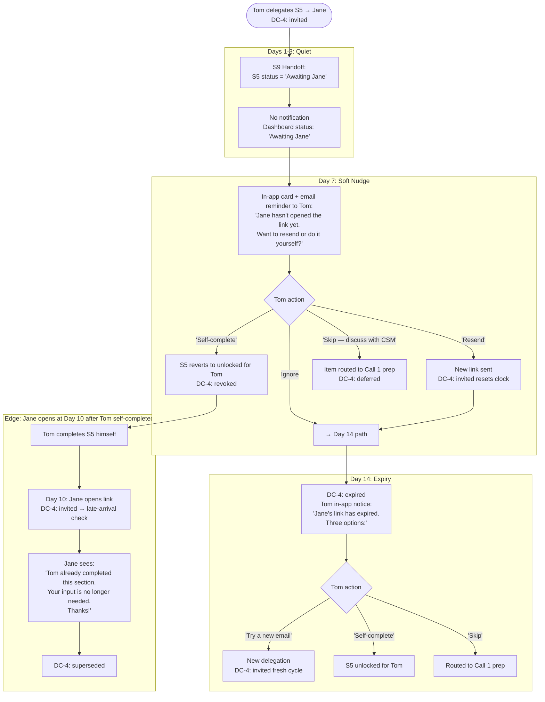
```mermaid
flowchart TD
    A([Tom delegates S5 → Jane\nDC-4: invited]) --> B[S9 Handoff:\nS5 status = 'Awaiting Jane']
    subgraph DAY_1_3 ["Days 1-3: Quiet"]
        B --> C[No notification\nDashboard status: 'Awaiting Jane']
    end
    subgraph DAY_7 ["Day 7: Soft Nudge"]
        C --> D[In-app card + email reminder to Tom:\n'Jane hasn't opened the link yet.\nWant to resend or do it yourself?']
        D --> E{Tom action}
        E -- 'Resend' --> F[New link sent\nDC-4: invited resets clock]
        E -- 'Self-complete' --> G[S5 reverts to unlocked for Tom\nDC-4: revoked]
        E -- 'Skip — discuss with CSM' --> H[Item routed to Call 1 prep\nDC-4: deferred]
        E -- Ignore --> I[→ Day 14 path]
        F --> I
    end
    subgraph DAY_14 ["Day 14: Expiry"]
        I --> J[DC-4: expired\nTom in-app notice:\n'Jane's link has expired.\nThree options:']
        J --> K{Tom action}
        K -- 'Try a new email' --> L[New delegation\nDC-4: invited fresh cycle]
        K -- 'Self-complete' --> M[S5 unlocked for Tom]
        K -- 'Skip' --> N[Routed to Call 1 prep]
    end
    subgraph MERGE_CONFLICT ["Edge: Jane opens at Day 10 after Tom self-completed"]
        G --> O[Tom completes S5 himself]
        O --> P[Day 10: Jane opens link\nDC-4: invited → late-arrival check]
        P --> Q[Jane sees:\n'Tom already completed this section.\nYour input is no longer needed.\nThanks!']
        Q --> R[DC-4: superseded]
    end
```

**Recovery artifact:** Every state has a notification surface. No user is silently stuck.

---

### UJ-10: Lina — Write Failure with Rollback (FR-9 Retry Exhaustion) [AMENDED 2026-05-26]

> **Amended.** Field example updated. Original used Q5.3 cleaning fee. In new schema, this maps to Section 3 Q3.3 security_deposit_amount OR Section 3 Q3.6 mandatory_fees[].amount. Same WriteStatus state machine applies. EP-5 recovery via RecoveryChip unchanged.

**Persona:** Owner-operator, mid-session, network blips between local commit and server ack.
**WriteStatus coverage:** The async edge inside every "next step" arrow, drawn explicitly.

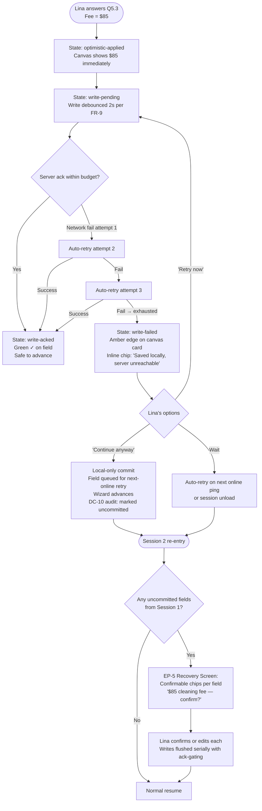
```mermaid
flowchart TD
    A([Lina answers Q5.3\nFee = $85]) --> B[State: optimistic-applied\nCanvas shows $85 immediately]
    B --> C[State: write-pending\nWrite debounced 2s per FR-9]
    C --> D{Server ack within budget?}
    D -- Yes --> E[State: write-acked\nGreen ✓ on field\nSafe to advance]
    D -- Network fail attempt 1 --> F[Auto-retry attempt 2]
    F -- Success --> E
    F -- Fail --> G[Auto-retry attempt 3]
    G -- Success --> E
    G -- Fail → exhausted --> H[State: write-failed\nAmber edge on canvas card\nInline chip: 'Saved locally, server unreachable']
    H --> I{Lina's options}
    I -- 'Continue anyway' --> J[Local-only commit\nField queued for next-online retry\nWizard advances\nDC-10 audit: marked uncommitted]
    I -- 'Retry now' --> C
    I -- Wait --> K[Auto-retry on next online ping\nor session unload]
    J --> L([Session 2 re-entry])
    K --> L
    L --> M{Any uncommitted fields\nfrom Session 1?}
    M -- Yes --> N[EP-5 Recovery Screen:\nConfirmable chips per field\n'$85 cleaning fee — confirm?']
    M -- No --> O[Normal resume]
    N --> P[Lina confirms or edits each\nWrites flushed serially with ack-gating]
    P --> O
```

**Cross-reference:** This is the journey that traverses DC-10 (Auto-Pilot audit) for uncommitted writes. Every flow's "→" arrow on a configuration screen is implicitly this state machine.

---

### UJ-11: Chen — Evaluator / Sub-Threshold User [AMENDED 2026-05-26]

> **Amended.** Skip mechanic updated. No Tier 1 intercept, no Auto-Pilot Acceptance Modal. Chen skips Q1.4 OAuth directly → wizard continues through pre-flight (Q1.5 going-live timeline) → can skip further questions or complete in degraded mode. Skipped items become Call 1 punch list per the new flat-skip model.

**Persona:** 2 listings, just signed up for Pro (probably intended Lite), wants to evaluate before committing data. Below the 5–20 target. Represents the 27% who don't activate during onboarding (Mary's data ask).

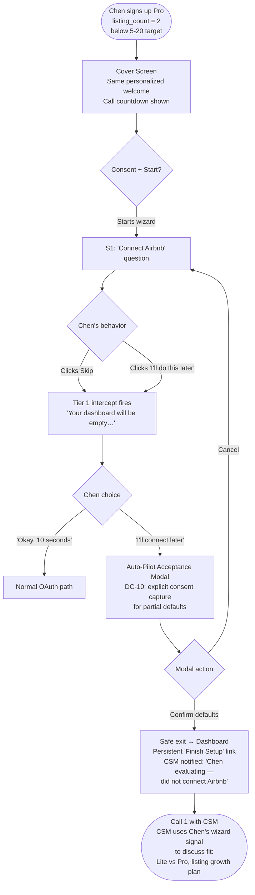
```mermaid
flowchart TD
    A([Chen signs up Pro\nlisting_count = 2\nbelow 5-20 target]) --> B[Cover Screen\nSame personalized welcome\nCall countdown shown]
    B --> C{Consent + Start?}
    C -- Starts wizard --> D[S1: 'Connect Airbnb' question]
    D --> E{Chen's behavior}
    E -- Clicks Skip --> F[Tier 1 intercept fires\n'Your dashboard will be empty…']
    E -- Clicks 'I'll do this later' --> F
    F --> G{Chen choice}
    G -- 'Okay, 10 seconds' --> H[Normal OAuth path]
    G -- 'I'll connect later' --> I[Auto-Pilot Acceptance Modal\nDC-10: explicit consent capture\nfor partial defaults]
    I --> J{Modal action}
    J -- Confirm defaults --> K[Safe exit → Dashboard\nPersistent 'Finish Setup' link\nCSM notified: 'Chen evaluating —\ndid not connect Airbnb']
    J -- Cancel --> D
    K --> L([Call 1 with CSM\nCSM uses Chen's wizard signal\nto discuss fit:\nLite vs Pro, listing growth plan])
```

**Sub-threshold UX rule:** The wizard never tells Chen he's "too small" or "wrong product." The CSM call becomes the conversion / re-segmentation moment. Per PRD §16 BLOCKER-8 partial resolution: opinionated design is appropriate for the onboarding moment regardless of account size.

---

## Cross-Cutting State Machines (Step 10.5)

These five state machines run *underneath* every user journey. Each diagram is authoritative; UJ flows reference these states by name.

### DC-3: Data Freshness

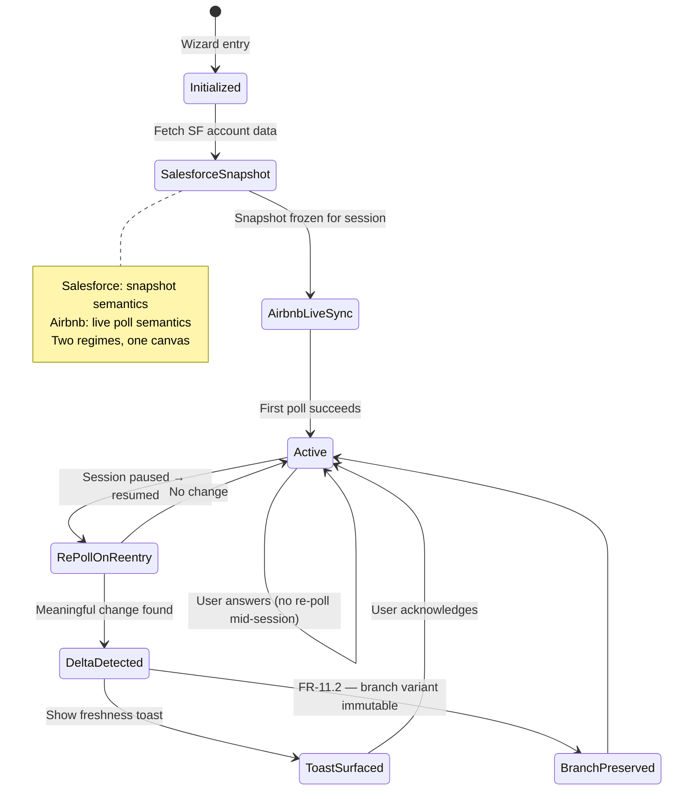
```mermaid
stateDiagram-v2
    [*] --> Initialized: Wizard entry
    Initialized --> SalesforceSnapshot: Fetch SF account data
    SalesforceSnapshot --> AirbnbLiveSync: Snapshot frozen for session
    AirbnbLiveSync --> Active: First poll succeeds
    Active --> Active: User answers (no re-poll mid-session)
    Active --> RePollOnReentry: Session paused → resumed
    RePollOnReentry --> DeltaDetected: Meaningful change found
    RePollOnReentry --> Active: No change
    DeltaDetected --> ToastSurfaced: Show freshness toast
    ToastSurfaced --> Active: User acknowledges
    DeltaDetected --> BranchPreserved: FR-11.2 — branch variant immutable
    BranchPreserved --> Active
    note right of SalesforceSnapshot
        Salesforce: snapshot semantics
        Airbnb: live poll semantics
        Two regimes, one canvas
    end note
```

### DC-4: Delegation Lifecycle [DEPRECATED 2026-05-26]

> **Deprecated.** Delegation removed per C5 reversal. State machine no longer authoritative. Original diagram retained for traceability only.

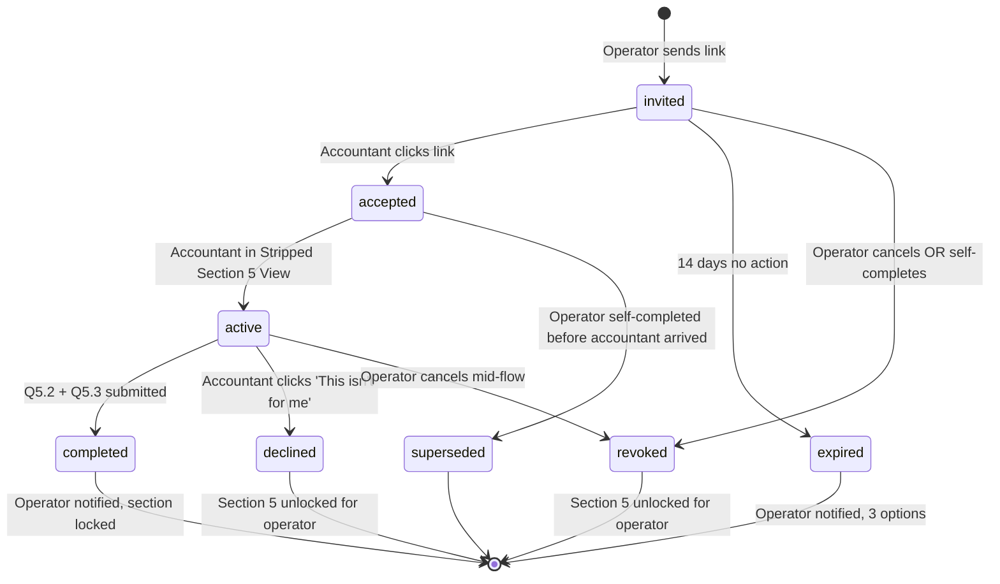
```mermaid
stateDiagram-v2
    [*] --> invited: Operator sends link
    invited --> accepted: Accountant clicks link
    invited --> expired: 14 days no action
    invited --> revoked: Operator cancels OR self-completes
    accepted --> active: Accountant in Stripped Section 5 View
    active --> completed: Q5.2 + Q5.3 submitted
    active --> declined: Accountant clicks 'This isn't for me'
    active --> revoked: Operator cancels mid-flow
    declined --> [*]: Section 5 unlocked for operator
    revoked --> [*]: Section 5 unlocked for operator
    expired --> [*]: Operator notified, 3 options
    completed --> [*]: Operator notified, section locked
    accepted --> superseded: Operator self-completed before accountant arrived
    superseded --> [*]
```

### DC-8: OAuth Redirect/Rehydration

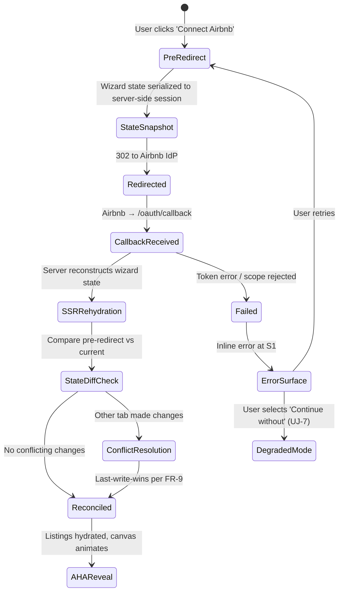
```mermaid
stateDiagram-v2
    [*] --> PreRedirect: User clicks 'Connect Airbnb'
    PreRedirect --> StateSnapshot: Wizard state serialized to server-side session
    StateSnapshot --> Redirected: 302 to Airbnb IdP
    Redirected --> CallbackReceived: Airbnb → /oauth/callback
    CallbackReceived --> SSRRehydration: Server reconstructs wizard state
    SSRRehydration --> StateDiffCheck: Compare pre-redirect vs current
    StateDiffCheck --> Reconciled: No conflicting changes
    StateDiffCheck --> ConflictResolution: Other tab made changes
    ConflictResolution --> Reconciled: Last-write-wins per FR-9
    Reconciled --> AHAReveal: Listings hydrated, canvas animates
    CallbackReceived --> Failed: Token error / scope rejected
    Failed --> ErrorSurface: Inline error at S1
    ErrorSurface --> PreRedirect: User retries
    ErrorSurface --> DegradedMode: User selects 'Continue without' (UJ-7)
```

### DC-9: Empty-Data Branching

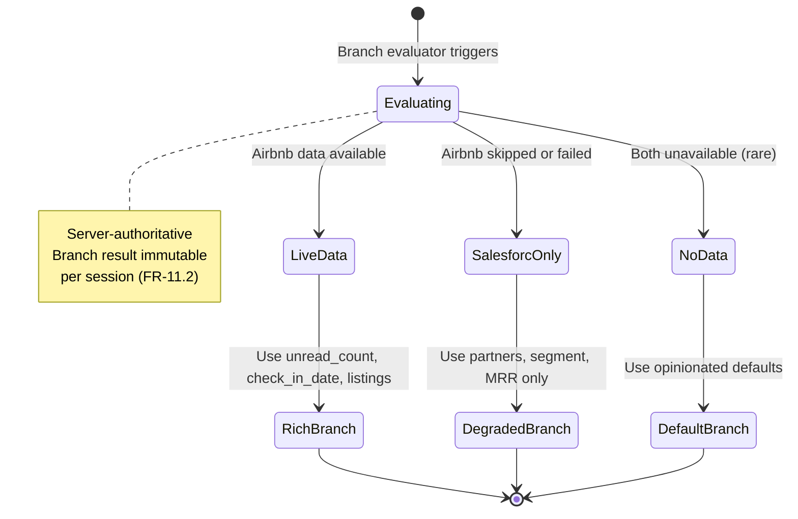
```mermaid
stateDiagram-v2
    [*] --> Evaluating: Branch evaluator triggers
    Evaluating --> LiveData: Airbnb data available
    Evaluating --> SalesforcOnly: Airbnb skipped or failed
    Evaluating --> NoData: Both unavailable (rare)
    LiveData --> RichBranch: Use unread_count, check_in_date, listings
    SalesforcOnly --> DegradedBranch: Use partners, segment, MRR only
    NoData --> DefaultBranch: Use opinionated defaults
    RichBranch --> [*]
    DegradedBranch --> [*]
    DefaultBranch --> [*]
    note right of Evaluating
        Server-authoritative
        Branch result immutable
        per session (FR-11.2)
    end note
```

### DC-10: Auto-Pilot Audit Trail [DEPRECATED 2026-05-26]

> **Deprecated.** Auto-Pilot Defaults removed (no FR-37 / FR-37.1 surface). Skipped items now flow directly to Call 1 punch list without an Auto-Pilot consent step. The audit trail for `Committed` and `Deferred` states is retained in a simpler form (no `AutoApplied` state). Engineering should adopt a minimal "skip → punch list" audit instead.

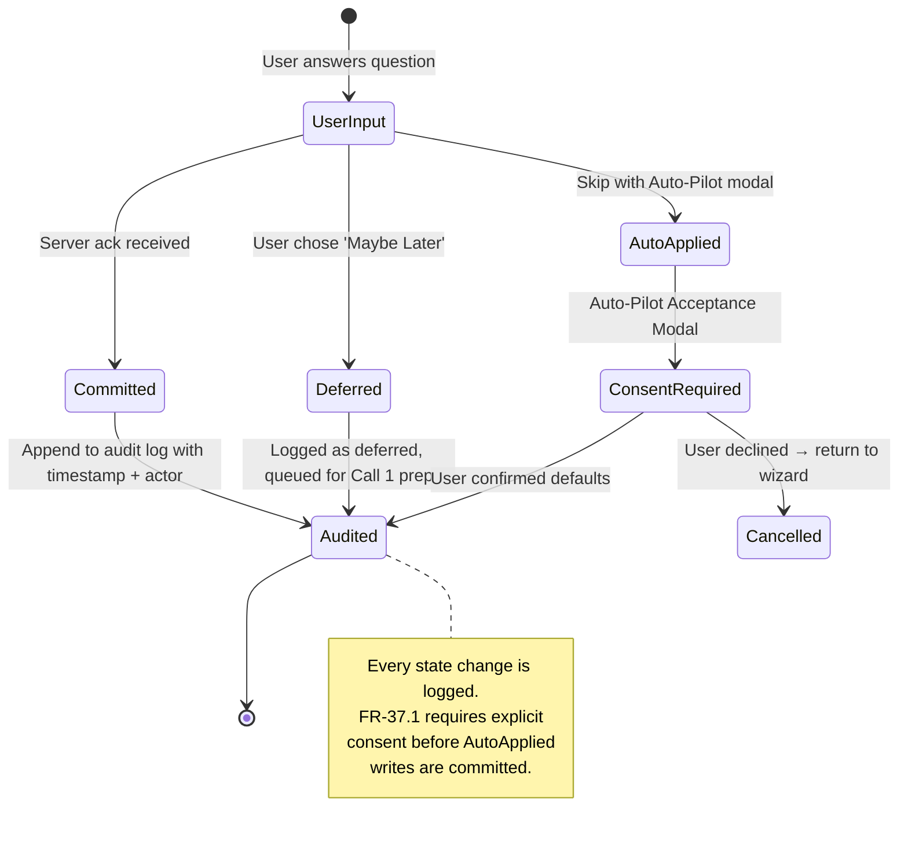
```mermaid
stateDiagram-v2
    [*] --> UserInput: User answers question
    UserInput --> Committed: Server ack received
    UserInput --> Deferred: User chose 'Maybe Later'
    UserInput --> AutoApplied: Skip with Auto-Pilot modal
    Committed --> Audited: Append to audit log with timestamp + actor
    Deferred --> Audited: Logged as deferred, queued for Call 1 prep
    AutoApplied --> ConsentRequired: Auto-Pilot Acceptance Modal
    ConsentRequired --> Audited: User confirmed defaults
    ConsentRequired --> Cancelled: User declined → return to wizard
    Audited --> [*]
    note right of Audited
        Every state change is logged.
        FR-37.1 requires explicit
        consent before AutoApplied
        writes are committed.
    end note
```

#### DC-10' (Replacement): Simplified Skip Audit [NEW 2026-05-26]

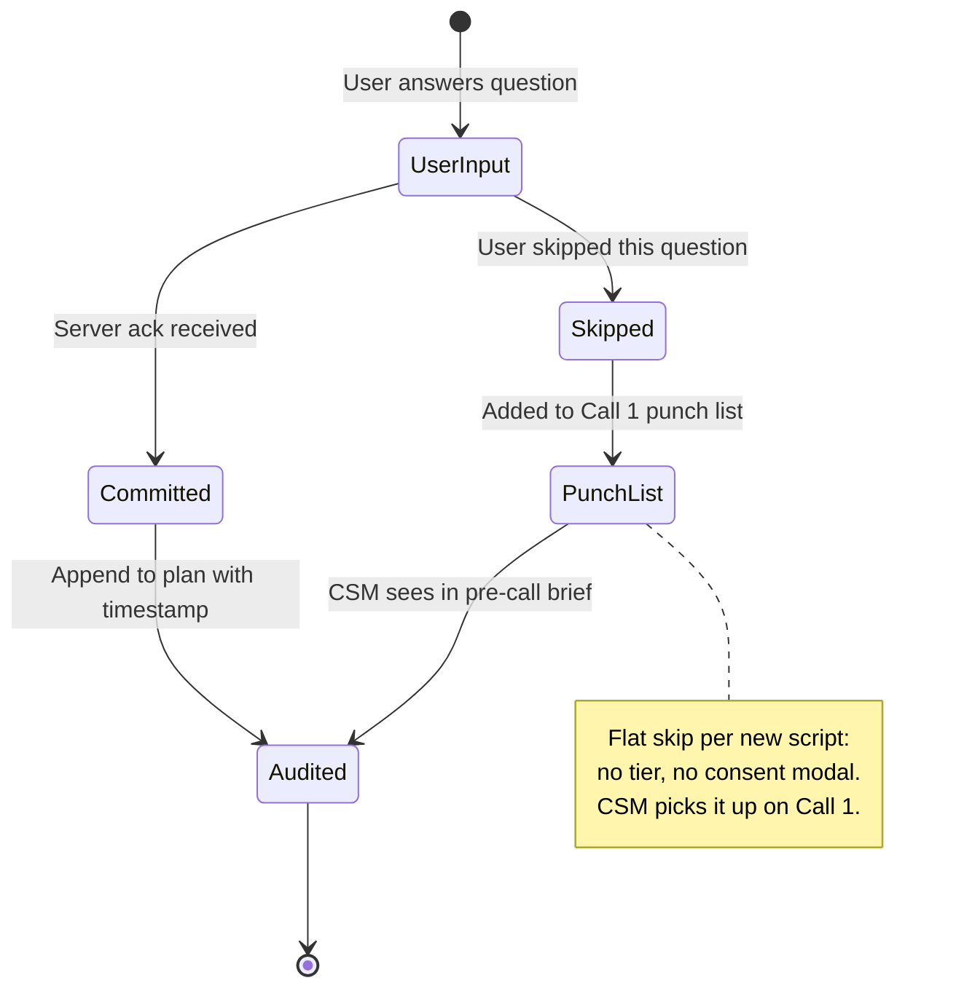
```mermaid
stateDiagram-v2
    [*] --> UserInput: User answers question
    UserInput --> Committed: Server ack received
    UserInput --> Skipped: User skipped this question
    Committed --> Audited: Append to plan with timestamp
    Skipped --> PunchList: Added to Call 1 punch list
    PunchList --> Audited: CSM sees in pre-call brief
    Audited --> [*]
    note right of PunchList
        Flat skip per new script:
        no tier, no consent modal.
        CSM picks it up on Call 1.
    end note
```

---

## Event Taxonomy (Step 10.6)

> **[AMENDED 2026-05-26]** Events related to delegation (DC-4) and Auto-Pilot Defaults (DC-10) are deprecated. New events added for Section 4 (Booking Website file uploads), Section 7 (Logo, CSV, Owner-Listing mapper), Section 8 (Review & Confirm), Section 9 (Setup in Progress per-item commits), Section 10 (Done dashboard load). See Amended Event Taxonomy table below.

Every journey transition emits a structured event. Engineering uses this taxonomy for instrumentation and SM-1 through SM-11 measurement.

| Event Name | Payload Keys | Emitter | Used By |
|------------|-------------|---------|---------|
| `wizard.session_started` | `session_id`, `user_id`, `cohort_flag`, `entry_source` | Cover screen mount | SM-2 |
| `wizard.consent_recorded` | `consent_type`, `actor`, `timestamp` | Consent checkbox commit | FR-7 audit |
| `snapshot.resolved` | `source`: `'live' \| 'cache' \| 'stale'`, `latency_ms` | Salesforce fetch settle | DC-3 |
| `oauth.redirect_initiated` | `provider`: `'airbnb'`, `session_snapshot_id` | S1 'Connect' click | DC-8, SM-1 |
| `oauth.callback_received` | `outcome`: `'success' \| 'rejected' \| 'failed' \| 'timeout'`, `error_code` | OAuth callback handler | DC-8, SM-1 |
| `aha.reveal_started` | `listing_count`, `reservation_count`, `unread_count` | Canvas stagger trigger | SM-1 |
| `canvas.stagger_complete` | `node_count`, `duration_ms` | Last node transition end | Auto-advance gate |
| `branch.evaluated` | `branch_id`, `variant`, `inputs_hash` | Branch evaluator (server) | DC-9, FR-11.2 |
| `freshness.delta_detected` | `fields_changed`, `magnitude` | Re-poll comparator | DC-3 |
| `freshness.toast_acknowledged` | `delta_id`, `dwell_ms` | Toast dismiss | DC-3 |
| `field.optimistic_applied` | `field_id`, `value` | Canvas state | DC-10 |
| `field.write_acked` | `field_id`, `retry_count`, `latency_ms` | Server ack | FR-9 |
| `field.write_failed` | `field_id`, `error_code`, `local_value` | After 3 retries | EP-5, UJ-10 |
| `delegation.invited` | `delegate_id`, `delegate_email`, `section_id` | Q5.1 send link | DC-4 |
| `delegation.state_changed` | `from`, `to`, `actor` | Lifecycle transition | DC-4 |
| `skip.intercept_shown` | `tier`: `1\|2\|3\|4`, `section_id`, `dwell_ms_before_skip` | Skip button click | FR-35–38 |
| `skip.intercept_resolved` | `tier`, `choice`: `'primary' \| 'secondary'` | Intercept CTA click | FR-35–38 |
| `auto_pilot.modal_shown` | `defaults_count`, `triggered_from` | Tier 1 secondary path | FR-37.1, DC-10 |
| `auto_pilot.modal_resolved` | `outcome`: `'accepted' \| 'cancelled'`, `defaults_applied` | Modal action | DC-10 |
| `wizard.section_entered` | `section_id`, `branch_variant`, `time_since_start_ms` | Section mount | SM-5 |
| `wizard.s9_dwell_exceeded` | `dwell_ms` | S9 timeout no CTA | UJ-8, SM-5 |
| `wizard.s9_abandoned` | `last_activity_at` | S9 session timeout | UJ-8 |
| `wizard.handoff_completed` | `items_configured`, `items_deferred`, `total_active_ms` | 'Go to Dashboard' click | SM-5, SM-6, SM-11 |
| `wizard.resumed` | `time_since_pause_ms`, `pause_count` | Re-entry detection | SM-11 (active vs wall-clock) |

**Active time vs. wall-clock:** SM-11 (onboarding duration) is calculated from `total_active_ms` accumulated across sessions, not wall-clock. Idle gaps over 5 minutes pause accumulation.

### Amended Event Taxonomy [NEW 2026-05-26]

**Events deprecated:**
- ❌ `delegation.invited` — delegation removed
- ❌ `delegation.state_changed` — DC-4 obsolete
- ❌ `skip.intercept_shown` — no tiered intercept
- ❌ `skip.intercept_resolved` — no tiered intercept
- ❌ `auto_pilot.modal_shown` — Auto-Pilot Defaults removed
- ❌ `auto_pilot.modal_resolved` — Auto-Pilot Defaults removed
- ❌ `wizard.s9_dwell_exceeded` — S9 renumbered (see new event below)
- ❌ `wizard.s9_abandoned` — S9 renumbered
- ❌ `wizard.handoff_completed` — replaced by `wizard.plan_confirmed`

**Events added:**

| Event Name | Payload Keys | Emitter | Used By |
|------------|-------------|---------|---------|
| `canvas.reveal_started` | `moment`: `'aha' \| 'mid_funnel_milestone' \| 'review_confirm'`, `section_id`, `trigger_event` | Canvas state transitions Hidden → Revealing | Canvas state machine, animation timing telemetry (NEW 2026-05-27) |
| `canvas.reveal_complete` | `moment`, `duration_ms` | Canvas state transitions Revealing → Visible | Animation timing; gate for AHA stagger trigger (NEW 2026-05-27) |
| `canvas.hide_started` | `moment`, `trigger`: `'user_advance' \| 'auto_timeout' \| 'section_change'` | Canvas state transitions Visible → Hiding | Canvas state machine (NEW 2026-05-27) |
| `canvas.hide_complete` | `moment`, `duration_ms` | Canvas state transitions Hiding → Hidden | DOM unmount gate (NEW 2026-05-27) |
| `canvas.milestone_held` | `section_id: 3`, `holdtime_ms` | Section 3 mid-funnel auto-hide timer | Mid-funnel engagement telemetry (NEW 2026-05-27) |
| `skip.recorded` | `field_id`, `section_id`, `reason`: `'deferred_by_user' \| 'partner_detected' \| 'not_applicable'` | Skip button click (flat) | Call 1 punch list |
| `punch_list.item_added` | `field_id`, `section_id`, `reason`, `user_intent` | After `skip.recorded` | CSM pre-call brief |
| `file.uploaded` | `field_id`, `file_type`: `'logo' \| 'csv' \| 'pdf' \| 'docx'`, `size_bytes`, `mime_type` | Q2.4 checklist / Q4.2 T&Cs / Q4.3 cookie / Q7.1 logo / Q7.2 owner CSV | File upload completion |
| `file.upload_failed` | `field_id`, `error_code`, `size_bytes` | Upload validation/network fail | Recovery surface |
| `owner_listing.match_attempted` | `owner_id`, `listing_id`, `confidence`: `'manual' \| 'suggested'` | Q7.2a drag-to-assign | Owner mapping audit |
| `owner_listing.match_committed` | `owner_id`, `listing_id`, `actor` | Q7.2a confirm | Owner mapping audit |
| `tax.builder_step_completed` | `step`: `'type' \| 'inclusivity' \| 'what_taxed'`, `field_id`, `value` | Multi-step tax sub-wizard | Q3.7 audit |
| `fee.row_added` | `fee_type`, `amount`, `unit` | Q3.6 fee builder | Q3.6 audit |
| `fee.row_removed` | `fee_type`, `previous_value` | Q3.6 fee builder | Q3.6 audit |
| `review.section_expanded` | `section_id`, `dwell_ms` | Section 8 Accordion expand | Engagement metric |
| `review.item_edited` | `field_id`, `previous_value`, `new_value` | Section 8 inline edit | Last-mile correction tracking |
| `wizard.plan_confirmed` | `items_configured`, `items_skipped`, `total_active_ms` | Section 8 'Confirm and continue' click | SM-5, SM-6, SM-11 |
| `setup.item_committed` | `feature_id`, `status`: `'success' \| 'skipped' \| 'error'`, `error_code` | Section 9 per-feature commit | SM-1 readiness |
| `setup.section_completed` | `total_items`, `success_count`, `error_count`, `duration_ms` | Section 9 final transition | SM-1 readiness |
| `done.dashboard_loaded` | `widgets_shown[]`, `punch_list_count` | Section 10 mount | Completion confirmation |
| `wizard.section_8_dwell_exceeded` | `dwell_ms` | Section 8 timeout no CTA | UJ-8, SM-5 |
| `wizard.section_8_abandoned` | `last_activity_at` | Section 8 session timeout | UJ-8 |

**Events retained (unchanged or with minor relabel):**
- `wizard.session_started`, `wizard.consent_recorded`, `snapshot.resolved`, `oauth.*`, `aha.*`, `canvas.stagger_complete`, `branch.evaluated`, `freshness.*`, `field.*`, `wizard.section_entered`, `wizard.resumed` — all retained.

---

## Amended User Journey Summary (Authoritative — 2026-05-26)

This is the **authoritative replacement** for the journey block above. The journeys above are retained for traceability with their `[DEPRECATED]` / `[AMENDED]` markers.

### Active journeys after amendment

| UJ | Persona | Status | Authoritative flow |
|----|---------|--------|---------------------|
| **UJ-1** | Maya — end-to-end happy path | Amended | See **UJ-1 (Amended)** below |
| UJ-2 | David — urgent route | ❌ Deprecated | n/a |
| UJ-3 | Sara — tiered intercept | ❌ Deprecated | n/a |
| UJ-4 | Marcus — delegation | ❌ Deprecated | n/a |
| **UJ-5** | Hannah — partner detection (confirm-only) | Amended | Above + downgrade note |
| **UJ-6** | Ben — mid-session resume | Amended | Above + Q3.2 anchor shift note |
| **UJ-7** | Priya — OAuth failure | Amended | Above + Q1.4 OAuth note |
| **UJ-8** | Yusuf — Section 8 bounce | Amended | Above + Section 8 rename note |
| UJ-9 | Tom — delegation ghosted | ❌ Deprecated | n/a |
| **UJ-10** | Lina — write failure rollback | Amended | Above + field schema note |
| **UJ-11** | Chen — evaluator | Amended | Above + flat-skip note |
| **UJ-12** | Quinn — owner-to-listing mapping | ✨ New | See below |
| **UJ-13** | Riley — Booking Website setup | ✨ New | See below |

### UJ-1 (Amended): Maya — End-to-End Happy Path Through New 10-Section Flow

> **[AMENDED 2026-05-27 — Canvas-as-Moments]** Mermaid updated with canvas reveal/hide annotations. 🎬 = canvas reveal, 🚪 = canvas hide.

**Persona:** Owner-operator, 8 listings, Call 1 in 2d 14h. Completes the wizard in ~15 minutes (longer than V4's 8 min — more sections, more questions).

**Canvas reveal moments:** Three only — Q1.4 AHA (holds through Q1.5), Section 3 entry milestone (4.5s), Section 8 Review & Confirm (full section). All other screens are single-panel Typeform-style.


```mermaid
flowchart TD
    A([Dashboard → wizard entry]) --> B[Section 1 Pre-flight\nCanvas: HIDDEN — single panel]

    subgraph S1 ["Section 1 — Pre-flight"]
        B --> B1[Q1.1: Active listing count confirm\nSF prefill: '8 active listings. Still accurate?']
        B1 --> B2[Q1.2: Airbnb-only check]
        B2 --> B3[Q1.3: Channel confirmation\nPrefilled checkboxes]
        B3 --> B4[Q1.4: Connect Airbnb — the WOW step\nCanvas still HIDDEN here]
        B4 --> B5{OAuth outcome?}
        B5 -- Success --> B6["🎬 CANVAS REVEAL: slide-in 500ms\n+ AHA stagger\n'✓ 8 listings · 22 reservations · 3 messages'"]
        B5 -- Fail --> UJ7[→ UJ-7 Degraded mode\nCanvas stays HIDDEN]
        B6 --> B7[Q1.5: Going-live timeline\nCanvas HELD VISIBLE — user absorbs AHA]
    end

    B7 --> C0["🚪 CANVAS HIDE: slide-out 350ms\non Section 2 entry"]
    C0 --> C[Section 2 Operations\nCanvas: HIDDEN — single panel]

    subgraph S2 ["Section 2 — Operations (single-panel Typeform-style)"]
        C --> C1[Q2.1: Cleaning system\nSF prefill if known — confirm-only]
        C1 --> C2{External tool?}
        C2 -- Yes → skip Q2.2-Q2.4 --> C3[Q2.5: Check-in method]
        C2 -- No → continue --> C4[Q2.2: Cleaning timing]
        C4 --> C5[Q2.3: Inspection requirement]
        C5 --> C6[Q2.4: Turnover checklist with upload option]
        C6 --> C3
        C3 --> C7{Smart lock or mix?}
        C7 -- Yes --> C8[Q2.6: Smart lock provider]
        C7 -- No --> D0
        C8 --> D0
    end

    D0["🎬 CANVAS REVEAL: brief milestone\n(4.5s celebratory hold)\n'You're halfway through. Listings + Operations set.'"]
    D0 --> D1["🚪 CANVAS HIDE: auto after 4.5s\nOR user clicks Continue"]
    D1 --> E[Section 3 Financials\nCanvas: HIDDEN — single panel for Q3.1-Q3.7]

    subgraph S3 ["Section 3 — Financials (single-panel — 7 questions)"]
        E --> E1[Q3.1: Revenue recognition]
        E1 --> E2[Q3.2: Non-refundable rates]
        E2 --> E3[Q3.3: Security deposit or damage waiver]
        E3 --> E4[Q3.4: Payment timing]
        E4 --> E5[Q3.5: Payment split]
        E5 --> E6[Q3.6: Mandatory fees - fee builder]
        E6 --> E7[Q3.7: Taxes - 3-step sub-wizard]
    end

    E7 --> F[Section 4 Booking Website\nCanvas: HIDDEN — single panel\nBot Alert anchor present]

    subgraph S4 ["Section 4 — Booking Website (3 questions)"]
        F --> F1[Q4.1: Business profile prefilled]
        F1 --> F2[Q4.2: T&Cs - Guesty template or upload]
        F2 --> F3[Q4.3: Cookie policy - Guesty template or upload]
    end

    F3 --> G[Section 5 Governance\nCanvas: HIDDEN]

    subgraph S5 ["Section 5 — Governance"]
        G --> G1[Q5.1: Decision owners - one person or split]
        G1 --> G2[Q5.2: Invite teammates - optional skip]
    end

    G2 --> H[Section 6 Focus Topics\nCanvas: HIDDEN]

    subgraph S6 ["Section 6 — Focus Topics"]
        H --> H1[Q6.1: Call 1 focus topics - multi-select]
        H1 --> H2[Q6.2: Biggest pain - free text 280 char]
    end

    H2 --> I[Section 7 Business\nCanvas: HIDDEN]

    subgraph S7 ["Section 7 — Business (optional)"]
        I --> I1[Q7.1: Brand logo upload]
        I1 --> I2[Q7.2: Owner records CSV]
        I2 --> I3{Owners + Airbnb connected?}
        I3 -- Yes --> I4[Q7.2a: Owner-to-listing matcher\nDedicated two-column UI — not canvas\n→ UJ-12]
        I3 -- No --> I5[Q7.3: Rate strategy windows]
        I4 --> I5
        I5 --> J{Dynamic pricing detected?}
        J -- Yes auto-skip --> K0
        J -- No --> I5
    end

    K0["🎬 CANVAS REVEAL: Section 8 entry\nStays visible entire section"]
    K0 --> K[Section 8 Review & Confirm\nCanvas: VISIBLE — full summary]

    subgraph S8 ["Section 8 — Review & Confirm (canvas visible)"]
        K --> K1[Summary with all settings grouped by section\nEdit links inline]
        K1 --> K2{User action?}
        K2 -- Edit an item --> K3[Inline edit → return]
        K3 --> K1
        K2 -- Confirm and continue --> L0
    end

    L0["🚪 CANVAS HIDE: Section 9 takes over viewport"]
    L0 --> L[Section 9 Setup in progress\nFull-viewport loader]

    subgraph S9 ["Section 9 — Setup in progress (loading)"]
        L --> L1[Per-item progress: messages, locks, fees...]
        L1 --> L2{Any feature errors?}
        L2 -- Yes --> L3[Skip + log, continue rest]
        L2 -- No --> M
        L3 --> M
    end

    M[Section 10 Done\nDashboard, not wizard surface]

    subgraph S10 ["Section 10 — Done dashboard"]
        M --> M1[Home page with: next OB session widget,\nfocus topic widgets, recap, Call 1 punch list]
    end
```

**Canvas event sequence for UJ-1 happy path:**
1. `canvas.reveal_started` (moment: `aha`) on OAuth success
2. `canvas.reveal_complete` after 500ms slide-in → AHA stagger begins
3. `canvas.hide_started` (moment: `aha`, trigger: `section_change`) on Section 2 entry
4. `canvas.hide_complete` after 350ms slide-out
5. `canvas.reveal_started` (moment: `mid_funnel_milestone`) on Section 3 first-entry
6. `canvas.milestone_held` after 4.5s hold timer
7. `canvas.hide_started` (moment: `mid_funnel_milestone`, trigger: `auto_timeout` OR `user_advance`)
8. `canvas.hide_complete`
9. `canvas.reveal_started` (moment: `review_confirm`) on Section 8 entry
10. `canvas.hide_started` (moment: `review_confirm`, trigger: `user_advance`) on "Confirm and continue" click
11. `canvas.hide_complete` → Section 9 loader takes over

**Key flow notes:**
- **Total questions:** ~25–30 depending on branching (auto-skipped Q2.2–Q2.4 if external cleaning tool, auto-skipped Q7.3 if dynamic pricing tool, optional Q5.2 skip, optional Q7.1/Q7.2 skip).
- **Time-to-complete target:** ~15 minutes for cooperative user (vs ~8 min in V4).
- **AHA Moment at Q1.4** is preserved as defining experience.
- **Skipped questions** go to Call 1 punch list (no Auto-Pilot Defaults).
- **Section 9 commits the plan** per FR-44 deferral (no real provisioning — per C3 decision).

---

### UJ-12: Quinn — Owner-to-Listing Mapping [NEW 2026-05-26]

**Persona:** Property manager managing 12 listings for 5 different owners. Airbnb is connected (Q1.4 success), uploaded owner CSV at Q7.2.
**New surface:** Drag-to-assign matcher (Q7.2a).

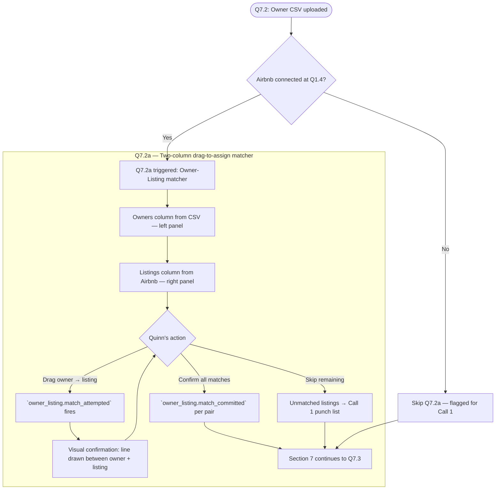
```mermaid
flowchart TD
    A([Q7.2: Owner CSV uploaded]) --> B{Airbnb connected at Q1.4?}
    B -- Yes --> C[Q7.2a triggered: Owner-Listing matcher]
    B -- No --> Z[Skip Q7.2a — flagged for Call 1]

    subgraph MATCHER ["Q7.2a — Two-column drag-to-assign matcher"]
        C --> D[Owners column from CSV — left panel]
        D --> E[Listings column from Airbnb — right panel]
        E --> F{Quinn's action}
        F -- Drag owner → listing --> G[`owner_listing.match_attempted` fires]
        G --> H[Visual confirmation: line drawn between owner + listing]
        H --> F
        F -- Confirm all matches --> I[`owner_listing.match_committed` per pair]
        F -- Skip remaining --> J[Unmatched listings → Call 1 punch list]
        I --> K[Section 7 continues to Q7.3]
        J --> K
    end

    Z --> K
```

**Component:** `OwnerListingMatcher` (Tier D, wizard-local; promotion candidate).
**Edge case:** Owner CSV has more rows than Airbnb listings → unmatched owners flagged in punch list.
**Edge case:** Quinn re-uploads CSV mid-match → matches reset with confirmation modal.

---

### UJ-13: Riley — Booking Website Setup [NEW 2026-05-26]

**Persona:** Owner-operator who already has a marketing website (e.g., `mountainretreats.com`) but no direct-booking infrastructure. Q4.1 SF-prefill captures business name + email + domain hint.
**New section:** Booking Website (Q4.1–Q4.3) — entirely new flow.

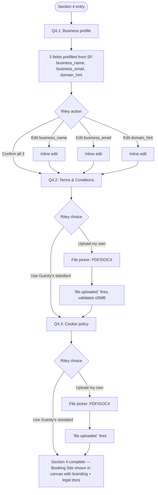
```mermaid
flowchart TD
    A([Section 4 entry]) --> B[Q4.1: Business profile]
    B --> B1[3 fields prefilled from SF:\nbusiness_name, business_email, domain_hint]
    B1 --> B2{Riley action}
    B2 -- Confirm all 3 --> C[Q4.2 next]
    B2 -- Edit business_name --> B3[Inline edit]
    B2 -- Edit business_email --> B4[Inline edit]
    B2 -- Edit domain_hint --> B5[Inline edit]
    B3 --> C
    B4 --> C
    B5 --> C

    C[Q4.2: Terms & Conditions]
    C --> C1{Riley choice}
    C1 -- Use Guesty's standard --> D[Auto-advance with confirmation chip]
    C1 -- Upload my own --> C2[File picker: PDF/DOCX]
    C2 --> C3[`file.uploaded` fires, validates ≤5MB]
    C3 --> D

    D[Q4.3: Cookie policy]
    D --> D1{Riley choice}
    D1 -- Use Guesty's standard --> E[Auto-advance with confirmation chip]
    D1 -- Upload my own --> D2[File picker: PDF/DOCX]
    D2 --> D3[`file.uploaded` fires]
    D3 --> E

    E[Section 4 complete — Booking Site shown in canvas with branding + legal docs]
```

**Components needed:**
- `BusinessProfileEditor` — Tier D, 3-field inline-edit composition
- `LegalDocSelector` — Tier D, radio + file upload composition

**Important UX note:** Section 4 has its top-of-section copy: *"Even if you don't have a direct booking site today, we strongly recommend setting one up. Direct bookings mean no commissions, full guest data, and higher repeat-guest rates. We'll prep it for you here — you decide when to go live."* This framing is critical for users who don't think of themselves as needing a direct booking site.

---

## Behavioral Pattern Catalog (Step 10.7) [AMENDED 2026-05-26]

Six observed patterns the wizard must handle gracefully. Updated for new flat-skip model and removed delegation.

| Pattern | Description | Wizard Response |
|---------|-------------|-----------------|
| **Rage-skip** | User clicks Skip on 3+ questions in <60s | No tier escalation. After 3rd skip in <60s, a soft inline link appears: *"Want to talk to {{CSM_Name}} sooner? Reschedule your call."* with calendar-link. Skips continue to add to Call 1 punch list. |
| **Configure-then-undo** | User completes a section, navigates back, changes answer | Back-navigation always allowed. Canvas re-renders with new state. Branch variant remains locked (FR-11.2). Audit log captures both values. |
| **Multi-attempt OAuth** | OAuth succeeds with wrong Airbnb account | Q1.4 "AHA Reveal" includes 'Wrong account? Switch' link. Triggers token revoke + re-OAuth. Branch lock preserved per FR-11.2. |
| **View-only paranoia** | User dwells >60s on OAuth permission screen | Inline reassurance copy at Q1.4: "View-only means: we read your listings. We never change them, message guests, or accept bookings on Airbnb's side." Plus link to Help article. |
| **Tab-hoarding** | User has wizard open in multiple tabs across days | Multi-tab leadership: most-recently-active tab is leader. Others show "This setup is running in another tab — switch to it" with [Take over here] button. Last-write-wins on FR-9 commits. |
| **The Tester** | User enters obviously fake data ("Test Property 123") to probe | Wizard does not validate against fake names. Audit log flags accounts with patterns matching test-data heuristics for CSM awareness (do not auto-block — CSM handles in call). |

**Demographic considerations** (forwarded to Step 13: Responsive & Accessibility):
- **i18n** — copy supports `{communication_language}` from Guesty config (currently EN, ES, FR, PT, HE pending). Bot persona voice must localize without losing warmth.
- **Screen reader** — Mermaid diagrams in this spec are dev documentation, not runtime UI. Runtime canvas uses `aria-live` (see Step 8).
- **Low-tech-confidence** — Bot Alerts at anchor screens (Sections 1, 3, 4, 8) include plain-language paraphrase + "Talk to {{CSM_Name}} now" escape hatch. [AMENDED 2026-05-26 — anchors remapped]
- **Mobile-only** — explicitly out of scope per stakeholder constraint (desktop-only product).

---

## Journey Patterns

> **[AMENDED 2026-05-26]** Across the **authoritative** journey set (UJ-1 amended + UJ-5/6/7/8/10/11 amended + UJ-12/13 new), six families of reusable patterns emerge. Patterns referencing tiered intercept, delegation, urgent-route, or Auto-Pilot Defaults are deprecated.

### Navigation Patterns

| Pattern | Screens | Behavior |
|---------|---------|---------|
| **Progressive Unlock** | All | S1 must be connected or explicitly skipped before S2–S7 unlock. S9 unlocks once any core section (S2, S3, or S5) is touched. |
| **Non-linear Back / Guarded Forward** | All | Backward: always allowed to any visited screen. Forward: only to visited screens or the next unlocked section. |
| **Branch-Skip with Status** | S2 (partner), S5 (delegation), S7 (PriceLabs) | Auto-skipped or delegated sections show a status label (`Turno ✓`, `Delegated to Jane`, `Done ✓`) — not removed from nav. |
| **Urgent-Route Badge** | S1 → S5 → all subsequent | When urgent route fires, the framing badge persists in the persistent header for the entire session (per FR-11.1). |
| **Degraded Mode Continuation** | All when Airbnb fails (UJ-7) | Wizard never blocks on Airbnb. Defaults applied with consent. CSM briefed. |

### Decision Patterns

| Pattern | Screens | Behavior |
|---------|---------|---------|
| **Auto-advance on Partner Detect** | S2 (Q2.1), S7 (Q7.2) | CRM data → bot confirmation chip → auto-advance. No user input unless disambiguation needed. |
| **Single-select auto-advance** | S2 (Q2.2), S3 (Q3.1), S4 (Q4.1) | One tap on a single-choice option commits and immediately advances. |
| **Tiered Skip Intercept** | All (Skip button) | 4-tier system: intercept copy and CTA options adapt to investment level. Tier 4 exits silently. |
| **Delegation Lifecycle Gate** | S4, S5 | While delegation is in `active` state, the originating operator cannot edit the delegated section — but can cancel. |
| **Reasonableness Validation** | S5 (Q5.3) | Outlier values surface inline "looks right?" check without blocking. |

### Feedback Patterns

| Pattern | Screens | Behavior |
|---------|---------|---------|
| **AHA Reveal** | S1 (post-OAuth) | Listing cards stagger into canvas with animation + sr announcement. First and most memorable feedback moment. |
| **Section Progress** | Persistent header | Nav shows `✓` / `●` / `○` / `🔒` + delegation/partner status labels throughout. |
| **Mid-funnel Milestone** | S5 entry | "3 of 5 sections complete" — text counter, not color-only (DC-3 accessibility rule). |
| **Freshness Toast** | S1 re-entry, S6 (UJ-6) | On re-poll detecting meaningful change: non-blocking toast naming the specific change. |
| **In-flight Save Indicator** | All answer screens | Amber edge on save-in-flight (State C), green `✓` on success (State B), no indicator on idle (State A). |
| **Welcome-Back Toast** | S9-complete return (UJ-8) | Recognizes completed wizard on re-entry; bypasses re-opening. |

### Recovery Patterns

| Pattern | Trigger | Recovery Artifact |
|---------|---------|---------|
| **OAuth Failure Recovery** | S1 OAuth fails/cancelled | Inline error + retry → escalation surface (UJ-7) → degraded mode |
| **Safe Exit → Finish Setup** | Any tier skip | Dashboard "Finish Setup" persistent link. Skipped items → Call 1 Prep list. |
| **Auto-Pilot Acceptance** | Tier 1 secondary CTA | Modal confirms which defaults are applied before exit — DC-10 consent capture. |
| **Delegation Expiry** | 14 days no accountant action (UJ-9) | In-app notice: resend, self-complete, or skip-for-CSM. |
| **EP-5 Save Failure Recovery** | Write failure on re-entry (UJ-10) | Confirmable recovery chips per uncommitted field. |
| **Three-tier Notification Cadence** | Delegation, skipped sections, uncommitted writes | Day 1–3 silent. Day 7 soft nudge. Day 14 expiry + 3-option recovery. |

### State Machine Traversal Patterns

| Pattern | Description |
|---------|-------------|
| **Branch Lock on First Write** | FR-11.2 — once a user commits any answer in a section, the branch variant for that section is immutable for the session. Re-entry preserves variant even if upstream data changed. |
| **Last-Write-Wins on Conflict** | Multi-tab or operator-vs-delegate conflicts resolve via FR-9 commit timestamp. Audit log preserves both values. |
| **Server-Authoritative Branching** | All branching evaluated server-side. Client cannot speculate or pre-compute branch variants. |
| **Snapshot vs. Live-Poll Split** | Salesforce data uses session-snapshot semantics; Airbnb uses live-poll-with-immutable-branch semantics (DC-3). |

### Recovery Maturity Patterns

| Pattern | Description |
|---------|-------------|
| **No Silent Stuck-States** | Every state has a notification surface (in-app + email where appropriate). Users always have a next-action option. |
| **Confirmable Recovery Chips** | EP-5 recovery surface — each failed write becomes a confirmable chip with original value pre-filled. |
| **CSM Briefed on Anomaly** | OAuth failure, evaluator-skip, delegation-ghost, test-data flagging — all surface in the CSM's Call 1 prep with context. |

### Amended Pattern Status (2026-05-26 — authoritative)

**Deprecated patterns** (from tables above):
- ❌ **Branch-Skip with Status** for delegation — only Partner detect + PriceLabs auto-skip remain
- ❌ **Urgent-Route Badge** — no urgent route
- ❌ **Tiered Skip Intercept** — flat skip only
- ❌ **Delegation Lifecycle Gate** — no delegation
- ❌ **Auto-advance on Partner Detect** — downgraded to confirm-only ("Keep it / Change")
- ❌ **Auto-Pilot Acceptance** — Auto-Pilot Defaults removed
- ❌ **Delegation Expiry** recovery — no delegation
- ❌ **Three-tier Notification Cadence** — applied to delegation only; now obsolete in this form

**New patterns added:**

| Pattern | Section | Behavior |
|---------|---------|---------|
| **Flat Skip → Punch List** | All | Skip button click immediately writes `skip.recorded` + `punch_list.item_added`. No intercept. Bot Alert (anchor screens) carries the soft "Want to talk to {{CSM_Name}} sooner?" surface on rage-skip pattern only. |
| **Partner Confirm-Only** | Q2.1, Q2.6 (smart lock), Q7.3 (PriceLabs auto-skip retained) | SF prefill shows "Looks like you're using {{tool}}." with "Keep it / Change" — user must take an action to proceed. |
| **Multi-Step Sub-Wizard** | Q3.7 Taxes (3-step), Q5.1 Decision Owners (conditional split-to-three), Q3.3 Security Deposit (conditional amount field) | Some questions expand into 2–3 atomic sub-screens with a sub-step indicator within the main section. Treated as one logical question in nav. |
| **File Upload + Standard Fallback** | Q2.4 (checklist), Q4.2 (T&Cs), Q4.3 (cookie), Q7.1 (logo), Q7.2 (owner CSV) | Radio choice: "Use Guesty's standard" (default) OR "Upload my own" (file picker). Standard option is recommended visually. Skip is always allowed. |
| **Drag-to-Assign Matcher** | Q7.2a (owner-to-listing) | Two-column UI: source items left, target items right. Drag source onto target. Unmatched items at confirm-time flagged for punch list. |
| **Review & Confirm Section** | Section 8 | Collapsible per-section summary with inline edit links. Single "Confirm and continue" CTA commits the plan to Section 9. Per FR-44/C3: commits plan only, not real provisioning. |
| **Per-Item Commit Progress** | Section 9 | Loading state with per-feature progress + error tolerance. Errors skip + log without blocking the rest. |

---

## Flow Optimization Principles

> **[AMENDED 2026-05-26]** Principle #1 updated: OAuth at Q1.4 (after 3 pre-flight questions), not Question 1. Other principles retained.

Synthesizing across all amended + new journeys (UJ-1 amended, UJ-5/6/7/8/10/11 amended, UJ-12/13 new):

1. **Minimize steps to AHA** — OAuth is Q1.4 (after 3 SF-prefilled pre-flight questions), not Question 8. The pre-flight is a short, low-friction ramp; value demonstration via AHA still precedes configuration. [AMENDED 2026-05-26]

2. **Data-informed defaults reduce input** — CRM pre-fills (partner detection, check-in urgency, unread count) eliminate 2–3 questions per relevant user where the data exists.

3. **Every exit creates a recovery artifact** — No user exits empty-handed. Tier 1 skip → Finish Setup link. Tier 2–3 skip → Call 1 Prep. Delegation → Accountant flow continues async. Mid-session close → resumable at exact position. OAuth failure → degraded mode + CSM brief.

4. **Bot speaks at commitment thresholds, not constantly** — DD-5 Hybrid places bot surface at S0 (first impression), S1 (irreversible OAuth), S5 (highest-stakes configuration), S9 (final commitment + handoff). Body screens use inline italic only.

5. **Canvas shows real, not hypothetical** — From S1 post-AHA, every user answer immediately updates the canvas with the actual account consequence. Canvas is the feedback loop; the bot is the interpreter.

6. **Skip ≠ abandon** — "Maybe Later" terminology (not "Skip") signals deferral with intent to return. Four-tier intercept system ensures users understand the cost before they exit, without blocking them.

7. **State is durable, not fragile** — Ben's session 2 resumes in under 2 seconds at the exact question he left. The re-poll toast names the specific change rather than alarming with "Your data has changed."

8. **Wizard never blocks on external dependency failure** — Airbnb down, Salesforce stale, accountant ghosting, network blip — every dependency has a degraded path that keeps the user moving forward with CSM briefed.

9. **Active time ≠ wall-clock time** — SM-11 measures `total_active_ms`, not gap-between-first-session-and-last-session. Idle pauses don't penalize the wizard's reported duration.

10. **Every transition is an event** — Step 10.6 event taxonomy is the contract between UX and instrumentation. SM-1 through SM-11 can only be measured if the events fire.

All extensions are logged with `#ds-design` and `#ds-engineering` as promotion candidates. Step 14 includes the formal extension list.

---

## Component Strategy

> **[AMENDED 2026-05-26]** Component inventory rebalanced for new 10-section flow. 5 components removed (delegation + tiered intercept obsolete). 11 new components added (Booking Website, Business section, Review & Confirm, Setup-in-progress, Done dashboard). Implementation roadmap updated. **Authoritative amended inventory appears as "Amended Component Inventory" section after the original.**

Built from the Arc/Nebula inventory confirmed in Step 6, the eleven user journeys + cross-cutting state machines from Step 10, and the engineering blockers surfaced in Party Mode.

### Approach

**Arc-first.** Every component need is first checked against the existing Arc inventory. Compose, don't extend. Extend only via design tokens, never via forks. Net-new components are built as wizard-local first, then proposed to Nebula governance for promotion if reusable.

**Four-tier classification** for every component the wizard touches:

| Tier | Definition | Action |
|------|-----------|--------|
| **A — Use as-is** | Arc component covers the need with no changes | Import, configure, ship |
| **B — Compose** | Arc primitive composed in wizard-specific layout, no API change | Wizard-local composition file |
| **C — Extend via tokens** | Arc component used with new token values (already defined in Step 8) | Token registration + variant prop |
| **D — Net-new** | No Arc component covers this; build it | Wizard-local spec → Nebula governance promotion candidate |

---

### Design System Components (Arc Coverage Analysis)

#### Tier A — Use as-is (no work)

| Component | Used For | Source |
|-----------|---------|--------|
| `LayoutShell` | Top-level wizard chrome (header + body grid) | Arc Shell |
| `AppShell` + `AppShellPanel` | 40/60 split-screen (question left, canvas right) | Arc Shell |
| `Container`, `Grid`, `Stack` | Internal layout primitives | Arc |
| `Heading`, `Text` | H1–H6 + body typography | Arc |
| `Button`, `ButtonGroup` | Primary/secondary CTAs across all screens | Arc |
| `Avatar` | Bot persona icon on anchor screens (S0/S1/S5/S9) | Arc |
| `Badge` | Section status chips in nav, partner-detected chips | Arc |
| `Combobox` | Smart-lock brand selection (Q2.2 inline), accountant email autocomplete | Arc |
| `CheckboxCard` | Consent checkbox + multi-select question options | Arc |
| `Accordion` | "What's Configured" summary on S9 (expandable per section) | Arc |
| `Collapsible` | Inline "Why view-only?" reassurance on S1 | Arc |
| `Calendar` | Calendar-add CTA target on S9 (read-only display) | Arc |
| `Card` | Property/listing cards in canvas | Arc |
| `Alert` (information variant) | **Bot dialogue surface** at anchor screens S0/S1/S5/S9 | Arc (used per DD-5) |
| `AlertDialog` | Skip intercept dialogs (Tier 1–3) | Arc |

#### Tier B — Compose (wizard-local layouts only)

| Composition | Built From | Used For |
|-------------|-----------|---------|
| **WizardHeader** | `LayoutShell` header slot + `Badge` + countdown text + skip button | Persistent header with section nav + call countdown + skip |
| **QuestionFrame** | `AppShellPanel` (left) + `Heading` + `Alert` (anchor screens only) + input slot | Per-screen question layout |
| **HandoffSummary** | `Accordion` + `Badge` + `Card` + `Button` | S9 "What's Configured" surface |
| **StrippedSection5Surface** | `LayoutShell` (no nav, no header chrome) + `QuestionFrame` × 2 | Accountant Secure Link landing surface |

#### Tier C — Extend via tokens (already defined in Step 8)

| Extension | Base Component | Token Added (Step 8) |
|-----------|---------------|---------------------|
| **Bot Alert voice** | `Alert` (information) | Italic body type + bot avatar slot |
| **Save-failure edge** | `Card` | `--wizard-edge-warning` (amber-edge state) |
| **Active-save edge** | `Card` | `--wizard-edge-active` (pulse + opacity) |
| **Source attribution chip** | `Badge` | Muted variant + tooltip-on-hover |

#### Tier D — Net-new (wizard-local + promotion candidates)

These are the components Party Mode flagged as blocking Step 11. Specced in detail below.

| Component | Why net-new | Promotion candidate? |
|-----------|------------|---------------------|
| **CanvasStage** | No Arc component for live-evolving multi-node canvas with imperative stagger API | ✅ Yes (any "live preview" surface in Guesty Pro could reuse) |
| **AHARevealStage** | Specialization of CanvasStage with first-reveal physics (spring easing, sr announcement, reduced-motion fallback) | ⚠️ Wizard-local — reveal physics specific to onboarding |
| **FreshnessToast** | Standard toast doesn't carry structured delta payload + "Review changes" action | ✅ Yes (data-staleness is a cross-product concern) |
| **WriteStatusIndicator** | No Arc primitive for the four-state optimistic-write contract (idle / pending / acked / failed) | ✅ Yes (any optimistic-save UI needs this) |
| **RecoveryChip** | Confirmable chip with pre-filled value, confirm/edit affordances, write-flush gating | ✅ Yes (EP-5 pattern generalizes) |
| **DelegationStatusCard** | Operator-side view of delegate lifecycle with cancel/resend actions | ⚠️ Likely wizard-local (delegation specific to onboarding context) |
| **MultiTabLeadershipBanner** | Cross-tab leadership UI not in Arc; needs broadcast-channel integration | ✅ Yes (any cross-tab Guesty surface could reuse) |
| **AutoPilotAcceptanceModal** | DC-10 consent capture modal with audit log linkage; not a standard confirm dialog | ⚠️ Wizard-local (audit semantics specific) |
| **UrgentRouteBadge** | Persistent context badge in header; not a standard `Badge` because of placement + persistence rules | ⚠️ Wizard-local |
| **SkipInterceptDialog** | Four-tier variant of `AlertDialog` with tier-specific copy slots + dwell-time instrumentation | ⚠️ Wizard-local (tier model specific to wizard) |

---

### Custom Components

#### 1. CanvasStage [AMENDED 2026-05-27 — Canvas-as-Moments]

**Purpose:** A momentary preview surface that reveals at three specific points in the wizard (AHA, mid-funnel milestone, Review & Confirm). The 60% right panel — **hidden by default**, animated in and out per reveal moment.

**Anatomy:**
- Outer container (`AppShellPanel` host) — `display: none` when Hidden state
- Scroll region with sticky section headers
- Node list (cards, chips, widgets) — each node has `id`, `kind`, `priority`, `sourceAttribution`
- Mode-specific content slots (AHA mode, milestone mode, review mode, degraded mode)
- Dark-mode explicit `--gst-border` divider (from Step 8)

**API:**
- `reveal(moment, options)` — animates Hidden → Visible. `moment`: `'aha' | 'mid_funnel_milestone' | 'review_confirm'`. Returns a Promise resolving on `canvas.reveal_complete`.
- `hide(options)` — animates Visible → Hidden. `trigger`: `'user_advance' | 'auto_timeout' | 'section_change'`. Returns a Promise resolving on `canvas.hide_complete`.
- `addNode(node)` — appends with default opacity-fade transition (only effective when Visible)
- `updateNode(id, patch)` — diff-aware update (only effective when Visible)
- `removeNode(id)` — with fade-out
- `playStagger(nodeIds, options)` — imperative AHA reveal (used once per session, after `reveal('aha')` completes)
- `setContentMode(mode)` — `'aha' | 'milestone' | 'review' | 'degraded'` — selects which node-content template renders

**State machine** (NEW — replaces prior implicit state model):

```
                    reveal()
   ┌────────┐   ───────────────►   ┌──────────┐
   │ Hidden │                       │ Revealing │
   └────────┘   ◄───────────────   └──────────┘
        ▲                                │
        │                                ▼
   ┌────────┐         hide()      ┌──────────┐
   │ Hiding │   ◄───────────────  │  Visible  │
   └────────┘                     └──────────┘
        │                                │
        ▼                                ▼ (during interaction)
        └──── canvas.hide_complete  Live updates allowed
```

| State | Visual | When | Allowed transitions |
|-------|--------|------|---------------------|
| **Hidden** (default) | DOM unmounted OR `display: none`. Left panel 100% width. | Pre-AHA Sections 1.1–1.3, Sections 2/5/6/7 body, between reveal moments | → Revealing (on `reveal()`) |
| **Revealing** | Sliding in from right (500ms ease-out-expo). Left panel concurrently shrinking. | Triggered by AHA / milestone / Section 8 entry | → Visible (after animation) |
| **Visible** | Stable 40/60 split. Content interactive. | During AHA hold (Q1.4–Q1.5), milestone hold (4.5s), entire Section 8 | → Hiding (on `hide()`) |
| **Hiding** | Sliding out to right (350ms ease-in-expo). Left panel concurrently expanding. | User advances OR auto-timeout (milestone) | → Hidden (after animation) |
| **Degraded** | Sub-state of Visible. "Coming on your call" overlay. | UJ-7 OAuth fallback (canvas reveal triggered but no real data) | → Hiding (same as Visible) |
| **Read-only** | Sub-state of Visible. Dimmed (60% opacity), cursor disabled. | While modal open or during writes-pending | → Visible (resume) or → Hiding (advance) |

**Accessibility:**
- `aria-live="polite"` region for stagger completion announcement (AHA mode only)
- Each node has `role="article"` with accessible name
- Reduced-motion: reveal/hide collapse to 200ms opacity fades; stagger becomes instant
- Tab order: only when in Visible state AND nodes have interactive children (Section 8 edit links)
- When Hidden: surface is `aria-hidden="true"`. Screen readers do not announce.
- When Revealing: focus does NOT move automatically (left panel retains focus); user can Tab into canvas after reveal completes if interactive nodes exist.

**Animation timing (Step 8 tokens):**
- Reveal: `wizard.canvas.reveal.duration` (500ms) + `wizard.canvas.reveal.easing`
- Hide: `wizard.canvas.hide.duration` (350ms) + `wizard.canvas.hide.easing`
- Milestone auto-hide hold: `wizard.canvas.milestone.holdtime` (4500ms)
- AHA stagger (after reveal completes): `wizard.stagger.anticipation` (200ms interval), `wizard.ease.settle` per-node spring
- Reduced-motion: All slide animations → 200ms opacity. Stagger → instant. Hold time unchanged (still 4500ms — content visibility is non-negotiable).

#### 2. AHARevealStage [AMENDED 2026-05-27 — Canvas-as-Moments]

**Purpose:** Specialization of CanvasStage for the first-OAuth-success moment. Now drives the FIRST canvas reveal moment of the session (and the only one until Section 3 mid-funnel milestone).

**Anatomy:** Same as CanvasStage, plus:
- Confirmation banner above stage: "✓ Synced. {{N}} listings · {{M}} reservations · {{K}} messages"
- Optional CSM #1 milestone marker
- *(Removed 2026-05-27: "Pre-reveal pulse on empty ghost cards" — pre-AHA canvas is now Hidden, not empty-with-ghosts. The pre-reveal pulse no longer applies.)*

**Trigger:** Fires exactly once per session on `oauth.callback_received` with `outcome: 'success'`.

**Sequence (NEW — replaces prior state machine):**

1. OAuth callback succeeds → emit `canvas.reveal_started` with `moment: 'aha'`
2. CanvasStage transitions Hidden → Revealing (slide-in 500ms)
3. After slide-in completes → emit `canvas.reveal_complete` → CanvasStage transitions Revealing → Visible
4. AHARevealStage calls `playStagger()` on listing nodes → cards stagger in with spring physics
5. After last card lands → emit `aha.reveal_started` (legacy event name retained for backward compat) and announce via `aria-live`: "Your {{N}} Airbnb listings have loaded."
6. Canvas remains Visible through Q1.5
7. User advances from Q1.5 to Section 2 → AHARevealStage exits stage; CanvasStage transitions Visible → Hiding → Hidden

**Accessibility:**
- Single `aria-live="polite"` announcement after all nodes land: "Your {{N}} Airbnb listings have loaded."
- Visual reveal must not be the only signifier — banner text is load-bearing.
- Reduced-motion: slide-in replaced with 200ms opacity fade; stagger replaced with instant appearance; announcement still fires.

#### 2a. MilestoneRevealStage [NEW 2026-05-27]

**Purpose:** Specialized canvas content for the Section 3 mid-funnel milestone (CSM #3). Renders a celebratory "account-so-far" summary with progress counter, auto-hides after 4.5 seconds.

**Trigger:** Fires on `wizard.section_entered` with `section_id: 3` AND `is_first_entry: true` (does not re-fire on back-navigation).

**Anatomy:**
- Compact summary card with progress counter: "You're 30% through. Listings + Operations set."
- Listing count chip (from AHA data)
- Operations summary chip ("Cleaning: Manage in Guesty", "Smart lock: RemoteLock", etc.)
- No interactive elements — display only
- Auto-dismiss countdown indicator (subtle progress bar)

**Sequence:**

1. Section 3 first entry → emit `canvas.reveal_started` with `moment: 'mid_funnel_milestone'`
2. CanvasStage Hidden → Revealing → Visible (500ms)
3. Hold for `wizard.canvas.milestone.holdtime` (4500ms) — countdown indicator visible
4. After hold → emit `canvas.milestone_held` and `canvas.hide_started` with `trigger: 'auto_timeout'`
5. CanvasStage Visible → Hiding → Hidden (350ms)
6. User can manually click "Continue" CTA in left panel to advance earlier — emits `canvas.hide_started` with `trigger: 'user_advance'`

**Accessibility:**
- `aria-live="polite"` announcement: "Halfway milestone. Listings and operations are set."
- 4.5s hold respects `prefers-reduced-motion` (unchanged — content visibility is non-negotiable)
- Visible countdown indicator gives keyboard/screen-reader users awareness of auto-dismiss

#### 2b. ReviewConfirmCanvas [NEW 2026-05-27]

**Purpose:** Specialized canvas content for Section 8 Review & Confirm. Renders the full plan summary with inline edit links. Stays visible for the entire section (no auto-hide).

**Trigger:** Fires on `wizard.section_entered` with `section_id: 8`.

**Anatomy:**
- Accordion with section-grouped settings (matches the `ReviewConfirmSummary` Tier D component)
- Edit-link affordance per setting
- "Plan vs Work" copy framing: header reads "Here's what we'll set up for you" not "Here's what's set up"

**Sequence:**

1. Section 8 entry → emit `canvas.reveal_started` with `moment: 'review_confirm'`
2. CanvasStage Hidden → Revealing → Visible (500ms)
3. Stays Visible for entire section (no timer)
4. User clicks "Confirm and continue" in left panel → emits `canvas.hide_started` with `trigger: 'user_advance'`
5. CanvasStage Visible → Hiding → Hidden (350ms) — concurrent with Section 9 full-viewport loader fading in

**Accessibility:**
- `aria-live="polite"` on reveal: "Review your setup."
- All edit links are keyboard-reachable in tab order after left-panel content
- Accordion expansion/collapse follows Arc Accordion accessibility

#### 3. FreshnessToast

**Purpose:** Non-blocking notification when re-poll detects meaningful data change on session resume.

**Anatomy:**
- Toast container (positioned bottom-center, above any modal)
- Icon (information variant — blue from `--gst-information`)
- Text: "{{change_summary}}" (e.g., "5 new messages since you left")
- Action button: "Review changes" (opens delta detail) — optional
- Dismiss affordance

**Payload contract:**
```ts
type FreshnessDelta = {
  fields_changed: Array<{ name: string; from: any; to: any }>
  magnitude: 'minor' | 'meaningful' | 'major'
  branch_preserved: boolean  // always true in V1 per FR-11.2
}
```

**States:** `appearing → visible → dismissing → hidden`. Auto-dismiss after 8s (12s if reduced-motion).

**Accessibility:** `role="status"`, `aria-live="polite"`. Action button is keyboard-focusable; auto-dismiss pauses on focus.

#### 4. WriteStatusIndicator

**Purpose:** Visualize the four-state optimistic-write contract on every input that commits to server.

**States:**
| State | Visual | Token |
|-------|--------|-------|
| Idle | No indicator | — |
| Pending | Amber edge + spinner (subtle, edge-only) | `--wizard-edge-active` |
| Acked | Green `✓` (fades after 1.5s) | `--gst-success` |
| Failed | Amber edge + inline chip "Saved locally, server unreachable" | `--wizard-edge-warning` |

**API:**
- Bound to a `fieldId`. Subscribes to `field.optimistic_applied`, `field.write_acked`, `field.write_failed` events.
- Exposes `onRetry()` for manual retry action.

**Accessibility:**
- Color independence: each state has a text-equivalent accessible name.
- `role="status"`, polite. Failed state escalates to `assertive` only when user attempts to advance with a failed write outstanding.

#### 5. RecoveryChip

**Purpose:** Confirmable chip for EP-5 recovery screen (uncommitted writes on re-entry).

**Anatomy:**
- Chip body with pre-filled value (e.g., "$85 cleaning fee")
- Confirm action (commits as-is)
- Edit action (opens inline editor)
- Source attribution (which screen the value came from)

**States:** `pending → confirming → confirmed | editing → confirmed`.

**Flush gating:** Confirmed chips flush serially with ack-gating — the next chip's commit waits for the previous chip's `field.write_acked`.

#### 6. DelegationStatusCard

**Purpose:** Operator-side view of a delegated section's lifecycle.

**Anatomy:**
- Card with delegate name + email (masked partial)
- Lifecycle stage indicator (DC-4 states)
- Time-since-invite counter
- Actions menu: `Resend`, `Cancel`, `Self-complete`

**Variants:** One per DC-4 state — `invited`, `accepted`, `active`, `completed`, `expired`, `revoked`, `declined`, `superseded`.

**Accessibility:** Stage indicator includes accessible name; not color-only.

#### 7. MultiTabLeadershipBanner

**Purpose:** Surface for non-leader tabs ("This setup is running in another tab").

**Anatomy:**
- Full-viewport overlay (blocks wizard interaction in non-leader tab)
- Headline + body explanation
- Primary CTA: `[Take over here]` — claims leadership via broadcast channel
- Secondary link: `Switch to the other tab` (best-effort; relies on browser focus API)

**State machine:** `observer → claiming → leader` or `observer → switched`.

**Accessibility:** Focus trapped on `[Take over here]` button. Announced as `aria-live="assertive"` on tab focus.

#### 8. AutoPilotAcceptanceModal

**Purpose:** DC-10 explicit consent capture before applying default values on Tier 1 skip.

**Anatomy:**
- Modal with title "Before we set things to defaults…"
- Default-list: each default with a checkbox (pre-checked) + explanatory text
- Auditable summary: "These will be saved with timestamp {{now}} and reviewable in Settings"
- CTAs: `[Apply these defaults]` (primary), `[Cancel — return to wizard]`

**Accessibility:** Focus on primary CTA. `Esc` cancels. Defaults list keyboard-navigable.

#### 9. UrgentRouteBadge

**Purpose:** Persistent context badge in header indicating UJ-2 urgent-route was triggered.

**Anatomy:** Small badge with `⚡` icon + text "Payment locked for your check-in". Tooltip on hover/focus shows full context.

**Lifecycle:** Appears on Q1.2 urgent-route trigger. Persists for the entire session, even after the check-in window passes (per FR-11.1).

#### 10. SkipInterceptDialog

**Purpose:** Four-tier variants of `AlertDialog` with tier-specific copy slots and instrumentation.

**Variants:** `tier-1`, `tier-2`, `tier-3` (Tier 4 has no dialog — silent exit).

**Instrumentation:** Emits `skip.intercept_shown` on open with `dwell_ms_before_skip`; `skip.intercept_resolved` on action.

**Composition:** Built on Arc `AlertDialog`. Tier 1 secondary CTA triggers `AutoPilotAcceptanceModal`.

---

### Component Implementation Strategy

**Build approach:**
1. **Tier A/B components** (use as-is + compose) — wizard team consumes Arc as-is. Zero coordination cost with Nebula.
2. **Tier C extensions** (token-based) — registered in wizard's local theme; tokens forwarded to Nebula governance for inclusion in next minor release. No Arc API change.
3. **Tier D net-new** — built in `apps/onboarding-wizard/src/components/` as wizard-local. Each carries a `// PROMOTION-CANDIDATE: <component>` comment and a one-page promotion spec. Post-V1 launch, the wizard team submits promotion PRs to Nebula for the components marked ✅ above.

**Governance commitments:**
- No fork of any Arc component. Period.
- No new design tokens outside the `--wizard-*` namespace until Nebula governance accepts them.
- All Tier D components ship with Storybook stories and Vitest tests matching Nebula's contribution standards.

**Versioning expectations:**
- Wizard pins Arc to a specific minor version at V1 launch.
- Promotion candidates target Arc N+1 (next minor after V1 ships).

---

### Implementation Roadmap

**Phase 0 — Pre-dogfood (V1 launch-blocking)**

| Component | Tier | Owner |
|-----------|------|-------|
| WizardHeader | B | Wizard team |
| QuestionFrame | B | Wizard team |
| CanvasStage | D | Wizard team |
| AHARevealStage | D | Wizard team |
| WriteStatusIndicator | D | Wizard team |
| SkipInterceptDialog (Tier 1) | D | Wizard team |
| AutoPilotAcceptanceModal | D | Wizard team |
| Bot Alert composition | C | Wizard team |

**Phase 1 — Pre-10%-rollout (Phase 2 in PRD)**

| Component | Tier | Owner |
|-----------|------|-------|
| FreshnessToast | D | Wizard team |
| DelegationStatusCard | D | Wizard team |
| StrippedSection5Surface | B | Wizard team |
| SkipInterceptDialog (Tiers 2 & 3) | D | Wizard team |
| UrgentRouteBadge | D | Wizard team |
| HandoffSummary | B | Wizard team |

**Phase 2 — Pre-50%-rollout (Phase 3 in PRD)**

| Component | Tier | Owner |
|-----------|------|-------|
| RecoveryChip + EP-5 surface | D | Wizard team |
| MultiTabLeadershipBanner | D | Wizard team + Platform |

**Phase 3 — Post-launch promotion**

| Component | Promotion target |
|-----------|------------------|
| CanvasStage | Nebula Arc N+1 |
| FreshnessToast | Nebula Arc N+1 |
| WriteStatusIndicator | Nebula Arc N+1 |
| RecoveryChip | Nebula Arc N+1 |
| MultiTabLeadershipBanner | Nebula Arc N+1 (jointly with Platform team) |

---

### Amended Component Inventory (Authoritative — 2026-05-26)

**Tier D components removed** (deprecated per amendment):

| Component | Reason removed |
|-----------|----------------|
| `SkipInterceptDialog` | 4-tier intercept removed per C4 reversal |
| `AutoPilotAcceptanceModal` | Auto-Pilot Defaults removed |
| `DelegationStatusCard` | Delegation removed per C5 reversal |
| `StrippedSection5Surface` | Accountant secure-link surface removed |
| `UrgentRouteBadge` | Q1.2 urgent route removed |

**Tier D components added (NEW for new 10-section flow):**

| Component | Section / question | Purpose | Promotion candidate? |
|-----------|---------------------|---------|---------------------|
| **LogoUploader** | Q7.1 | Image upload with preview, max 1MB, PNG/JPG, recommended 300×300, SF prefill from `logo_url` | ⚠️ Possibly reusable across Guesty Pro |
| **CSVUploader** | Q7.2 | CSV upload with template download link, validation for owner records | ⚠️ Likely reusable wherever Guesty ingests structured uploads |
| **OwnerListingMatcher** | Q7.2a | Two-column drag-to-assign matcher (owners ↔ listings) | ✅ Yes — generalizable to any cross-entity matching |
| **DateRangePicker** | Q7.3 | Multi-range date picker for seasonal pricing windows | ✅ Yes — Arc lacks a multi-range date picker |
| **LegalDocSelector** | Q4.2, Q4.3 | Radio: "Use Guesty standard" OR "Upload my own" → file picker (PDF/DOCX) | ✅ Yes — pattern repeats across legal/policy surfaces |
| **BusinessProfileEditor** | Q4.1 | 3-field inline-edit composition with SF prefill (name, email, domain) | ⚠️ Wizard-local pattern |
| **MultiStepTaxBuilder** | Q3.7 | 3-step sub-wizard within a question (type → inclusivity → what taxed). Multi-select + radio combinations. | ⚠️ Tax-domain specific |
| **FeeBuilder** | Q3.6 | Repeatable rows with fee_type / amount / unit columns. "Other" fee_type flags for Call 1. | ✅ Yes — applies to any repeatable structured input |
| **ReviewConfirmSummary** | Section 8 | Accordion with per-section grouped settings + inline edit links + single "Confirm" CTA | ✅ Yes — generalizable review-and-confirm surface |
| **SetupProgressLoader** | Section 9 | Per-item progress with feature names + status icons + error tolerance | ✅ Yes — applies to any multi-step provisioning surface |
| **DoneDashboard** | Section 10 | Home dashboard with focus widgets + Call 1 punch list + recap | ⚠️ Wizard-local (specific to onboarding handoff) |

**Tier C extensions (additional to original) for new flow:**

| Extension | Base Component | Token / Variant |
|-----------|---------------|---------------------|
| **Sub-step indicator** | Section header | New `--wizard-substep-counter` token for "Step 2 of 3" indicator inside multi-step questions (Q3.7 taxes) |
| **Skip → punch list chip** | `Badge` | New muted variant indicating "skipped — will discuss on Call 1" |

**Tier B compositions (additional):**

| Composition | Built From | Used For |
|-------------|-----------|---------|
| **PunchListWidget** | `Card` + `Badge` + `Button` (link variant) | Section 10 dashboard — list of skipped items with "talk on Call 1" framing |
| **FocusTopicWidget** | `Card` + `Heading` + `Text` | Section 10 dashboard — surfaces selected Q6.1 focus topics |

### Amended Implementation Roadmap (Authoritative — 2026-05-26)

**Phase 0 — Pre-dogfood (V1 launch-blocking)**

| Component | Tier | Notes |
|-----------|------|-------|
| WizardHeader | B | Updated — no skip tier UI; flat skip button only |
| QuestionFrame | B | Updated — supports multi-step sub-wizard mode for Q3.7 |
| CanvasStage | D | Unchanged |
| AHARevealStage | D | Unchanged — fires on Q1.4 success |
| WriteStatusIndicator | D | Unchanged |
| BusinessProfileEditor | D | NEW — Q4.1 |
| LegalDocSelector | D | NEW — Q4.2, Q4.3 |
| FeeBuilder | D | NEW — Q3.6 |
| MultiStepTaxBuilder | D | NEW — Q3.7 |
| ReviewConfirmSummary | D | NEW — Section 8 |
| SetupProgressLoader | D | NEW — Section 9 |
| DoneDashboard | D | NEW — Section 10 |
| Bot Alert composition | C | Anchor screens remapped to Sections 1, 3, 4, 8 |

**Phase 1 — Pre-10%-rollout**

| Component | Tier | Notes |
|-----------|------|-------|
| LogoUploader | D | NEW — Q7.1 |
| CSVUploader | D | NEW — Q7.2 |
| FreshnessToast | D | Unchanged |
| DateRangePicker | D | NEW — Q7.3 |
| PunchListWidget | B | NEW — Section 10 |
| FocusTopicWidget | B | NEW — Section 10 |

**Phase 2 — Pre-50%-rollout**

| Component | Tier | Notes |
|-----------|------|-------|
| OwnerListingMatcher | D | NEW — Q7.2a (most complex new component) |
| RecoveryChip + EP-5 surface | D | Unchanged |
| MultiTabLeadershipBanner | D | Unchanged |

**Phase 3 — Post-launch promotion (updated)**

| Component | Promotion target |
|-----------|------------------|
| CanvasStage | Nebula Arc N+1 |
| FreshnessToast | Nebula Arc N+1 |
| WriteStatusIndicator | Nebula Arc N+1 |
| RecoveryChip | Nebula Arc N+1 |
| MultiTabLeadershipBanner | Nebula Arc N+1 (jointly with Platform team) |
| **OwnerListingMatcher** | Nebula Arc N+1 (NEW — strong reuse case for any cross-entity matching) |
| **CSVUploader** | Nebula Arc N+1 (NEW — structured ingest is a recurring need) |
| **DateRangePicker** | Nebula Arc N+1 (NEW — multi-range date picker missing from Arc) |
| **LegalDocSelector** | Nebula Arc N+1 (NEW — legal/policy pattern recurs) |
| **FeeBuilder** | Nebula Arc N+1 (NEW — repeatable structured rows generalizable) |
| **ReviewConfirmSummary** | Nebula Arc N+1 (NEW — review surface generalizable) |
| **SetupProgressLoader** | Nebula Arc N+1 (NEW — multi-step provisioning UI generalizable) |

---

### Open Questions for Engineering Review [AMENDED 2026-05-26]

These contracts must be confirmed by the architecture workflow before V1 build:

1. **Event taxonomy ratification** — Step 10.6 (amended) now lists ~35 events with proposed payloads. Engineering to confirm emitter ownership and payload shape, especially for new file-upload + per-item-commit events.
2. **WriteStatus state machine** — UJ-10 specifies the four-state contract; engineering to confirm idempotency + retry semantics match FR-9.
3. **Branch-lock timing** — when exactly does FR-11.2 immutability bind? Server-side contract needed.
4. **OAuth return-state rehydration** — DC-8 SSR pathway needs platform-team confirmation (session restoration cost, fallback if state-store unavailable).
5. **CanvasStage API surface** — promotion-candidate components need Nebula governance pre-review before V1 build to avoid rework.
6. **NEW: Section 9 commit semantics** — per FR-44 deferral and C3 decision, Section 9 commits the *plan*, not actual provisioning writes. Engineering to confirm the Section 9 "Setup in progress" loader matches plan-commit semantics, NOT account write semantics. Copy and error messaging must match: "Saving your setup plan" not "Setting up your account."
7. **NEW: File upload size limits + storage** — Q2.4 (checklist PDF), Q4.2/Q4.3 (legal PDFs), Q7.1 (logo image 1MB), Q7.2 (owner CSV). Engineering to confirm storage backend, virus scan, and asset CDN strategy.
8. **NEW: Owner-Listing matcher data dependency** — Q7.2a depends on (a) Q7.2 CSV uploaded AND (b) Q1.4 Airbnb connected. Engineering to confirm dependency-resolution UI when prerequisites missing (auto-skip with punch-list flag).
9. **NEW: Punch list data model** — Skipped items → Call 1 punch list. Engineering to confirm schema, persistence, and the CSM-side surface (out of UX scope but the wizard must produce a consumable artifact).

---

## UX Consistency Patterns

> **[AMENDED 2026-05-26]** Tiered Skip Intercept patterns removed. Flat-skip + Call 1 punch list pattern added. New patterns added for: multi-question sections, file upload + standard fallback, multi-step sub-wizard (taxes), drag-to-assign matcher, Review & Confirm, Per-item commit progress.

These patterns govern the consistent behavior of common interactions across the amended user journey set. They sit on top of the DD-5 Hybrid direction (anchor pattern + body pattern) and reference the components defined in Step 11.

**Scope note:** Desktop-only product per stakeholder constraint. No mobile variants planned.

### Pattern Category Priorities

| Category | Priority for Wizard | Why |
|----------|---------------------|-----|
| **Button hierarchy** | Critical | Every screen has primary + secondary CTAs; tier intercepts depend on hierarchy clarity |
| **Feedback patterns** | Critical | AHA reveal, save status, freshness toast, error states — feedback is core to the experience |
| **Form patterns** | Critical | Wizard is a form, fundamentally |
| **Navigation patterns** | Critical | Section nav, progressive unlock, back/forward rules |
| **Modal & overlay** | Critical | Skip intercepts, Auto-Pilot Acceptance, multi-tab leadership |
| **Empty & loading states** | High | Canvas pre-AHA, restoring states, degraded mode |
| **Search & filtering** | N/A | Wizard does not search or filter — not applicable |

---

### Button Hierarchy

**Rule:** Every screen has at most **one** primary CTA. Secondary actions are visually demoted; tertiary actions are text links.

#### Variants

| Variant | Visual | Use For | Arc Component |
|---------|--------|---------|---------------|
| **Primary** | Filled, `--gst-primary` background, white text | The expected next-step action ("Connect Airbnb", "Use it", "Go to Dashboard") | `Button variant="primary"` |
| **Secondary** | Outlined, `--gst-foreground` border, transparent fill | Alternative action ("I'll connect later", "Let me edit it") | `Button variant="secondary"` |
| **Tertiary (Link)** | Underlined text, `--gst-primary` color, no chrome | Soft escape ("Maybe later", "Why view-only?") | `Button variant="link"` |
| **Destructive** | Filled, `--gst-destructive` background | Reserved for: cancel delegation, disconnect Airbnb (rare in wizard) | `Button variant="destructive"` |
| **Auto-advance** | Not a button — single-select option that commits + advances on tap | S2 Q2.2, S3 Q3.1, S4 Q4.1 | `CheckboxCard` with `autoAdvance` prop |

#### Hierarchy Rules

- **One primary per screen.** Two primaries is a design error.
- **Primary is always rightmost** in a horizontal CTA row (consistent with Arc convention).
- **Skip is never primary.** "Skip to Dashboard" is tertiary; intercept secondary CTA is also visually demoted relative to "Continue".
- **CTA labels are verb-first and specific.** "Connect Airbnb (10 sec)" not "Continue". "Send to my accountant" not "Submit".
- **CTA is disabled until prerequisites met.** Cover screen CTA disabled until consent checkbox + write acknowledgment from server (per FR-7).

#### Accessibility

- Disabled state communicates *why* via `aria-describedby` ("Check the consent box to continue").
- Focus ring uses `--gst-ring` token (from Step 8).
- Primary and secondary are distinguishable by more than color — primary has fill, secondary has only border.

---

### Feedback Patterns

The wizard's feedback model is the spine of the experience. Five distinct feedback channels coexist:

#### 1. Bot Voice (Alert/Inline) [AMENDED 2026-05-26]

Per DD-5 Hybrid:
- **Anchor screens (Sections 1, 3, 4, 8):** `Alert` component with `--gst-information` variant, italic body type, bot avatar slot. Persistent (not dismissible).
- **Body screens (Sections 2, 5, 6, 7):** Inline italic text embedded in the question. No bot avatar, no `Alert` chrome.
- **Partner-detect confirmation:** "Looks like you're using **{{tool}}**." chip with [Keep it / Change] action. No auto-advance — user must confirm or change.
- **Section 9 (Setup in progress) and Section 10 (Done):** No bot surface — these are non-question screens with their own treatments (full-viewport loader and dashboard, respectively).

#### 2. Save Status (WriteStatusIndicator)

Four-state contract on every input that commits to server (see Step 11):

| State | Visual | Sound (optional V2) | Announcement |
|-------|--------|---------------------|--------------|
| Idle | None | — | — |
| Pending | Amber edge + spinner | — | None (avoid noise) |
| Acked | Green `✓` fades 1.5s | Subtle "tick" (V2) | Polite, once: "Saved" |
| Failed | Amber edge + inline chip | — | Polite: "Saving failed. Press Tab to review." |

**Rule:** Save status is field-scoped. Never use a global "Saving…" banner.

#### 3. Toasts [AMENDED 2026-05-26]

Reserved for time-sensitive, dismissible information that doesn't require user action to proceed.

| Toast Type | Trigger | Component |
|-----------|---------|-----------|
| **Freshness** | Re-poll detects meaningful Airbnb change on session resume | `FreshnessToast` (Step 11) |
| **Welcome-back** | Re-entry after Section 8 confirmation OR Section 10 dashboard load (UJ-8) | Arc `Toast` (information variant) |
| **Multi-tab takeover** | User claims leadership in a non-leader tab | Arc `Toast` (information variant) |
| **File upload success** | After `file.uploaded` event for Q2.4/Q4.2/Q4.3/Q7.1/Q7.2 | Arc `Toast` (success variant) — auto-dismisses in 3s (faster than other toasts) |

**Rules:**
- Toast position: bottom-center. Above modals only for system-critical (multi-tab takeover).
- Auto-dismiss: 8s default, 12s if `prefers-reduced-motion`. Pauses on focus.
- Max one toast visible at a time. New toasts queue.

#### 4. Inline Validation [AMENDED 2026-05-26]

Field-level validation for forms (Q3.6 fee values, Q4.1 business email validation, Q3.7 tax amounts, etc.).

**Rules:**
- **Inline, never modal.** Validation messages appear below the field, not in popovers.
- **On commit, not on keystroke.** Validate on blur or submit, not on every character. Exception: format validation (email) can be live.
- **Soft validation for reasonableness checks.** Outliers get a "Looks right?" prompt with confirm option, not a block.
- **Hard validation only for true errors.** Email format invalid, required field empty.

#### 5. Empty & Restoring States (Canvas)

See dedicated section below.

---

### Form Patterns [AMENDED 2026-05-26]

The wizard is a 10-section form with ~25–30 questions across the flow. Some questions are multi-step sub-wizards (Q3.7 taxes). These rules govern how the form behaves.

#### Input Patterns

| Input Type | Component | Behavior |
|-----------|-----------|----------|
| **Single-select (3+ options)** | `CheckboxCard` (used as radio) | Auto-advance on tap |
| **Single-select (2 options)** | `Button` pair | Single tap commits + advances |
| **Multi-select** | `CheckboxCard` (multi mode) | No auto-advance; explicit "Next" CTA |
| **Text input** | Arc `Input` | Enter key advances (when valid); inline editor where applicable |
| **Email input** | Arc `Input` with email validation | Live format check, blur commits |
| **Combobox / typeahead** | Arc `Combobox` | Used for smart-lock brand (Q2.6) |
| **Inline editor** | Arc `Textarea` | Used for Q6.2 "biggest pain" free-text (280 char soft limit with counter) |
| **Fee Builder rows** | `FeeBuilder` (Tier D) | Repeatable rows for Q3.6: fee_type + amount + unit, "Add another fee" button |
| **Multi-step sub-wizard** | `MultiStepTaxBuilder` (Tier D) | Q3.7 taxes: 3-step flow with sub-step indicator ("Step 2 of 3") |
| **File upload + standard fallback** | `LegalDocSelector` / `LogoUploader` / `CSVUploader` (Tier D) | Q2.4, Q4.2, Q4.3, Q7.1, Q7.2: radio choice "Use Guesty standard" OR "Upload my own" → file picker |
| **Date range (multi)** | `DateRangePicker` (Tier D) | Q7.3 rate strategy: multiple high-season + low-season date ranges, with "Pricing is the same year-round" toggle |
| **Drag-to-assign matcher** | `OwnerListingMatcher` (Tier D) | Q7.2a: two-column UI for owner-listing assignment |
| **Multi-field SF-prefilled form** | `BusinessProfileEditor` (Tier D) | Q4.1: 3 fields shown together (name, email, domain) — each independently editable |
| **Currency / numeric** | Arc `Input` with numeric mode | Used for fees in Q5.3; reasonableness check on blur |

#### Validation Rules

- **One field per screen** (Typeform principle) — most screens have a single committable input.
- **Validation messages live below the field**, never floating.
- **Inline, soft, and blocking are visually distinct:**
  - Inline (informational): muted text, no icon
  - Soft (confirmation needed): `--gst-warning` color + icon, "Looks right?" confirm pattern
  - Blocking (must fix): `--gst-destructive` color + icon, advance disabled

#### Auto-save semantics

- **Every committed answer is auto-saved.** No "Save" button anywhere in the wizard.
- **Optimistic commit + async write** (see Step 10 UJ-10, Step 11 WriteStatusIndicator).
- **Branch lock on first commit** per FR-11.2 — branch variant becomes immutable for the session.

---

### Navigation Patterns [AMENDED 2026-05-26]

#### Section Navigation

The persistent header section nav follows these rules:

| Icon | State | Behavior |
|------|-------|---------|
| ✓ | Done | Clickable — revisit allowed |
| ● | Current | Highlighted, not clickable on itself |
| ○ | Unlocked | Clickable — jump forward |
| 🔒 | Locked | Disabled — tooltip explains prerequisite |
| ⊘ | Skipped (will appear in Call 1 punch list) | Clickable to retry — won't block flow |

#### Forward/Backward Rules [AMENDED 2026-05-26]

- **Backward navigation:** Always allowed to any visited screen.
- **Forward navigation:** Only to (a) already-visited sections, or (b) the next unlocked section.
- **Skipped sections:** Show `⊘` status in nav. Clickable for re-entry. Skipped items remain on the Call 1 punch list until completed.
- **Section progress is not linear progress** — counter says "Section X of 10" referring to position in flow.

#### Keyboard Navigation [AMENDED 2026-05-26]

| Key | Action |
|-----|--------|
| `Enter` | Advance (when CTA enabled) |
| `Tab` | Move focus through left panel → input → CTAs → right panel (canvas, if interactive) |
| `Shift+Tab` | Reverse tab order |
| `Esc` | Skip current question (flat skip — adds to Call 1 punch list immediately) |
| `←` / `→` | Backward/Forward (where allowed by nav rules) |

#### Persistent Header [AMENDED 2026-05-26]

Three regions, every screen:

| Region | Content |
|--------|---------|
| **Top-left** | Section nav with status icons (10 sections; Section 9 + 10 visible but not interactive until reached) |
| **Top-center** | `📞 Call with {{CSM_Name}} in {{call_countdown}}` (live, subtle) |
| **Top-right** | `Skip this question` (tertiary styling) — flat skip, no intercept |

---

### Modal & Overlay Patterns [AMENDED 2026-05-26]

#### Modal Hierarchy

| Z-tier | Surface | Component | Examples |
|--------|---------|-----------|----------|
| Z1 | Inline overlay (within wizard frame) | `Collapsible`, inline editor | "Why view-only?" expandable |
| Z2 | Toast | Arc `Toast` / `FreshnessToast` | Freshness, save status, welcome-back, file upload success |
| Z3 | Modal (blocks wizard) | Arc `AlertDialog` | File picker, CSV upload errors, Q7.2a re-upload confirm |
| Z4 | Multi-step sub-wizard | `MultiStepTaxBuilder` (inline modal) | Q3.7 taxes 3-step expansion |
| Z5 | Full-viewport overlay | `MultiTabLeadershipBanner`, Section 9 loader | Multi-tab non-leader, Setup-in-progress |

**Rules:**
- **Only one modal at a time.** Stacking modals is forbidden. If Z4 must follow Z3, dismiss Z3 first.
- **Z5 supersedes everything.** When a tab becomes non-leader OR Section 9 is loading, all other surfaces are obscured.
- **Modal dismissal:** `Esc` always closes (except Z5 multi-tab and Z5 Section 9 loader). Click outside closes for Z2/Z3, not Z4/Z5.
- **Focus management:** On open, focus moves to primary CTA. On close, focus returns to the trigger element.
- **Removed 2026-05-26:** `SkipInterceptDialog` Tier 1–3 and `AutoPilotAcceptanceModal` (Z3/Z4 examples) — no longer used.

#### Modal Anatomy Consistency

All modals share:
- Title (one line, sentence case, no period)
- Body (1–3 sentences, plain language)
- CTAs (primary right, secondary left; tertiary cancel as text link below if needed)
- Close affordance: `Esc` always, X icon top-right for non-blocking modals only

---

### Empty & Loading States [AMENDED 2026-05-27 — Canvas-as-Moments]

#### Canvas States

The canvas is **hidden by default**. It reveals only at three moments: Q1.4 AHA (holds through Q1.5), Section 3 mid-funnel milestone (4.5s auto-hold), Section 8 Review & Confirm (full section). The states below reflect the visible-window content modes; outside of those moments the canvas is in **Hidden** state.

| State | Visual | When | Component |
|-------|--------|------|-----------|
| **Hidden** (default) | Canvas not rendered. Left panel 100% width. | All screens except the 3 reveal moments | `CanvasStage` Hidden state |
| **Revealing** | Sliding in from right (500ms ease-out-expo) + left panel shrinking | Entry into a reveal moment | `CanvasStage` Revealing transition |
| **AHA-revealing** | Stagger animation in progress (after Revealing completes) | First post-OAuth render | `AHARevealStage` |
| **Visible — AHA mode** | Listings + reservation count + message count | Q1.4 post-AHA through Q1.5 | `AHARevealStage` Visible |
| **Visible — Milestone mode** | Compact account-so-far summary + countdown indicator | Section 3 first entry (4.5s) | `MilestoneRevealStage` |
| **Visible — Review mode** | Full Accordion summary with edit links | Section 8 entire duration | `ReviewConfirmCanvas` |
| **Hiding** | Sliding out to right (350ms ease-in-expo) + left panel expanding | Exit from any reveal moment | `CanvasStage` Hiding transition |
| **Degraded** | "Coming on your call" overlay with muted cards. Sub-state of Visible. | UJ-7 OAuth fallback | `CanvasStage` degraded variant |
| **Read-only** | Dimmed (60% opacity), cursor disabled. Sub-state of Visible. | While modal open or write-in-flight | `CanvasStage` readonly variant |

**Removed 2026-05-27:**
- ❌ **Ghost / Pre-AHA state** — pre-AHA canvas is now Hidden, not empty. The ghost cards + "Your account preview will appear here" placeholder are removed.
- ❌ **Restoring state** — Post-OAuth callback pre-reveal is now part of the Revealing transition itself. No separate shimmer state.
- ❌ **Live state (continuous)** — canvas is no longer continuously live during body screens. "Live" exists only within the Visible state during reveal moments.

#### Loading State Rules

- **Never show a full-page spinner.** Use inline loading indicators within the relevant component.
- **Use shimmer for content that will appear** (canvas restoring, listing cards loading).
- **Use spinner for actions in progress** (button-loading state during OAuth redirect).
- **Use skeleton placeholders for unknown-shape content** (S1 ghost listings before OAuth).

#### Empty State Copy [AMENDED 2026-05-27 — Canvas-as-Moments]

Each empty state has a plain-language explanation, not a generic "No data":

| Surface | Empty Copy |
|---------|-----------|
| ~~Canvas pre-AHA (Sections 1.1–1.3)~~ | ~~"Your listings will appear here once you connect Airbnb."~~ **Removed 2026-05-27** — canvas is hidden pre-AHA, no placeholder copy needed |
| Canvas degraded (UJ-7 OAuth fail) | "We'll connect this on your call with {{CSM_Name}}." (only visible if canvas was revealed and then degraded) |
| Section nav locked tooltip | "Complete the previous section to continue here." |
| Owner CSV empty (Q7.2 before upload) | "Upload a CSV with your owner list — we'll match each owner to their listings in the next step." |
| Owner-listing matcher (Q7.2a, no matches yet) | "Drag owners on the left onto listings on the right. Unmatched items will go on your Call 1 punch list." |
| File upload empty state (Q4.2, Q4.3, Q2.4) | "Use Guesty's standard template — you can always upload your own version later." |

---

### Additional Patterns [AMENDED 2026-05-26]

#### Pattern × Design System Integration

| Pattern | Arc Component / Token | Custom Component (Step 11) |
|---------|----------------------|----------------------------|
| Button hierarchy | `Button` variants + `--gst-primary` / `--gst-foreground` / `--gst-destructive` | — |
| Bot voice (anchor — Sections 1, 3, 4, 8) | `Alert` (information) + `Avatar` | — |
| Bot voice (body — Sections 2, 5, 6, 7) | Inline italic via `Text` | — |
| Save status | — | `WriteStatusIndicator` |
| Freshness toast | — | `FreshnessToast` |
| Inline validation | `Input` + helper text slot | — |
| Section nav | `Badge` + status icons | — (composed in `WizardHeader`) |
| Flat skip → punch list | `Button` (tertiary) | — (logic in wizard state) |
| Multi-tab leadership | — | `MultiTabLeadershipBanner` |
| Canvas empty/loading | — | `CanvasStage` (state variants) |
| Multi-step sub-wizard | — | `MultiStepTaxBuilder` (Q3.7) |
| Fee builder rows | `Input` + `Select` | `FeeBuilder` (Q3.6) |
| Date range (multi) | — | `DateRangePicker` (Q7.3) |
| Business profile editor | `Input` (3-field) | `BusinessProfileEditor` (Q4.1) |
| Legal doc upload + fallback | `RadioGroup` + file picker | `LegalDocSelector` (Q4.2, Q4.3) |
| Logo upload | — | `LogoUploader` (Q7.1) |
| Owner CSV upload | — | `CSVUploader` (Q7.2) |
| Drag-to-assign matcher | — | `OwnerListingMatcher` (Q7.2a) |
| Review & Confirm summary | `Accordion` + `Badge` | `ReviewConfirmSummary` (Section 8) |
| Per-item commit progress | — | `SetupProgressLoader` (Section 9) |
| Done dashboard | `Card` + `Heading` | `DoneDashboard` + `PunchListWidget` + `FocusTopicWidget` (Section 10) |

**Removed 2026-05-26:**
- ❌ Skip intercept (`SkipInterceptDialog`) — flat skip replaces it
- ❌ Auto-Pilot consent (`AutoPilotAcceptanceModal`) — no Auto-Pilot Defaults
- ❌ Urgent route badge (`UrgentRouteBadge`) — no urgent route

#### Canvas-as-Moments Pattern [NEW 2026-05-27]

The morphing canvas is no longer a continuous surface — it is an event-driven surface that reveals at three deliberate moments.

**Pattern statement:** *"The canvas earns its 60% of viewport only when it has something visually meaningful to show."*

**Three moments only:**

| # | Moment | Section | Duration | Auto-hide? |
|---|--------|---------|----------|------------|
| 1 | **AHA reveal** | Q1.4 → holds through Q1.5 | Persists until user advances from Q1.5 | No — user-advance only |
| 2 | **Mid-funnel celebratory milestone** | Section 3 first entry | 4.5 seconds | Yes — auto-timeout OR user advance, whichever first |
| 3 | **Review & Confirm** | Section 8 | Entire section | No — user-advance only (on "Confirm and continue") |

**Pattern rules:**

1. **Default state is Hidden.** Left panel renders full-width Typeform-style. No placeholder, no ghost, no "your account will appear here" copy.
2. **Reveal is always animated.** Canvas slides in from right (500ms ease-out-expo). Concurrent left-panel shrink from 100% → 40%.
3. **Hide is always animated.** Canvas slides out to right (350ms ease-in-expo). Concurrent left-panel expand from 40% → 100%.
4. **Reduced-motion respects:** slide animations collapse to 200ms opacity fades; panel resize is instant; content visibility (and milestone hold time) unchanged.
5. **Each reveal moment uses a specialized content mode:** AHA mode (`AHARevealStage`), Milestone mode (`MilestoneRevealStage`), Review mode (`ReviewConfirmCanvas`). Modes are not interchangeable.
6. **Source attribution chips that previously lived on canvas now migrate to inline copy in the left panel** (e.g., *"Pre-filled from your sales call. Looks right?"*). Canvas-only chips no longer exist.
7. **Mid-funnel milestone DOES NOT block flow.** User can continue interacting with the left-panel question during the 4.5s canvas hold. The canvas is celebration, not interruption.
8. **No canvas during body screens.** Sections 2, 5, 6, 7 (plus Q1.1–Q1.3 pre-AHA) have NO canvas — single-panel only.

**Why this pattern:**
- The AHA moment becomes more powerful when canvas is a surprise rather than a pre-existing surface.
- Body-screen canvas updates (small chips, status badges) didn't earn 60% of viewport.
- Mid-funnel milestone gains a real visual home (instead of a text-only progress counter).
- Section 8 Review & Confirm gets its proof-of-work moment.
- Architecture simplifies: no need to continuously synchronize canvas with answer state on every screen.

#### Pattern Library Governance Rules

1. **Patterns inherit from Arc, never override.** If a wizard pattern conflicts with Arc convention, the wizard pattern is wrong unless explicitly approved by Nebula governance.
2. **One pattern per situation.** If there are two ways to do the same thing in the wizard, that's a bug.
3. **Patterns are documented before built.** Step 12 is the authoritative rulebook; component implementations conform to it, not the reverse.
4. **Accessibility is non-negotiable per pattern.** Every pattern includes its WCAG 2.1 AA conformance approach.
5. **No mobile patterns planned.** Desktop-only product per stakeholder constraint.

#### Cross-Pattern Consistency Checks [AMENDED 2026-05-26]

Before V1 launch, every screen is audited against these consistency invariants:

- ✅ Exactly one primary CTA visible
- ✅ Skip is tertiary, never primary; flat skip behavior (no intercept dialog)
- ✅ All committable inputs have `WriteStatusIndicator`
- ✅ Bot voice matches anchor (Sections 1, 3, 4, 8) or body (Sections 2, 5, 6, 7) per DD-5
- ✅ Empty/loading states use canvas state variants, not generic spinners
- ✅ Modal layering follows Z-tier rules; no modal stacking
- ✅ Focus management on every modal open/close
- ✅ Keyboard navigation covers Enter / Tab / Esc / Arrow keys
- ✅ Every error state has an action (retry, edit, contact CSM)
- ✅ Every file upload has a "Use Guesty standard" fallback OR clearly skippable
- ✅ Multi-step sub-wizards (Q3.7, Q5.1-split, Q3.3 conditional) show sub-step indicator
- ✅ Section 8 Review & Confirm is the only place answers can be edited inline after first commit
- ✅ Section 9 commits the plan, never real account writes (FR-44 / C3)
- ✅ **Canvas is Hidden by default** [NEW 2026-05-27]. Visible only at three reveal moments (Q1.4 AHA, Section 3 milestone, Section 8). No pre-AHA placeholder copy.
- ✅ **Canvas reveal animations** use `wizard.canvas.reveal.*` and `wizard.canvas.hide.*` tokens [NEW 2026-05-27]. Reduced-motion collapses to opacity fades.

---

## Responsive Design & Accessibility

### Responsive Strategy

#### Platform Scope: Desktop

The Guesty Pro Onboarding Wizard is a **desktop product**. There are no plans for mobile or tablet support.

This is a deliberate platform decision:

1. **The setup context is desktop-bound.** SMB owner-operators in the pre-Call-1 window are at a computer scheduling Call 1, configuring payment policy, and reviewing real account data. This work doesn't happen on phones.
2. **The DD-5 Hybrid pattern requires viewport width.** The 40/60 split-screen canvas + bot architecture is foundational to the AHA moment and cannot be redesigned for mobile without becoming a different product.
3. **Cost is intentional.** Building and maintaining a parallel mobile experience would dilute V1 quality without serving real user demand in this specific funnel position.

Users on mobile or tablet are routed to an "Open on desktop" landing page with a magic-link to email themselves the resumable wizard URL. This is the product's behavior, not a fallback.

#### Desktop Viewport Range

| Viewport | Width | Strategy |
|---------|-------|---------|
| **Below minimum** | < 1024px | "Open this on a larger screen" landing + magic-link to self-email the resumable URL. Canonical product behavior, not a degraded mode. |
| **Minimum supported** | 1024px (Arc Shell minimum) | Functional but tight; canvas may need internal scrolling |
| **Optimal target** | 1280–1440px | Primary design optimization viewport |
| **Wide desktop** | 1440–1920px | Canvas panel breathes; question panel remains constrained |
| **Ultra-wide / two-monitor / split-screen** | 1920px+ | Wizard centered in max 1920px container; side margins on `LayoutShell` |

#### Split-Screen Behavior

The 40/60 split (`AppShell` + two `AppShellPanel`) holds across all supported desktop widths:

| Width range | Left panel | Right panel (canvas) | Notes |
|------------|-----------|---------------------|-------|
| 1024–1279 | 40% | 60% | Canvas may scroll within panel; question never scrolls |
| 1280–1599 | 40% | 60% | Primary target — both panels comfortable |
| 1600–1919 | min(40%, 640px) | rest | Question panel capped |
| 1920+ | 640px | rest, max 1280px | Outer container max-width 1920px; centered |

#### Below-Minimum Landing (Canonical Behavior)

When viewport `< 1024px` is detected at entry or via resize:

- Full-viewport landing page renders (not the wizard).
- Headline: "Setup needs a larger screen"
- Body: "This setup works best on a desktop computer. We've saved your spot — open it on a larger screen to continue."
- Primary CTA: `[Email me the link]` — sends magic-link to the authenticated user's email.
- Secondary link: `Try again` — re-checks viewport (useful if user resized their window mid-flow).
- If wizard was in progress: state is committed before landing renders (per FR-9).

**Important:** This is a routing surface. The wizard itself is never loaded below 1024px.

---

### Breakpoint Strategy

```css
/* Desktop viewport guards */
--bp-desktop-min: 1024px;       /* hard minimum — below this routes to landing */
--bp-desktop-mid: 1280px;       /* primary target */
--bp-desktop-wide: 1600px;      /* panel cap kicks in */
--bp-desktop-ultra: 1920px;     /* container cap kicks in */
```

#### Preference-Based Breakpoints

The wizard responds to four user preference media queries:

| Media Query | Wizard Response | Token Source |
|------------|-----------------|--------------|
| `prefers-color-scheme: dark` | Dark mode tokens applied via `.dark` class on `<html>` | Step 8 — `--gst-*` dark overrides |
| `prefers-reduced-motion: reduce` | Stagger interval → 0ms; spring eases → linear; auto-dismiss timers extended 50% | Step 8 motion tokens |
| `prefers-contrast: more` | Borders thickened; muted text upgraded to foreground; canvas dark mode border becomes 2px | Step 13 |
| `forced-colors: active` (Windows High Contrast) | All custom colors replaced with system colors; `--wizard-edge-*` becomes `Highlight` | Step 13 |

#### Forced Colors / High Contrast Mode (Windows)

Specific commitments:
- Bot Alert: uses `Canvas` / `CanvasText` / `Highlight` system colors.
- WriteStatusIndicator: amber edge → `Highlight` border + text label always visible (no color-only).
- Canvas state shimmer: replaced with text-based "Loading…" indicator.
- Focus rings: use system `Highlight` color, always 2px minimum.

---

### Accessibility Strategy

#### Compliance Target

**WCAG 2.1 Level AA** is the baseline. This matches Nebula governance (per Step 6) and is the industry standard for B2B SaaS. AAA conformance is targeted opportunistically per component but not contractually required.

#### Specific Accessibility Commitments Per UJ

| UJ | Critical A11y Path |
|----|---------------------|
| **UJ-1** Happy path | Full keyboard traversal possible from S0 → S9. AHA reveal announced via `aria-live`. |
| **UJ-2** Urgent route | UrgentRouteBadge has accessible name + screen-reader announcement on first appearance. |
| **UJ-3** Skip intercept | Tier 1–3 dialogs trap focus, restore on close. `Esc` works in all tiers. |
| **UJ-4** Delegation | Delegation status in nav uses text label + icon (not icon-only). |
| **UJ-5** Partner auto-skip | Bot confirmation chips have `aria-live="polite"` announcement: "Turno detected, section auto-completed." |
| **UJ-6** Re-entry | Freshness toast announced; auto-dismiss pauses on focus. |
| **UJ-7** OAuth failure | Error states have action labels, not just visual indicators. "Try again" button accessible by Tab. |
| **UJ-8** S9 bounce | Welcome-back toast on re-entry; "Go to Dashboard" CTA is the focused element on landing. |
| **UJ-9** Delegation ghosted | In-app notice announced on dashboard load; 3 options keyboard-reachable. |
| **UJ-10** Write failure | Save failure announced polite once, escalated to assertive when user attempts advance. |
| **UJ-11** Evaluator | Sub-threshold experience identical to UJ-1; no patronizing copy. |

#### Color & Contrast

All combinations meet WCAG 2.1 AA contrast ratios (text ≥ 4.5:1, UI components ≥ 3:1):

| Combination | Ratio | Status |
|------------|-------|--------|
| Foreground on background (light) | 14.1:1 | AAA |
| Foreground on background (dark) | 12.6:1 | AAA |
| Primary on primary-foreground (light) | 7.8:1 | AAA |
| Information (bot Alert) on Information-bg | 4.7:1 | AA |
| Success on Success-bg | 4.6:1 | AA |
| Warning on Warning-bg | 4.5:1 | AA (boundary — verified per Step 8) |
| Destructive on Destructive-bg | 5.2:1 | AA |
| Muted-foreground on background | 4.6:1 | AA |

**Color independence rules:**
- Save failure: amber edge **plus** text chip ("Saved locally")
- Mid-funnel milestone: green checkmark **plus** text counter ("3 of 5")
- Source attribution: muted color **plus** text label ("from your Airbnb account")
- Validation states: color **plus** icon **plus** text

#### Keyboard Navigation

| Element class | Tab order | Special keys |
|--------------|-----------|--------------|
| Question screen | Left panel content → input → primary CTA → secondary CTA → skip | Enter = advance; Esc = skip intercept |
| Canvas (interactive nodes only) | After question panel, only if any node is interactive | Arrow keys within node groups |
| Section nav (header) | Reachable via Tab from any screen | Enter activates; Arrow keys move between sections |
| Skip intercept dialog | Trapped: primary CTA → secondary CTA → close | Esc closes; Enter activates focused |
| Auto-Pilot modal | Trapped: each checkbox → primary CTA → cancel link | Esc cancels |
| Multi-tab banner | Single focus on [Take over here] | Esc does nothing (intentional — no escape from non-leader state) |

#### Screen Reader Support

Tested against VoiceOver (macOS Safari), NVDA (Windows Firefox/Chrome), JAWS (Windows Chrome).

**Live region usage:**

| Region | Politeness | Used For |
|--------|-----------|----------|
| Canvas reveal | `polite` | AHA completion announcement |
| Save status | `polite` | Save success (once); save failure (once, then assertive on advance attempt) |
| Freshness toast | `polite` (status role) | Re-poll delta summary |
| Multi-tab takeover | `assertive` | Critical state change |
| Mid-funnel milestone | `polite` | "3 of 5 sections complete" |
| Skip intercept open | `assertive` | Modal open announcement with title |

**Semantic HTML commitments:**
- `<main>` wraps wizard body; `<aside>` wraps canvas panel.
- Each section uses `<section aria-labelledby="...">` with H1 = question.
- Form elements use native `<label for="...">` association, never placeholder-only.
- Navigation uses `<nav aria-label="Wizard sections">`.

#### Focus Management

- **On screen change:** Focus moves to first interactive element on new screen (typically input or first CTA). Never auto-focuses on a non-actionable element.
- **On modal open:** Focus moves to modal's primary CTA. Background content is `inert`.
- **On modal close:** Focus returns to the element that opened it.
- **On error:** Focus moves to the error message via `aria-describedby`, not auto-scrolled to.
- **On OAuth return:** Focus moves to AHA banner once `aria-live` announcement completes.
- **Focus visible always:** `--gst-ring` token (per Step 8) ensures focus indicator on all interactive elements.

---

### Testing Strategy

#### Automated Testing (CI gate)

| Tool | Scope | Gate |
|------|-------|------|
| **axe-core** (via Storybook) | Every component story | Zero violations on commit |
| **Lighthouse Accessibility** | Each route in E2E | Score ≥ 95 |
| **Pa11y CI** | Each route in E2E | Zero WCAG 2.1 AA violations |
| **Color contrast script** | All token combinations | All ratios ≥ AA thresholds |

#### Manual Testing (per phase)

| Phase | Manual Test |
|-------|-------------|
| Phase 0 (pre-dogfood) | Full keyboard-only walkthrough of UJ-1 + UJ-3 |
| Phase 1 (10% rollout) | Screen reader walkthrough on VoiceOver + NVDA for UJ-1, UJ-4, UJ-7 |
| Phase 2 (50%) | High-contrast mode walkthrough; reduced-motion walkthrough |
| Phase 3 (100%) | External a11y audit (vendor TBD) |

#### Cross-Browser Matrix

| Browser | Versions | Priority |
|---------|---------|----------|
| Chrome | Latest 2 | Primary |
| Firefox | Latest 2 | Primary |
| Safari | Latest 2 | Primary (macOS users in target persona) |
| Edge | Latest 2 | Primary |
| Older browsers | < Latest 2 | Best-effort; graceful degradation |

#### User Testing with Disabilities (Phase 2+)

Commitment: include at least one user from each cohort in usability studies before 50% rollout.

- Screen reader user (VoiceOver and/or NVDA)
- Keyboard-only user (no mouse/trackpad)
- Low-vision user (high contrast / large text)
- Cognitive accessibility (clear language, predictable flow)

---

### Implementation Guidelines

#### Responsive Development

- **Container queries over media queries** where Arc Shell supports them — canvas content nodes use container queries to adapt to panel width independent of viewport.
- **Use relative units** (`rem`, `%`) for typography and spacing. Pixel values only for borders, grid gaps, and 1px-precision elements.
- **No fixed widths** on text containers — always max-width with `ch` units for readability.
- **Images** in canvas use Louvre (Cloudinary integration from Nebula) for responsive sizing within desktop range.
- **Avoid horizontal scrolling** on the wizard frame entirely. Canvas may scroll vertically within `AppShellPanel`.
- **Viewport guard** — wizard root component checks viewport on mount and on resize; routes to landing if below `--bp-desktop-min`.

#### Accessibility Development

- **Semantic HTML first.** No `<div onClick>` — use `<button>`. No `role="link"` — use `<a href>`.
- **ARIA only when semantic HTML cannot express the relationship.** Bot Alert: `role="status"`. Canvas: `role="region"` with `aria-label`.
- **Test with Tab key** before testing with screen reader. If keyboard doesn't work, screen reader won't either.
- **Build with reduced-motion in mind from day one.** Never use animation as the only signifier of state change.
- **Storybook stories include a11y annotations** — every component has an a11y story documenting tab order, ARIA, screen reader expectations.
- **Skip links** at top of wizard: "Skip to current question" — useful for keyboard users to bypass nav.

#### Internationalization Accessibility

- Bot voice translations preserve warmth (not literal). Translation review with native speakers required.
- RTL support (Hebrew) — text direction reverses; left/right panel swap to right/left panel.
- Date/time/currency: use Localize (Nebula package, per Step 6) for all formatting.
- Untranslated copy: never visible to user; fallback to English with logged warning.

#### Performance & Accessibility Crossover

- **Slow networks** must not break keyboard navigation — loading states are reachable and announced.
- **JavaScript failure**: wizard does not silently break. Falls back to "Reload to continue" message via `<noscript>`.
- **Lighthouse Performance** target: ≥ 90 (CLS < 0.1, LCP < 2.5s) — slow LCP affects users with cognitive accessibility needs disproportionately.

---

## Airbnb Connect Step — Pre-Built Component Reference

> **[AMENDED 2026-05-28 — Doc Merge]** The full prototype implementation reference (previously `docs/planning-artifacts/airbnb-connect-implementation-reference.md`) is now merged inline as Appendix A1–A9 below. The high-level UX mapping (this section's original content) precedes the appendix. Both audiences are served: designers/PMs read the UX mapping; the agent building the prototype reads Appendix A.

> **For agent builders:** The Airbnb connect step (Q1.4 in the wizard) is NOT built from scratch. It reuses a pre-built 2-step flow from the `abnb-distribution-page-master` codebase. **Read Appendix A1–A9 below before implementing.**

### What This Step Is

S1 of the onboarding wizard is a **2-step sub-flow** for Airbnb account connection, sourced entirely from the existing `abnb-distribution-page-master` codebase. Both steps are Arc-native, match the design system, and implement the correct UX copy and interaction patterns.

| Sub-step | Source Component | Arc Wizard Label | Screen Content |
|----------|-----------------|-----------------|----------------|
| 1 of 2 | `ConnectAbnb.tsx` | "Set up a view-only connection" | Heading "Airbnb listings to be imported" + view-only explanation copy + "Pre-connect to Airbnb" primary button |
| 2 of 2 | `ImportListings.tsx` → `ImportListingsContent.tsx` | "Import listings" | Heading "Choose listings to import" + City / Status / Ownership filter dropdowns + search input + listing cards + Back + "Select listings" buttons |

The outer chrome for these two sub-steps inside the onboarding wizard uses the **onboarding wizard's own shell** — not the `WizardWrapper` from `BulkImport.tsx`.

### Mapping to This Spec's Design Decisions

| Spec element | Pre-built implementation |
|---|---|
| DC-8 `NOT_STARTED → INITIATED` | Button click → `useGetPreConnectAccount` hook (mocked in prototype) |
| DC-8 `INITIATED` — "Connecting…" loading state | Arc `Button isLoading` prop — built into component |
| DC-8 `CALLBACK_PENDING → CONSENT_RECORDED` | `useEffect` watches `integrationId` URL param → `goNext()` (prototype: replaced by timeout mock → `goNext()`) |
| DC-8 `WRITE_COMMITTED` — AHA fires | Wizard shell receives `onConnected(selectedIds)` callback from step 2 → triggers `AHARevealStage` |
| DC-9 Branch B1 (zero listings) | `ImportListingsContent` renders empty state when `listings.length === 0` |
| DC-9 Branch B4 (partial data) | `ImportListingsContent` renders whatever data is passed — no blocking |
| EP-3 — "Connecting to Airbnb…" named state | `Button isLoading` shows spinner with disabled state |
| EP-4 — view-only reassurance | `Collapsible` "Why view-only?" in `ConnectAbnb` explains read-only scope |
| Bot Alert (anchor screen S1 per DD-5) | Add Arc `Alert` information variant above the step 1 content in the wizard shell wrapper — the pre-built component does not include it; the wizard shell layer adds it |

### Prototype Mock Contract

For the prototype, real OAuth is skipped. The mock behaviour is:

1. User clicks "Pre-connect to Airbnb" → button enters loading state for **1.5 seconds**
2. After delay → `goNext()` fires automatically → wizard advances to sub-step 2 (Import listings)
3. Sub-step 2 receives **hardcoded dummy listings** (8 listings, 4 cities) — no API polling
4. User clicks "Select listings" → `onConnected(selectedIds)` fires → wizard shell triggers AHA canvas reveal

See `docs/planning-artifacts/airbnb-connect-implementation-reference.md` for exact mock code, dummy data, and dependency checklist.

### What to Reuse vs. What to Build Fresh

| Element | Action |
|---|---|
| `ConnectAbnb.tsx` | Reuse — replace `useGetPreConnectAccount` call with timeout mock |
| `ImportListings.tsx` | Reuse — replace API polling with direct dummy data pass |
| `ImportListingsContent.tsx` | Reuse as-is — filter logic, selection, layout all work correctly with dummy data |
| `ImportListingsSubheader.tsx` | Reuse as-is |
| `ListingsFilter.tsx`, `ListingsList.tsx`, `ListingItem.tsx` | Reuse as-is |
| `useIdListContext` + `IdListProvider` | Reuse as-is — manages listing selection state |
| `WizardWrapper.tsx` | Do NOT reuse — onboarding wizard has its own shell |
| `BulkImportWizard.tsx` | Do NOT reuse as the outer wizard — embed `ConnectAbnb` + `ImportListings` as steps inside the onboarding wizard's own Arc `Wizard` |
| Bot `Alert` for S1 anchor screen | Build fresh in the wizard shell — the pre-built flow does not include the DD-5 bot advisory |

---

### Appendix A — Prototype Implementation Reference (merged 2026-05-28)

> **Source:** `docs/planning-artifacts/airbnb-connect-implementation-reference.md` — merged inline 2026-05-28 per stakeholder request. Audience: agent building the Guesty Pro Onboarding Wizard prototype.

#### A0. Critical Rules (Read Before Anything Else)

**Rule 1 — Never modify the source codebase**

Every file listed under "REUSE" in section A2 must be **copied into the prototype project** at `src/prototype/connect/` (or equivalent). Never edit files inside `abnb-distribution-page-master` itself — that is a production codebase. All mocks and modifications described below apply to the copies in the prototype project only.

**Rule 2 — Prototype-only mocks must never ship to production**

The mocks in this appendix bypass real OAuth, return hardcoded listings, and accept any selection. If any of this code reaches production, OAuth security is silently broken.

Gate every mock with a build-time guard. Recommended pattern:

```ts
// At top of every mock file:
if (process.env.NODE_ENV === 'production' && process.env.REACT_APP_PROTOTYPE !== 'true') {
  throw new Error('Prototype mock loaded in production build. This is a fatal misconfiguration.');
}
```

Alternative: place the entire `prototype/` directory behind a build exclusion in `tsconfig.json` and the bundler config.

#### A1. What You Are Building

Q1.4 of the onboarding wizard is a 2-step Airbnb connection sub-flow. You do **not** build it from scratch. You lift the pre-built components from `abnb-distribution-page-master`, apply a thin prototype mock layer to skip real OAuth, and embed them inside the onboarding wizard shell.

The result: user clicks "Pre-connect to Airbnb" → 1.5s loading state → listing selection screen with 8 dummy listings → user clicks "Select listings" → AHA canvas reveal fires.

#### A2. Source Component Map

All paths are relative to `abnb-distribution-page-master/src/`.

```
app/views/bulk-import/
  BulkImport.tsx                    ← DO NOT reuse (has WizardWrapper chrome)
  components/
    BulkImportWizard.tsx            ← DO NOT reuse as outer wizard
    ConnectAbnb.tsx                 ← REUSE — mock the hook + remove useEffect
    ImportListings.tsx              ← REUSE — replace API logic with dummy data
    ImportListingsContent.tsx       ← REUSE AS-IS
    ImportListingsSubheader.tsx     ← REUSE AS-IS
    ImportListingsLoader.tsx        ← NOT NEEDED in prototype (no async loading)

app/components/
    listings/
      ListingsFilter.tsx            ← REUSE AS-IS
      ListingsList.tsx              ← REUSE AS-IS
      ListingItem.tsx               ← REUSE AS-IS
      SelectListingsSkeleton.tsx    ← NOT NEEDED in prototype

app/hooks/
    useIdListContext.tsx            ← REUSE AS-IS (selection state management)
    useContainerHeight.ts           ← REUSE AS-IS (virtual list height calc)
    useHistoryPush.ts               ← REUSE AS-IS

app/api/hooks/
    useGetPreConnectAccount.ts      ← DO NOT use — replaced by mock
    useFetchLastIntegration.ts      ← DO NOT use — replaced by dummy data
    useIntegrationListings.ts       ← DO NOT use — replaced by dummy data
    useImportListings.ts            ← KEEP but intercept onSuccess to call onConnected

constants/
    filterKeys.ts                   ← REUSE AS-IS
    filterTypes.ts                  ← REUSE AS-IS
    listingPublishTypes.ts          ← REUSE AS-IS
    hostRole.ts                     ← REUSE AS-IS

types/
    listing.ts                      ← REUSE AS-IS (Listing interface)
    index.ts                        ← REUSE AS-IS
```

#### A3. Required Dependencies

Copy these from `abnb-distribution-page-master/package.json` into the prototype project:

```json
{
  "@guestyci/arc": "1.8.1",
  "@guestyci/arc-styles": "1.2.1",
  "@guestyci/localize": "^4.1.11",
  "@tanstack/react-query": "^4.36.1",
  "react-router-dom": "^5.1.2",
  "lucide-react": "^0.545.0",
  "react-virtuoso": "^4.14.1",
  "react-hook-form": "7.25.3",
  "classnames": "^2.2.6",
  "lodash": "^4.17.15"
}
```

**Not needed for the prototype** (all API calls are mocked):
- `@guestyci/agni`
- `@guestyci/feature-toggle-fe`
- `axios`

**Arc Styles setup** — in the prototype's entry CSS, import Arc styles:
```css
@import '@guestyci/arc-styles/dist/index.css';
```

And on the `<html>` element, add the `gst-` prefix class and optionally `dark` for dark mode:
```html
<html class="gst-font-sans">
```

#### A4. Mock: ConnectAbnb (Step 1 of Q1.4)

Replace the real hook with a timed mock. The existing JSX, copy, and Arc components stay unchanged.

**Original `ConnectAbnb.tsx` — lines to replace:**

```tsx
// REMOVE these imports:
import useGetPreConnectAccount from 'app/api/hooks/useGetPreConnectAccount';
import { DOMAIN } from 'constants/domain';

// REMOVE the useEffect that watches integrationId:
useEffect(() => {
  if (integrationId && activeStep?.id === 'connect') {
    goNext();
  }
}, [integrationId, activeStep, goNext]);

// REMOVE the real handler:
const { mutateAsync: connectAccount, isLoading } = useGetPreConnectAccount({ onError });
const onPreconnectClick = async () => { ... };
```

**Replace with:**

```tsx
import { useState } from 'react';

// Inside ConnectAbnb component:
const [isLoading, setIsLoading] = useState(false);

const onPreconnectClick = () => {
  setIsLoading(true);
  setTimeout(() => {
    setIsLoading(false);
    goNext();
  }, 1500); // simulates redirect + OAuth callback round-trip
};
```

Also remove the `integrationId` / `action` / `errorMessage` reads from `searchParams` — they are only relevant for the real OAuth callback. The `errorMessage` Alert at the bottom of the JSX can be removed too.

**Final simplified ConnectAbnb interface for prototype:**

This version supports demoing the OAuth failure state (DC-8 FAILED, UJ-7) via a URL flag: `?mockError=oauth-failed | scope-rejected | network`.

```tsx
import { useState } from 'react';
import { useLocation } from 'react-router-dom';
import { Container, Heading, Text, Button, Stack, Alert, AlertTitle, useWizard } from '@guestyci/arc';
import t from '@guestyci/localize/t.macro';

const ERROR_COPY: Record<string, string> = {
  'oauth-failed': "Your Airbnb session may have expired. Try signing in again.",
  'scope-rejected': "Looks like permission wasn't granted. We only need view-access.",
  'network': "Airbnb didn't respond. Try again?",
};

const ConnectAbnb = () => {
  const { goNext } = useWizard();
  const location = useLocation();
  const [isLoading, setIsLoading] = useState(false);
  const [errorKey, setErrorKey] = useState<string | null>(null);

  // Read mock error flag once on mount
  const mockError = new URLSearchParams(location.search).get('mockError');

  const onPreconnectClick = () => {
    if (isLoading) return; // double-click guard
    setIsLoading(true);
    setErrorKey(null);
    setTimeout(() => {
      setIsLoading(false);
      if (mockError && ERROR_COPY[mockError]) {
        setErrorKey(mockError);
      } else {
        goNext();
      }
    }, 1500);
  };

  return (
    <Container data-qa="bulk-import-step-1" className="gst-overflow-auto">
      <Heading className="gst-mb-2" variant="h2">
        {t('Airbnb listings to be imported')}
      </Heading>
      <Text className="gst-text-muted-foreground">
        {t('A view-only connection will import data without making changes to your listings on Airbnb.')}
      </Text>
      <Text bold className="gst-text-muted-foreground gst-pt-14">
        {t('Start test-driving Guesty:')}
      </Text>
      <Text size="base" className="gst-text-muted-foreground">
        {t("Test Guesty without affecting your listings on Airbnb. The property management software you're")}
        <br />
        {t('using will still be connected to Airbnb until you decide to switch to Guesty.')}
      </Text>
      <Text size="base" className="gst-text-muted-foreground gst-mt-6">
        {t("We'll import real data from Airbnb so you can explore Guesty. We won't sync changes in Guesty to")}
        <br />
        {t('Airbnb until you are ready to switch to Guesty and fully connect the Airbnb account.')}
      </Text>
      <Stack spacing={2} className="gst-mt-16">
        <Button
          className="gst-w-fit"
          onClick={onPreconnectClick}
          isLoading={isLoading}
          disabled={isLoading}
        >
          {t('Pre-connect to Airbnb')}
        </Button>
        {errorKey && (
          <Alert variant="critical" dismissible={false}>
            <AlertTitle className="gst-font-normal">{t(ERROR_COPY[errorKey])}</AlertTitle>
          </Alert>
        )}
      </Stack>
    </Container>
  );
};
```

**Demo URLs:**
- `/prototype/wizard?step=connect` — happy path
- `/prototype/wizard?step=connect&mockError=oauth-failed` — token expired
- `/prototype/wizard?step=connect&mockError=scope-rejected` — user denied view-only scope
- `/prototype/wizard?step=connect&mockError=network` — Airbnb unreachable

#### A5. Mock: ImportListings (Step 2 of Q1.4)

Replace the polling + API logic with direct dummy data. The dataset is switchable via URL flag `?mockData=default | empty | inactive` so the prototype can demo DC-9 branches.

> **Flagged inconsistency (2026-05-28):** The implementation reference labels these DC-9 branches B1 (zero listings), B2 (all inactive), B5 (first-time host). The spec's DC-9 state machine uses different labels (LiveData / SalesforcOnly / NoData). Reconciliation needed in a future amendment — see frontmatter `revisionLog` 2026-05-28 entry.

**Replace `prototype/connect/ImportListings.tsx` entirely with:**

```tsx
import { useMemo } from 'react';
import { useLocation } from 'react-router-dom';
import { Container } from '@guestyci/arc';
import ImportListingsContent from 'prototype/connect/ImportListingsContent';
import {
  DUMMY_LISTINGS_EIGHT,
  DUMMY_LISTINGS_EMPTY,
  DUMMY_LISTINGS_INACTIVE,
} from 'prototype/dummyListings';

interface ImportListingsProps {
  onConnected: (selectedIds: string[]) => void;
}

const ImportListings = ({ onConnected }: ImportListingsProps) => {
  const location = useLocation();
  const mockData = new URLSearchParams(location.search).get('mockData') || 'default';

  const listings = useMemo(() => {
    switch (mockData) {
      case 'empty': return DUMMY_LISTINGS_EMPTY;
      case 'inactive': return DUMMY_LISTINGS_INACTIVE;
      default: return DUMMY_LISTINGS_EIGHT;
    }
  }, [mockData]);

  const uniqCities = useMemo(
    () => Array.from(new Set(listings.map((l) => l.city).filter(Boolean))) as string[],
    [listings],
  );

  return (
    <Container data-qa="bulk-import-step-2" className="gst-h-full">
      <ImportListingsContent
        data={{ listings, uniqCities }}
        integrationId="mock-integration-id"
        onConnected={onConnected}
      />
    </Container>
  );
};

export default ImportListings;
```

**Modify `prototype/connect/ImportListingsContent.tsx`** (the copy in the prototype directory — never the original):

**a. Add the `onConnected` prop:**
```tsx
interface ImportListingsContentProps {
  data?: { listings: Listing[]; uniqCities: string[] };
  integrationId: string;
  onConnected: (selectedIds: string[]) => void; // ADD THIS
}
```

**b. Seed the selection set with all listings on mount** (the production code starts with empty `idSet`, but the screenshots show "Select all" pre-checked):
```tsx
import { useEffect } from 'react';

// Inside the component body, after the useIdListContext call:
const { idSet, addId } = useIdListContext({ initialData: listings });
useEffect(() => {
  listings.forEach((l) => addId(l.listingIdentifier));
}, [listings, addId]);
```
Verify the exact `useIdListContext` API in `src/app/hooks/useIdListContext.tsx` — if it exposes a different setter (e.g. `setIds(new Set(...))`), use that instead.

**c. Remove these imports and references entirely:**
- `import useImportListings from 'app/api/hooks/useImportListings';`
- `import useHistoryPush from 'app/hooks/useHistoryPush';`
- `import SuccessFlowModal from 'app/components/dialogs/SuccessFlowModal';`
- The `useImportListings` hook call
- The `useEffect` that watches `isListingsImportSuccess`
- The `redirectURL` memo and the `SuccessFlowModal` JSX block

**d. Replace `handleSubmit` with the onConnected call:**
```tsx
const handleSubmit = useCallback(() => {
  onConnected(Array.from(idSet));
}, [idSet, onConnected]);
```

**e. Fix the two button attributes that referenced the removed loading state** — find this Button:
```tsx
<Button
  onClick={handleSubmit}
  disabled={isListingsImportLoading || !idSet.size}
  isLoading={isListingsImportLoading}
>
```
Replace with:
```tsx
<Button
  onClick={handleSubmit}
  disabled={!idSet.size}
>
```

**f. Optional realism delay** — if you want the prototype to feel less instantaneous, wrap the data pass with a brief loader. Add at the top of `ImportListings.tsx`:
```tsx
const MOCK_LOAD_MS = 800; // set to 0 to disable
```
And conditionally render `ImportListingsLoader` for that duration before the content. Keep this off by default; turn on only for demo realism.

#### A6. Dummy Listings Data

Create `src/prototype/dummyListings.ts` with three exports — one per DC-9 branch the prototype needs to demo. The `image` field is omitted from all entries so `ListingItem` uses its built-in fallback. If you want real thumbnails, commit static images to `public/listing-images/` and reference them as local paths — do NOT use fabricated CDN URLs, they will 404.

```ts
import { Listing } from 'types';

// DC-9 default — UJ-1 Maya happy path (8 listings, 4 cities, 1 inactive, 1 co-host)
export const DUMMY_LISTINGS_EIGHT: Listing[] = [
  {
    listingIdentifier: 'mock-1',
    listingId: 'airbnb-901234',
    name: 'Sunny Studio in South Beach',
    nickname: 'South Beach Studio',
    propertyType: 'Apartment',
    address: '1200 Ocean Dr, Miami Beach, FL 33139',
    city: 'Miami',
    isListed: true,
    status: 'active',
    hostRole: 'owner',
  },
  {
    listingIdentifier: 'mock-2',
    listingId: 'airbnb-901235',
    name: 'Modern 2BR with Pool View',
    nickname: 'Brickell Pool Suite',
    propertyType: 'Apartment',
    address: '801 Brickell Bay Dr, Miami, FL 33131',
    city: 'Miami',
    isListed: true,
    status: 'active',
    hostRole: 'owner',
  },
  {
    listingIdentifier: 'mock-3',
    listingId: 'airbnb-901236',
    name: 'Cozy Loft in Wynwood',
    nickname: 'Wynwood Art Loft',
    propertyType: 'Loft',
    address: '274 NW 26th St, Miami, FL 33127',
    city: 'Miami',
    isListed: true,
    status: 'active',
    hostRole: 'owner',
  },
  {
    listingIdentifier: 'mock-4',
    listingId: 'airbnb-901237',
    name: 'Spacious Villa with Garden',
    nickname: 'Coral Gables Villa',
    propertyType: 'Villa',
    address: '3 Tahiti Beach Island Rd, Coral Gables, FL 33143',
    city: 'Miami',
    isListed: false,
    status: 'inactive',
    hostRole: 'owner',
  },
  {
    listingIdentifier: 'mock-5',
    listingId: 'airbnb-901238',
    name: 'Penthouse with City Views',
    nickname: 'El Poblado Penthouse',
    propertyType: 'Apartment',
    address: 'Calle 10 #43-22, El Poblado, Medellín',
    city: 'Medellin',
    isListed: true,
    status: 'active',
    hostRole: 'co-host',
  },
  {
    listingIdentifier: 'mock-6',
    listingId: 'airbnb-901239',
    name: 'Historic Apartment in Alfama',
    nickname: 'Alfama Heritage',
    propertyType: 'Apartment',
    address: 'R. de São Pedro, 1100-522 Lisboa, Portugal',
    city: 'Lisbon',
    isListed: true,
    status: 'active',
    hostRole: 'owner',
  },
  {
    listingIdentifier: 'mock-7',
    listingId: 'airbnb-901240',
    name: 'Beachfront Casita',
    nickname: 'Barcelona Beachfront',
    propertyType: 'House',
    address: 'Passeig Marítim de la Barceloneta, 08003 Barcelona',
    city: 'Barcelona',
    isListed: true,
    status: 'active',
    hostRole: 'owner',
  },
  {
    listingIdentifier: 'mock-8',
    listingId: 'airbnb-901241',
    name: 'Gothic Quarter Studio',
    nickname: 'Gothic Studio',
    propertyType: 'Apartment',
    address: 'Carrer dels Escudellers, 08002 Barcelona',
    city: 'Barcelona',
    isListed: true,
    status: 'active',
    hostRole: 'owner',
  },
];

// DC-9 B1 — Zero listings (first-time host, B5 also routes here)
export const DUMMY_LISTINGS_EMPTY: Listing[] = [];

// DC-9 B2 — All listings inactive (account exists, nothing live)
export const DUMMY_LISTINGS_INACTIVE: Listing[] = DUMMY_LISTINGS_EIGHT.map((l) => ({
  ...l,
  isListed: false,
  status: 'inactive',
}));
```

> **Note on AHA reveal values:** The reservation count, message count, and canvas banner copy are the wizard shell's responsibility (canvas reveal — see `AHARevealStage` spec in Step 11), not the connect step's. The connect step's contract ends at `onConnected(selectedIds)`. Those values belong in the AHA canvas reference, not here.

#### A7. Embedding in the Onboarding Wizard Shell

The onboarding wizard has its own `AppShell` (40/60 split when canvas is revealed — see Canvas-as-Moments amendment 2026-05-27). The Airbnb connect sub-flow occupies the **left panel only**. The right panel (canvas) is owned by the wizard shell and only appears at AHA reveal after `onConnected` fires.

```tsx
// Inside the onboarding wizard's Q1.4 screen component:

import { Wizard, WizardStepData } from '@guestyci/arc';
import { IdListProvider } from 'app/hooks/useIdListContext';
import ConnectAbnb from './connect/ConnectAbnb.mock';
import ImportListings from './connect/ImportListings.mock';

interface AirbnbConnectStepProps {
  onConnected: (selectedIds: string[]) => void;
}

const AirbnbConnectStep = ({ onConnected }: AirbnbConnectStepProps) => {
  const steps: WizardStepData[] = [
    {
      id: 'connect',
      label: 'Set up a view-only connection',
      content: <ConnectAbnb />,
    },
    {
      id: 'import',
      label: 'Import listings',
      content: <ImportListings onConnected={onConnected} />,
    },
  ];

  return (
    <IdListProvider>
      <Wizard
        steps={steps}
        disableStepNavigation={true}
        showBackButton={false}
        showNextButton={false}
      />
    </IdListProvider>
  );
};
```

The wizard shell calls `onConnected` → advances the outer onboarding wizard out of Q1.4 → fires the AHA canvas reveal (`canvas.reveal_started` with `moment: 'aha'`).

**Bot Alert (DD-5 anchor screen)** — the pre-built `ConnectAbnb` does not include the bot advisory. Per DD-5, the **wizard shell** (not this connect-step reference) adds a bot Alert above the step content for sub-step 1. The full anchor-screen bot pattern is owned by the wizard shell spec.

Connect-step-specific copy to use:

> *"We only request view-only access — Guesty reads your listings but never changes them, messages guests, or accepts bookings on Airbnb's side."*

The wizard shell composes this copy into an Arc `Alert variant="information"` with the bot persona. Concrete component composition is the wizard shell's responsibility; verify exact `Alert` slot API and any persona/avatar conventions against the Arc Storybook at `https://livebook.guesty.com/nebula/` before implementing.

#### A8. Do Not Change List

| File | Reason |
|------|--------|
| `ImportListingsContent.tsx` filter logic | Correctly filters dummy data by city, status, hostRole, search |
| `ListingsFilter.tsx` | Arc Combobox wiring is correct |
| `ListingsList.tsx` | `react-virtuoso` virtual list handles any data size |
| `ListingItem.tsx` | Renders `Listing` interface correctly |
| `useIdListContext.tsx` | Selection state logic is correct |
| All `gst-` CSS class prefixes | Arc Styles Tailwind utilities — never replace with raw Tailwind or inline styles |
| `filterKeys.ts`, `filterTypes.ts`, `listingPublishTypes.ts` | Constants used inside filter logic |

#### A9. Quick Reference: Mock Flow Summary

```
User clicks "Pre-connect to Airbnb"
  → Button disabled + isLoading state (Arc spinner) — double-click guarded
  → setTimeout(1500ms)
  → If ?mockError flag set: render <Alert variant="critical"> with error copy
    Else: goNext() fires → Arc Wizard advances to sub-step 2

Sub-step 2 mounts
  → Dataset selected by ?mockData flag (default | empty | inactive)
  → DUMMY_LISTINGS_EIGHT (8 items) passed directly to ImportListingsContent
  → useEffect seeds idSet with all listing IDs → "Select all" checked, button enabled
  → Filters: City (derived from listings), Status, Ownership
  → "Showing N listings"

User clicks "Select listings"
  → handleSubmit calls onConnected(Array.from(idSet))
  → Connect step contract ends here
  → Wizard shell (separate component) owns AHA canvas reveal
    → canvas.reveal_started (moment: 'aha')
    → CanvasStage Hidden → Revealing → Visible
    → AHARevealStage playStagger() fires
    → aria-live announcement: "Your N Airbnb listings have loaded."
    → Canvas holds through Q1.5
    → canvas.hide_started on Section 2 entry
```

---

## Completion & Handoff

> **[AMENDED 2026-05-26]** Updated to reflect amendment scope (new onboarding script as authoritative substrate, deprecated UJs/components/state-machines, new UJs/components, expanded open questions).
>
> **[AMENDED 2026-05-27 — Canvas-as-Moments]** Canvas surface model changed from continuous-visible to event-driven (three reveal moments only). DD-5 Hybrid simplified to single-panel body screens with bot Alert at anchors. New motion tokens (`wizard.canvas.reveal.*`, `wizard.canvas.hide.*`). New events (`canvas.reveal_started`, `canvas.reveal_complete`, `canvas.hide_started`, `canvas.hide_complete`, `canvas.milestone_held`). New component sub-specifications (`MilestoneRevealStage`, `ReviewConfirmCanvas`).

### Specification Status

**Status:** Amended (V1).
**Originally completed:** 2026-05-26 (initial spec).
**Amendment 1:** 2026-05-26 (surgical amendment for new onboarding script).
**Amendment 2:** 2026-05-27 (Canvas-as-Moments — canvas now event-driven, not continuous).
**Amendment 3:** 2026-05-28 (Airbnb Connect implementation reference merged inline as Appendix A1–A9).
**Author:** Yair Cohen with Sally (BMAD UX Designer).
**Companion artifacts:**
- PRD v2 (2026-05-25)
- Brief + Addendum (2026-05-25)
- V4 Questionnaire (2026-05-25) — **superseded 2026-05-26**
- New onboarding script (2026-05-26) — **new source of truth for question flow**
- `airbnb-connect-implementation-reference.md` — **merged inline 2026-05-28** as Appendix A in "Airbnb Connect Step" section; file remains as standalone source

### Amendment Summary (2026-05-26)

**Decisions confirmed:**
- C1 → No chat agent (wizard IS the product, no fallback)
- C2 → AHA Moment & morphing canvas retained
- C3 → Plan-vs-Work copy rule retained; no real account writes
- C4 → **Reversed** — 4-tier skip intercept dropped; flat skip + Call 1 punch list
- C5 → **Reversed** — accountant delegation dropped entirely (DC-4 obsolete)
- C6 → **Reversed** — screen count expanded to ~15–20 across 10 sections
- C7 → Variable unified as `{{CSM_Name}}` (supersedes `{{ob_specialist_name}}` from PM files)
- C8 → All chat-paradigm content discarded; wizard-only patterns retained

**Removed:** 4 user journeys (UJ-2, UJ-3, UJ-4, UJ-9), 2 state machines (DC-4 Delegation Lifecycle, DC-10 Auto-Pilot Audit Trail in original form), 5 components (SkipInterceptDialog, AutoPilotAcceptanceModal, DelegationStatusCard, StrippedSection5Surface, UrgentRouteBadge).

**Added:** 2 user journeys (UJ-12 Owner-to-Listing matcher, UJ-13 Booking Website setup), 1 state machine (DC-10' Simplified Skip Audit), 11 components (LogoUploader, CSVUploader, OwnerListingMatcher, DateRangePicker, LegalDocSelector, BusinessProfileEditor, MultiStepTaxBuilder, FeeBuilder, ReviewConfirmSummary, SetupProgressLoader, DoneDashboard), ~12 new events in taxonomy.

#### Amendment 2 (2026-05-27 — Canvas-as-Moments) summary

**Conceptual shift:** Canvas surface no longer continuously visible. Reveal-and-hide pattern at three deliberate moments only.

**Reveal moments:**
1. Q1.4 AHA (holds through Q1.5)
2. Section 3 mid-funnel milestone (4.5s celebratory auto-hide)
3. Section 8 Review & Confirm (full section)

**Modified components:** `CanvasStage` (new state machine: Hidden/Revealing/Visible/Hiding), `AHARevealStage` (now drives first reveal moment).

**New sub-components:** `MilestoneRevealStage` (Section 3 4.5s celebratory canvas), `ReviewConfirmCanvas` (Section 8 full-section canvas).

**New motion tokens:** `wizard.canvas.reveal.duration` (500ms), `wizard.canvas.reveal.easing` (ease-out-expo), `wizard.canvas.hide.duration` (350ms), `wizard.canvas.hide.easing` (ease-in-expo), `wizard.canvas.milestone.holdtime` (4500ms).

**New events:** `canvas.reveal_started`, `canvas.reveal_complete`, `canvas.hide_started`, `canvas.hide_complete`, `canvas.milestone_held`.

**Removed:** "Ghost / Pre-AHA" canvas state + placeholder copy ("Your account preview will appear here…"). "Restoring" state (subsumed into Revealing transition). Continuous "Live" state (canvas updates only happen during Visible state at reveal moments).

**Pattern shift:** DD-5 Hybrid body screens (Sections 2, 5, 6, 7 + Q1.1–Q1.3 pre-AHA) become Typeform-style single-panel layout with inline italic bot voice. Anchor screens (Sections 1, 3, 4, 8) retain bot Alert in left panel — canvas reveals only at the three specified moments. Source attribution chips migrate from canvas to left-panel inline copy.

#### Amendment 3 (2026-05-28 — Implementation Reference Merge) summary

**Merged inline:** Full prototype implementation reference for the Airbnb Connect step (Q1.4) — previously in standalone file `airbnb-connect-implementation-reference.md`. Now lives as **Appendix A1–A9** within the spec's "Airbnb Connect Step — Pre-Built Component Reference" section.

**Appendix A contents:**
- A0: Critical rules (never modify source codebase, prototype-mock production guard)
- A1: What you are building (Q1.4 2-step sub-flow lifted from `abnb-distribution-page-master`)
- A2: Source component map (REUSE / DO NOT REUSE annotations)
- A3: Required dependencies (Arc 1.8.1, Arc Styles 1.2.1, Localize, React Query, etc.)
- A4: Mock for `ConnectAbnb` (Step 1) with URL-flag error demoing (`?mockError=oauth-failed|scope-rejected|network`)
- A5: Mock for `ImportListings` (Step 2) with URL-flag dataset switching (`?mockData=default|empty|inactive`)
- A6: Dummy listings data (8 listings, 4 cities, 1 inactive, 1 co-host) for UJ-1 happy path + DC-9 branches
- A7: Embedding pattern in onboarding wizard shell (left-panel only; canvas owned by shell)
- A8: Do Not Change list (filter logic, virtual list, selection state, gst- prefixes)
- A9: Quick reference mock flow summary with canvas event sequence

**Flagged inconsistency:** Implementation reference labels DC-9 branches B1/B2/B5; spec's DC-9 state machine uses LiveData/SalesforcOnly/NoData. Reconciliation deferred to a future amendment — captured in frontmatter `revisionLog` 2026-05-28 entry under `flagged_inconsistencies`.

**Companion file retained:** `airbnb-connect-implementation-reference.md` is NOT deleted — it remains as the standalone source. Appendix A is a verbatim merge plus minor cross-reference additions (Q1.4 numbering, canvas event names per Amendment 2, DC-9 inconsistency note).

### Spec Structure Summary [AMENDED 2026-05-26]

| Section | Step | Coverage (amended) |
|---------|------|---------|
| Executive Summary | 2 | Project understanding + stakeholder alignment |
| Core User Experience | 3 | Updated for 10-section flow + flat-skip + delegation-removed + Section 8/9/10 arc |
| Desired Emotional Response | 4 | Six emotional design principles (EDP-1..EDP-6) — unchanged |
| UX Pattern Analysis | 5 | Pattern inspiration from Mobbin + B2B SaaS research — unchanged |
| Design System Foundation | 6 | Nebula umbrella + Arc component library — unchanged |
| Defining Experience | 7 | AHA Moment at Q1.4 (not Q1.1); Plan-vs-Work retained |
| Visual Design Foundation | 8 | Real `--gst-*` tokens, Figtree typography, animation tokens — unchanged |
| Design Direction Decision | 9 | DD-5 Hybrid with anchor screens remapped to Sections 1, 3, 4, 8 |
| User Journey Flows | 10 | Authoritative: UJ-1 amended, UJ-5/6/7/8/10/11 amended, UJ-12/13 new. Deprecated: UJ-2/3/4/9. 3 retained state machines (DC-3, DC-8, DC-9); DC-10' replaces DC-10 |
| Component Strategy | 11 | Amended inventory: 5 removed, 11 added, Tier B compositions revised, roadmap updated |
| UX Consistency Patterns | 12 | Flat-skip pattern, file upload + standard fallback, multi-step sub-wizard, drag-to-assign matcher, Review & Confirm, Per-item commit progress |
| Responsive & Accessibility | 13 | Desktop-only product (mobile out of scope permanently), WCAG 2.1 AA, preference-based breakpoints — unchanged |
| Completion & Handoff | 14 | This section |

### Nebula Governance Promotion List [AMENDED 2026-05-26]

Per Step 11 amended component strategy, the following components are formal promotion candidates to be proposed to Nebula governance after V1 launch:

| Component | Promotion Target | Owner |
|-----------|------------------|-------|
| CanvasStage | Arc N+1 minor release | Wizard team |
| FreshnessToast | Arc N+1 minor release | Wizard team |
| WriteStatusIndicator | Arc N+1 minor release | Wizard team |
| RecoveryChip | Arc N+1 minor release | Wizard team |
| MultiTabLeadershipBanner | Arc N+1 minor release | Wizard team + Platform |
| **OwnerListingMatcher** | Arc N+1 (NEW 2026-05-26) | Wizard team |
| **CSVUploader** | Arc N+1 (NEW 2026-05-26) | Wizard team |
| **DateRangePicker** | Arc N+1 (NEW 2026-05-26) | Wizard team |
| **LegalDocSelector** | Arc N+1 (NEW 2026-05-26) | Wizard team |
| **FeeBuilder** | Arc N+1 (NEW 2026-05-26) | Wizard team |
| **ReviewConfirmSummary** | Arc N+1 (NEW 2026-05-26) | Wizard team |
| **SetupProgressLoader** | Arc N+1 (NEW 2026-05-26) | Wizard team |

**Wizard-local (not promotion candidates):**
- AHARevealStage, WizardHeader, QuestionFrame, HandoffSummary, BusinessProfileEditor, LogoUploader, MultiStepTaxBuilder, DoneDashboard, PunchListWidget, FocusTopicWidget.

**Removed from promotion list (deprecated 2026-05-26):**
- ~~DelegationStatusCard~~, ~~AutoPilotAcceptanceModal~~, ~~UrgentRouteBadge~~, ~~SkipInterceptDialog~~, ~~StrippedSection5Surface~~ — components removed entirely.

### Open Questions Forwarded to Architecture Workflow [AMENDED 2026-05-26]

These contracts must be resolved by the downstream architecture workflow before V1 build:

1. **Event taxonomy ratification** — confirm emitter ownership and payload shape for ~35 events in amended Step 10.6 (delegation/intercept/auto-pilot events removed; file-upload, owner-listing-match, fee-builder, tax-step, review-edit, setup-progress, done-load events added).
2. **WriteStatus state machine** — confirm idempotency + retry semantics match FR-9 (2s write budget, 3 retries).
3. **Branch-lock timing** — when exactly does FR-11.2 immutability bind on the server? Define the canonical commit event.
4. **OAuth return-state rehydration** — DC-8 SSR pathway needs platform-team confirmation: session restoration cost, fallback if state-store unavailable.
5. **CanvasStage API surface** — Nebula governance pre-review before V1 build to avoid post-launch rework.
6. **Multi-tab leadership election** — broadcast-channel protocol + write-fence semantics need joint design with Platform team.
7. **Partner attach rate** — UJ-5 frequency depends on Turno/PriceLabs penetration in SMB cohort; data team to provide before Phase 2 hold-criteria evaluation.
8. **Section 9 commit semantics** — per FR-44 deferral and C3 decision, Section 9 commits the *plan*, not real provisioning writes. Engineering to confirm semantics and copy match: "Saving your setup plan" not "Setting up your account." [NEW 2026-05-26]
9. **File upload size limits + storage** — Q2.4 (checklist PDF), Q4.2/Q4.3 (legal PDFs), Q7.1 (logo image ≤1MB), Q7.2 (owner CSV). Engineering to confirm storage backend, virus scan, asset CDN. [NEW 2026-05-26]
10. **Owner-Listing matcher data dependency** — Q7.2a depends on (a) Q7.2 CSV uploaded AND (b) Q1.4 Airbnb connected. Engineering to confirm dependency-resolution UI (auto-skip with punch-list flag when prerequisites missing). [NEW 2026-05-26]
11. **Punch list data model** — Skipped items → Call 1 punch list. Engineering to confirm schema, persistence, and the CSM-side surface (out of UX scope but the wizard must produce a consumable artifact). [NEW 2026-05-26]
12. **CSM pre-call brief generator** — referenced in deprecated `ob_specialist_brief.md`. If retained as a downstream deliverable, the brief generator reads from Section 9's plan output + Q6.2 free text; Plan-vs-Work copy rule applies ("Recommended Setup" not "Ready to demo"). [NEW 2026-05-26]

### Open Questions Forwarded to PRD [AMENDED 2026-05-26]

These are observations from the UX work that should reflect back into the PRD:

1. **UJ-7 OAuth failure flow** — currently treated as recovery pattern in PRD §4.3; should be a first-class flow given SM-1's centrality.
2. **UJ-8 Section 8 bounce metric distinction** — SM-5 needs to differentiate "reached Section 8" from "clicked Confirm and continue" (currently undifferentiated).
3. **UJ-11 sub-threshold (2-listing) user** — opinionated UX treatment confirmed; PRD §2.3 may want explicit non-user note vs. accommodate-but-don't-target framing.
4. **Active-time vs. wall-clock SM-11** — UX requires event taxonomy that distinguishes; PRD §7 should specify the measurement formula.
5. **PRD must be updated to match the new onboarding script.** Currently PRD §4.3–§4.10 reference V4 questionnaire features (Communications section, Tiered Skip Intercept, Delegation, Auto-Pilot Defaults, urgent-route) that have been removed in this UX amendment. The PRD update should: [NEW 2026-05-26]
   - Remove FR-25–30 (Delegation), FR-35–38 (Skip Intercept), FR-37.1 (Auto-Pilot Modal)
   - Remove §4.4 (Communications) — section eliminated
   - Remove §4.10 (Delegation Lifecycle state machine)
   - Add new section for Booking Website (Q4.1–Q4.3) — currently no FR coverage
   - Add new section for Business / Owner Records / Rate Strategy (Q7.1–Q7.3) — currently no FR coverage
   - Add new section for Review & Confirm (Section 8) and Setup-in-Progress (Section 9) — currently no FR coverage
   - Update §1 Vision to reflect 10-section flow (not 9-screen)

### Deferred Deliverables (Post-Spec) [AMENDED 2026-05-26]

These are downstream artifacts not produced in this spec but planned:

- **HTML/Figma interactive mockups** for DD-5 Hybrid (anchor screen + body screen exemplars in amended 10-section flow).
- **Storybook stories** for all net-new components (16 total after amendment).
- **Vitest test suites** matching Nebula contribution standards.
- **Promotion specs** (1-pager per candidate component) for Nebula governance — 12 promotion candidates after amendment.
- **a11y audit report** from external vendor (Phase 3 commitment).
- **CSM pre-call brief generator spec** — if retained as a separate downstream deliverable per Open Question #12 above.
- **PRD revision** aligning to new onboarding script per Open Question #5 above.

### Recommended Next Workflow Steps [AMENDED 2026-05-26]

1. **PRD update FIRST** — reconcile PRD v2 with the new onboarding script before any architecture or build work. Without this, the FR set is inconsistent with the UX spec.
2. **Architecture workflow** — input this amended UX spec + updated PRD to design state persistence, branching engine, OAuth rehydration, multi-tab leadership, file upload + CSV ingestion, Section 9 plan-commit pipeline.
3. **Figma visual design** — produce high-fidelity mockups of DD-5 Hybrid using the visual foundation from Step 8 against the new 10-section structure.
4. **Epic creation / story slicing** — break (updated) PRD FRs into stories aligned with the amended Phase 0/1/2/3 component roadmap from Step 11.
5. **Interactive prototype** — clickable Figma or HTML prototype of UJ-1 amended happy path for stakeholder review before build kickoff.
6. **Storybook scaffolding** — wizard team sets up local Storybook with Arc Styles imported; begins building Tier B compositions while waiting on architecture decisions.

---

*End of UX Design Specification — Guesty Pro Onboarding Wizard V1 (amended 2026-05-26, 2026-05-27, and 2026-05-28).*
