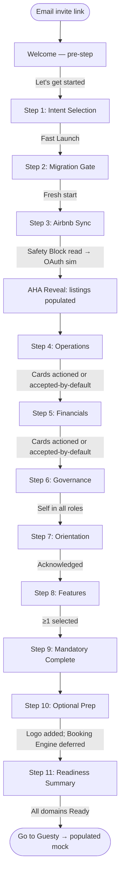
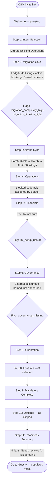
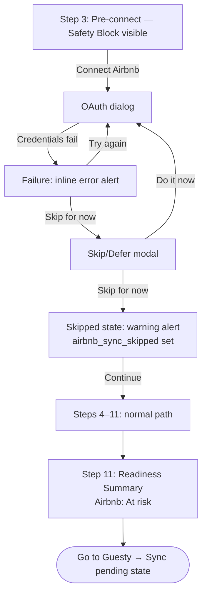

# UX Design Specification — Guesty Pro Onboarding Wizard

**Author:** Yair Cohen
**Date:** 2026-05-03

---

## Project Understanding

### North Star

A new Guesty Pro SMB customer should be able to prepare their account before
Call 1 without fear of breaking anything.

The prototype succeeds if the user:

1. Connects Airbnb in view-only mode.
2. Confirms key operational and financial defaults.
3. Captures migration complexity and launch context.
4. Understands what is ready, what is at risk, and what the specialist will review.
5. Books or arrives prepared for Call 1.

The prototype must never imply the customer is ready to go live.

---

### Success Criteria

**Primary activation KPI**

Airbnb view-only sync completed before Call 1. This is the only hard KPI for
the V1 prototype. A customer who completes Airbnb sync is not ready to go live —
they are no longer starting from zero.

**What "Ready for Call 1" means**

- Launch path selected.
- Migration gate answered.
- Airbnb view-only sync complete (or skip acknowledged with consequence visible).
- Operational and financial defaults confirmed or flagged.
- Governance owner captured.
- Feature interests selected.
- Review flags surfaced for the specialist.

**What it does not mean**

The account is live, integrated, configured for all OTAs, or migration-complete.

---

### Primary User

The primary user is an SMB owner-operator managing roughly 5–70 listings.

Design implications:

- They are time-poor. Steps must be directive.
- They are anxious about double-bookings. Every external-connection CTA requires
  explicit safety copy before the action.
- They often own admin, financials, and go-live approval simultaneously. The
  wizard must supply sequencing they would otherwise need a project manager to
  provide.
- They may work evenings and weekends. Save and resume must feel reliable and
  state-preserving.
- They may not know what matters before Call 1. The product must define readiness
  for them rather than asking them to self-assess.

---

### Core Product Principle

**The wizard is editable infrastructure, not education content.**

Every step must do at least one of three things:

1. Represent account configuration that would be written to the live account in production.
2. Capture decision context or risk signals for the specialist.
3. Reduce user uncertainty enough for them to safely continue.

Examples:

- Airbnb sync: simulates view-only sync state and reveals the account is no longer
  blank.
- Operations: surfaces Guesty's defaults; user confirms or edits.
- Financials: confirms assumptions or creates a reviewFlag for the specialist.
- Migration gate: captures complexity and risk; does not import anything.
- Owner prep: captures owner records only; sends no invitations.

---

### What the Wizard Does

- Scopes the first launch before asking the customer to configure.
- Resolves cold-start by showing the customer's real listings, bookings, and
  messages (via Airbnb view-only sync).
- Applies opinionated defaults so the customer confirms or edits instead of
  starting from blank.
- Captures migration complexity and routes it to the specialist via reviewFlags.
- Records governance ownership (who owns admin, financials, go-live approval).
- Captures feature interests to personalize Call 1.
- Produces a Readiness Summary that is legible to both the customer and the
  specialist.
- Ends with a platform handoff that lands on a populated homepage, not an empty
  dashboard.

### What the Wizard Does Not Do

- Imply the customer is ready to go live.
- Manage the full onboarding journey after Call 1.
- Execute a real migration from another PMS.
- Connect channels other than Airbnb (Booking.com, Vrbo, Expedia — Call 2 scope).
- Set up automated messaging, Guest App, tasks, or inbox.
- Send owner invitations.
- Provide a Review Mode UI for specialists (V2).
- Operate as a help center, learning module, or generic onboarding checklist.

---

### Key UX Challenges

1. **Cold-start to AHA in one sitting.**
   Airbnb view-only sync is the only hard activation KPI. The OAuth handoff,
   return state, and reveal are the make-or-break moment of V1.

2. **Role-collapse compensation.**
   No exec, admin, or champion to self-organize the work. The wizard must supply
   sequencing, defaults, mandatory/optional clarity, and a readiness definition
   the operator can trust.

3. **Safety copy before every external-connection CTA.**
   Before every Airbnb connection CTA, show a safety block that explicitly states:
   - Nothing will change on Airbnb.
   - Guesty is only reading listing data.
   - The user can continue even if the connection fails or is skipped.

   This block must reappear verbatim in failure and skip states.

4. **Progress communication without a progress bar or percentage.**
   ARC forbids a progress bar for step navigation. The PRD forbids "100% complete"
   and "you're done" language. Progress is communicated via a stepper sidebar and
   the Readiness Summary's five domain states only: Ready · At risk · Not started ·
   In progress · Needs review.

5. **Migration: capture and reassure without doing.**
   V1 captures migration complexity for the specialist; it does not import.
   When the timeline is tight (≤2 weeks) or the source is another PMS, the UI
   must simultaneously capture risk and reassure the user that the specialist
   will handle it — without dead-ending them.

6. **Save / resume that does not feel like a fresh start.**
   Return-after-leave is first-class. When Call 1 is not yet booked, the
   persistent Book Call 1 affordance must visually out-rank the generic
   "continue where you left off" resume copy.

7. **Dual-audience Readiness Summary.**
   The Readiness Summary is the only screen with two audiences: the customer
   reading it now, and the specialist reading it cold before Call 1. It must be
   legible to both without a separate UI.

8. **Posture discipline on every CTA, badge, and completion state.**
   Every state, badge, and CTA must avoid overclaiming readiness. Misrepresenting
   "Ready for Call 1" as "ready to go live" creates onboarding risk and
   downstream churn risk.

---

### Required Patterns

These are non-negotiable implementation-level rules derived from the PRD and
ARC design system.

**Step navigation**

Use a Stepper or Wizard component (vertical sidebar). Never use Tabs for
sequential wizard steps.

**Confirm-or-Edit default card**

The single highest-leverage pattern in the wizard. Shape:

> Question → Guesty default with reasoning → [Looks good] [Edit]

Primary use: Operations and Financials. Secondary use: Owner Prep only when
uploaded owner records are reviewed as editable rows.

**Safety block before external CTAs**

Any CTA that hands off to an external system (Airbnb OAuth, future channel
connections, future owner invitations) must be preceded by a safety block.
The Airbnb safety block text is canonical and must appear verbatim:

> "Nothing changes on Airbnb. We can only view your listings, reservations,
> and messages. We cannot change your pricing, calendar, availability, or
> listing content from this step."

**Skip / Defer modal**

Every skippable step follows the same modal pattern: plain-language consequence
statement, primary "do it now" CTA, secondary "skip for now" path. No support
dead-ends.

**Completion copy per mode**

- Operations and Financials (Alone + OB Review mode): "Saved. Your specialist
  will review these settings with you on Call 1."
- Governance, Interesting Features, Orientation (Alone mode): completion copy
  is self-contained; no "specialist will review" framing.

**Persistent Book Call 1**

Top-bar affordance, never buried inside a step. Book Call 1 is always visible
and contextually repeated when Call 1 is not booked. It may outrank generic
progress copy, but it must not visually overpower the active task CTA or
Resume CTA.

**Canonical CTA verbs**

Allowed: Continue · Connect Airbnb · Looks good · Edit · I'm all three ·
I'm ready — enter Guesty → · Go to Guesty → · Book Call 1 · Keep going ·
Save for review.

Forbidden: Complete setup · Go live now · Launch · You're done · 100% complete ·
You're fully ready.

**Forms**

Single-column, label-above-input, inline errors beside the field, focus first
error on submit, no placeholder-as-label. Use Checkbox (not Switch) inside any
save-submit form.

---

### Readiness + Handoff Model

The Readiness Summary is the only place where all five domain states appear
together, visible without extra navigation. It has two logical audiences:

**Customer view:** Where does my account stand? What will the specialist review?
Am I ready for Call 1?

**Specialist view (no separate UI in V1):** The same screen, read cold before
Call 1. Must surface: preset selected, migration mode, Airbnb sync status and
listing count, ops and financials status, active reviewFlags, governance owner,
feature interests, and top 3 recommended Call 1 focus areas.

Domain states: Ready · At risk · Not started · In progress · Needs review.
No percentages. No "100% complete."

ReviewFlags render as calm, color-coded chips — never destructive language.

---

### Locked Decisions

These decisions are set. They do not reopen during later design steps.

- **Completion mode per step (PRD Q3):** Operations and Financials use Alone +
  OB Review mode (specialist-review framing in completion copy). Governance,
  Interesting Features, and Rocketlane/Docebo Orientation use Alone mode
  (no specialist-review framing).
- **Telemetry in prototype:** Invisible. Events annotated in code and console
  only. The prototype must look production-clean.
- **Five presets:** Fast Launch · Migrate Existing Operations · Channel Sync
  Setup · Payments & Financials First · Team Operations Setup. Treated as given
  for V1.

---

### Prototype Constraints

These are implementation limits for V1, not permanent product decisions.

- Desktop-first only. No full mobile requirement.
- English-only.
- No real OAuth, no real API calls, no real emails.
- No real integrations (Salesforce, Rocketlane, Docebo, Airbnb, analytics
  pipeline).
- No WCAG certification. Basic accessibility primitives (semantic HTML, visible
  focus states, focus traps in modals, sufficient contrast tokens, keyboard-
  friendly navigation, reduced-motion support) honored where low-cost.
- Client-side simulated save only. No production persistence layer.

---

## Core User Experience

### Defining Experience

**Confirm-or-Edit is the product mechanic.
Airbnb reveal is the sales moment.
Step Loop is the navigation container.**

The wizard has one core loop and one set-piece. Everything else is a container.

**The defining experience is Confirm-or-Edit.**

If a user can describe to their friend in one sentence what makes the wizard
different, it is this: *"Guesty already knew most of the answers; I just
checked them."*

Confirm-or-Edit is the single highest-frequency interaction in V1. It runs
across:

- Operations (6 cards: cleaning model, cleaning window, inspection, min stay,
  check-in window, check-out time) — **primary use.**
- Financials (5 sections: fees, cancellation, revenue calc, payment automation,
  tax) — **primary use.**
- Owner Prep (uploaded owner records reviewed as editable rows, when present)
  — **secondary use, conditional on upload.**

It is also the pattern Guesty should reuse outside this wizard whenever the
product offers defaults the user must validate.

The AHA reveal is the **emotional peak** of V1; Confirm-or-Edit is the
**product mechanic**. Both must be perfect, but Confirm-or-Edit is what the
user does most.

**Set-piece: the AHA reveal.**

Not a loop. A single, scripted moment that runs once per account: empty
listings/calendar/inbox placeholders → simulated Airbnb sync → populated
listings, bookings, and messages. This is the only moment in the prototype
where motion is intentional and choreographed.

**Outer container: the Step Loop.**

The Step Loop (Welcome pre-step → 11 setup steps → Platform Handoff) is the
navigation shell, not the core experience. The builder should treat the Step
Loop as the frame and Confirm-or-Edit as the painting. If the Step Loop chrome
ever competes for attention with a Confirm-or-Edit card, the chrome loses.

---

### Confirm-or-Edit Detailed Specification

#### User Mental Model

**The user expects to be asked questions. We give them answers.**

The role-collapsed SMB owner-operator opens the wizard expecting one of three
mental models:

1. **The TurboTax model.** "Long form, plain-language questions, I answer one
   at a time." This is the closest correct expectation.
2. **The enterprise SaaS model.** "Empty dashboard with a hundred fields and
   tooltips. I don't know where to start." This is the model the wizard must
   replace.
3. **The Hostaway / Lodgify model.** "Settings buried under tabs and accordions.
   I'll figure it out by clicking around." This is the model the user is
   migrating from.

Confirm-or-Edit subverts all three. The user sees a question *and an answer*.
Their job is to validate, not author.

**The shift in the user's head:**

| What they expected | What they get |
|---|---|
| "Configure cleaning fee" | "Cleaning fee — $75. (Median for similar listings.) [Looks good] [Edit]" |
| "Set minimum stay" | "Minimum stay — 2 nights. (Most properties your size.) [Looks good] [Edit]" |
| "Pick cancellation policy" | "Cancellation — Moderate. (Balanced for most operators.) [Looks good] [Edit]" |

**Where the user gets confused** if we get this wrong:

- They click [Looks good] without reading the value (failure: confidence
  without comprehension).
- They hesitate because the reasoning is missing or behind a tooltip
  (failure: no trust in the default).
- They click [Edit] and lose flow because the editor takes them away from the
  card (failure: broken momentum).
- They cannot tell whether confirming saves, queues, or commits (failure:
  unclear feedback).

---

#### Success Criteria

The Confirm-or-Edit pattern succeeds when:

1. **The user understands the default in one read.** No re-reading, no tooltip
   hunt. Reasoning sits inline beside the value.
2. **Confirming takes one click or one keystroke.** Primary action button, or
   Enter when the card is focused. No save spinner on accept.
3. **Editing happens inline.** The card flips in place to show the appropriate
   ARC form control. The user does not navigate away.
4. **Saved feedback is silent and local.** A small saved-tick beside the
   confirmed card. No toast, no celebration.
5. **The next card auto-focuses after confirm or edit.** The user moves down
   the step without re-clicking.
6. **Skipping or leaving mid-step preserves all confirmed cards.** The user
   can close the tab and find their work intact on return.

**Builder tests** (observable, not vibes-based):

- Time-to-first-confirm on the first Operations card: < 10 seconds.
- Clicks to confirm an unedited default: 1.
- Edit flow structural clicks: no more than 1 explicit Save action after the
  value change; no separate navigation step required.
- Active **Default** or **Editing** cards visible at once: 1. Previously
  confirmed cards may remain visible above in **Confirmed** state.
- "Are you sure?" modals during a confirm or edit: 0.

---

#### Novel vs. Established Patterns

**Confirm-or-Edit is a familiar pattern in an unfamiliar density.**

It is not a novel invention. The pattern exists in:

- Stripe Dashboard (account setup, tax form pre-fill).
- TurboTax (proposed deductions, "we suggest…" prompts).
- Apple Wallet Pay setup (suggested defaults from card issuer).
- Some Shopify business setup steps (proposed shipping zones).

What is different is **density**. The wizard makes Confirm-or-Edit the
**dominant** mechanic, not an occasional convenience. The user sees ~14
Confirm-or-Edit cards in V1 across Operations and Financials.

**Adopt the pattern; do not invent novelty.**

- Use ARC **Card** as the container.
- Use ARC form controls inside editor mode.
- Use ARC **Button** for the confirm and edit actions.
- Use a small ARC saved-state indicator (badge/icon) for the confirmed state.
- Do not invent gesture controls, swipe-to-confirm, slider-to-accept, or
  similar novelty.

**No separate tutorial is required.** The first card must explain the pattern
through layout: recommended value as the headline, reasoning as secondary
text, and two clear actions. If the visual hierarchy is correct, the pattern
is self-explanatory.

---

#### Experience Mechanics

The full builder-level spec for one Confirm-or-Edit card.

##### Card Anatomy

Each Confirm-or-Edit card must contain all six elements in this order:

1. **Question label** — the setting name.
   Example: *"Cleaning model"*

2. **Recommended value** — the pre-selected default rendered as the primary
   visual, not as a form field.
   Example: *"Cleaning fee collected from guest"*

3. **Reasoning** — why this default, in plain language. Inline, never behind
   a tooltip.
   Example: *"This is the safest default for most short-term rental operators
   because it keeps cleaning cost visible and recoverable."*

4. **Confidence / source hint** — optional second line of context.
   Example: *"Recommended for Fast Launch accounts"* or *"Based on your launch
   path."*

5. **Actions** — two buttons in **Default** state; two buttons in **Editing**
   state (see Interaction below).
   - Operations default action: **[Looks good]** / **[Edit]**
   - Financials default action: **[Use this]** / **[Edit]**
   (Operations defaults are operational; the calmer "Looks good" fits. Financial
   defaults carry revenue consequence; "Use this" signals deliberate acceptance.)

6. **Saved / review state indicator** — replaces the action buttons in
   **Confirmed** state. Shows saved-tick for a clean confirm; shows ARC "Needs
   review" badge when a reviewFlag is captured (e.g. `tax_setup_unsure`).

---

##### States

A Confirm-or-Edit card has **five primary states**. Avoid adding states unless
they are required for validation, prerequisite handling, or review-flag
behavior.

1. **Default** — Rendered with recommended value, reasoning, and actions. Entry
   state.
2. **Editing** — User clicked [Edit]. ARC form control replaces the static value
   in place; reasoning remains visible.
3. **Saving** — Brief (≤300ms) visual transition while simulated save resolves.
   Prototype only; no real network call.
4. **Confirmed** — Final value visible with saved-tick (or "Needs review" badge
   for flagged inputs). A single [Edit] affordance available on hover/focus only.
5. **Skipped** (skippable cards only) — "Not started" muted treatment with
   [Set this later] available. Reached only via the step-level Skip/Defer modal.

---

##### Initiation

- The first card on a step **auto-focuses** on entry. The step headline appears
  above the card stack; nothing else competes for attention.
- Subsequent cards become focusable as the user advances. Only one card is in
  **Default** or **Editing** state at a time; confirmed cards above remain
  visible in **Confirmed** state.
- The user reaches each card via click on the card body, **Tab** from the
  previous card, or the auto-focus chain after confirm/edit.

---

##### Interaction

**In Default state:**

- Card body is keyboard-focusable. Focus is visible per ARC.
- Pressing **Enter** when the card is focused = confirm (equivalent to primary
  action button).
- Clicking the primary action button ([Looks good] or [Use this]) confirms.
- Clicking [Edit] enters **Editing** state.
- No custom keyboard shortcuts beyond **Tab**, **Enter**, **Esc**.

**In Editing state:**

- The card flips in place. ARC form control replaces the static value.
  Reasoning remains visible above or beside.
- Two buttons appear: **[Save]** (primary) and **[Cancel]** (secondary).
- Pressing **Enter** in the form field = Save (where Enter is not itself a
  form input, e.g. single-line text and select controls).
- Pressing **Esc** = Cancel (returns to **Default** or **Confirmed** state
  with the previous value, no change).
- **Save** triggers **Saving** → **Confirmed**.
- **Cancel** returns to previous state with no change.

**In Confirmed state:**

- Confirmed value is visible with saved-tick.
- A subtle [Edit] affordance is available on hover/focus, never as a
  primary call-out.
- Clicking [Edit] returns to **Editing** with the current confirmed value
  pre-loaded.

---

##### Feedback

What tells the user the system is responding:

- Hover and focus on action buttons: ARC default Button states.
- Click on primary confirm button: brief saved-tick animation (≤300ms) replaces
  the buttons. No spinner on accept.
- Click on [Edit]: card flips into **Editing** within 200ms. No loading state.
- Click on [Save] in **Editing**: button enters loading state ≤300ms, then card
  collapses to **Confirmed**. Saved-tick appears.
- After confirm or edit: focus moves to the next unconfirmed card.
- **Step-level:** A single ARC Toast ("Saved") fires once on step advance, not
  on every card confirm.

What tells the user they made a mistake:

- Invalid value in **Editing** state: ARC inline error beside the field. [Save]
  disables until valid.
- No invalid-value modals. No toasts for field errors. Inline only.

What does not happen:

- No spinner on primary confirm (instant visual only).
- No celebratory animation on confirm.
- No global toast per card (only per step on advance).

---

##### Completion

How the user knows they are done with a step:

The step can be continued when there are no invalid active edits or missing
required decisions.

On Continue:
- explicitly confirmed cards save as confirmed,
- edited cards save their edited value,
- untouched defaults save as accepted-by-default,
- "I'm not sure" answers create reviewFlags.

CTA structure (not combined button + copy):

```
Primary button:   Continue →
Supporting text:  Saved. Your specialist will review this on Call 1.
                  (Operations and Financials — Alone + OB Review mode only)
```

For Governance, Interesting Features, and Orientation (Alone mode):

```
Primary button:   Continue →
Supporting text:  (none, or step-specific completion note)
```

How the user knows they can leave mid-step:

- Saved-ticks on confirmed cards make it visually obvious work is preserved.
- Subtle "Progress saved automatically" hint at the bottom of the wizard shell
  is always visible.

---

##### Edge Cases

| Edge case | Behavior |
|---|---|
| User edits a previously confirmed card | Returns to **Editing** with current value. On Save, replaces the confirmed value. |
| User confirms, then wants to revisit an earlier card | Click any earlier **Confirmed** card → **Editing** with current value pre-loaded. |
| User starts editing, never saves, navigates away | **Editing** state is discarded. Card reverts to its previous state (**Default** or **Confirmed**) on return. |
| User edits to an invalid value | [Save] disables. ARC inline error beside the field. No modal, no toast. |
| User edits a card back to the default value | Card enters **Confirmed** with the default value and a saved-tick. No "you didn't change anything" warning. |
| Financial card answered "I'm not sure" (e.g. tax) | `tax_setup_unsure` reviewFlag captured. Card enters **Confirmed** with "Needs review" ARC badge instead of saved-tick. |
| User skips the entire step | Canonical Skip/Defer modal appears. Unconfirmed cards remain in **Default**. Sidebar shows the step as "In progress" if ≥1 card was confirmed, "Not started" if none were. |

---

#### What Confirm-or-Edit Is Not

To prevent builder drift:

- **Not a form field with a helper-text tooltip.** Reasoning sits beside the
  value in plain text, not in an icon-tooltip combo.
- **Not a wizard step on its own.** Multiple Confirm-or-Edit cards live inside
  one step (Operations has 6, Financials has 5).
- **Not a survey or a quiz.** No scored answers, no progress meters, no
  "you got X right."
- **Not a ChatGPT-style proposal flow.** The default is deterministic and
  explainable within the selected preset. It is not a freeform generated
  suggestion.
- **Not a per-listing detail editor.** Confirm-or-Edit operates at the
  account-default level. Per-listing fine-tuning is post-wizard work, framed
  on step completion as "Your specialist will fine-tune per listing later."

---

### Platform Strategy

**Target platform: desktop web only.**

- Primary input: mouse and keyboard.
- Minimum viewport: 1024 px wide. The prototype may render acceptably down to
  the ARC `lg` breakpoint, but is not certified for tablet or mobile.
- No native capabilities (camera, push, offline, file-system access). All
  uploads are simulated.
- No offline mode. The prototype assumes a stable connection; loss-of-network
  edge cases are out of V1 scope.
- Browsers: latest two versions of Chrome and Safari. Firefox/Edge acceptable
  but not stress-tested.

**Why desktop-only is acceptable for V1**

The primary user works at a desk during account setup (per persona research
and the role-collapsed owner-operator profile). Mobile entry to onboarding is
real for steady-state operations but rare for the 30-minute setup window the
wizard targets. Mobile is a V2 concern when this wizard expands to mid-market.

**Anti-goals for platform**

- Do not build responsive breakpoints below 1024 px.
- Do not build a mobile-app variant or a PWA wrapper.
- Do not introduce keyboard shortcuts beyond standard form behavior (Tab,
  Enter, Esc). Power-user shortcuts are a V2 concern.

---

### Effortless Interactions

Two interactions get the highest polish budget. All other interactions should
use standard ARC patterns unless they affect safety, readiness interpretation,
or specialist handoff clarity.

**1. Airbnb OAuth handoff + return + AHA reveal.**

The single moment where the prototype either sells the product or breaks trust.
Builder rules:

- Pre-OAuth: the verbatim safety block sits directly above the [Connect Airbnb]
  button. Below the button: secondary [I'll do this later].
- OAuth handoff: a simulated full-screen Airbnb-branded screen (no real OAuth)
  with the read-only scopes listed plainly ("View listings · view reservations ·
  view messages"). No write scopes appear anywhere.
- Return state: the user lands on a 2–3 second loading screen with progressive
  copy ("Reading your listings" → "Loading upcoming reservations" →
  "Loading guest messages"). A skeleton matches the upcoming layout.
- AHA reveal: the skeleton crystallizes into 2–3 listing cards with photo +
  name + city + active badge, plus a calendar showing 2–3 bookings, plus an
  inbox with 2–3 messages.
  Reveal headline: "Your Airbnb setup is now visible in Guesty."
  Sub: "Your listings, upcoming bookings, and recent guest messages are now
  visible here. Airbnb has not been changed."
- Reveal honors `prefers-reduced-motion`: with reduced motion, no transition;
  the populated state appears immediately without animation.
- Sidebar updates: the Connect Airbnb step gains a checkmark and the badge
  "Airbnb connected · view only."
- Failure path: same safety block reappears verbatim. Two CTAs: [Try again]
  and [I'll do this in my first session]. No support dead-end.

**2. Save & resume.**

The second moment where trust is earned or lost. Builder rules:

- Every step persists state on every Confirm or Edit action — not on step
  advance. The user can close the tab mid-step and not lose work.
- Returning to the wizard URL routes to `wizard.currentStep`. Confirmed cards
  in earlier steps display as confirmed without re-prompting.
- Resume copy on the welcome screen reads: "Welcome back. You left off at
  [Step Name]." A primary [Resume] CTA, secondary [Start over] (modal-confirmed).
- When Call 1 is not yet booked, the persistent Book Call 1 affordance remains
  highly visible in the top bar and is repeated contextually on the welcome/
  resume screen. It should not block, hide, or visually overpower [Resume].
- Skipped steps remain visibly incomplete in the sidebar with the "○ Not
  started" state. They do not disappear or auto-resolve.
- Mid-flow preset change (a known edge case): trigger a confirmation modal
  ("Changing your launch path will adjust later steps. Confirm?") and increment
  `presetRevisionCount` for the specialist's awareness.

**Anti-goals for effortless**

- Do not animate or polish step transitions, header, or sidebar collapse. Those
  are background chrome.
- Do not invest in Confirm-or-Edit beyond the rules above; once correct, it is
  correct.
- Do not add easter eggs, achievements, or celebratory animations on step
  completion. Save quietly. The AHA reveal is the only choreographed moment in V1.

---

### Critical Success Moments

The moments where the prototype either succeeds or fails, with the rule that
must hold for each to pass.

| # | Moment | Rule that must hold |
|---|---|---|
| 1 | First read of the welcome screen | The user understands within 5 seconds that this is preparation for Call 1, not full setup. Headline owns this: "Let's get your account ready for your first session." |
| 2 | Airbnb safety acknowledgment | The user understands that Airbnb will not be changed before clicking [Connect Airbnb]. If they skip, the modal must make the consequence clear without making the choice feel wrong. |
| 3 | OAuth → AHA reveal | The reveal lands with real-looking listings, a populated calendar, and visible messages. If any of the three is empty or stylized as fake, the moment fails. |
| 4 | Confirm-or-Edit on first use | The user understands within one card that the default is real, the reasoning is real, and confirming is one click. If they hesitate or ask "what is this default?", the pattern has failed. |
| 5 | Mandatory complete | The user reaches the mandatory-complete screen and feels they have done meaningful work, not busywork. Headline: "You're ready for your first session." Secondary CTA must offer optional prep without obscuring [Enter Guesty →]. |
| 6 | Readiness Summary read | The user reads the summary and (a) understands what their specialist will review, and (b) does not interpret any state as "I'm ready to go live." Both must hold. |
| 7 | Platform handoff | The Guesty homepage must appear populated after handoff. An empty homepage breaks the AHA-to-platform continuity and should be treated as a blocking prototype issue. |

---

### Experience Principles

Five principles, in priority order. When two principles conflict, the higher
one wins.

1. **Defaults over decisions.**
   The wizard offers an opinionated default with reasoning before it asks the
   user to choose. The user's job is to confirm or correct, not to author.

2. **Safety before action.**
   Every external-system CTA is preceded by an explicit, plain-language safety
   block. The block sits above the button, not in a tooltip, not in a footnote.
   Failure and skip states show the same safety block again.

3. **Save state, not steps.**
   State is durable; step completion is just a visible consequence of state.
   Returning users land on `currentStep` with confirmed earlier work intact.
   The user can never lose work by closing the tab.

4. **Two audiences, one screen.**
   The Readiness Summary serves both the customer and the specialist. Every
   element on it must be legible to both. If a label is meaningful only to one
   audience, it is in the wrong place.

5. **Posture beats persuasion.**
   "Ready for Call 1" never inflates into "ready to go live." This rule
   overrides marketing copy, completion celebration, and conversion instinct.
   When unsure, choose the more conservative claim.

---

## Desired Emotional Response

### Primary Emotional Goals

The core emotional posture is **calm confidence**, not delight or excitement.

Three emotions held throughout the wizard:

1. **Calm** — The user feels in steady hands. Nothing rushing them, nothing
   scolding them, nothing surprising them.
2. **Confidence** — The user trusts that Guesty knows what to recommend.
3. **Earned trust** — The user trusts that nothing they do in the wizard will
   damage their Airbnb account, bookings, or guests.

The distinction matters: confidence is about competence; earned trust is about
safety. Both must hold simultaneously throughout the wizard.

One emotion peaks once: **Recognition** at the AHA reveal — "this is actually
my business, inside this product." Calm not excitement; recognition not
surprise.

**Rejected emotions (intentionally):**

- Excitement / delight — overclaims, conflicts with "Ready for Call 1 ≠ ready
  to go live."
- Urgency / FOMO — would weaponize the role-collapsed user's time pressure.
- Pride or accomplishment on completion — wrong target. The user has not
  accomplished onboarding; they have prepared for it.
- Reassurance via cheerfulness — would feel like the product is hiding
  something. Calm is the right reassurance, not enthusiasm.

---

### Emotional Journey Mapping

The held emotion at each phase, and why it must hold there.

| Phase | Held emotion | Why it must hold |
|---|---|---|
| Welcome | Curiosity + permission | "I'm in the right place, and I'm allowed to take 30 minutes for this." |
| Intent + Migration gate | Permission to be honest | The user must feel safe answering "I'm migrating with a tight deadline" without fear of being judged or upsold. |
| Pre-Airbnb safety block | Provisional trust | Trust is offered, not yet earned. |
| OAuth handoff | Controlled anxiety | A real, transient anxiety. The product cannot eliminate it; it can only shorten it. |
| AHA reveal | Recognition | "This is my business, in here." Calm, not euphoric. |
| Confirm-or-Edit cards | Quiet productivity | Each card lowers the user's mental load. Saved-tick feedback confirms momentum. |
| Skip / Defer | Dignity | The user's "not now" is met as a deliberate choice, never as failure. |
| Mandatory complete | Earned readiness | Steady satisfaction, not celebration. |
| Readiness Summary | Operational confidence | "I know what's done, what's at risk, and what my specialist will handle." |
| Platform handoff | Continuity | The new home feels familiar because Airbnb is already there. |

---

### Micro-Emotions

Five emotional pivots that, if mishandled, undo everything else.

1. **Confidence vs. confusion** at the first Confirm-or-Edit card.
   Builder test: Does the user understand the default and its reasoning in one
   read?

2. **Trust vs. skepticism** at the Airbnb safety block.
   Builder test: Does the user understand what Guesty can and cannot do before
   clicking [Connect Airbnb]?

3. **Calm vs. anxiety** during the OAuth handoff and 2–3-second loading state.
   Builder test: Does the user wait, or do they reload the page?

4. **Permission vs. shame** at any Skip/Defer modal.
   Builder test: Does "Continue without syncing" read as a valid choice, not a
   punishment?

5. **Recognition vs. detachment** at the AHA reveal.
   Builder test: Does the user feel "this is mine," or "this is a demo of
   someone's data"?

---

### Design Implications

Each emotional goal maps to at least one builder-enforceable rule.

**Calm**

- No countdown timers, no "X minutes left" pressure copy.
- No interruptive modals except for safety acknowledgment and irreversible
  actions (preset change, start over).
- Saved-tick is silent and local. Toasts are short, neutral, non-blocking.

**Confidence**

- Defaults are pre-selected and clearly labeled as recommendations, with
  reasoning visible next to the value.
- Avoid dead empty states inside the wizard. Every screen should provide either
  a recommended default, a clear next action, or honest "Not started" copy.
- The user is never asked to author a value Guesty could have proposed.

**Earned trust**

- Avoid claiming trust with generic reassurance such as "safe," "secure," or
  "guaranteed." Trust is built by visible behavior: read-only scopes, plain
  safety copy, save-state durability, and honest skip consequences.
- Read-only Airbnb scopes are listed by name on the simulated OAuth screen.
- Failure copy reuses the same safety block verbatim.

**Recognition (AHA peak)**

- The reveal shows real-shaped data (listing photo, real city, real-looking
  message preview), not lorem ipsum.
- The headline and sub-copy are factual, not celebratory: "Your Airbnb setup
  is now visible in Guesty." / "Airbnb has not been changed."
- No confetti, no chime, no gradient burst. Calm reveal only.

**Dignity in skipping**

- Every skip path uses one canonical modal: consequence stated plainly, primary
  [Do it now], secondary [Skip for now]. No double-confirms, no "Are you sure?"
  theater.
- Skipped steps remain visible as "○ Not started" in the sidebar, never hidden.

**Continuity at handoff**

- The platform homepage that loads after [Go to Guesty →] shows the same
  synced Airbnb listings, visible upcoming bookings, and inbox previews the
  user just saw. Same data, new context.

---

### Emotional Design Principles

Five principles, in priority order. When two conflict, the higher one wins.

1. **Calm beats delight.**
   The product is preparing the user for a high-stakes operational change. The
   wrong emotional register (cheerful, celebratory, enthusiastic) breaks
   credibility. Calm is the design target.

2. **Earn trust, don't claim it.**
   Avoid claiming trust with generic reassurance such as "safe," "secure," or
   "guaranteed." When safety matters, explain the actual system behavior:
   read-only access, no Airbnb changes, visible scopes, and resumable state.

3. **Dignity over conversion pressure.**
   When a user chooses "not now," the product treats it as a real choice, not
   a problem to be corrected. Skip flows are designed for the dignified user,
   not the at-risk one.

4. **One peak, no spikes.**
   The AHA reveal is the only emotional peak in V1. All other moments —
   Confirm-or-Edit, save, step complete, mandatory complete, handoff — operate
   at the same calm baseline. No mini-celebrations, no "Way to go!" microcopy.

5. **Honest readiness over earned applause.**
   The Readiness Summary is honest — including "At risk," "Needs review," "Not
   started." The product never inflates its own state to make the user feel
   better. Calibrated honesty produces durable confidence; overclaim produces
   churn.

---

### Emotional Failure Modes

The experience fails emotionally if:

- The user feels pushed to connect Airbnb before understanding what changes.
- The user interprets "ready for first session" as "ready to go live."
- The user feels punished for skipping optional setup.
- The user returns later and sees lost or reset progress.
- The AHA reveal looks like fake demo data instead of their business.
- Completion copy celebrates too much and inflates the user's actual readiness.

---

### Forbidden Microcopy Register

The following phrases and patterns are out of register for V1. Builders should
treat them as lint failures.

- Celebration: "Awesome!", "You're crushing it!", "Way to go!", "Almost there!"
- Hype: "Let's go!", "Ready, set, go!", "Get pumped!"
- Celebratory emoji on completion (🎉, ✨, 🚀, 💪).
- False reassurance: "Don't worry," "No problem," "It's easy."
- Manufactured urgency: "Hurry," "Limited time," "Only X left."
- Overclaim: "Congratulations on completing setup," "You're all set,"
  "You're fully ready."

---

## UX Pattern Analysis & Inspiration

### How to Use These References

This section uses reference products as pattern sources, not visual direction.
Each reference is included only for the transferable UX mechanic it contributes.
Borrow the mechanic; do not borrow the skin.

---

### Reference Products

**1. monday.com — hybrid onboarding architecture (PRD-named benchmark)**

What they do well:

- The product owns much of the initial configuration through templates,
  defaults, and presets. The CSM owns scoping, validation, and governance.
- Onboarding is staged: scope first (which workspace template?), then
  configure with defaults, then hand off to the CSM for review.
- A clear separation between "what I'm building" and "who's helping me
  build it." The customer is never lost between product and human.

What we adopt:

- The build/review split: the wizard builds, the specialist reviews.
- Preset-driven scoping before configuration (our Launch Path mirrors this).
- Defaults applied first, asked-to-edit second.

What we explicitly do not adopt:

- Their permission/role complexity. Our user is role-collapsed; we do not
  need their team-assignment surface.
- Their breadth of templates. We have five presets, not fifty.

---

**2. Stripe Dashboard — operational setup and Confirm-or-Edit**

What they do well:

- Confirm-or-Edit at scale. Defaults are pre-selected, reasoning is
  visible, edits are inline.
- Calm, factual completion register. No celebration, no pressure.
- Save-and-return is invisible — it just works.
- Sensitive flows (bank account, tax form) get plain-language behavioral
  explanation above the action, not a wall of legal text.

What we adopt:

- Confirm-or-Edit visual pattern (default as primary state, reasoning beside).
- Calm completion register ("Saved" not "Awesome!").
- Plain-language behavior above the action, not reassurance claims.

What we adapt:

- Stripe assumes a financially literate user. Our Financials section must
  work for an SMB owner-operator who may consult an external accountant.
  We translate Stripe's competence-assumption into plain-language reasoning
  copy beside every default.

---

**3. Plaid Link — connection trust and scope transparency**

What they do well:

- Every permission is named in plain language on the consent screen ("View
  account balances", "View transactions"). No vague "access your account."
- Failure copy is calm, blame-neutral, and offers retry without a support
  dead-end.
- The consent screen is the single source of trust — not scattered
  reassurance copy across the surrounding product.

What we adopt:

- Scope-naming pattern on the simulated Airbnb OAuth screen ("View
  listings · view reservations · view messages"). No write scopes anywhere.
- Failure copy tone: "We couldn't connect…" not "Something went wrong."
- Retry-or-skip without forcing contact with support.

What we explicitly do not adopt:

- Plaid's branded hand-off animation. Our AHA reveal is the moment of
  trust, not the OAuth screen.

---

**4. Linear — calm cadence and dignified skipping**

What they do well:

- Calm, almost sparse register throughout. No celebration on step completion.
- Dignified skipping — every "skip for now" is a real choice, not a guilt
  prompt.
- Empty states are honest and informative, never blank.

What we adopt:

- Tone register baseline. Linear's onboarding is the closest-in-spirit
  reference for our copy.
- Skip-as-real-choice pattern (informs our canonical Skip/Defer modal).

What we adapt:

- Linear's user is a developer who already knows their domain. Our user is
  often translating between Airbnb language and Guesty language. We need
  more reasoning copy beside defaults than Linear provides.

---

**5. Shopify — SMB business setup progression**

What they do well:

- Turns abstract setup into concrete business readiness tasks.
- Makes progress feel tied to the user's actual business, not generic
  product education.
- Business-artifact progression: each completed task produces something
  real (a product page, a payment method, a domain) — not just a checked
  box.
- Keeps the setup path accessible from the main product without trapping
  the user inside onboarding.

What we adopt:

- Business-artifact progression: listings, bookings, messages, defaults, and
  readiness become visible proof of setup (our equivalent of "your store is
  taking shape").
- Persistent return path to onboarding from the main product.

What we explicitly do not adopt:

- Launch-oriented language. Guesty Pro V1 prepares for Call 1; it does not
  launch the business.
- Commerce metaphors ("publish," "go live," "your store is open").

---

**6. TurboTax — guided high-stakes decision flow**

What they do well:

- Breaks complex domain decisions into plain-language questions.
- Explains why a question matters before asking for input.
- Lets users answer progressively without needing to understand the full
  system upfront.
- Review-before-submit summary that is readable to a non-expert.

What we adopt:

- Question-first structure for Financials and Migration Gate.
- Plain-language reasoning beside every default.
- Review-oriented summary before handoff (our Readiness Summary).

What we explicitly do not adopt:

- Long interview flow feeling. Our wizard is modular; it does not feel like
  a filing session.
- Fear-based compliance copy.
- "We found savings" type celebration.

---

**7. Atlassian / Trello / Asana — preset-as-scoping-decision**

What they do well:

- Preset selection upfront sets the entire downstream experience. The user
  is never asked to author from scratch.
- Each template communicates "what you'll build" before asking for input.

What we adopt:

- Preset-as-scoping-decision pattern (Launch Path step).
- Recap-after-selection copy: "Selected: Fast Launch · Your answer changes
  what we show next."

What we explicitly do not adopt:

- Visual-heavy template galleries with screenshots and animations. Our
  preset tiles are text-led: name, description, who it's for. Five tiles,
  visible without scrolling.

---

**8. Hostaway / Lodgify / Booking.com Extranet — PMS anti-patterns**

These are products the user is migrating from or operating alongside.
They define what to avoid.

Anti-patterns observed:

- **Listing/property/unit taxonomy confusion.** Multiple labels with unclear
  hierarchy surfaced across search, filter, and settings without explanation.
  Users in persona research describe "I can never tell where my unit lives."
  *Rule:* Use one label per concept consistently. "Listings" for bookable
  units. "Property" only when a multi-unit complex is explicitly introduced.

- **Cluttered first-run dashboards.** New accounts land in a fully-featured
  enterprise UI with empty modules, badges, and counters at zero.
  *Rule:* The post-handoff Guesty homepage must inherit the same Airbnb
  data the user just saw in the wizard. The user must never move from a
  populated onboarding story into an empty product.

- **Channel connection success without operational proof.** Connect flows
  that succeed visually but silently fail to sync. Users discover the
  failure via guest complaints.
  *Rule:* A connection is not "done" until the user sees the synced objects
  that matter: listings, upcoming bookings, and recent messages. Partial
  populate = failure state, not success.

- **Help links that exit the product.** Setup help that routes to a
  separate Help Center URL, breaking flow.
  *Rule:* All help in V1 is inline. Reasoning copy sits beside the input.
  No mid-wizard external link that leaves the product.

- **Save-and-return that loses state.** Multi-step setup forms that lose
  inputs when the tab closes.
  *Rule:* State persists on every Confirm or Edit, not on step advance.
  The user can never lose work by closing the tab.

---

**9. Google Ads / Meta Ads setup — conversion-pressure anti-patterns**

Anti-patterns observed:

- Setup flows optimize for activation over user confidence.
- Defaults are framed as easy, but their operational consequences are
  unclear.
- Skipping recommended setup feels like degrading the account.
- Completion language implies readiness before the user understands what
  has been configured.

*Rule:* The Guesty wizard must never optimize conversion at the expense of
operational understanding. Defaults can be opinionated, but the consequence
of accepting, editing, or skipping must remain visible at all times. This
is the design-level enforcement of "Posture beats persuasion."

---

### Transferable UX Patterns

Six patterns we adopt, each with its specific builder mapping.

| # | Pattern | Source | Where it applies in V1 |
|---|---|---|---|
| 1 | Hybrid build/review | monday.com | The whole wizard architecture; codified in "Alone + OB Review" mode for Operations and Financials. |
| 2 | Confirm-or-Edit default cards | Stripe Dashboard | Operations (6 cards) and Financials (5 sections). The single highest-frequency pattern in V1. |
| 3 | OAuth scope transparency | Plaid Link | Pre-Airbnb safety block + the simulated Airbnb consent screen. Read-only scopes named in plain language. |
| 4 | Dignified skipping | Linear | Canonical Skip/Defer modal applied to every skippable step (Airbnb skip, governance skip, financial skip, optional prep). |
| 5 | Preset-as-scoping-decision | Atlassian / Asana | Launch Path step, with recap-after-selection copy. |
| 6 | Business-artifact progression | Shopify | Listings, upcoming bookings, messages, and readiness states as visible proof of work, not just checked boxes. |

---

### Pattern Mechanics

For each adopted pattern, the builder should preserve the underlying mechanic,
not the surface styling.

| Pattern | Mechanic to preserve | Failure mode |
|---|---|---|
| Hybrid build/review | Product lets the customer prepare safely; specialist validates risk and edge cases on Call 1. | Wizard becomes passive education or fake self-serve go-live. |
| Confirm-or-Edit | User validates a proposed default instead of authoring from scratch. Reasoning is visible next to the value. | Card becomes a form field with helper text. User must author, not confirm. |
| OAuth scope transparency | User sees exactly what data Guesty can read before connecting. No vague claims. | Consent screen is a black box with a "We keep your data safe" generic claim. |
| Dignified skipping | User can defer without shame; consequence remains visible in sidebar and Readiness Summary. | Skip feels like failure, or skipped steps disappear from readiness. |
| Preset-as-scoping | One early answer changes later defaults and required context. Recap confirms the choice has consequences. | Preset becomes decorative with no downstream effect on step order or defaults. |
| Calm completion | Completion confirms saved state, not emotional achievement. | UI celebrates prep as if onboarding is complete. |
| Business-artifact progression | Completed steps produce visible business objects (listings, bookings, messages, defaults). | Completion is abstract — checkboxes only, no proof of what exists. |

---

### Anti-Patterns to Avoid

Consolidated reference. Every anti-pattern has the rule that prevents it.

1. **Taxonomy confusion.** Multiple labels for the same concept.
   *Rule:* One label per concept, consistently.

2. **Empty enterprise dashboard at first load.**
   *Rule:* Post-handoff homepage shows synced Airbnb data. Never cold.

3. **OAuth success without operational proof.**
   *Rule:* Connection confirmed only when listings, bookings, and messages
   are all populated. Partial = failure state.

4. **Help that exits the product.**
   *Rule:* All help is inline in V1. No mid-wizard external links.

5. **Save-and-return that loses state.**
   *Rule:* State persists on every Confirm or Edit, not on step advance.

6. **Onboarding theater** (confetti, achievements, level-ups).
   *Rule:* The AHA reveal is the only choreographed moment. All other
   completion states are quiet.

7. **"Are you sure?" theater on every irreversible-feeling action.**
   *Rule:* Confirmation modals for genuine consequence only (preset change,
   start-over). Skip is one click with a single consequence-stating modal.

8. **Conversion pressure** (urgency, scolding defaults, punitive skips).
   *Rule:* Consequence of accepting, editing, or skipping must remain
   visible. Never optimize for completion rate at the expense of
   operational understanding.

---

### Design Translation Rules

When borrowing from references, these rules govern what transfers.

1. **Borrow mechanics, not aesthetics.**
   Stripe's calm setup logic matters; Stripe's exact visual system does not.

2. **Borrow trust behaviors, not trust language.**
   Plaid works because it shows scopes clearly, not because it says "secure."

3. **Borrow pacing, not complexity.**
   monday.com's hybrid onboarding model matters; its team/permission
   complexity does not.

4. **Borrow restraint, not emptiness.**
   Linear's sparse register is useful, but Guesty needs more domain
   explanation because the user is less domain-fluent than a developer.

5. **Borrow setup proof, not launch pressure.**
   Shopify's business-artifact progression is useful only if it reinforces
   Call 1 readiness, not go-live readiness. "Your business is taking shape"
   maps to "you are ready for your first session," not "go live."

6. **Borrow question-first structure, not interview length.**
   TurboTax's plain-language question + reasoning-before-answer model is
   useful for Financials and Migration Gate. The filing-session pacing is
   not.

---

### Module-by-Module Inspiration Strategy

**Welcome screen**
Adopt: Linear's calm sparse register. Stripe's plain-language framing.
Avoid: Slack-style hero illustration with "Welcome to your new workspace!"

**Launch Path (Intent Selection)**
Adopt: Atlassian's preset-as-scoping-decision. Recap-after-selection copy.
Adapt: Text-led tiles only. Five tiles, all visible without scrolling.
Avoid: Template galleries that imply parity across presets.

**Migration Gate**
Adopt: TurboTax's question-first + reasoning model. Linear's dignified skipping.
Adapt: For tight-timeline + complex-source combinations, surface specialist
review as proactive reassurance, not as a warning.
Avoid: Migration import flows that promise to "do it for you." V1 captures
context; it does not migrate.

**Airbnb Connect + AHA Reveal**
Adopt: Plaid Link's scope transparency. Stripe's plain behavior copy.
Adapt: The reveal is our one exception to Linear's no-celebration rule.
Avoid: OAuth that succeeds visually and fails silently. Lorem ipsum data.

**Operations / Financials (Confirm-or-Edit)**
Adopt: Stripe's Confirm-or-Edit card pattern. TurboTax's reasoning-beside-default.
Adapt: Add plain-language domain reasoning — our user is less domain-fluent
than Stripe's typical user.
Avoid: Empty templates that ask the user to author from scratch.

**Governance**
Adopt: monday.com's role-capture model, simplified to one-person default.
Adapt: Multi-person path is secondary ([Add different people →]), never the
default.
Avoid: Permission matrix UIs. Out of scope for our role-collapsed user.

**Orientation (Rocketlane + Docebo)**
Note: Orientation is not inspired by Rocketlane/Docebo UX. It acknowledges
their existence as tools the user will use later, without routing the user
there in V1. The pattern is acknowledgment-only; there is no UX reference
product here.

**Readiness Summary**
Adopt: monday.com's review surface framing. TurboTax's pre-submit review
structure.
Adapt: Domain states (Ready / At risk / Not started / In progress / Needs
review) instead of percentages. Dual audience (customer + specialist).
Shopify's "this is your business taking shape" as emotional underpinning.
Avoid: Marketing-style "You're all set!" summaries.

**Platform Handoff**
Adopt: Stripe's invisible cross-product transition. Shopify's "your business
exists now" moment.
Adapt: Familiarity comes from the synced Airbnb data, not from prior Guesty
knowledge.
Avoid: Empty homepages. Re-onboarding loops after handoff.

---

## Design System Foundation

### 1.1 Design System Choice

**Guesty ARC** (`@guestyci/arc`) is the sole design system foundation for the
V1 prototype.

There is no parallel evaluation of Material Design, Ant Design, Chakra, or a
custom system. The prototype is a Guesty product surface; it must read as
Guesty to internal stakeholders and to the specialist who will review the
output alongside live Guesty UI.

**Believability inside Guesty is the job.** Visual originality is not.

The prototype may introduce new **product patterns** (such as Confirm-or-Edit),
but only as **compositions of ARC primitives** — not as new visual components,
not as a theme fork, and not as bespoke styling outside semantic tokens.

---

### Design System Non-Negotiables

- Use ARC components before creating any custom UI.
- Use ARC semantic tokens before using raw values.
- Do not create new **visual variants** of ARC components (no forked Button,
  no custom Card elevation system, no alternate color ramp).
- Custom **compositions** are allowed when built entirely from ARC primitives,
  documented variants, and semantic tokens — this is how Confirm-or-Edit,
  Readiness Summary tiles, and the AHA reveal layout are built.
- If ARC and a product concept disagree, **adapt the concept** before forking
  ARC.
- If a custom composition is needed, it must still be built from ARC
  primitives.

---

### Rationale for Selection

1. **Speed without drift.** The prototype proves interaction mechanics
   (Confirm-or-Edit, OAuth trust, save/resume, Readiness Summary), not a second
   visual language. ARC supplies Stepper, Dialog, Form, Card, Toast, Skeleton,
   Spinner, Alert, Badge, and Table with documented behaviors.

2. **Handoff continuity.** The post-wizard Guesty homepage mock must visually
   match the wizard chrome. Same tokens, same components, same density. A
   foreign design system breaks the AHA-to-platform continuity the PRD requires.

3. **Enforcement alignment.** `component-enforcement-rules.md` defines Critical
   violations (Tabs for sequential workflows, Switch in save-submit forms,
   Toast for actionable errors, etc.). Building outside ARC would produce a
   prototype that fails its own design review.

4. **Single source of truth.** The UX guidelines knowledge base defines ARC as
   canonical: Figtree typography, semantic `gst-*` tokens, 32+ documented
   component behaviors. The prototype inherits these rules rather than
   inventing parallel ones.

**ARC owns the visual language; this spec owns the interaction logic.**

---

### Implementation Approach

**Component sourcing**

- Import primitives from `@guestyci/arc` per the Nebula / Livebook component
  inventory referenced in `component-index.md`.
- Use documented variants only.

**Layout shell**

- Vertical **Stepper** in the sidebar for sequential navigation (per ARC
  governance: "Vertical > Horizontal" for primary module nav).
- Single-column main content area. No horizontal **Tabs** for wizard steps.
- Top bar: wizard title + persistent Book Call 1 affordance + optional
  account context (read-only).

**Typography**

- Figtree (`font-sans`) at the scale defined in `component-index.md`. Headings
  follow documented h1–h4 responsive steps.

**Color / tokens**

- Semantic tokens only (`primary`, `destructive`, `border`, `muted`, etc.).
- Use `gst-*` utilities as documented. Do not introduce raw hex except where
  ARC documents known Figma/code drift (treat drift as advisory, not permission
  to freestyle).

**Motion**

- `prefers-reduced-motion` honored on the AHA reveal and any Skeleton shimmer.
- No custom animation library beyond ARC transitions.

**Forms**

- ARC **Form** + **Input** + **Select** + **Checkbox** + **Radio** + **Textarea**
  per `form.md`.
- **Checkbox** (never **Switch**) inside any save-submit flow per enforcement
  rules.

**Feedback**

- **Inline Alert** for actionable corrections (per enforcement: not Toast).
- **Toast** for transient, non-blocking confirmations only.
- **Skeleton** for data-fetch loading; **Inline Spinner** for user-action
  processing; **PageSpinner** only if the entire wizard shell reloads — never
  inside a step for partial content.

**Overlays**

- **Dialog** for Skip/Defer and ≤5-field sub-tasks.
- **Alert Dialog** for destructive confirmations (preset change mid-flow,
  start-over from welcome).
- **Drawer** / **Sheet** for optional deep-dive (e.g. "see all fee types")
  without leaving the step context.

**Density**

- Use ARC standard density, but bias toward **generous spacing** inside wizard
  content. The wizard is a guided setup surface, not an operational dashboard.
  Cards should feel scannable, not compressed.

**Icons**

- Icons are **functional**, not decorative. Use icons only to clarify status,
  safety, connection, or completion.
- No celebratory icons on step completion. No custom icons outside the ARC icon
  set.

---

### Pattern-to-ARC Mapping

| Product pattern | ARC foundation |
|---|---|
| Wizard step navigation | Vertical **Stepper** |
| Confirm-or-Edit card | **Card** + **Form** controls + **Button** + local saved-state indicator |
| Airbnb safety block | **Alert** (inline / persistent region) |
| Simulated OAuth loading | **Skeleton** + **Inline Spinner** |
| Skip / Defer flow | **Dialog** |
| Preset change confirmation | **Alert Dialog** |
| Readiness Summary | **Card** + **Badge** / **Tag** + **List** / **Table** |
| Review flags | **Badge** / **Tag** / **Status** (per semantic role) |
| Platform handoff homepage | ARC page shell + **Card** + **List** / **Table** |

Custom compositions are allowed, but they must be built from ARC primitives,
documented variants, and semantic tokens.

---

### Readiness Status Treatment

Readiness states must use ARC **status** / **badge** / **tag** patterns and
semantic tokens only. Do not invent custom red/yellow/green ramps.

| Readiness state | ARC treatment |
|---|---|
| Ready | Positive / success semantic treatment |
| At risk | **Warning** — calibrated, not alarming. Never **destructive** unless a true blocking error exists. |
| Needs review | Warning or neutral informational — pick whichever ARC documents for "attention needed without crisis" |
| In progress | Informational / neutral |
| Not started | Muted / neutral |

Do not use **destructive** styling for "At risk" or skipped steps. Destructive
is reserved for irreversible user actions (e.g. start-over confirmed), not for
readiness posture.

---

### Known ARC Violations to Avoid

- Do not use **Tabs** for the 11-step wizard sequence. Use **Stepper**.
- Do not use **Switch** inside save-submit forms. Use **Checkbox** / **Radio** /
  **Select** per semantics.
- Do not use **Toast** for errors that require user action. Use **Inline Alert**.
- Do not hide required reasoning behind **Tooltips**. Reasoning belongs beside
  the value on the Confirm-or-Edit card.
- Do not introduce custom color-coded statuses outside ARC semantic tokens.
- Do not create celebratory completion treatments outside the **AHA reveal**
  set-piece.
- Do not use **Progress bar** for step progress (per ARC: progress bar is for
  determinate operations, not wizard steps).

---

### Customization Strategy

**What is customized in V1**

- **Copy only** — headlines, reasoning text, safety blocks, domain labels.
  Follows the emotional register and forbidden microcopy register defined
  earlier in this spec.
- **Layout composition** — which ARC components appear in which order inside
  each step. No new component variants.
- **Mock data shape** — listing cards, calendar rows, inbox messages populated
  with realistic fake data matching ARC **Card** / **Table** / list structures.

**What is not customized in V1**

- No new color tokens, typography scale, radii, shadows, or icon set.
- No "Guesty Pro wizard theme" fork of ARC.

**Future (post-V1)**

- Brand campaign layers, illustration, and motion choreography beyond ARC
  defaults ship after interaction mechanics are validated.

**Accessibility (V1 vs. production)**

- Formal **WCAG certification** and **full responsive expansion** are post-V1
  production concerns.
- V1 must still preserve **basic accessibility primitives**: semantic structure,
  visible focus states, keyboard navigation, focus traps in dialogs,
  token-based sufficient contrast, and `prefers-reduced-motion` support.

---

## Visual Design Foundation

V1 does not define a bespoke visual identity. All color, typography, spacing,
radii, shadows, and iconography come from **Guesty ARC** semantic tokens and
documented component defaults.

The job is not to invent a visual system. The job is to make the wizard read as
a trustworthy Guesty surface while the **interaction spec** (Confirm-or-Edit,
readiness, AHA) does the real work.

---

### Visual Hierarchy Rules

On every wizard step, visual priority must follow this order:

1. Step headline and short orientation copy.
2. Active task or active Confirm-or-Edit card.
3. Primary CTA.
4. Saved / readiness feedback.
5. Sidebar Stepper and shell chrome.

If sidebar chrome, badges, secondary actions, or decorative elements compete
with the active card, **reduce their visual weight** — smaller type, muted
tokens, less contrast, or collapse non-essential chrome until the active card
wins.

**Decision rule:** When in doubt, the **Confirm-or-Edit card** or the **active
external-connection surface** (Airbnb) wins. Everything else is quiet.

---

### Color System

**Source of truth:** ARC semantic tokens (`primary`, `destructive`, `border`,
`muted`, `background`, `foreground`, success / warning / informational
treatments per component docs). Use `gst-*` utilities as documented in
`component-index.md`.

**Wizard-specific application:**

- **Primary actions** — `primary` token for [Continue →], [Connect Airbnb],
  [Looks good] / [Use this], [Save].
- **Secondary actions** — `outline` or `secondary` Button variant per ARC.
- **Destructive** — reserved for **true data-loss actions** (e.g. **Start over**
  after explicit confirmation). **Preset-change** uses **Alert Dialog** because
  it has downstream consequences, but **must not use destructive styling**
  unless confirmed work will actually be discarded — treat as consequential,
  not automatically destructive.
- **Readiness states** — map to ARC semantic treatments per the Readiness
  Status Treatment table in Design System Foundation. **At risk** uses
  **warning** — calibrated, not alarming. No custom red/yellow/green ramps.
- **Airbnb safety block** — `Alert` variant that reads as informational +
  caution, not error-red (the user has done nothing wrong).

**Emotional alignment:** Calm confidence. The palette must never spike toward
celebration colors on step completion. The AHA reveal is the only moment where
success treatment may be slightly more prominent — still within ARC success
tokens, no custom gradients.

---

### Typography System

**Source of truth:** **Figtree** (`font-sans`) at the scale defined in
`component-index.md` (h1–h4 responsive steps, body, caption).

**Wizard-specific application:**

- **Step headlines** — one step title per screen (H3 or H4 per ARC modal /
  page hierarchy rules; never above H3 inside a Dialog).
- **Card question label** — body semibold or label style per ARC Form label
  pattern.
- **Recommended value** — body large or emphasized body (largest text on the
  Confirm-or-Edit card after the step headline).
- **Reasoning** — body regular, muted foreground token (`muted-foreground` or
  ARC equivalent).
- **Confidence / source hint** — caption or small body, muted.
- **Safety block** — body regular; the verbatim Airbnb safety text must be
  fully readable without zooming below 100% at 1024px viewport.

**Tone through type:** **Factual hierarchy, not marketing hierarchy.** No
all-caps headlines, no oversized hero type on internal wizard steps.

---

### Spacing & Layout Foundation

**Grid:** ARC standard 4px base unit. Use documented spacing scale only.

**Wizard shell layout:**

- **Sidebar Stepper** — fixed width per ARC Stepper documentation (follow ARC
  example layouts).
- **Main content** — single column, max readable width per ARC patterns
  (`max-w-2xl` or equivalent) with consistent horizontal padding from shell
  edge.
- **Vertical rhythm** — generous gap between Confirm-or-Edit cards (minimum
  one full spacing step above ARC default dense stacks — follow ARC `gap-*`
  tokens, never arbitrary pixel gaps).
- **Sticky bottom CTA** — allowed on long steps so [Continue →] is always
  reachable, but the bar **must not cover card content**, must not introduce
  urgency copy or animation, and must not visually compete with the active
  card. It reads as **persistent utility**, not a sales banner.

**Density rule:** Standard ARC density in the shell chrome; **generous**
density inside wizard content. The wizard is guided setup, not an operational
dashboard.

---

### Confirm-or-Edit Visual Treatment

- The **recommended value** is the **visual anchor** of the card — largest
  typographic weight after the step headline.
- **Reasoning** appears **directly below or beside** the value, never hidden
  behind an icon-only affordance.
- **[Use this]** / **[Looks good]** and **[Edit]** are the only visible actions
  in **Default** state.
- **Confirmed** cards may **compress slightly** (reduced vertical padding) but
  must remain **fully readable** — never faded to illegibility.
- **Confirmed** cards should feel **complete**, not **disabled** — no
  greyed-out "inactive" treatment that implies the setting no longer applies.
- **"Needs review"** uses **Badge** / **Tag** warning or neutral-informational
  treatment per ARC — **never error / destructive** styling.
- **Saved feedback** is local and quiet: small icon or badge only — **no color
  spike**, no flash animation beyond a brief (≤300ms) tick.

---

### AHA Reveal Visual Treatment

The AHA reveal is the **only** moment allowed to feel visually elevated —
still entirely inside ARC.

- Start from **Skeletons** that match the final populated layout (listings,
  calendar, inbox regions).
- Reveal **listings, upcoming bookings, and messages** as **real-shaped data**
  — the populated content **is** the visual payoff.
- Apply **success** treatment **sparingly** — e.g. on the "Airbnb connected ·
  view only" badge or a slim success `Alert` strip — **not** across the full
  viewport as a hero wash.
- **No** confetti, illustration burst, gradient celebration, or oversized
  success hero.
- **No** marketing headline treatment larger than the documented heading scale
  allows for this surface.

**Rule:** The data is the celebration.

---

### Not Started / Skipped Visual Treatment

- **Not started** — muted neutral foreground and background tokens. Readable
  but clearly deprioritized vs. active work.
- **Skipped optional work** — remains **visible and calm** in the sidebar and
  Readiness Summary. Never hidden as if it did not happen.
- **Never use error or destructive styling** for skipped, deferred, or "At
  risk" readiness posture — those are **informational or warning** states, not
  moral failures.
- Do **not** collapse skipped sections in a way that removes them from the
  Readiness Summary — skipped must still surface as honest state.

This is the visual enforcement of **Dignity over conversion pressure**.

---

### Accessibility Considerations

These primitives are **required** for V1:

- Semantic HTML structure (headings in order, `button` vs `a` per ARC
  enforcement).
- Visible focus rings on all interactive elements.
- **Tab**, **Enter**, **Esc** keyboard paths through Confirm-or-Edit, Dialogs,
  and the Stepper.
- Focus trap in all Dialog and Alert Dialog instances.
- Token-based contrast — do not override ARC foreground/background pairs with
  custom colors.
- `prefers-reduced-motion` on AHA reveal and Skeleton shimmer.

**Full accessibility audit, WCAG certification, and responsive accessibility
testing** are post-V1 production scope — but the primitives above are not
optional within the prototype.

---

## Design Direction Decision

### Context

V1 has no bespoke visual identity. ARC owns color, type, and spacing. The
design direction decision is therefore a **structural and layout question**,
not a visual identity question:

*How does the Wizard shell organize the three competing surfaces — Stepper
sidebar, main step content, and persistent top-bar affordances — in a way that
centers the Confirm-or-Edit card and the Airbnb AHA reveal without creating
visual competition?*

Three viable directions were evaluated.

---

### Design Directions Explored

**Direction A — Fixed sidebar + full-width content well**

Layout: Persistent vertical Stepper sidebar (fixed, left-anchored). Main
content occupies the remaining viewport as a single constrained column
(`max-w-2xl`, centered or slight-left offset). Top bar spans full width.

Character: Closest to a standard enterprise wizard shell (Atlassian,
monday.com). The sidebar is always visible; the user can see the full step
list and their position at all times. Heavy on chrome; lighter on content
focus.

Tradeoffs:
- Pro: Strong "where am I?" orientation; matches operator mental model of
  working inside a structured tool.
- Con: Sidebar competes visually with content on narrow desktops; AHA reveal
  has less horizontal real estate for the listing card grid.

---

**Direction B — Collapsible sidebar + focus mode**

Layout: Sidebar starts expanded during navigation; collapses to an icon rail
during active Confirm-or-Edit or the AHA reveal step. Main content expands
to use the freed width during focus moments.

Character: Closer to Linear or Notion's "focus while working" pattern.
The product communicates intent dynamically through the layout.

Tradeoffs:
- Pro: Maximum content focus on the steps that matter most (AHA reveal,
  Operations, Financials).
- Con: Sidebar state transitions add builder complexity; collapsing the
  Stepper may confuse users who want persistent orientation. Risks hiding
  the "where am I?" signal precisely when users are deepest in work.

---

**Direction C — Persistent sidebar + contained content panel**

Layout: Persistent vertical Stepper sidebar (fixed, left-anchored). Main
content lives inside a contained **content panel** (not a card) visually
inset from the viewport edge on all sides. The panel creates visual focus,
but the page uses **native browser scrolling** wherever possible. The outer
panel uses subtle containment — not heavy card styling — so Confirm-or-Edit
cards remain the primary card objects inside it.

Character: Closest to Stripe's account setup or Shopify's onboarding setup
panel. The "wizard as a focused document, not a full-page dashboard" posture.
The step content feels like a curated workspace inside a larger shell.

Tradeoffs:
- Pro: Strong alignment with calm-confidence posture; content panel's generous
  padding enforces the density rule without extra work; panel containment
  matches the Confirm-or-Edit card-stack shape naturally; AHA reveal can
  use an expanded panel variant cleanly.
- Con: Wide steps (Readiness Summary, AHA reveal) need documented width
  variants; these outlier steps require a named override.

---

### Chosen Direction

**Direction C — Persistent sidebar + contained content panel.**

**Rationale:**

1. **Emotional alignment.** The contained panel reinforces calm-confidence
   posture. The user is not in a full-page enterprise product; they are working
   inside a focused, scoped setup surface. The containment communicates
   "this is a bounded, manageable task."

2. **Confirm-or-Edit fit.** The card-stack of Confirm-or-Edit cards lives
   naturally inside a contained panel with generous padding. The stack reads
   as a curated checklist rather than a form dump.

3. **AHA reveal fit.** The panel switches to a documented expanded-width
   variant on the AHA reveal step, making the populated listings, calendar,
   and inbox feel like a reveal into a larger world — a deliberate contrast to
   the contained panel that precedes it.

4. **Orientation at all times.** The persistent sidebar keeps the step list
   visible throughout; unlike Direction B, the user always knows where they
   are.

5. **Builder simplicity.** No dynamic sidebar collapse logic. One layout shell
   handles all steps, with two documented named variants (AHA expanded, wide
   panel for Readiness).

---

### Implementation Approach

**Default layout (all steps except AHA reveal and Readiness Summary):**

```
┌──────────────────────────────────────────────────────────────────┐
│  Top bar: wizard title · [Book Call 1]  (persistent utility)     │
├────────────────────┬─────────────────────────────────────────────┤
│  Sidebar Stepper   │   Content panel (max-w-2xl, inset, native  │
│  (fixed, ~w-64)    │   page scroll)                              │
│  ─ visual secondary│                                             │
│  1. ✓ Intent       │   Step headline                             │
│  2. ✓ Migration    │   Orientation copy                         │
│  3. ● Airbnb       │                                             │
│  4. ○ Operations   │   [Card stack / form / picker]             │
│  5. ○ Financials   │                                             │
│  6. ○ Governance   │   ─────────────────────────────────────    │
│  ...               │   [Continue →]  (sticky bottom, native)    │
└────────────────────┴─────────────────────────────────────────────┘
```

**Panel scroll rule:** The content panel is visually contained but uses native
browser scrolling wherever possible. Avoid nested scroll containers unless
explicitly required to preserve the shell. Nested scroll creates confusing
trackpad/keyboard/browser-find behavior and complicates future mobile work.

**AHA Reveal Mode (Airbnb sync step, post-connect state):**

The shell remains stable. The content panel switches to an **expanded-width
variant** — the only step where the content area may exceed the default
`max-w-2xl`. The sidebar remains visible and visually de-emphasised during
the reveal. The Skeleton-to-populated transition uses the full expanded width
to give listing cards, calendar, and inbox room to breathe.

**Wide Panel variant (Readiness Summary):**

Same shell, same inset, wider `max-w-*` than default. Does **not** use the
AHA full-bleed expanded treatment — the Readiness Summary is an operational
review document, not a reveal moment.

**Sidebar visual rules:**

The sidebar is persistent but **visually secondary** at all times. Active step
is clearly marked; completed and future steps use muted treatment. The sidebar
must never compete with the active Confirm-or-Edit card for visual attention.

**Sticky bottom CTA:**

The [Continue →] bar anchors to the bottom of the content area on long steps.
It must not cover card content or create a second competing footer. Prefer
native page scroll over nested panel scroll.

**Top bar:**

- Minimum: wizard title (left) + [Book Call 1] button (right, always visible).
- When Call 1 is booked: title (left) + call date chip (right, muted).
- [Book Call 1] remains always visible, but must not be visually louder than
  the primary action inside the current step unless the user is on a
  booking-specific moment.
- No progress bar, no step count, no percentage in the top bar.

---

### Decision Guardrails

| Element | Rule |
|---|---|
| Default step | Contained panel, native scroll |
| AHA reveal | Expanded-width panel variant |
| Readiness Summary | Wide-panel variant (not AHA full-bleed) |
| Sidebar | Persistent, visually secondary |
| Top bar | Persistent utility — never louder than the active step CTA |
| Confirm-or-Edit cards | Primary card objects inside the panel |
| Outer panel | Subtle containment, not heavy card styling |
| Scroll | Native browser scroll; avoid nested scroll containers |

---

---

## User Journey Flows

### Purpose

These four journeys validate the critical V1 prototype realities: clean
activation, complex migration with flags, save-and-resume trust, and Airbnb
failure recovery. Together they cover the full behavioral surface the
prototype must prove.

### Journey Coverage Matrix

| Risk / behavior | Covered by |
|---|---|
| Clean activation path | Journey 1 |
| Complex migration flags | Journey 2 |
| Save/resume trust | Journey 3 |
| Airbnb failure recovery | Journey 4 |
| Skip without punishment | Journeys 1 and 4 |
| Specialist cold-read | Journeys 1 and 2 |
| Platform handoff continuity | Journeys 1, 2, 4 |

---

### Step Numbering Reference

Welcome is a **pre-step** — it is not configuration and does not count as
setup progress. The wizard has 11 numbered setup steps.

| Label | Step | Type |
|-------|------|------|
| Welcome | Pre-step | Entry / orientation |
| Intent Selection | Step 1 | Mandatory |
| Migration Gate | Step 2 | Mandatory |
| Airbnb Sync | Step 3 | Mandatory (KPI) |
| Operations | Step 4 | Mandatory |
| Financials | Step 5 | Mandatory |
| Governance | Step 6 | Mandatory |
| Orientation | Step 7 | Mandatory |
| Interesting Features | Step 8 | Mandatory |
| Mandatory Complete | Step 9 | Gate |
| Optional Prep | Step 10 | Optional |
| Readiness Summary | Step 11 | Mandatory |
| Platform Handoff | Exit action | Not a numbered step |

---

### Journey 1 — Fresh Start / Fast Launch

**Profile:** New Guesty Pro account, no previous PMS, 5–15 listings on
Airbnb. Selects "Fast Launch" preset. Has 30–45 minutes available.

**Entry point:** Email invite link → Welcome screen (pre-step).

**Flow:**

| Step | Sidebar state | Decision | reviewFlags set |
|------|--------------|----------|----------------|
| Welcome (pre-step) | — | [Let's get started] | — |
| 1. Intent Selection | Step 1 active, 2–11 pending | Selects "Fast Launch" preset | — |
| 2. Migration Gate | Step 1 ✓, Step 2 active | "Starting fresh" — no sub-questions | — |
| 3. Airbnb Sync | Step 2 ✓, Step 3 active | Reads Safety Block → [Connect Airbnb] → OAuth sim → AHA reveal | — |
| 4. Operations | Step 3 ✓, Step 4 active | 5 cards [Looks good]; 1 card [Edit] + [Save] | — |
| 5. Financials | Step 4 ✓, Step 5 active | 4 cards [Use this]; 1 card [Edit] + [Save] | — |
| 6. Governance | Step 5 ✓, Step 6 active | "I handle all of these" → self in all three roles | — |
| 7. Orientation | Step 6 ✓, Step 7 active | Rocketlane + Docebo acknowledged | — |
| 8. Interesting Features | Step 7 ✓, Step 8 active | 2 features selected | — |
| 9. Mandatory Complete | Step 8 ✓, Step 9 active | Gate passed | — |
| 10. Optional Prep | Step 9 ✓, Step 10 active | Logo uploaded; Booking Engine deferred via Skip/Defer modal | — |
| 11. Readiness Summary | Step 10 ✓, Step 11 active | Reviews summary; [Go to Guesty →] | — |

**Key decisions:**
- Step 1: Preset gates the intent label and specialist context on Readiness Summary.
- Step 2: "Fresh" branch skips migration sub-questions.
- Step 3: Safety Block must be fully visible before [Connect Airbnb] is available.
- Steps 4–5: [Continue →] is not blocked by card state. Defaults are valid unless edited or marked unsure. Advancing without changing a default records it as accepted-by-default, not an error.
- Step 10: Booking Engine deferral triggers Skip/Defer modal. No reviewFlag for optional skips.

**Exit state:**
- All mandatory readiness domains: Ready
- No reviewFlags
- Readiness Summary: clean specialist read (preset = Fast Launch, migration = Fresh, Airbnb = synced)
- [Go to Guesty →] → populated mock homepage: listings, upcoming bookings, inbox

---



---

### Journey 2 — Complex Migration / Tight Timeline

**Profile:** Migrating from Lodgify, 40 listings, active bookings in progress,
go-live deadline in 3 weeks. Selects "Migrate Existing Operations" preset.
Time-poor, anxious about operational continuity.

**Entry point:** CSM-shared invite link → Welcome screen (pre-step).

**Flow:**

| Step | Sidebar state | Decision | reviewFlags set |
|------|--------------|----------|----------------|
| Welcome (pre-step) | — | [Let's get started] | — |
| 1. Intent Selection | Step 1 active | "Migrate Existing Operations" | — |
| 2. Migration Gate | Step 1 ✓, Step 2 active | Source = Lodgify; 40 listings; active bookings = yes; timeline = <4 weeks | `migration_complexity_high`, `migration_timeline_tight` |
| 3. Airbnb Sync | Step 2 ✓, Step 3 active | Safety Block → connects → AHA reveal (38 listings) | — |
| 4. Operations | Step 3 ✓, Step 4 active | 3 cards [Edit]; 2 cards [Looks good]; 1 default untouched (accepted-by-default) | — |
| 5. Financials | Step 4 ✓, Step 5 active | Tax section: "I'm not sure" checkbox checked | `tax_setup_unsure` |
| 6. Governance | Step 5 ✓, Step 6 active | Admin = self; Financials = external accountant (named, not yet onboarded); Go-live = self | `governance_missing` |
| 7. Orientation | Step 6 ✓, Step 7 active | Both acknowledged | — |
| 8. Interesting Features | Step 7 ✓, Step 8 active | 3 features selected | — |
| 9. Mandatory Complete | Step 8 ✓, Step 9 active | Gate passed | — |
| 10. Optional Prep | Step 9 ✓, Step 10 active | All optional steps skipped | — |
| 11. Readiness Summary | Step 10 ✓, Step 11 active | Reviews summary; [Go to Guesty →] | — |

**Readiness Summary domain states:**

| Domain | Status | ReviewFlag badges |
|--------|--------|------------------|
| Airbnb sync | Ready | — |
| Operations | Ready | 1 default accepted-by-default (no badge required) |
| Financials | Needs review | `tax_setup_unsure` → "Tax setup: needs review" |
| Governance | Needs review | `governance_missing` → "Governance not assigned" |
| Migration | At risk | `migration_complexity_high`, `migration_timeline_tight` |
| Feature interests | Ready | — |

**Specialist cold-read:**
- Preset: Migrate Existing Operations
- Migration: Lodgify → Guesty, 40 listings, active bookings, < 4 weeks
- Airbnb: Synced (38 listings)
- Operations: 1 default accepted-by-default (not flagged)
- Financials: Tax unsure — flag for Call 1
- Governance: External accountant identified but not onboarded
- Call 1 focus: Tax setup, migration timeline, governance onboarding

**Exit state:** 4 reviewFlags active. [Go to Guesty →] → populated mock. The wizard
succeeds even with flags. Flags are information for Call 1, not blockers.

---



---

### Journey 3 — Return User / Resume

**Profile:** Completed Welcome through Step 4 (Operations) in a Monday session.
Closed the browser. Returns Thursday. Call 1 not yet booked.

**Entry point:** Same invite link → Welcome screen (system detects prior session).

**Welcome screen — return state:**
- `arc/Alert` (info, inline): "Welcome back. You left off at Financials."
- [Continue where you left off →] as primary CTA
- [Let's get started] visible but secondary weight
- Sidebar: Steps 1–4 shown as ✓; Step 5 (Financials) shown as active (currentStep)
- [Book Call 1] in top bar: elevated weight (pre-booking variant)

**Resume behavior:**

| Step | State on return | User action |
|------|----------------|-------------|
| 5. Financials | currentStep — Confirm-or-Edit cards from Session 1 in Saved state | Resumes; saved choices intact; completes remaining cards |
| 6–11 | Sequential normal path | — |

**Key decisions:**
- System routes to currentStep (Step 5), not Welcome.
- Sidebar backward navigation: user may click any completed step to review answers — read-only, no re-confirmation required.
- [Book Call 1] elevated weight on return: more prominent than post-booking chip, but never louder than the active step CTA.
- Cards actioned in Session 1 remain in Saved state; no re-confirmation required.

**Exit state:** Depends on choices made in Session 2 (same distribution as Journey 1 or 2).

---

### Journey 4 — Airbnb Failure / Skip

**Profile:** Fresh start user. Airbnb OAuth fails (wrong credentials or network
error). Opts to skip after one retry.

**Airbnb sync sub-state sequence:**

| Sub-state | Panel content | User action |
|-----------|--------------|-------------|
| A: Pre-connect | Safety Block + [Connect Airbnb] | Reads Safety Block; clicks [Connect Airbnb] |
| B: OAuth dialog | Email + password fields | Submits credentials |
| C: Failure | `arc/Alert` (error): "We couldn't connect to Airbnb." + [Try again] + [Skip for now] | Clicks [Try again] |
| B: OAuth dialog (retry) | Same dialog | Re-enters credentials; fails again |
| C: Failure (second) | Same failure alert | Clicks [Skip for now] |
| Skip/Defer modal | "Without Airbnb sync, your listings won't appear yet. Your specialist will set this up on Call 1." + [Do it now] / [Skip for now] | Clicks [Skip for now] |
| D: Skipped state | `arc/Alert` (warning): "Airbnb sync skipped. Your specialist will set this up on Call 1." + [Continue →] | Continues to Step 4 |

**ReviewFlag set:** `airbnb_sync_skipped`

**Sidebar Step 3 state:** ⚠ amber icon — not red ✗, not ✓.

**Readiness Summary domain states:**

| Domain | Status | ReviewFlag |
|--------|--------|-----------|
| Airbnb sync | At risk | `airbnb_sync_skipped` → "Airbnb sync skipped" |
| All other domains | Ready (clean path assumed for Steps 4–11) | — |

**Platform handoff fallback — mock homepage after skipped sync:**
- Listings area: "Sync pending — your specialist will connect this on Call 1" placeholder. No fake listing cards.
- Upcoming bookings: "Sync pending" placeholder. Do not populate with fake Airbnb bookings.
- Inbox: "Sync pending" placeholder. Do not populate with fake Airbnb message threads.
- Non-Airbnb modules (e.g. Owner portal preview): may show clearly-labeled sample content if relevant to the prototype.

Showing fake Airbnb data after a failed sync breaks the earned-trust principle. The user knows the sync failed. Pretending otherwise damages credibility.

---



---

### Journey-Wide Rules

**Accepted-by-default is not incomplete.** Defaults are valid unless edited,
skipped, or marked unsure. Advancing without changing a default records it as
accepted-by-default — not an error, not an incomplete card, not a reviewFlag.

**ReviewFlags accumulate without interruption.** Flags do not trigger banners,
counters, or step-blocking interrupts. They may appear locally as calm
"Needs review" badges on the relevant card, then consolidate on the Readiness
Summary. No mid-flow flag counter.

**The wizard always succeeds.** Regardless of flags, the user always reaches
Readiness Summary and [Go to Guesty →]. Flags are information for Call 1, not
blockers.

**currentStep persistence.** The system tracks the last active step. Return
users resume at currentStep. Completed steps remain ✓. Backward navigation is
always available (read-only). Users cannot un-complete a step.

**One skip confirm, no double confirm.** Every skippable item presents the
Skip/Defer modal once. No "Are you sure?" follows. Consequence → [Do it now] /
[Skip for now]. Period.

**[Book Call 1] is always visible.** Pre-booking: primary-weight CTA.
Post-booking: muted chip with call date. Never disappears. Never louder than
the active step CTA.

---

## Component Strategy

### ARC Component Coverage by Screen

#### Shell Components — Persistent Across All Steps

| Component | ARC Component | Composition notes |
|-----------|--------------|------------------|
| Sidebar Stepper | `arc/Stepper` (vertical variant) | Fixed-position, left-anchored (~256px). States per step: active, completed (✓ icon), pending (muted), skipped (⚠ amber icon). Navigable for completed steps; pending steps `aria-disabled`. Never use `arc/Tabs`. |
| Top bar | `arc/Header` shell or custom div | Wizard title (left) + `arc/Button` "Book Call 1" (right, primary weight pre-booking). Post-booking: title + `arc/Tag` chip showing call date. No progress bar, no step count, no percentage. |
| Sticky CTA bar | `arc/Button` (primary, large) + `arc/Typography` (muted, below) | [Continue →] + supporting text per mode. Anchors to bottom of content panel on tall steps. Not an overlay — uses native scroll. |
| Save state feedback | `arc/Toast` (success, non-actionable) | "Saved." Duration: 2s. Auto-dismisses. No action button. This is the only permitted `arc/Toast` use in the wizard. |
| Skip/Defer modal | `arc/Dialog` (sm–md) | Reusable. See Pattern 3. |
| Preset-change confirmation | `arc/Dialog` (sm) | Triggered when user changes preset after Step 2 completion. See Shell section below. |

---

#### Welcome (pre-step)

| Element | ARC Component | Notes |
|---------|--------------|-------|
| Step headline | `arc/Typography` (Display or H1) | "Let's set up your Guesty account." |
| Orientation body | `arc/Typography` (Body) | 2–3 sentences. No bullet lists. |
| Primary CTA | `arc/Button` (primary, large) | "Let's get started" |
| Return-user alert | `arc/Alert` (info, inline, non-dismissible) | "Welcome back. You left off at [step name]." + `arc/Button` (link variant) inside alert. |
| Specialist intro | `arc/Card` (flat, muted) | Photo + name + role. Standard `` with ARC border-radius token. No `arc/Avatar` required. |

---

#### Step 1 — Intent Selection (Preset Tiles)

| Element | ARC Component | Notes |
|---------|--------------|-------|
| Step headline | `arc/Typography` (H2) | |
| Preset grid | `arc/Card` (interactive/selectable) ×5 | One tile per preset. Each: icon + title + one-line description. Semantics: `role="radio"` per tile inside a `role="radiogroup"`. |
| Selected tile state | `arc/Card` + primary border + tint | Checkmark icon in top-right corner (CSS overlay, not a separate component). |
| Supporting copy | `arc/Typography` (Body, muted) | "You can change this later." Below grid. |
| Continue CTA | `arc/Button` (primary) | Disabled until a preset is selected. |
| Preset-change modal (on subsequent visit) | `arc/Dialog` (sm) | "Changing your launch path will reset your step selections. Your saved answers will be preserved." → [Change preset] (primary) / [Keep current preset] (ghost). |

---

#### Step 2 — Migration Gate

| Element | ARC Component | Notes |
|---------|--------------|-------|
| Branch question | `arc/RadioGroup` with 2 options | "Starting fresh" / "Moving from another system." |
| Fresh path | No additional fields | [Continue →] available immediately after radio selection. |
| Migration path — Source PMS | `arc/FormField` + `arc/Select` | List of common PMSes + "Other." |
| Migration path — Listing count | `arc/FormField` + `arc/Input` (type="number") | |
| Migration path — Active bookings | `arc/Checkbox` | "I have active bookings in my current system." |
| Migration path — Timeline | `arc/FormField` + `arc/Select` | "< 4 weeks", "1–3 months", "3+ months". |
| Continue CTA | `arc/Button` (primary) | Enabled immediately after branch selection (not gated on sub-questions for prototype). |

---

#### Step 3 — Airbnb View-Only Sync (5 sub-states)

**Sub-state A: Pre-connect**

| Element | ARC Component | Notes |
|---------|--------------|-------|
| Step headline | `arc/Typography` (H2) | "Connect your Airbnb account" |
| Safety Block | `arc/Alert` (info, inline, `dismissible={false}`) | Verbatim safety copy. No dismiss. Visible on every visit to this step, including return users. |
| Connect CTA | `arc/Button` (primary, large) | [Connect Airbnb]. Triggers OAuth dialog. |

**Sub-state B: OAuth simulation (dialog)**

| Element | ARC Component | Notes |
|---------|--------------|-------|
| OAuth dialog | `arc/Dialog` (md) | Title: "Airbnb — Log in". Non-functional inputs for realism. |
| Email input | `arc/FormField` + `arc/Input` (type="email") | |
| Password input | `arc/FormField` + `arc/Input` (type="password") | |
| Submit | `arc/Button` (primary) | [Log in]. Simulates network call (1–2s Spinner). |
| Loading overlay | `arc/Spinner` (centered over dialog) | Brief delay for realism. |
| Escape | Esc key or `arc/Dialog` close icon | Closes dialog → returns to Pre-connect state. |

**Sub-state C: AHA Reveal (success)**

| Element | ARC Component | Notes |
|---------|--------------|-------|
| Panel variant | Expanded-width variant | Shell switches; sidebar remains visible and visually secondary. |
| Loading copy | `arc/Typography` (Body, muted) | "Importing your listings from Airbnb…" Fades in at T+0. |
| Listing card skeletons | `arc/Skeleton` (card shape) ×3 | Pulse animation. `aria-hidden="true"`. `aria-busy="true"` on container. |
| Calendar skeleton | `arc/Skeleton` (rectangular) | Represents 2-week view. |
| Inbox skeleton | `arc/Skeleton` (list-item shape) ×3 | |
| Listing cards (populated) | `arc/Card` (flat) ×N | Title, thumbnail, unit count. Cross-fade from skeleton at T+2s. |
| Calendar preview (populated) | `arc/Card` (custom) | Simplified occupancy view. |
| Inbox preview (populated) | `arc/List` + `arc/ListItem` ×3 | Guest name + truncated message preview. |
| Reveal heading | `arc/Typography` (H2) | "Your Airbnb listings are now in Guesty." `tabindex="-1"` for focus management. |
| Continue CTA | `arc/Button` (primary) | Appears only after skeleton → populated transition completes. |

**Sub-state D: Failure**

| Element | ARC Component | Notes |
|---------|--------------|-------|
| Failure alert | `arc/Alert` (error, inline) | "We couldn't connect to Airbnb. This doesn't affect your Guesty account." |
| Retry CTA | `arc/Button` (primary) | [Try again]. Reopens OAuth dialog. |
| Skip link | `arc/Button` (ghost) | [Skip for now]. Triggers Skip/Defer modal. |

**Sub-state E: Skipped**

| Element | ARC Component | Notes |
|---------|--------------|-------|
| Skipped alert | `arc/Alert` (warning, inline) | "Airbnb sync skipped. Your specialist will set this up on Call 1." |
| Retry affordance | `arc/Button` (ghost or link) | [Try connecting again]. Returns panel to Sub-state A. |
| Continue CTA | `arc/Button` (primary) | [Continue →]. Enabled immediately. |
| Sidebar step marker | `arc/Stepper` step item | ⚠ icon (amber, not red, not ✓). |

---

#### Step 4 — Operations (6 Confirm-or-Edit Cards)

| Element | ARC Component | Notes |
|---------|--------------|-------|
| Step headline | `arc/Typography` (H2) | |
| Orientation copy | `arc/Typography` (Body) | 1–2 sentences. |
| Card container (×6) | `arc/Card` (outlined or elevated) | Full Confirm-or-Edit anatomy. Builder: see Defining Experience section for complete card spec. |
| Question label | `arc/Typography` (Label/Overline, muted) | |
| Recommended value | `arc/Typography` (H4 or Body strong) | |
| Reasoning | `arc/Typography` (Body, muted) | |
| Source hint | `arc/Typography` (Caption) + `arc/Icon` | |
| [Looks good] | `arc/Button` (secondary) | Confirm action. → Saved state. |
| [Edit] | `arc/Button` (ghost) | Opens inline edit form inside the card. |
| Edit form | `arc/FormField` + `arc/Input` / `arc/Select` / `arc/Checkbox` | No `arc/Switch`. No modal. Inline expansion only. |
| [Save] | `arc/Button` (primary, sm) | Within edit state. → Saved state. |
| [Cancel] | `arc/Button` (ghost, sm) | Within edit state. Discards changes. Returns card to prior state. |
| Saved state badge | `arc/Tag` (success, muted) | "Saved" text or checkmark icon. |
| Save feedback | `arc/Toast` (success) | "Saved." 2s. Auto-dismiss. Non-actionable. |
| Step completion CTA | `arc/Button` (primary) + `arc/Typography` (muted, below) | "Continue →" + "Saved. Your specialist will review this on Call 1." |

---

#### Step 5 — Financials (5 Confirm-or-Edit Sections)

Same component anatomy as Operations with these differences:

| Difference | Component change | Notes |
|-----------|-----------------|-------|
| Confirm action label | [Use this] instead of [Looks good] | Button label only — same `arc/Button` (secondary). |
| Unsure option | `arc/Checkbox` "I'm not sure — flag for specialist" | Added below recommended value. Checking sets domain-specific reviewFlag. |
| Tax section | `arc/Alert` (info, inline) embedded in card | "Tax setup is complex. Your specialist will walk through this on Call 1." Non-dismissible. |

---

#### Step 6 — Governance

| Element | ARC Component | Notes |
|---------|--------------|-------|
| Section intro | `arc/Typography` (Body) | "Who owns key decisions in your account?" |
| "Same person" shortcut | `arc/Checkbox` | "I handle all of these." Auto-fills all three role fields with primary user. |
| Admin role field | `arc/FormField` + `arc/Select` or `arc/Input` | Name / email of admin owner. |
| Financials role field | `arc/FormField` + `arc/Input` (text) | External person allowed; name + email. |
| Go-live approval field | `arc/FormField` + `arc/Select` or `arc/Input` | |
| Incomplete state | `arc/Alert` (warning, inline) | Shown if all three roles not assigned on Continue attempt. "Assign all roles to continue, or skip to flag for Call 1." |
| [Skip governance] | `arc/Button` (ghost) | Below continue CTA. Triggers Skip/Defer modal. Sets `governance_missing`. |
| Continue CTA | `arc/Button` (primary) | [Continue →] |

---

#### Step 7 — Orientation (Rocketlane + Docebo)

| Element | ARC Component | Notes |
|---------|--------------|-------|
| Platform blocks (×2) | `arc/Card` (flat, muted) | Logo + one-sentence description + acknowledge checkbox per platform. |
| Acknowledge | `arc/Checkbox` ×2 | "Got it." Both must be checked to enable Continue. |
| Continue CTA | `arc/Button` (primary) | Disabled until both checkboxes checked. |

---

#### Step 8 — Interesting Features

| Element | ARC Component | Notes |
|---------|--------------|-------|
| Step headline | `arc/Typography` (H2) | "What would you like to explore on Call 1?" |
| Feature tiles (multi-select) | `arc/Card` (selectable) ×N | Icon + feature name + one-line benefit. Multiple selection allowed. `role="checkbox"` per tile. |
| Selected state | Primary border + tint + checkmark overlay | Same visual treatment as Preset Tile selected state. |
| Minimum validation | `arc/Alert` (warning, inline) | "Select at least one feature to continue." Shown only on premature Continue attempt (not proactively). |
| Continue CTA | `arc/Button` (primary) | Disabled until ≥1 tile selected. |

---

#### Step 9 — Mandatory Complete (Gate)

| Element | ARC Component | Notes |
|---------|--------------|-------|
| Gate headline | `arc/Typography` (H2) | "Mandatory prep complete." No celebration copy. |
| Completed items list | `arc/List` + `arc/Icon` (checkmark per item) | Lists the 9 completed mandatory steps. |
| Transition copy | `arc/Typography` (Body) | "The following steps are optional. Skip any you prefer to handle later with your specialist." |
| Continue CTA | `arc/Button` (primary) | [Continue to optional steps →] |

---

#### Step 10 — Optional Prep

| Element | ARC Component | Notes |
|---------|--------------|-------|
| Optional step cards (×N) | `arc/Card` (flat) | One card per optional task. Title + description + time estimate. |
| [Start] | `arc/Button` (secondary) | Expands card to show optional task fields. |
| [Skip] | `arc/Button` (ghost) | Triggers Skip/Defer modal. No reviewFlag set for optional step skips. |
| Expanded task form | `arc/FormField` + appropriate input components | Specific to each task. Logo upload: standard `<input type="file">` styled with ARC tokens. |
| Continue to Readiness CTA | `arc/Button` (primary) | Persistent. Skipping all optional steps is a valid path. [Continue →] |

---

#### Step 11 — Readiness Summary

| Element | ARC Component | Notes |
|---------|--------------|-------|
| Panel variant | Wide-panel variant | Not AHA full-bleed. Wider `max-w-*` than default. |
| Section headline | `arc/Typography` (H2) | "Your readiness summary" |
| Domain rows | Custom composition | See Pattern 5 (Readiness Domain Row). One row per domain. |
| Readiness status chip | `arc/Tag` / `arc/Badge` | 5 states — see Pattern 5 for full color-and-label spec. |
| ReviewFlag badges | `arc/Tag` (muted, outlined, sm) | Per domain. Human-readable label. See Pattern 4. |
| Specialist note | `arc/Alert` (info, inline) | "Your specialist will review these items on Call 1." Non-dismissible. |
| Call 1 focus section | `arc/Card` (flat) | Top 3 Call 1 focus items derived from reviewFlags + feature selections. |
| [Book Call 1] | `arc/Button` (primary) | If Call 1 not yet booked: this is the primary CTA. |
| [Go to Guesty →] | `arc/Button` (primary / secondary) | Primary if Call 1 booked. Secondary if not (Book Call 1 takes primary). |

---

#### Platform Handoff Homepage (Post-wizard mock)

| Element | ARC Component | Notes |
|---------|--------------|-------|
| Listing cards | `arc/Card` (flat) ×N | Synced Airbnb listings with title, thumbnail, status badge. |
| Upcoming bookings | `arc/List` + `arc/ListItem` | Guest name, dates, listing name. |
| Inbox threads | `arc/List` + `arc/ListItem` | Message thread previews. |
| Never: empty state | — | The homepage must never render fully empty. If Airbnb sync succeeds: show synced-looking listings, upcoming bookings, and inbox previews. If Airbnb sync is skipped or fails: show Sync pending placeholders for Airbnb-dependent areas, do not show fake Airbnb listings, bookings, or messages, and non-Airbnb modules may show clearly labeled sample content only if useful. |

---

### Component Implementation Priority

| Priority | Target | Reason |
|----------|--------|--------|
| P0 | Shell: Stepper sidebar + top bar + content panel | Every step depends on this structure |
| P0 | Confirm-or-Edit card — all 5 states | Used across 2 steps covering ~11 cards total |
| P0 | Step 3: Airbnb sync — all sub-states | Primary activation KPI |
| P1 | Welcome (pre-step) (incl. return variant) + Step 1: Intent Selection | First impression; gates the full flow |
| P1 | Step 2: Migration Gate | Complexity capture; drives reviewFlags |
| P1 | Step 11: Readiness Summary | Exit surface; validates full flag propagation |
| P2 | Steps 6–8: Governance, Orientation, Features | Mandatory; shorter screens |
| P2 | Skip/Defer modal (reusable) | Required for every skippable step |
| P3 | Step 10: Optional prep steps | Post-mandatory; non-critical path |
| P1 | Platform handoff mock homepage | Required to preserve AHA-to-platform continuity. An empty or placeholder handoff breaks V1 trust. |

---

## UX Patterns

### Pattern 1: Confirm-or-Edit

**Cross-reference:** Full specification in "Core User Experience — Confirm-or-Edit Detailed Specification" section of this document. Builder: read that section for the complete anatomy, 5-state machine, interaction model, and edge cases. Do not repeat here.

**Summary for pattern catalog:**
- **When used:** Step 4 — Operations (6 cards). Step 5 — Financials (5 cards).
- **Action label difference:** Operations = [Looks good] / [Edit]. Financials = [Use this] / [Edit]. Same `arc/Button` component; label differs.
- **Save rule:** State persists on action ([Looks good] / [Use this] / [Save]), not on step advance. Advancing without acting = implicit default confirmation.
- **Core ARC:** `arc/Card` + `arc/Button` (secondary + ghost + primary) + `arc/FormField` + `arc/Toast` (2s success).

---

### Pattern 2: Safety Block

**When used:** Before any CTA that initiates an external connection or action with perceived data risk. **Required before [Connect Airbnb].** Future external connections must each have their own bespoke safety copy — do not reuse the Airbnb block verbatim.

**Structure:**
```
arc/Alert (info, inline, dismissible={false})
──────────────────────────────────────────────
[ℹ icon]  [Safety Block copy — single paragraph]
```

**Verbatim copy (Airbnb sync, canonical):**
> "Nothing changes on Airbnb. We can only view your listings, reservations, and messages. We cannot change your pricing, calendar, availability, or listing content from this step."

**States:**
- Always visible above the CTA it guards.
- Non-dismissible. No "×" close button.
- Persists on return visits to the step (do not suppress for return users).
- Never replaced by a tooltip, footnote, or collapsed accordion.

**Copy rules:**
- Plain declarative sentences. No softening language ("don't worry", "we promise", "rest assured").
- No bullet list for the Airbnb safety block. The verbatim spec is a single paragraph.
- Positive framing of what Guesty cannot do, not only what it can.

**ARC implementation:** `arc/Alert` with `type="info"` and `dismissible={false}`.

---

### Pattern 3: Skip/Defer Modal

**When used:** Any step or card that is skippable. Triggered by: [Skip for now] on a step CTA, [Skip] on an optional step card, [Skip governance] ghost button.

**Structure:**
```
arc/Dialog (sm–md)
─────────────────────────────────────────────
[No title with warning language]

[Consequence text — plain, one sentence]
e.g. "Without Airbnb sync, your listings and bookings
won't appear yet. Your specialist will set this up
on Call 1."

[Do it now]      [Skip for now]
  (primary)         (ghost)
```

**States:**
- Single confirm only. No secondary "Are you sure?" dialog.
- [Do it now] → closes modal, returns focus to the CTA that triggered it.
- [Skip for now] → closes modal, marks step/card as skipped, sets relevant reviewFlag (if applicable).
- [×] close icon on dialog → same as [Do it now] (does not skip).
- Escape key → same as [Do it now].

**Copy rules:**

| Element | Rule |
|---------|------|
| Consequence text | One sentence. Plain. Factual. States what won't happen + who handles it. |
| Forbidden consequence copy | "Warning!", "This is important!", "This may break your setup", "You'll regret this." |
| [Do it now] label | Static across all instances. Never "Yes, I'll do it", "Never mind", "Go back." |
| [Skip for now] label | Static across all instances. Never "No, skip", "Yes, skip", "Confirm skip." |

**ARC implementation:** `arc/Dialog` with `size="sm"` or `size="md"`.

---

### Pattern 4: ReviewFlag Badge

**When used:** Readiness Summary only. ReviewFlags accumulate without interrupting
the user. They may appear locally as calm "Needs review" badges on the relevant
card or step, but they are consolidated in the Readiness Summary. No mid-flow
banner, modal, or counter should warn the user that they have N flags. Surfaces
per-domain flags for customer comprehension and specialist cold-read.

**Structure:**
```
arc/Tag (muted, outlined, sm)
──────────────────────────────
[Human-readable flag label]
```

**Human-readable flag label map:**

| Flag key | Display label |
|----------|--------------|
| `airbnb_sync_skipped` | Airbnb sync skipped |
| `airbnb_sync_failed` | Airbnb sync failed |
| `tax_setup_unsure` | Tax setup: needs review |
| `migration_complexity_high` | Complex migration |
| `migration_timeline_tight` | Tight go-live timeline |
| `financials_incomplete` | Financials incomplete |
| `operations_incomplete` | Operations incomplete |
| `governance_missing` | Governance not assigned |

**States:**
- Consolidated in the Readiness Summary; may also appear as local "Needs review" badges on relevant cards or steps mid-flow.
- No badge = domain is clean. Do not show "No flags" placeholder.
- Multiple badges per domain: stack horizontally, wrap on overflow.
- No color coding on badges — all muted/neutral. Color is on the status chip (Pattern 5), not the flag badge.

**ARC implementation:** `arc/Tag` with `variant="outlined"`, `size="sm"`, `color="neutral"`.

**Screen reader:** `aria-label="[Human-readable flag label]"` on each badge.

---

### Pattern 5: Readiness Domain Row

**When used:** Readiness Summary (Step 11). One row per domain.

**Structure:**
```
[Domain name]                              [Status chip]
[Brief status description — one sentence]
[ReviewFlag badge]  [ReviewFlag badge]     (if applicable)
```

**Status chip — 5 states:**

| State | Label | `arc/Tag` color | Icon prefix | Non-color indicator |
|-------|-------|----------------|-------------|---------------------|
| Ready | "Ready" | success/green | ✓ checkmark | Text label + icon |
| At risk | "At risk" | warning/amber | ⚠ triangle | Text label + icon |
| Not started | "Not started" | neutral/muted | ○ empty circle | Text label + icon |
| In progress | "In progress" | info/blue | ◐ half-circle | Text label + icon |
| Needs review | "Needs review" | warning/amber, outlined | ⚠ triangle | Text label + icon |

**Domain list for V1 wizard:**

| Domain | Status = "At risk" when |
|--------|------------------------|
| Airbnb sync | `airbnb_sync_skipped` or `airbnb_sync_failed` |
| Operations | `operations_incomplete` flag set (accepted-by-default is not incomplete and does not set this flag) |
| Financials | `tax_setup_unsure`; `financials_incomplete` |
| Governance | `governance_missing` |
| Migration | `migration_complexity_high`; `migration_timeline_tight` |
| Feature interests | Never "At risk" — always Ready if ≥1 feature selected |

**Rules:**
- No percentage. No score. No "100% complete."
- "Ready" never implies "live" or "fully configured." Do not combine "Ready" with go-live language.
- At risk and Needs review states always have at least one ReviewFlag badge.

**Screen reader:** Each row container: `role="region"` with `aria-label="[Domain name] status"`. Status chip: `aria-label="[Domain]: [Status label]"`.

**ARC implementation:** Custom composition using `arc/Tag` (status chip) + `arc/Typography` + `arc/Tag` (flag badges) in a horizontal flex row.

---

### Pattern 6: Preset Tile

**When used:** Intent Selection (Step 1). Single-select launch path picker.

**Structure:**
```
arc/Card (interactive/selectable) — role="radio"
─────────────────────────────────────────────────
[Icon]  [Preset name]     ← arc/Typography (Body strong)
        [One-line desc]   ← arc/Typography (Body, muted)
```

**States:**

| State | Visual treatment |
|-------|-----------------|
| Default | Outlined card, neutral border, standard background |
| Hovered | Primary-tint border, subtle background lift |
| Selected | Primary border + primary background tint + ✓ icon (top-right corner) |
| Focused | ARC focus ring (keyboard) |

**Selection rules:**
- Single-select: selecting a new tile deselects the previous.
- No deselect: once selected, a preset is always active. User cannot return to "no preset" state.
- Post-Step-2 selection change: triggers Preset-Change Confirmation modal before applying.

**The 5 presets:**

| Preset | Suggested icon concept | One-line description |
|--------|----------------------|---------------------|
| Fast Launch | Rocket / arrow-right | "Get live quickly with smart defaults" |
| Migrate Existing Operations | Transfer arrows | "Move from another property management system" |
| Channel Sync Setup | Multi-channel grid | "Connect and sync your OTA channels" |
| Payments & Financials First | Credit card | "Set up payment flow before anything else" |
| Team Operations Setup | Users / team | "Onboard your team and set up permissions" |

**ARC implementation:** `arc/Card` with `role="radio"` + `aria-checked` + wrapped in `role="radiogroup"`. Selected state uses ARC primary color tokens; no custom color ramps.

---

### Pattern 7: Step Completion CTA

**When used:** Bottom of every wizard step as the primary advance action.

**Structure:**
```
[Continue →]           ← arc/Button (primary, large)
[Supporting text]      ← arc/Typography (Body, muted) — below button
```

**Copy rules by context:**

| Step / Context | Button label | Supporting text |
|----------------|-------------|----------------|
| Standard mandatory step | Continue → | (none) |
| Operations (Step 4) | Continue → | "Saved. Your specialist will review this on Call 1." |
| Financials (Step 5) | Continue → | "Saved. Your specialist will review this on Call 1." |
| Orientation (Step 7) | Continue → | (none) |
| Mandatory Complete (Step 9) | Continue to optional steps → | (none) |
| Readiness Summary (Step 11) | Go to Guesty → | "Your specialist will reach out before Call 1." |

**Disabled state rule:**
- Disabled only when a hard prerequisite is unmet: no preset selected (Step 1), no feature selected (Step 8).
- Never disabled on Operations or Financials steps (user may advance with default card states).
- Never disabled mid-edit: if user is in an open Edit form and clicks Continue, the edit is discarded and the card returns to its prior state. [Continue →] is still active.

**Sticky behavior:**
- Steps taller than the viewport: CTA bar anchors to bottom of content panel with a subtle shadow above.
- Short steps: CTA renders inline at the end of content.
- Never an opaque overlay that obscures card content.

---

### Pattern 8: Return / Resume Pattern

**When used:** Any return visit after a prior session.

**Welcome screen (return state):**
```
arc/Alert (info, inline, non-dismissible)
─────────────────────────────────────────
[ℹ icon] "Welcome back. You left off at [step name]."
         [Continue where you left off →]  ← arc/Button (link variant inside alert)
```

**Sidebar (return state):**
- Steps 1–N completed: ✓ icon (completed)
- currentStep: active highlight
- Steps after currentStep: pending (muted)
- Completed steps: keyboard-navigable; clicking navigates to read-only view of that step

**Content panel (return state):**
- System routes to currentStep content automatically.
- Confirm-or-Edit cards actioned in the prior session: Saved state (user's choices, not defaults).
- User does not re-confirm saved cards.
- Backward sidebar navigation: completed steps are read-only. User may [Edit] individual cards but cannot un-complete a step.

**[Book Call 1] prominence (return state):**
- Pre-booking: `arc/Button` visible in top bar with slightly elevated visual weight vs. standard in-flow steps.
- Post-booking: muted `arc/Tag` chip showing call date.

**Rules:**
- System never prompts "Do you want to start over?" — restart requires explicit sidebar navigation to Step 1.
- Never show the Welcome screen's "Starting fresh" primary CTA as the dominant action on a return visit.

---

### Pattern 9: AHA Reveal Sequence

**When used:** Step 3, immediately after successful Airbnb OAuth simulation.

**Sequence:**

**T+0 to T+2s — Loading state:**
- Panel switches to expanded-width variant.
- Copy fades in: "Importing your listings from Airbnb…"
- Skeleton cards appear in Listing, Calendar, and Inbox areas.
- Skeleton shimmer: CSS `@keyframes` pulse. `aria-busy="true"` on container. `aria-label="Loading your Airbnb listings"`.
- No interactive elements focusable during loading.

**T+2s — Populated reveal:**
- Skeleton → populated content: CSS opacity cross-fade (200ms).
- Listing cards fill: property titles, thumbnails, unit counts.
- Calendar: simplified 2-week occupancy view with reservation bars.
- Inbox: 3 demo message thread previews.
- `aria-busy="false"`. `aria-live="polite"` announces: "Your Airbnb listings are now in Guesty."
- Reveal heading appears: "Your Airbnb listings are now in Guesty." `tabindex="-1"`, focus programmatically moved here.

**Settled state:**
- [Continue →] button appears (was not visible during loading).
- Sidebar Step 3 transitions to ✓ completed state.

**Motion rules:**

| Animation | Standard | Reduced-motion (`prefers-reduced-motion: reduce`) |
|-----------|----------|--------------------------------------------------|
| Skeleton shimmer | CSS `@keyframes` pulse | Static skeleton, no animation |
| Skeleton → populated | CSS opacity cross-fade (200ms) | Instant swap |
| Reveal heading fade | CSS opacity in (150ms) | Instant appear |

**Copy rules:**
- Loading: "Importing your listings from Airbnb…" — active tense, no percentage, no ETA.
- Reveal heading: "Your Airbnb listings are now in Guesty." — declarative, not celebratory.
- Forbidden: "Amazing!", "You're all connected!", "Woohoo!", "You're crushing it!"

---

### Pattern 10: Airbnb Failure / Skip Escape

**When used:** Step 3, when OAuth simulation fails or user manually triggers skip.

**Failure path structure:**
```
Panel sub-state D:

arc/Alert (error, inline)
"We couldn't connect to Airbnb. This doesn't affect your Guesty account."

[Try again]        [Skip for now]
  (primary)          (ghost)  → Skip/Defer modal (Pattern 3)
```

**Skip/Defer modal consequence copy (Airbnb-specific):**
> "Without Airbnb sync, your listings and bookings won't appear yet. Your specialist will set this up on Call 1."

**After skip confirmed — Skipped state:**
- Panel: `arc/Alert` (warning, inline): "Airbnb sync skipped. Your specialist will set this up on Call 1." + [Try connecting again] ghost button.
- Sidebar Step 3: ⚠ amber icon.
- `airbnb_sync_skipped` reviewFlag set.
- [Continue →] enabled immediately.

**Re-try from skipped state:**
- [Try connecting again] ghost button → resets panel to Sub-state A (Pre-connect).
- Safety Block is visible again on retry.
- Retry success → AHA Reveal sequence.
- Retry failure → Sub-state D again → same escape path available.

**No dead end rule:** At every failure and skipped state, the user always has a clear forward path. There is no state in which both [Try again] and [Skip for now] / [Continue →] are simultaneously unavailable.

---

## Responsive Design & Accessibility

### Viewport Strategy

**V1 minimum supported viewport:** 1024px width. The wizard is explicitly desktop-first. No breakpoint logic below 1024px is required for the V1 prototype.

**Primary design target:** 1280px–1440px (standard laptop and desktop monitor). The `max-w-2xl` content panel provides natural left-right whitespace on wider viewports without additional layout changes.

**1024px behavior:** Layout is correct and usable. The sidebar (~256px) + content panel fit within the viewport. No horizontal scroll should occur at 1024px on any step, including the default panel variant.

**1440px+ behavior:** Sidebar and panel stay at their fixed widths. Outer whitespace grows. No layout changes required.

**768px (tablet — courtesy, not a V1 requirement):**

Known degradations at 768px. Acceptable for V1 as documented gaps:

| Element | Behavior at 768px | Classification |
|---------|------------------|----------------|
| Sidebar Stepper | Tight but visible; content panel compressed | Functional, not ideal |
| AHA reveal expanded panel | Horizontal scroll likely | Known V1 gap — acceptable |
| Preset tile grid (Step 2) | May need 2-col override | Minor layout issue |
| Skip/Defer modal | Centered dialog — usable | No issue |
| Confirm-or-Edit cards | Stack normally | No issue |

**Below 768px:** Not supported. No graceful degradation is required or planned for V1.

**Post-V1 tablet work (out of scope for V1):**
- Sidebar collapses to top-strip stepper or off-canvas drawer.
- AHA reveal uses contained panel (no expanded-width variant on tablet).
- Preset grid: 2-column layout.

---

### Keyboard Navigation Map

| Step | Tab order (left → right, top → bottom) | Enter / Space | Escape |
|------|----------------------------------------|---------------|--------|
| Welcome | [Book Call 1] → [Let's get started] (or [Continue where you left off] on return) | Activates focused button | — |
| Intent Selection | [Book Call 1] → Tile 1 → Tile 2 → ... → Tile 5 → [Continue →] | Selects tile (radio) | — |
| Migration Gate | [Book Call 1] → Radio option 1 → Radio option 2 → [form fields] → [Continue →] | Selects radio; advances field | — |
| Airbnb Pre-connect | [Book Call 1] → [Connect Airbnb] | Opens OAuth dialog | — |
| OAuth dialog | Email input → Password input → [Log in] (looped within dialog) | Submits form | Closes dialog → Pre-connect |
| Airbnb Failure | [Book Call 1] → [Try again] → [Skip for now] | Activates button | — |
| Skip/Defer modal | [Do it now] → [Skip for now] (looped within dialog) | Activates button | Closes → Do it now behavior |
| Operations / Financials | [Book Call 1] → Card 1 [Looks good/Use this] → Card 1 [Edit] → Card 2 ... → [Continue →] | Activates button | — |
| Card Edit mode (open) | Form fields → [Save] → [Cancel] (looped within card) | Submits field / activates [Save] | Discards edit — same as [Cancel] |
| Governance | [Book Call 1] → [Same person checkbox] → Role field 1 → Role field 2 → Role field 3 → [Continue →] | Toggles checkbox; opens select | — |
| Orientation | [Book Call 1] → Checkbox 1 → Checkbox 2 → [Continue →] | Toggles checkbox | — |
| Interesting Features | [Book Call 1] → Tile 1 → ... → Tile N → [Continue →] | Toggles tile selection | — |
| Readiness Summary | [Book Call 1 or call chip] → [Go to Guesty →] → Domain rows (read-only) | Activates CTA | — |
| Sidebar Stepper | Integrated in shell tab order: appears after top bar, before content panel | Navigates to completed step | — |

**Sidebar tab order note:** Completed steps in the sidebar are keyboard-navigable (Tab to, Enter to navigate). Active step: `aria-current="step"`. Pending steps: `aria-disabled="true"` (visible but not activatable). Skipped steps: navigable (returns user to the step in skipped state).

---

### Focus Management Rules

**On step entry:**
- Auto-focus the step heading (`h2`, `tabindex="-1"`) programmatically on step load.
- Exception: if the step's first visible element is an interactive control (e.g., a radio group with no orientation copy), focus the first control instead.
- Never auto-focus [Continue →] on step entry.

**After Dialog (modal) close:**

| Trigger | Dialog closed by | Focus destination |
|---------|-----------------|------------------|
| [Connect Airbnb] → OAuth dialog | [×] / Escape / [Cancel] | [Connect Airbnb] button |
| Skip/Defer modal | [Do it now] | CTA that triggered the modal |
| Skip/Defer modal | [Skip for now] | First focusable element in the new panel state (skipped alert or [Continue →]) |
| Preset-change modal | [Keep current preset] | Preset tile that was active |
| Preset-change modal | [Change preset] | Newly selected preset tile |

**After Confirm-or-Edit card action:**

| Action | Focus destination |
|--------|-----------------|
| [Looks good] / [Use this] clicked | Next card's first action button |
| [Edit] clicked | First form field inside the expanded card |
| [Save] clicked | Next card's first action button |
| [Cancel] clicked | [Edit] button on the same card |

**AHA Reveal:**
- During skeleton loading: no focusable elements (loading state).
- On reveal completion: `focus()` moves to the reveal heading (`h2`, `tabindex="-1"`), then [Continue →] is the next Tab stop.

---

### Screen Reader Annotations

**Sidebar Stepper:**
```html
<nav role="navigation" aria-label="Onboarding steps">
  <ol>
    <li aria-current="step">         <!-- active step -->
    <li aria-label="[Name], completed">  <!-- completed -->
    <li aria-label="[Name], not yet available" aria-disabled="true">  <!-- pending -->
    <li aria-label="[Name], skipped">    <!-- skipped -->
  </ol>
</nav>
```

**Confirm-or-Edit Card (state transitions):**
- Card container: `role="region"` + `aria-label="[Question label]"`
- [Looks good] / [Use this] clicked: `aria-live="polite"` region announces "[Question label]: saved."
- Edit open: card container adds `aria-expanded="true"`; form fields become Tab-reachable.
- [Save] clicked: `aria-live="polite"` announces "[Question label]: saved."
- [Cancel] clicked: `aria-expanded="false"`; no announcement needed.

**AHA Reveal:**
- Skeleton state: `aria-busy="true"` on listing container; `aria-label="Loading your Airbnb listings"`.
- All skeleton elements: `aria-hidden="true"` (decorative).
- On reveal: `aria-busy="false"`; `aria-live="polite"` region announces: "Your Airbnb listings are now in Guesty."

**Readiness Status Chips:**
- `aria-label="[Domain name]: [Status label]"` per chip.
- e.g., `aria-label="Airbnb sync: At risk"`

**ReviewFlag Badges:**
- `aria-label="[Human-readable flag label]"` per badge.
- e.g., `aria-label="Airbnb sync skipped"`

**Safety Block:**
- `arc/Alert` renders as `role="note"` or static ARIA — informational, not a live interrupt.
- Read once on step entry; no `aria-live` region needed.

---

### Motion Reduction Rules

All CSS animations in the wizard must respect `prefers-reduced-motion: reduce`.

| Animation | Standard behavior | Reduced-motion behavior |
|-----------|------------------|------------------------|
| Skeleton shimmer | `@keyframes` pulse (repeating) | Static skeleton; no animation; opacity only |
| Skeleton → populated cross-fade | CSS `opacity` transition (200ms) | Instant swap; no transition |
| Card Edit expand | CSS height / slide-down transition | Instant expand |
| Dialog open | Fade-in + subtle scale | Instant appear |
| Step panel transition | Opacity fade between panel states | Instant swap |
| Reveal heading fade-in | `opacity` in (150ms) | Instant appear |

**Rule for builders:** Every transition or animation must be wrapped in a `@media (prefers-reduced-motion: no-preference)` block, not applied by default. The wizard must be 100% functional with zero CSS transitions applied.

---

### Color-Only Information Rule

**No readiness state, step status, or flag may be communicated by color alone.**

Every status in the wizard uses a minimum of two non-color signals:

| Signal type | Applied to |
|------------|-----------|
| Text label (e.g., "Ready", "At risk") | All readiness status chips |
| Icon prefix (✓, ⚠, ○, ◐) | All readiness status chips; sidebar step states |
| Text label | All ReviewFlag badges |
| Icon (✓, ⚠) | Sidebar Stepper completed and skipped states |

**Grayscale test:** A grayscale render of the Readiness Summary must still clearly distinguish Ready domains from At risk domains from Needs review domains. If the distinction relies on color alone, add an icon or adjust the label.

---

### V1 Accessibility Scope

**In scope for V1 prototype:**
- Full keyboard navigability for all interactive elements (per Keyboard Navigation Map above).
- Focus management rules (per Focus Management section above).
- `aria-live` regions for Confirm-or-Edit card state transitions and AHA Reveal.
- Screen reader labels on Stepper, status chips, and ReviewFlag badges (per Screen Reader Annotations above).
- `prefers-reduced-motion` compliance for all CSS animations (per Motion Reduction section above).
- Non-color status indicators on all readiness states (per Color-Only Information rule above).

**Out of scope for V1 (post-V1 priorities in recommended order):**
1. WCAG 2.1 AA formal audit with external screen reader testing (NVDA, JAWS, VoiceOver).
2. `forced-colors` / high contrast mode media query support.
3. Skip-link ("Skip to main content") implementation.
4. Full ARIA landmark structure audit (`main`, `nav`, `aside`, `footer`).
5. Mobile and tablet touch accessibility (target sizes, swipe gestures).
6. Multilingual support (RTL layout, localized copy).

---

## Spec Completion Summary

### What This Specification Covers

The Guesty Pro Onboarding Wizard UX Design Specification is complete across all 14 workflow steps. It provides the full design brief for the V1 desktop-first prototype:

- 11 numbered setup steps with step-level screen design.
- The primary activation KPI surface: Airbnb view-only sync (Step 3) with all 5 sub-states.
- The Confirm-or-Edit interaction model across Operations (Step 4) and Financials (Step 5).
- The AHA reveal set-piece: skeleton sequence, populated state, motion rules.
- The Readiness Summary dual-audience exit surface (Step 11): customer clarity + specialist cold-read.
- 4 canonical user journeys with decision trees, sidebar states, and reviewFlag accumulation.
- Exhaustive ARC component mapping for every screen and sub-state.
- 10 reusable UX patterns with copy rules and ARC implementation specs.
- Keyboard navigation map, focus management rules, and screen reader annotations.
- Emotional posture guardrails (calm confidence) and forbidden microcopy.

### Implementation Readiness

**This specification is ready for: prototype / front-end implementation.**

**Recommended first implementation targets — critical path (Epic 1):**

1. **Shell** — Stepper sidebar + top bar + content panel (default and expanded-width variants). Every step depends on this structure. Build and validate before touching any step content.
2. **Welcome (pre-step) + Step 1 (Intent Selection)** — First impression; preset selection gates the entire flow's label and specialist read.
3. **Step 3 (Airbnb sync) — all 5 sub-states** — The primary KPI step. AHA reveal is the highest-stakes moment in the prototype.
4. **Step 11 (Readiness Summary)** — The exit surface. Build this early to validate that reviewFlags propagate correctly end-to-end.

Build Epic 1 in this order to validate the critical path before investing in Steps 5–11.

---

### Open Questions for Implementation

The following PRD questions were not fully resolved during design and will surface during build:

| Question | Implication | Recommended V1 handling |
|----------|-------------|------------------------|
| Completion mode per step: Alone vs. OB Review — what determines the mode? | Supporting text under [Continue →] differs by mode. Mode may depend on plan tier or specialist flag. | Default to Alone mode for all V1 prototype flows. OB Review mode is a stub; do not build the mode-switching logic. |
| Preset validation on Step 2 — can the user reach Step 3 without selecting a preset? | [Continue →] disabled rule. | Disable [Continue →] until a preset tile is selected. Attempting to Continue with no selection shows `arc/Alert` (warning): "Select a launch path to continue." |
| Migration gate depth — how many sub-questions does the "Migrating" branch trigger? | Affects Migration Gate component count and reviewFlag logic. | V1: 4 questions (source PMS, listing count, active bookings, timeline). Additional depth is post-V1. |
| Governance "not yet onboarded" person — does the wizard trigger an email invite? | Affects what the Governance step actually saves to state. | V1: capture name and email in a text input field. No email trigger in prototype. Flag `governance_missing` is set when the field is filled with an external person who is not a current Guesty user. |
| Q9 feature selection minimum — is 1 the hard minimum or a soft warning? | Affects [Continue →] disabled logic on Step 9. | Hard minimum: [Continue →] is disabled until ≥1 feature tile is selected. |

---

### Spec Maintenance

Update this file as implementation decisions are made during build. Key moments to update:

- When an ARC component decision changes from the map in the Component Strategy section.
- When microcopy is finalized (copy may shift from the guidelines; spec takes lower priority than finalized copy deck).
- When post-V1 scope items are pulled into V1 (note the change and update the relevant pattern or accessibility section).
- When the prototype is tested with real users and flow decisions are revisited.

---

### Next Steps — Recommended Post-Spec Workflow

**Option A — For prototype-first teams:**
1. Build Epic 1 critical path (Shell + Welcome + Airbnb sync + Readiness Summary) as a clickable prototype.
2. Validate with 3–5 target users (SMB owner-operators) before building Steps 5–11.
3. Proceed to Epic 2 (Confirm-or-Edit steps) after prototype validation.

**Option B — For build-first teams:**
1. **Epic Creation** — Use the BMAD Create Epics workflow to break the 11 setup steps into epics and stories. Treat the critical path as Epic 1.
2. **Solution Architecture** — Define the client-side state model: step completion state, Confirm-or-Edit card state machine, reviewFlag accumulation, currentStep persistence (localStorage or session).
3. **Figma Visual Design** — Use this specification as the brief for high-fidelity screen production. All design decisions are documented; visual designers execute within the ARC constraint.

**Both paths:**
- Run the BMAD Validate PRD workflow against this spec before implementation begins to surface any remaining gaps.
- This spec is the single source of truth for UX decisions. Implementation questions that aren't answered here should be escalated to the spec (update the file) rather than resolved ad hoc in code.

---

## Wireframe Field Coverage Addendum

**Date added:** 2026-05-04
**Source:** Wireframe v2 field audit against current wizard flow (11-step)

This addendum documents field-level gaps identified by comparing an earlier single-page registration wireframe against the current wizard. The wireframe is **not a structural replacement** for the wizard. It is a field inventory only.

### Governing rule for this addendum

> The wireframe does not override the wizard structure.
> Use it only to identify missing fields that should be added to existing steps or Optional Prep.

**Preserve without change:**
- 11-step wizard structure
- Sidebar stepper (no global progress bar)
- Airbnb AHA moment
- Confirm-or-Edit mechanic
- Readiness Summary
- Platform Handoff
- Calm confidence posture and forbidden-copy register

**Do not adopt from the wireframe:**
- Single-page scroll form
- Global 80% progress bar
- "Complete Registration" CTA
- 5-section registration model
- Blank fields where a Guesty default exists

---

### Q1 — Wizard structure: unchanged

The wizard flow remains:

```
Welcome → Intent → Migration Gate → Airbnb Sync → Operations → Financials → Governance → Orientation → Interesting Features → Mandatory Complete → Optional Prep → Readiness Summary
```

No structural change is required. The wireframe's structural model (scrolling form, progress bar, "Complete Registration") is incompatible with the product brief, the five core objects, and the locked decisions in Section 0.2.

---

### Q2 — Branding & Legal: add to Optional Prep

Do not create a new early core step for branding or legal documents. Branding and legal are not the activation KPI and must not slow the path to Airbnb sync.

Add the following items to the **Optional Prep** step as additional optional cards:

| Card | Default | Actions | Context tag |
|------|---------|---------|-------------|
| Upload logo | No logo uploaded | [Add logo] [Skip for now] | Used for: invoices · booking engine · guest app |
| Rental Agreement | Use Guesty's standard template | [Use this] [Upload my own] | Used for: guest checkout flow · booking confirmation |
| Terms & Conditions | Use Guesty's standard template | [Use this] [Upload my own] | Used for: guest checkout flow · booking confirmation |
| Owner CSV upload | No owners added yet | [Upload CSV] [Skip for now] | Owners are not invited at this step |
| Rate Strategy | Not configured yet | [Set up] [Skip — specialist will help] | Gives your specialist pricing context for Call 1 |

The logo card already exists in Optional Prep. Promote its prominence within the section and add the context tag.

The Rental Agreement and T&Cs are binary-choice confirm-or-edit cards: Guesty's template is the default (the card confirms it), uploading a custom file is the edit action.

**Rate Strategy** (high/low season date ranges) is also placed here rather than in a new core step. It is useful context for the specialist but should not slow the pre-Call-1 path. Its card copy: *"Capture high season and low season date ranges. This gives your specialist pricing context for Call 1."*

---

### Q3 — Operations: add housekeeping system card

The current Operations step covers the commercial cleaning model (how is cleaning paid). The wireframe identifies a separate, legitimate field: what housekeeping or automation system does the operator use.

Add the following as a new confirm-or-edit card in the **Operations** step, after the existing cleaning-model card:

**Card: Housekeeping system**

| Element | Content |
|---------|---------|
| Question label | Housekeeping system |
| Default value | No external housekeeping system |
| Reasoning | Most operators starting on Guesty manage cleaning internally or through Guesty's task tools. If you use an external system, your specialist can review connection options on Call 1. |
| Options (edit mode) | No external system · Guesty partner system · Other system |
| Conditional field | If "Guesty partner system" or "Other system": text input for system/partner name |
| ReviewFlag | If a named external system is captured: `housekeeping_system_external` → "External housekeeping system — review integrations on Call 1" |
| Actions | [Looks good] [Edit] |

This card does **not** replace the existing cleaning fee model card. Both coexist in Operations.

---

### Q4 — Financials: replace FIN_CARDS with wireframe-aligned set

The current Financials step cards are retained as the base, but their framing is updated and one new card is added. The wireframe identified that the current revenue, cancellation, and payment fields model different objects than what operators actually configure. The revised card set:

| # | Card | Default | Edit options | Notes |
|---|------|---------|-------------|-------|
| 1 | Revenue recognition basis | Check-in date | Check-in date · Check-out date · Calendar date | Replaces current "Net of fees / Gross" card. This is how revenue is attributed to reporting periods. |
| 2 | Cancellation / non-refundable | Non-refundable rate: Disabled | Enable / Disable | Replaces current Flexible/Moderate/Strict card. Binary for V1; specialist reviews policy nuance on Call 1. |
| 3 | Payment collection timing | Pay upon booking: Yes | Yes / No | New card not previously in the wizard. Default is Yes with reasoning: "Collecting at booking is standard and reduces collection friction." |
| 4 | Payment automation split | 100% collected at once | 100% · 50/50 · 20/80 · Flag for specialist | Replaces current "on-arrival / manual" payout-timing card. This models collection split, not payout timing. |
| 5 | Mandatory guest fees | No additional mandatory fees | Fee type + percentage repeater (see below) | Replaces the current single-radio fees card. See fees repeater spec below. |
| 6 | Tax setup | I'm not sure — flag for specialist | Confirm regional tax setup / I'm not sure | Unchanged from current. |

**Keep the Confirm-or-Edit pattern on all cards.** Do not convert any Financials card to a blank form field.

**Actions per card:**
- Cards 1–4 and 6: `[Use this]` / `[Edit]`
- Card 5: `[Use this]` / `[Add fee]`

---

#### Mandatory guest fees repeater spec (Card 5)

This card replaces the current single-radio (cleaning + service / cleaning only).

**Default state:**

```
Mandatory guest fees
────────────────────────────────────
No additional mandatory guest fees added yet.

Cleaning fees are imported automatically from your listings — do not add them here.

[Use this]   [Add fee]
```

**After [Add fee]:**

The card expands inline to a repeater. Each row:

```
Fee type (text input)  |  Percentage (%)  |  [×]
```

Example filled state:

```
Resort fee        |  10%  |  [×]
Management fee    |  8%   |  [×]

[+ Add another fee]

[Save]   [Cancel]
```

**Confirmed state (1+ fees saved):**

Shows the fee rows as a read-only summary with a saved-tick and a subtle [Edit] affordance.

**Context tag on this card:**

```
Applies to: all guest bookings · visible on booking confirmation
```

**ReviewFlag:** If any fee is added: `mandatory_fees_set` → "Mandatory guest fees configured — specialist to review on Call 1."

---

### Q5 — Rate Strategy: Optional Prep (see Q2)

Rate strategy is covered under Q2. It is an Optional Prep card, not a core step or a Financials card.

---

### Q6 — Interesting Features: expand to 11 items

The current feature tile set is expanded. Each tile retains the existing format: icon + feature name + one-line benefit.

**Revised feature tile list:**

| # | Feature name | Replaces / status |
|---|-------------|------------------|
| 1 | Channel integrations | Current: multi-channel ✓ |
| 2 | Automated communications | Current: auto-message ✓ |
| 3 | Unified inbox | New |
| 4 | Reporting | New |
| 5 | Accounting | New |
| 6 | Owner management | Current: owners ✓ |
| 7 | Guest app tools | Current: guest-app ✓ |
| 8 | Lock management | New |
| 9 | BI analytics | New (add only if shipped Guesty product) |
| 10 | Revenue management | Renamed from: pricing |
| 11 | Operations automation | Renamed from: Cleaner & task ops — broadens the concept |

"Guesty add-ons" is not added. It is too vague to produce actionable specialist context.

**Step name and headline:** unchanged — "What would you like to explore on Call 1?"

**Minimum selection rule:** unchanged — [Continue →] disabled until ≥1 tile selected.

---

### Q7 — Fees repeater: confirmed (see Q4)

The fees repeater is specified fully under Q4 (Card 5). It replaces the current single-radio fees card. It ships with the confirm-or-edit default of "no mandatory guest fees" and an [Add fee] action.

---

### Q8 — Per-field context tags: selective adoption

Context tags ("Used for: X · Y · Z") are adopted selectively. They are **not** added to every field. The Confirm-or-Edit reasoning text already does this job for most cards.

Add context tags only where a field has material downstream impact that is not already explained by the Confirm-or-Edit reasoning, and where the user may not intuitively understand where their input will surface.

**Apply context tags to:**

| Field | Tag text |
|-------|---------|
| Logo (Optional Prep) | Used for: invoices · booking engine · guest app |
| Rental Agreement (Optional Prep) | Used for: guest checkout flow · booking confirmation |
| Terms & Conditions (Optional Prep) | Used for: guest checkout flow · booking confirmation |
| Owner CSV (Optional Prep) | Owners receive access after specialist reviews — not invited at this step |
| Mandatory guest fees (Financials, Card 5) | Applies to: all guest bookings · visible on booking confirmation |
| Rate Strategy (Optional Prep) | Gives your specialist pricing context for Call 1 |

**Do not add context tags to:** cleaning model, cancellation, revenue basis, payment split, payment timing, inspection, min stay, check-in/check-out windows, governance fields, tax. The Confirm-or-Edit reasoning text is sufficient for these.

---

### Q9 — Default values for new fields

All new fields follow the locked pattern: never blank. Apply a Guesty-opinionated default where one exists; use "Not added yet" or "Use Guesty's template" where the safest default is absence.

| New field | Default | Reasoning |
|-----------|---------|-----------|
| Housekeeping system | No external system | Most SMB operators start without external systems |
| Revenue recognition basis | Check-in date | Most common reporting convention for short-term rentals |
| Cancellation / non-refundable | Non-refundable: Disabled | Safer default; operator opts in when ready |
| Payment collection timing | Pay upon booking: Yes | Standard; reduces collection friction |
| Payment automation split | 100% | Simplest default for V1 pilot scope |
| Mandatory guest fees | No additional fees | Cleaning fees are auto-imported; safest empty default |
| Rental Agreement | Use Guesty's standard template | Available immediately; upload path is opt-in |
| Terms & Conditions | Use Guesty's standard template | Available immediately; upload path is opt-in |
| Rate Strategy | Not configured | No reasonable generic default; specialist will assist |

---

### Q10 — Progress indicator: sidebar stepper only

No change. The global progress bar from the wireframe is not adopted.

The sidebar stepper remains the progress surface. The Readiness Summary remains the primary "where do I stand?" surface with per-domain states (Ready · At risk · Not started · In progress · Needs review).

A global percentage bar is explicitly forbidden by the UX spec and the PRD. It measures none of the five core objects and implies completion of a form rather than readiness for Call 1.
